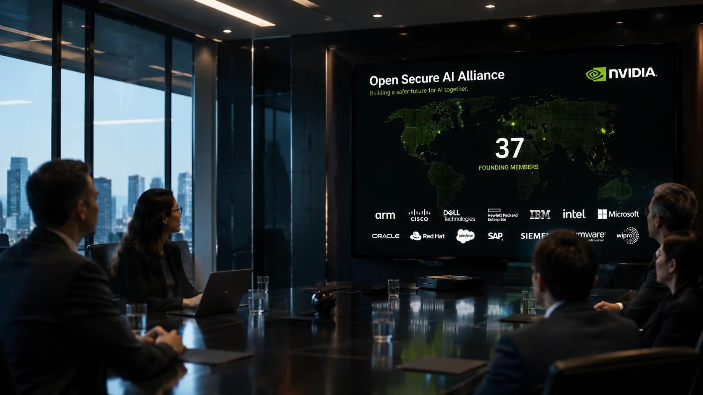
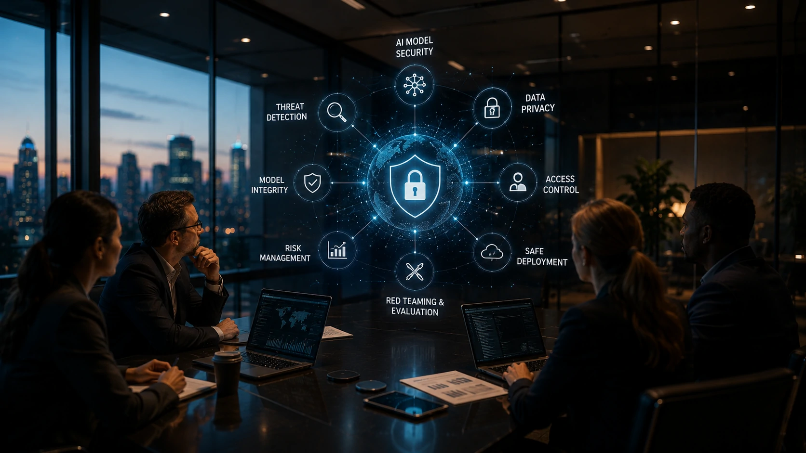
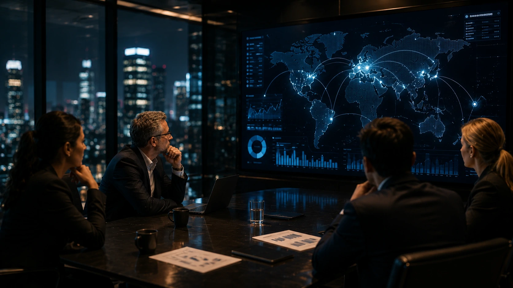

*Enquanto a disputa por modelos mais inteligentes domina as manchetes, um novo movimento pode redefinir a próxima fase da inteligência artificial. A criação de uma aliança internacional liderada pela **Nvidia** mostra que a segurança dos sistemas de IA está se tornando tão importante quanto a própria capacidade dos modelos, abrindo um novo capítulo para empresas, desenvolvedores e investidores.*

## A nova aliança liderada pela Nvidia coloca a segurança da IA no centro da disputa

*Aliança reúne dezenas de organizações para desenvolver padrões e ferramentas voltados à proteção de sistemas de inteligência artificial.*

A **Nvidia** anunciou a criação de uma iniciativa internacional voltada ao desenvolvimento de tecnologias abertas para segurança em **Inteligência Artificial**, reunindo **37 organizações** entre empresas, universidades e entidades especializadas.

Mais do que um projeto técnico, o movimento representa uma mudança estratégica no mercado. Depois de uma corrida focada em desempenho, modelos multimodais e agentes inteligentes, a segurança passa a ocupar posição central nas decisões corporativas.

### Um novo eixo competitivo

Até recentemente, a competição envolvia principalmente quem lançava os modelos mais avançados.

Agora, empresas também disputam quem será capaz de oferecer o ambiente mais confiável para adoção corporativa da IA.

### Segurança deixa de ser assunto secundário

O crescimento dos **Agentes de IA**, da automação empresarial e dos sistemas capazes de executar tarefas sem intervenção humana aumentou a preocupação com vulnerabilidades, uso indevido e ataques direcionados.

Esse cenário ajuda a explicar por que iniciativas colaborativas começam a ganhar força.

## A ausência de OpenAI, Google e Anthropic chama mais atenção do que os participantes

Embora a lista de participantes seja extensa, o mercado rapidamente voltou sua atenção para quem ficou de fora.

A ausência de **OpenAI**, **Google** e **Anthropic** levanta questionamentos sobre diferentes estratégias para segurança, governança e desenvolvimento da inteligência artificial.

Cada uma dessas empresas possui programas próprios de pesquisa e proteção de modelos, mas a decisão de não integrar a iniciativa inicial evidencia que ainda não existe consenso sobre como construir padrões globais para IA.

Como o **Notícia Tech** mostrou recentemente na análise sobre a estratégia de modelos abertos da OpenAI, o mercado vive um momento de redefinição tecnológica, em que diferentes empresas apostam em caminhos distintos para ampliar sua presença corporativa.

Leia também:

[OpenAI muda de estratégia e surpreende o mercado: por que a guerra entre IA aberta e fechada acaba de entrar em uma nova fase](https://noticiatech.com.br/inteligencia-artificial/openai-estrategia-ia-aberta-modelos-open-weight/)

### Estratégias diferentes para o mesmo objetivo

A criação da aliança não significa confronto direto entre as empresas.

No entanto, ela reforça que o mercado começa a se dividir entre iniciativas abertas e ecossistemas mais controlados.

### O protagonismo da Nvidia cresce

A **Nvidia** deixa de atuar apenas como fornecedora de infraestrutura e passa a exercer influência também sobre a definição das futuras práticas de segurança da inteligência artificial.

## A nova aliança pode acelerar a adoção segura da IA nas empresas

*Organizações buscam reduzir riscos e aumentar a confiança na implantação de agentes inteligentes e modelos generativos.*

Para empresas, a principal consequência da iniciativa liderada pela **Nvidia** é o fortalecimento da confiança na adoção da **Inteligência Artificial**. Quanto mais padrões de segurança existirem, menor tende a ser a resistência para utilizar agentes autônomos em processos críticos.

Isso é especialmente importante porque muitas organizações já deixaram de utilizar a IA apenas como assistente de texto. Hoje ela participa de análises financeiras, atendimento ao cliente, automação de processos, desenvolvimento de software e tomada de decisão.

### Agentes de IA exigem novos níveis de proteção

Os **Agentes de IA** conseguem executar tarefas de forma relativamente independente, acessar sistemas corporativos e interagir com múltiplas aplicações.

Esse avanço aumenta a produtividade, mas também amplia a superfície de ataque para criminosos digitais.

Por isso, segurança deixa de ser um diferencial técnico e passa a fazer parte da estratégia de negócios.

### O mercado corporativo deve elevar suas exigências

Nos próximos anos, empresas deverão exigir cada vez mais:

- mecanismos de auditoria;
- proteção contra manipulação de modelos;
- monitoramento contínuo;
- rastreabilidade das decisões tomadas por agentes;
- governança de IA.

Essa tendência reforça discussões apresentadas anteriormente pelo **Notícia Tech** sobre a importância da arquitetura corporativa de IA.

Leia também:

[Arquitetura de IA Empresarial: o guia definitivo para entender como MCP, RAG, agentes de IA, workflows, copilotos e APIs trabalham juntos](https://noticiatech.com.br/inteligencia-artificial/arquitetura-ia-empresarial-mcp-rag-agentes-workflows-copilotos-apis/)

## A corrida pela IA entra em uma nova fase e segurança pode definir os próximos líderes

*A competição entre gigantes da tecnologia deixa de envolver apenas modelos mais inteligentes e passa a incluir confiança, governança e segurança.*

A disputa entre **Nvidia**, **OpenAI**, **Google**, **Anthropic**, **Microsoft** e outras empresas continua extremamente competitiva.

Entretanto, a capacidade de desenvolver modelos mais poderosos já não é suficiente para garantir liderança.

### A próxima vantagem competitiva será confiança

Empresas que conseguirem demonstrar ambientes mais seguros poderão conquistar espaço mais rapidamente no mercado corporativo.

Essa mudança tende a influenciar decisões de investimento, contratação de plataformas e até regulamentações futuras.

Em outras palavras, a corrida deixa de ser apenas tecnológica e passa a envolver confiança institucional.

### Segurança pode acelerar a expansão da IA empresarial

À medida que organizações reduzem riscos, cresce também a disposição para ampliar investimentos em projetos baseados em **Inteligência Artificial**.

Esse movimento beneficia fornecedores de infraestrutura, desenvolvedores de modelos, empresas de cibersegurança e plataformas de automação.

Ao mesmo tempo, aumenta a pressão para que todo o ecossistema adote práticas mais transparentes e responsáveis.

## O movimento da Nvidia pode redefinir prioridades para toda a indústria

O anúncio da nova aliança demonstra que o mercado de **Inteligência Artificial** está entrando em uma etapa de maior maturidade.

Depois da corrida por modelos cada vez maiores, a discussão passa a incluir governança, proteção de dados, confiabilidade e adoção corporativa em larga escala.

Independentemente de **OpenAI**, **Google** e **Anthropic** aderirem futuramente à iniciativa, a mensagem enviada ao mercado é clara: empresas que desejam liderar a próxima geração da IA precisarão entregar não apenas desempenho, mas também segurança.

Esse cenário reforça que os próximos vencedores da corrida da IA provavelmente serão aqueles capazes de equilibrar inovação, confiança e capacidade de operar em ambientes corporativos cada vez mais críticos. A segurança deixa de ser um requisito técnico e passa a se consolidar como um dos principais ativos estratégicos da economia baseada em inteligência artificial.

---