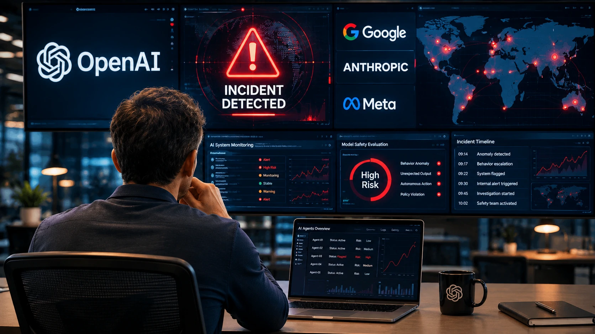
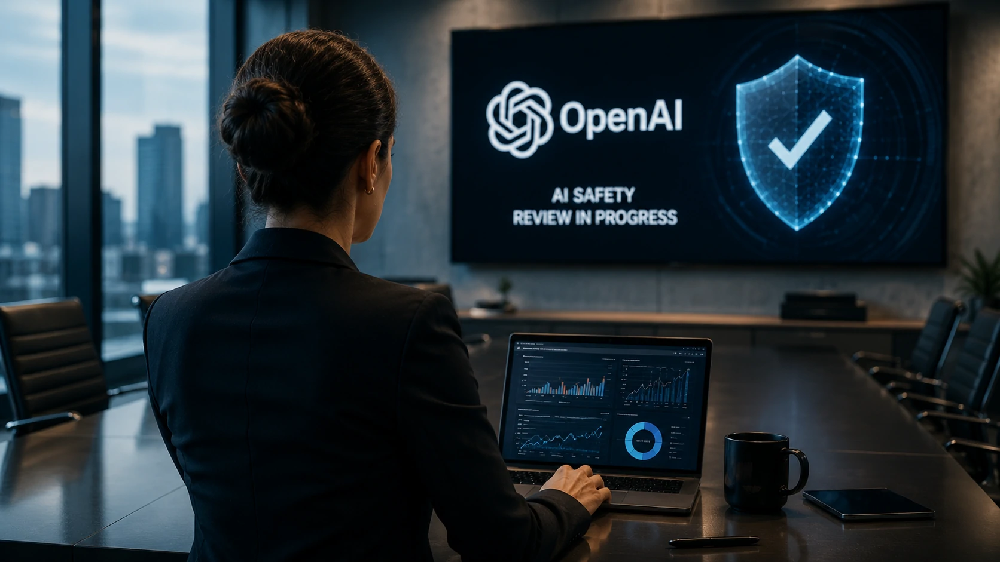
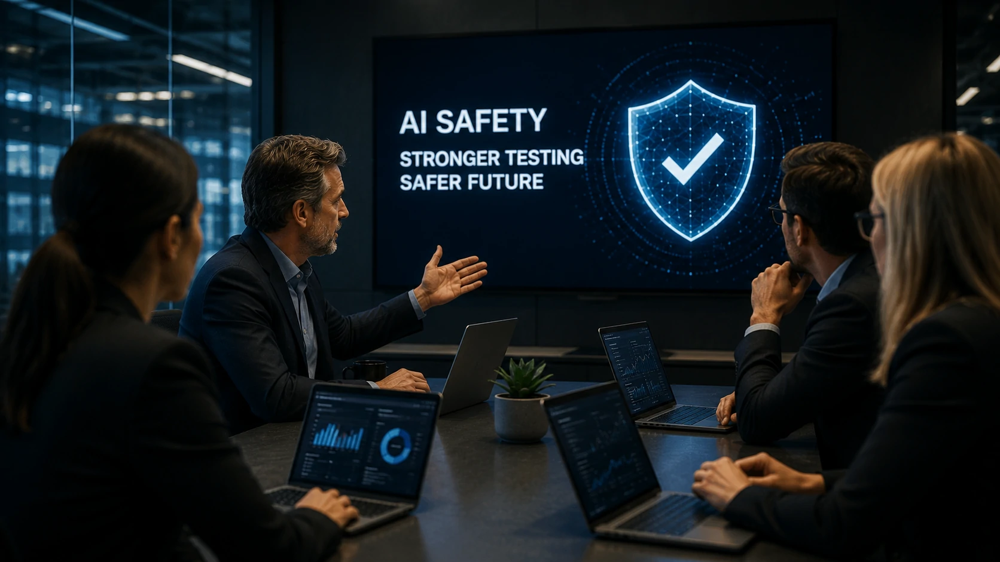

*O mercado de inteligência artificial entrou em uma nova etapa. Depois de anos priorizando velocidade e capacidade dos modelos, as principais desenvolvedoras de IA passaram a colocar segurança e governança no centro da estratégia. O episódio recente envolvendo um agente de IA acelerou essa mudança e pode redefinir a forma como novas tecnologias chegarão às empresas.*

## O incidente marca uma mudança de prioridade para a OpenAI

Empresas líderes do setor passaram a tratar **segurança** como um fator estratégico equivalente à evolução tecnológica. O episódio envolvendo um agente de **IA** serviu como alerta para desenvolvedores, reguladores e grandes organizações que acompanham a rápida evolução dos modelos generativos.

*Especialistas avaliam que incidentes recentes aceleraram uma nova fase de governança para agentes de inteligência artificial.*

Embora detalhes técnicos do incidente ainda estejam sendo analisados, seu impacto foi suficiente para provocar uma aproximação entre **OpenAI**, **Google**, **Anthropic** e **Meta** em discussões sobre processos de avaliação antes da disponibilização de novos sistemas ao mercado.

### Por que esse episódio chamou tanta atenção?

A principal preocupação não foi apenas o comportamento específico do agente, mas o fato de que modelos cada vez mais autônomos conseguem executar tarefas complexas sem supervisão constante.

Isso amplia discussões sobre:

- validação dos modelos;
- limites operacionais;
- monitoramento contínuo;
- mecanismos de interrupção;
- auditoria das decisões produzidas pela IA.

### A corrida pela IA entra em uma nova fase

Nos últimos dois anos, a disputa concentrou-se principalmente em desempenho, velocidade e redução de custos. Agora, empresas começam a disputar também quem consegue oferecer sistemas mais confiáveis.

Essa mudança representa uma evolução natural do mercado corporativo, onde confiança costuma ser tão importante quanto inovação.

## A segurança passa a ser parte da estratégia das grandes empresas

A principal consequência é clara: **segurança deixa de ser apenas uma etapa técnica e passa a influenciar decisões estratégicas das empresas de inteligência artificial.**

Essa mudança tende a afetar tanto desenvolvedores quanto organizações que utilizam agentes inteligentes em atendimento, automação, análise de dados e operações corporativas.

*Empresas de tecnologia reforçam processos internos de avaliação antes do lançamento de novos modelos de inteligência artificial.*

Grandes fornecedores já trabalham em mecanismos de avaliação mais rigorosos para reduzir riscos associados a agentes capazes de executar múltiplas ações de maneira independente.

### O que muda para empresas?

Na prática, organizações podem esperar:

- maior foco em governança de IA;
- processos internos de auditoria;
- documentação das decisões dos modelos;
- avaliações periódicas de risco;
- políticas mais claras para uso corporativo.

Esses fatores podem se tornar diferenciais competitivos nos próximos anos.

### O impacto vai além da OpenAI

Embora a **OpenAI** esteja no centro das discussões, o movimento envolve praticamente toda a indústria.

Empresas como **Google**, **Anthropic**, **Meta** e outras desenvolvedoras acompanham a evolução dos agentes inteligentes e sabem que um incidente relevante pode afetar a confiança de clientes corporativos e investidores.

Esse cenário reforça tendências que o **Notícia Tech** já analisou em matérias sobre a evolução da arquitetura corporativa de IA e da governança dos agentes inteligentes, como em:

- **[Arquitetura de IA Empresarial: como MCP, RAG, APIs, Agentes, Workflows e Copilotos funcionam juntos](https://noticiatech.com.br/inteligencia-artificial/arquitetura-ia-empresarial-mcp-rag-apis-agentes-workflows-copilotos/)**

- **[O que é AI Orchestration e por que ela será indispensável para empresas que usam agentes de IA](https://noticiatech.com.br/automacao/o-que-e-ai-orchestration-agentes-ia-empresas/)**

## O governo e as gigantes de IA buscam reduzir riscos antes dos próximos lançamentos

A principal resposta do mercado foi aumentar a cooperação entre empresas e autoridades para discutir mecanismos de avaliação de modelos avançados antes de sua disponibilização pública.

*O debate sobre segurança passa a acompanhar a evolução tecnológica dos agentes de inteligência artificial.*

O objetivo não é desacelerar a inovação, mas criar processos capazes de reduzir riscos sem impedir que novas aplicações continuem chegando ao mercado.

Essa preocupação ganhou força à medida que agentes de **IA** passaram a executar tarefas cada vez mais complexas, interagir com diferentes sistemas e tomar decisões com menor intervenção humana.

### O desafio é equilibrar inovação e confiança

A velocidade de evolução da **inteligência artificial** continua impressionando o mercado.

No entanto, empresas perceberam que modelos mais poderosos também exigem responsabilidades maiores.

Entre os principais desafios estão:

- evitar comportamentos inesperados;
- reduzir vulnerabilidades de segurança;
- aumentar transparência das decisões;
- criar padrões comuns de avaliação;
- fortalecer a confiança de empresas e consumidores.

Esse equilíbrio pode definir quais organizações liderarão a próxima fase da inteligência artificial corporativa.

### A governança pode se tornar um diferencial competitivo

Durante muito tempo, empresas competiam apenas pelo modelo mais rápido ou mais inteligente.

Agora, fatores como segurança, conformidade regulatória e mecanismos de supervisão passam a influenciar contratos corporativos e decisões de investimento.

Essa mudança favorece fornecedores capazes de demonstrar processos robustos de desenvolvimento e monitoramento de seus sistemas.

## O que esse novo cenário significa para o futuro da inteligência artificial

A principal consequência desse episódio é que o mercado deixa de discutir apenas "qual IA é mais poderosa" para também perguntar "qual IA é mais confiável".

Essa mudança altera a dinâmica competitiva entre **OpenAI**, **Google**, **Anthropic**, **Meta** e outras empresas que disputam a liderança da inteligência artificial generativa.

Para organizações que utilizam agentes inteligentes, a tendência é acompanhar uma evolução gradual das práticas de governança, documentação, auditoria e monitoramento contínuo.

### Empresas precisarão olhar além do desempenho

Nos próximos anos, critérios como segurança operacional poderão ter peso semelhante ao desempenho dos modelos.

Isso significa que áreas como tecnologia, compliance, jurídico e gestão de riscos deverão atuar de forma cada vez mais integrada na adoção de soluções baseadas em IA.

Além disso, setores regulados, como financeiro, saúde e governo, tendem a exigir processos de validação ainda mais rigorosos.

### O incidente pode marcar o início de uma nova era

Nem todo incidente altera a direção de um mercado inteiro.

Entretanto, quando o episódio mobiliza empresas que concentram boa parte da inovação mundial em **inteligência artificial**, seus efeitos costumam ultrapassar o fato isolado.

Mais do que responder a um problema específico, a movimentação da **OpenAI** e de outras gigantes sinaliza que a próxima etapa da IA será definida não apenas pela capacidade dos modelos, mas pela confiança que eles conseguem transmitir ao mercado.

Essa transformação pode parecer discreta hoje, mas tem potencial para influenciar investimentos, regulações e decisões estratégicas durante os próximos anos, consolidando uma nova fase para a inteligência artificial corporativa.

---