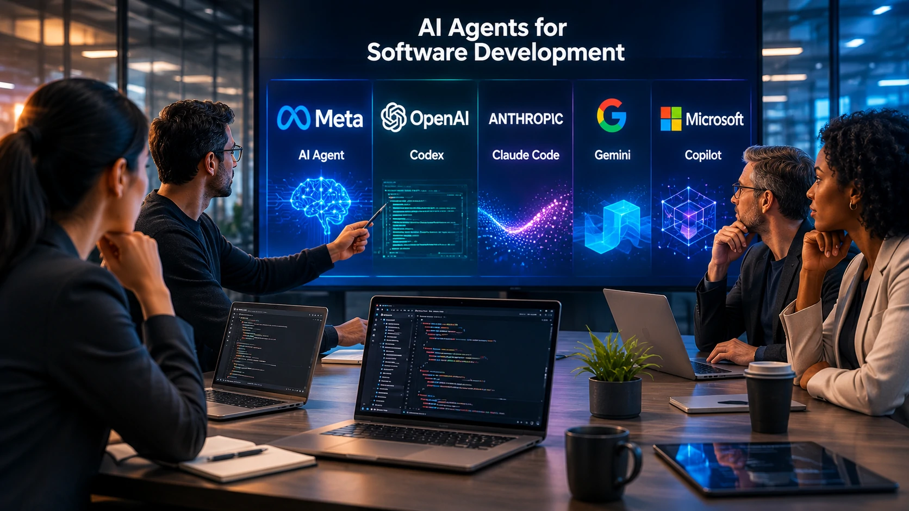

*Depois de meses concentrando investimentos em modelos de linguagem, a **Meta** decidiu entrar diretamente em uma das áreas mais disputadas da inteligência artificial: os agentes de IA para programação. O movimento coloca a empresa frente a frente com **ChatGPT**, **Claude** e outros concorrentes que disputam o futuro do desenvolvimento de software.*

## O novo agente de IA da Meta amplia a disputa pelo mercado de programação

Empresas de tecnologia estão transformando agentes de IA em ferramentas capazes de escrever código, revisar projetos e acelerar o ciclo de desenvolvimento de software. Agora, a **Meta** passa a disputar esse segmento de forma mais agressiva.

*O agente de IA da Meta foi desenvolvido para acelerar tarefas de programação e ampliar a presença da empresa no mercado corporativo.*

Segundo informações divulgadas pela empresa, o novo agente utiliza o modelo **Muse Spark 1.2**, desenvolvido especificamente para tarefas relacionadas ao desenvolvimento de software.

A estratégia aproxima a **Meta** do mercado atualmente liderado por soluções como **Claude Code**, da **Anthropic**, e **OpenAI Codex**, utilizado dentro do ecossistema **ChatGPT**.

### O foco deixa de ser apenas conversar

Durante os últimos anos, a corrida da IA foi marcada pela criação de chatbots cada vez mais sofisticados.

Agora, o cenário mudou.

As empresas passaram a competir pelo desenvolvimento de agentes capazes de executar tarefas completas, reduzindo etapas do trabalho humano e aumentando a produtividade das equipes técnicas.

### Programação tornou-se um dos mercados mais estratégicos da IA

Ferramentas capazes de gerar código representam uma oportunidade bilionária.

Além de acelerar projetos, esses sistemas ajudam empresas a reduzir custos operacionais, automatizar testes e aumentar a velocidade de entrega de produtos digitais.

Nesse contexto, a chegada da **Meta** aumenta significativamente a pressão sobre os concorrentes já consolidados.

## O lançamento mostra que a disputa vai muito além do ChatGPT

A entrada da **Meta** confirma uma mudança importante no mercado: a competição deixou de envolver apenas modelos de linguagem e passou a ocorrer em aplicações práticas para empresas.

## Empresas estão migrando da IA conversacional para agentes especializados

O lançamento da **Meta** reforça uma tendência observada ao longo de 2026: empresas querem menos chatbots genéricos e mais agentes capazes de executar tarefas específicas.

*Grandes empresas passaram a investir em agentes especializados para aumentar produtividade e reduzir custos no desenvolvimento de software.*

Nos últimos meses, praticamente todos os principais laboratórios anunciaram soluções voltadas para esse objetivo.

A **Anthropic** fortaleceu sua estratégia com o **Claude Code**. A **OpenAI** continua expandindo o **Codex** dentro do ecossistema **ChatGPT**. Empresas chinesas também aceleram investimentos em agentes para programação.

Esse movimento mostra que a próxima fase da inteligência artificial será menos focada em responder perguntas e mais voltada para executar atividades completas.

Quem acompanha essa evolução também pode entender melhor como a arquitetura dos agentes está mudando no mercado ao ler o artigo sobre **[AI Orchestration para empresas](https://noticiatech.com.br/automacao/o-que-e-ai-orchestration-agentes-ia-empresas/)**.

### O mercado entra em uma nova fase

Até pouco tempo atrás, vencer significava possuir o melhor modelo de linguagem.

Hoje, o diferencial está na capacidade de integrar a IA aos fluxos reais das empresas.

Isso envolve programação, atendimento, análise de dados, automação e integração com sistemas corporativos.

### A competição beneficia usuários corporativos

Quanto maior a concorrência entre **Meta**, **OpenAI**, **Anthropic** e outras empresas, maior tende a ser o ritmo de inovação.

Esse cenário também costuma acelerar melhorias de desempenho, reduzir custos e ampliar as possibilidades de integração com ferramentas empresariais.

## O que muda para empresas e desenvolvedores

Para organizações que utilizam inteligência artificial, o principal impacto é o aumento das opções disponíveis para automatizar tarefas técnicas.

*O crescimento da concorrência entre gigantes da IA deve acelerar novas funcionalidades para equipes corporativas.*

Equipes de desenvolvimento poderão comparar diferentes agentes conforme produtividade, custo, velocidade e integração com seus ambientes internos.

Já para profissionais, a tendência é que o trabalho evolua para funções de supervisão, revisão arquitetural e tomada de decisão, enquanto atividades repetitivas passam a ser executadas por agentes especializados.

### O impacto vai além da programação

O avanço desses agentes também influencia outras áreas.

Modelos especializados deverão chegar rapidamente aos setores de atendimento, marketing, vendas, operações e análise de dados, ampliando o uso da inteligência artificial em processos corporativos.

Essa transformação acompanha outro movimento recente do mercado mostrado pelo **Notícia Tech**, quando a **OpenAI** acelerou sua estratégia para novos dispositivos inteligentes: **[OpenAI entra na guerra do hardware e revela plano para criar uma nova geração de dispositivos com ChatGPT](https://noticiatech.com.br/inteligencia-artificial/openai-guerra-hardware-dispositivos-chatgpt/)**

### A corrida pela liderança continua aberta

O lançamento da **Meta** dificilmente encerrará a disputa.

Na prática, ele confirma que nenhuma empresa pretende deixar um segmento estratégico nas mãos dos concorrentes.

Para empresas que acompanham o mercado de tecnologia, isso significa um ritmo ainda maior de inovação, novas integrações e agentes cada vez mais capazes de executar tarefas complexas.

Mais do que um novo produto, o agente apresentado pela **Meta** sinaliza que a próxima grande batalha da inteligência artificial será vencida por quem conseguir transformar modelos de linguagem em profissionais digitais capazes de produzir resultados concretos dentro das organizações.

---