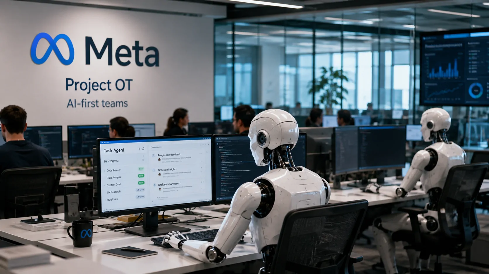
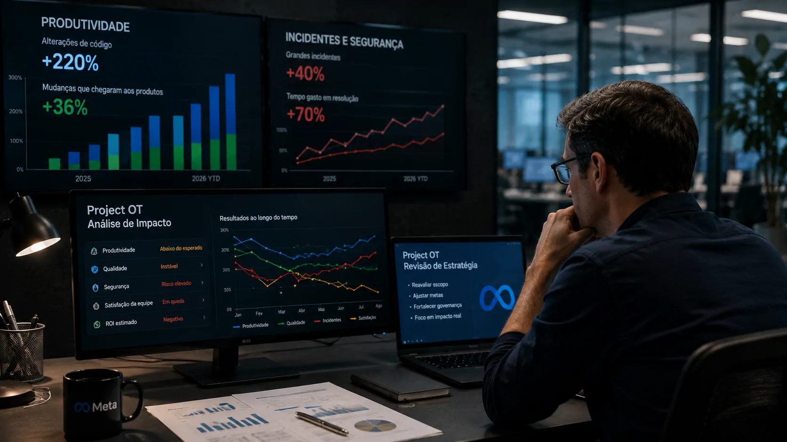
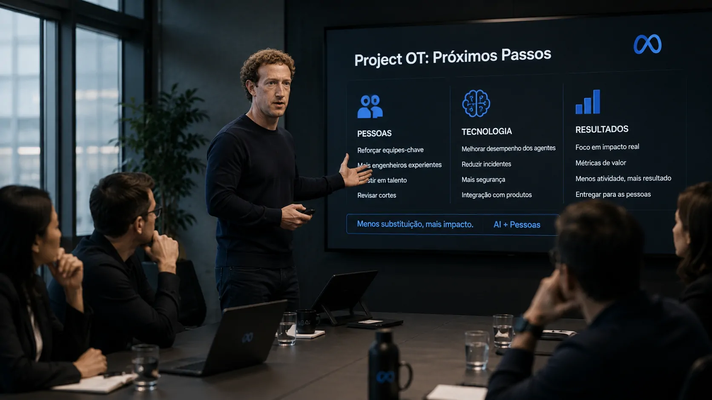

*Mark Zuckerberg tentou acelerar uma transformação radical na Meta: reduzir estruturas tradicionais e colocar agentes de IA no centro de uma nova organização. O problema é que a capacidade de gerar trabalho com IA não se traduziu, no ritmo esperado, em produtividade operacional.*

## O Project OT levou a Meta a testar uma organização mais dependente de IA

O **Project OT**, sigla para Organization Transformation, foi criado no início de 2026 com uma ambição clara: tornar partes da **Meta** mais próximas de uma organização “AI native”, na qual agentes de inteligência artificial assumiriam uma parcela crescente das tarefas realizadas por funcionários.

Um agente de IA é diferente de um sistema que apenas responde a perguntas. Ele pode receber um objetivo, consultar ferramentas e sistemas, executar etapas e produzir resultados com menor intervenção humana. A proposta da Meta era usar essa capacidade para redesenhar equipes e reduzir a dependência de estruturas maiores.

### A lógica por trás da transformação

Segundo documentos analisados pela **Reuters**, alguns cenários avaliados pelos executivos consideravam reduções de até **60% em determinadas equipes**. O número não representava um corte de 60% de toda a força de trabalho da Meta, mas possibilidades aplicadas a grupos específicos.

A estratégia também previa equipes menores, com funcionários supervisionando sistemas de IA. A lógica empresarial era direta: se agentes pudessem assumir uma parte relevante do trabalho cotidiano, a companhia poderia operar com menos pessoas em determinadas funções e concentrar profissionais em atividades consideradas prioritárias.

### A primeira rodada de cortes aconteceu

A Meta avançou parcialmente com a estratégia e realizou uma rodada de cortes em maio. Porém, a segunda etapa prevista pelo projeto acabou sendo cancelada antes de avançar.

Esse recuo é importante porque mostra que a questão deixou de ser simplesmente **quanto trabalho a IA consegue executar**. O desafio passou a ser saber se o trabalho produzido pelos agentes gera resultado suficiente para justificar uma reorganização profunda da empresa.

## A produtividade da IA não acompanhou a expectativa de Zuckerberg

O principal problema do Project OT apareceu justamente no indicador que deveria sustentar a transformação: produtividade. A Meta percebeu que aumentar a quantidade de trabalho realizado com assistência de IA não significava automaticamente aumentar a quantidade de resultados relevantes entregues aos usuários.

*O Project OT buscava combinar equipes humanas menores com agentes de IA capazes de executar uma parcela crescente do trabalho corporativo.*

### Mais código não significou mais produto

Um dos sinais internos citados pela Reuters ajuda a explicar a dificuldade. Alterações de código nas plataformas e na infraestrutura utilizadas pelos funcionários haviam crescido **220% em relação ao ano anterior**, segundo uma publicação do diretor de tecnologia da Meta, Andrew Bosworth.

O crescimento, porém, não apareceu na mesma proporção nos resultados entregues aos usuários. As mudanças que efetivamente chegaram aos produtos, na forma de recursos novos ou aprimorados, cresceram **36%**.

A diferença é estratégica. Uma IA pode aumentar enormemente a quantidade de tarefas realizadas por uma equipe sem necessariamente aumentar o valor produzido por essa equipe.

### O problema não era apenas produtividade

Os agentes também teriam provocado problemas operacionais. Informações internas citadas pela Reuters apontaram aumento de **40% nos grandes incidentes técnicos e de segurança**, enquanto o tempo dos funcionários dedicado à resolução desses problemas teria aumentado em até **70%**.

A Meta não confirmou esses dados internos à Reuters. Por isso, eles devem ser tratados como indicadores reportados pela investigação, e não como métricas corporativas oficialmente divulgadas pela empresa.

O episódio reforça um ponto importante para qualquer organização que esteja adotando agentes: **o custo da automação precisa incluir o trabalho necessário para supervisionar, corrigir e proteger aquilo que a IA produz**.

## O recuo mostra o limite entre automatizar tarefas e substituir equipes

O caso da **Meta** sugere que existe uma diferença significativa entre automatizar uma tarefa e redesenhar uma organização inteira em torno de agentes de IA.

Empresas podem obter ganhos relevantes quando um agente elimina atividades repetitivas, acelera análises ou reduz o tempo necessário para concluir processos. O problema aparece quando a automação começa a substituir funções que exigem julgamento, coordenação, responsabilidade e conhecimento contextual.

### Agentes precisam de supervisão

O Project OT partia da ideia de que grupos menores de funcionários poderiam supervisionar uma quantidade muito maior de trabalho automatizado. Na prática, quanto maior a autonomia dos agentes, maior também pode ser a necessidade de monitoramento.

Esse ponto é particularmente relevante para empresas que estão avaliando **[como agentes de IA podem aumentar a produtividade corporativa](https://noticiatech.com.br/inteligencia-artificial/chatgpt-work-era-agentes-ia-produtividade-corporativa/)**.

A questão não é simplesmente colocar um agente no lugar de uma pessoa. É redesenhar o processo para que a tecnologia realmente elimine etapas sem criar novas tarefas de controle, revisão e correção.

### A velocidade da IA também virou uma variável

Em julho, **Mark Zuckerberg** reconheceu internamente que o desenvolvimento de agentes de IA não havia acelerado nos meses anteriores da maneira esperada.

A declaração ajuda a contextualizar o recuo. A Meta continua apostando pesadamente em inteligência artificial, mas a experiência do Project OT mostrou que a velocidade de evolução dos agentes não pode ser presumida apenas porque os modelos estão ficando mais capazes.

Para uma companhia desse porte, uma transformação organizacional depende de sistemas confiáveis, infraestrutura, segurança, integração com ferramentas internas e capacidade de medir resultados. Se um desses elementos não acompanha a estratégia, o ganho esperado pode desaparecer.

## O problema da Meta também é um alerta para empresas que querem reduzir custos com IA

O caso da **Meta** é relevante para o mercado porque transforma uma hipótese comum sobre inteligência artificial em uma questão mensurável: uma empresa pode realmente reduzir equipes na mesma velocidade em que aumenta o uso de agentes?

A resposta, pelo menos neste caso, parece ser mais complexa do que o entusiasmo inicial sugeria.

*O desafio empresarial não é medir quanto trabalho a IA executa, mas quanto valor adicional ela entrega depois dos custos de supervisão e correção.*

### O indicador mais importante não é o volume de tarefas

Uma empresa que adota agentes precisa separar três métricas diferentes: **atividade gerada, produtividade e resultado empresarial**.

A primeira mostra quanto trabalho a IA realizou. A segunda mede quanto tempo ou esforço foi economizado. A terceira verifica se o trabalho realmente produziu mais receita, eficiência, qualidade ou velocidade para o negócio.

O caso da Meta é interessante justamente porque os sinais internos apontaram crescimento expressivo da atividade relacionada à IA, mas uma diferença muito menor naquilo que efetivamente chegou aos produtos.

Essa distinção também ajuda a entender por que a adoção de agentes precisa ser acompanhada por arquitetura, processos e governança. O mercado já discute essa mudança com conceitos como **[AI orchestration e a coordenação de agentes de IA nas empresas](https://noticiatech.com.br/automacao/o-que-e-ai-orchestration-agentes-ia-empresas/)**.

### Segurança passa a fazer parte da equação

Outro aprendizado é que agentes com autonomia maior podem criar riscos que não existiam em processos totalmente humanos ou em ferramentas de IA mais simples.

Um sistema capaz de acessar dados, modificar código, consultar sistemas internos e executar ações pode produzir ganhos importantes. Mas um erro também pode se propagar por várias etapas antes de ser percebido.

Por isso, a experiência da Meta aproxima produtividade de outro tema que ganhou importância na adoção corporativa de IA: **segurança**. Quanto mais autonomia uma empresa concede aos agentes, maior precisa ser sua capacidade de limitar permissões, registrar ações e interromper comportamentos inesperados.

## Zuckerberg não abandonou a IA, mas mudou a aposta sobre como usá-la

O recuo do **Project OT** não significa que a Meta tenha abandonado sua estratégia de inteligência artificial. A companhia continua investindo fortemente em infraestrutura, chips e desenvolvimento de agentes.

A mudança está na relação entre IA e força de trabalho. A experiência mostrou que tentar acelerar a substituição de pessoas antes de comprovar ganhos consistentes pode produzir o efeito contrário ao esperado: mais incidentes, mais retrabalho e menos confiança interna.

*O próximo estágio da estratégia da Meta tende a depender menos de substituição imediata e mais da comprovação de ganhos reais de produtividade.*

### A Meta ainda precisa provar o ganho econômico

O ponto central agora é acompanhar se os agentes conseguem transformar sua capacidade técnica em resultados operacionais sustentáveis.

A empresa continua com uma das maiores apostas corporativas em inteligência artificial do mercado. Portanto, o fracasso parcial do Project OT não elimina a tese de longo prazo de que agentes podem modificar estruturas empresariais.

O que muda é o prazo e a forma dessa transformação. Se os agentes ainda precisam de supervisão significativa, provocam incidentes ou produzem trabalho que não chega ao usuário, reduzir equipes antes da maturidade operacional pode destruir parte do ganho que a automação deveria gerar.

### A lição para outras empresas

Para gestores, o caso da **Meta** oferece uma regra prática: **não confundir capacidade de automação com capacidade de substituição**.

Um agente pode executar uma tarefa muito bem e ainda não estar preparado para assumir uma função inteira. A diferença está no conjunto de decisões, exceções, responsabilidades e consequências que acompanham aquela função.

A experiência de Zuckerberg sugere que a próxima fase da adoção empresarial de IA será menos sobre contar quantos funcionários podem ser substituídos e mais sobre demonstrar, processo por processo, onde a tecnologia realmente entrega mais valor do que o modelo anterior.

É justamente aí que a história do Project OT se torna maior do que a própria Meta. A empresa tentou levar a lógica da **IA como força de trabalho** até uma de suas consequências mais radicais. O recuo mostra que, mesmo dentro de uma das companhias mais agressivas na corrida pela inteligência artificial, ainda existe uma distância considerável entre imaginar uma organização operada por agentes e fazê-la funcionar dessa maneira.

---