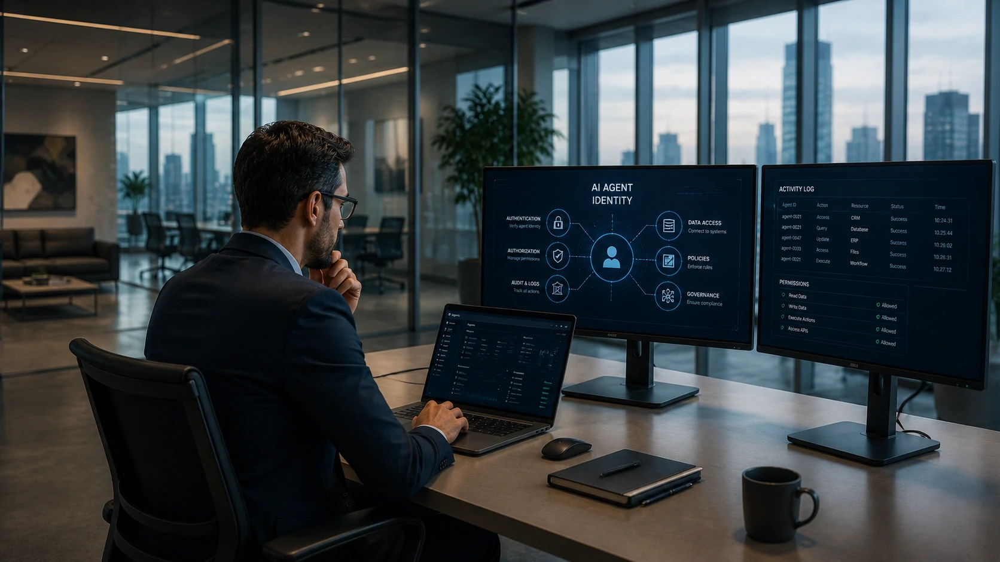

*À medida que os agentes de **Inteligência Artificial** deixam de apenas responder perguntas e passam a executar tarefas, acessar sistemas e tomar decisões, surge um novo desafio para as empresas: como identificar, controlar e auditar cada agente de forma segura? É justamente nesse cenário que nasce o conceito de **AI Agent Identity**, uma camada de identidade digital criada para permitir que agentes autônomos operem com autenticação, permissões e rastreabilidade, tornando-se um dos pilares das arquiteturas corporativas da próxima geração.*

## O que é AI Agent Identity e por que esse conceito ganhou importância



*Representação de um agente de IA autenticado acessando diferentes sistemas empresariais com identidade própria e políticas de segurança.*

A evolução dos **agentes de IA** mudou completamente a forma como empresas utilizam a Inteligência Artificial. Em vez de apenas conversar com usuários, esses agentes agora consultam bancos de dados, executam fluxos de trabalho, acessam APIs, enviam e-mails, atualizam CRMs e interagem diretamente com aplicações críticas.

Esse novo nível de autonomia trouxe uma questão que antes praticamente não existia: **como saber exatamente qual agente realizou determinada ação?**

É para responder essa pergunta que surgiu o conceito de **AI Agent Identity**.

### Cada agente passa a possuir uma identidade própria

Assim como um colaborador recebe um usuário corporativo para acessar sistemas internos, um agente inteligente também passa a possuir uma identidade exclusiva.

Essa identidade permite definir quais recursos poderão ser utilizados, quais permissões estarão disponíveis e quais operações poderão ser executadas.

Além disso, todas as ações ficam registradas, facilitando auditorias, investigações e conformidade com normas de segurança.

### A identidade torna os agentes confiáveis

Sem uma identidade própria, diversos agentes podem compartilhar a mesma credencial de acesso.

Na prática, isso dificulta descobrir quem executou determinada ação caso ocorra um erro, vazamento de dados ou acesso indevido.

Por isso, especialistas consideram que **AI Agent Identity** representa uma evolução natural dos modelos tradicionais de gerenciamento de identidade utilizados há anos pelas empresas.

Se você ainda não conhece como agentes estão transformando os processos corporativos, vale a leitura de **[Como os agentes de IA estão transformando a automação de processos nas empresas além do ChatGPT Work](https://noticiatech.com.br/automacao/agentes-ia-transformando-automacao-processos-empresas-alem-chatgpt-work/)**.

## Como AI Agent Identity funciona na prática


*Fluxo simplificado mostrando autenticação, autorização e registro das ações realizadas por um agente inteligente.*

Na prática, cada agente recebe uma identidade digital que funciona de maneira semelhante às identidades utilizadas por usuários e aplicações corporativas.

Quando o agente inicia uma tarefa, primeiro ocorre sua autenticação. Depois disso, políticas de autorização determinam exatamente quais recursos poderão ser acessados.

### Fluxo básico de operação

O processo normalmente segue uma sequência semelhante:

1. O agente solicita autenticação.
2. O sistema valida sua identidade.
3. As permissões autorizadas são carregadas.
4. O agente acessa apenas os recursos permitidos.
5. Todas as ações ficam registradas para auditoria.

Esse modelo reduz significativamente riscos de abuso de privilégios e facilita o gerenciamento de centenas ou milhares de agentes operando simultaneamente.

### Human-in-the-Loop continua sendo indispensável

Mesmo com controles avançados de identidade, especialistas recomendam manter o conceito de **Human-in-the-Loop**.

Agentes ainda podem interpretar solicitações de maneira incorreta, gerar respostas inadequadas ou executar ações não previstas quando recebem instruções ambíguas.

Por isso, operações críticas devem possuir mecanismos de aprovação humana antes da execução definitiva.

Esse conceito complementa outras camadas modernas de arquitetura corporativa apresentadas em **[Arquitetura de IA empresarial: guia completo sobre MCP, RAG, APIs, agentes, workflows e copilotos](https://noticiatech.com.br/inteligencia-artificial/arquitetura-ia-empresarial-mcp-rag-apis-agentes-workflows-copilotos/)**, onde identidade, governança e integração passam a funcionar de forma conjunta.

## AI Agent Identity será um requisito obrigatório nas arquiteturas corporativas


*Organizações estão adotando modelos de identidade para agentes de IA como parte das estratégias de segurança, governança e conformidade.*

À medida que empresas passam a operar dezenas ou centenas de **agentes de IA**, administrar identidades deixa de ser uma prática recomendada e passa a ser um requisito operacional.

Sem uma estratégia clara de identidade, cada novo agente aumenta a superfície de ataque da organização e dificulta o controle sobre dados, sistemas e processos automatizados.

### AI Agent Identity fortalece a governança corporativa

A governança de **Inteligência Artificial** depende da capacidade de responder perguntas fundamentais:

- Qual agente executou determinada ação?
- Quando essa ação ocorreu?
- Quais dados foram acessados?
- Qual permissão autorizou essa operação?
- Quem aprovou o fluxo?

Com uma identidade exclusiva para cada agente, essas respostas passam a fazer parte dos registros operacionais da empresa, facilitando auditorias, investigações e adequação a normas de conformidade.

Esse conceito complementa outras iniciativas de proteção discutidas em **[O que é Segurança em IA? Por que ela será prioridade nas empresas nos próximos anos](https://noticiatech.com.br/inteligencia-artificial/o-que-e-seguranca-ia-prioridade-empresas/)**.

### Exemplo prático de utilização

Imagine um agente responsável por aprovar pedidos de compra.

Em vez de utilizar uma credencial compartilhada, ele recebe uma identidade própria contendo apenas as permissões necessárias.

O fluxo pode funcionar assim:

1. O agente recebe uma solicitação de compra.
2. Autentica sua identidade.
3. Consulta o ERP da empresa.
4. Valida regras financeiras.
5. Solicita aprovação humana para valores acima do limite definido.
6. Registra toda a operação em log para auditoria.

Essa abordagem reduz riscos de fraude, facilita rastreabilidade e mantém o princípio do menor privilégio.

### Exemplo de prompt para um agente corporativo

```text
Você é um agente responsável pela aprovação de compras.

Objetivo:
Validar solicitações de aquisição de equipamentos.

Regras:
- Verifique limite financeiro.
- Consulte orçamento disponível.
- Caso ultrapasse R$ 20.000, encaminhe para aprovação humana.
- Nunca aprove compras sem orçamento.
- Registre todas as decisões em formato JSON.

Formato da saída:
- Status
- Motivo
- Responsável
- Data
- Próxima ação
```

Mesmo utilizando um prompt estruturado, a supervisão humana continua sendo indispensável para decisões estratégicas, financeiras ou regulatórias.

## O futuro da identidade digital dos agentes inteligentes

A evolução da **Inteligência Artificial** indica que agentes deixarão de ser simples assistentes para assumir funções operacionais em praticamente todos os departamentos das empresas.

Nesse cenário, identidade, autenticação, autorização e auditoria passam a ocupar a mesma importância que já possuem para usuários humanos e aplicações tradicionais.

Empresas que estruturarem desde cedo modelos de **AI Agent Identity** estarão mais preparadas para escalar automações com segurança, reduzir riscos operacionais e atender às futuras exigências de governança.

Mais do que uma tendência tecnológica, AI Agent Identity representa uma mudança na forma como organizações administram confiança em ecossistemas compostos por pessoas, softwares e agentes inteligentes trabalhando de maneira integrada. Essa transformação deve acompanhar a expansão da IA corporativa nos próximos anos e consolidar a identidade digital dos agentes como um dos pilares das arquiteturas empresariais modernas.

---