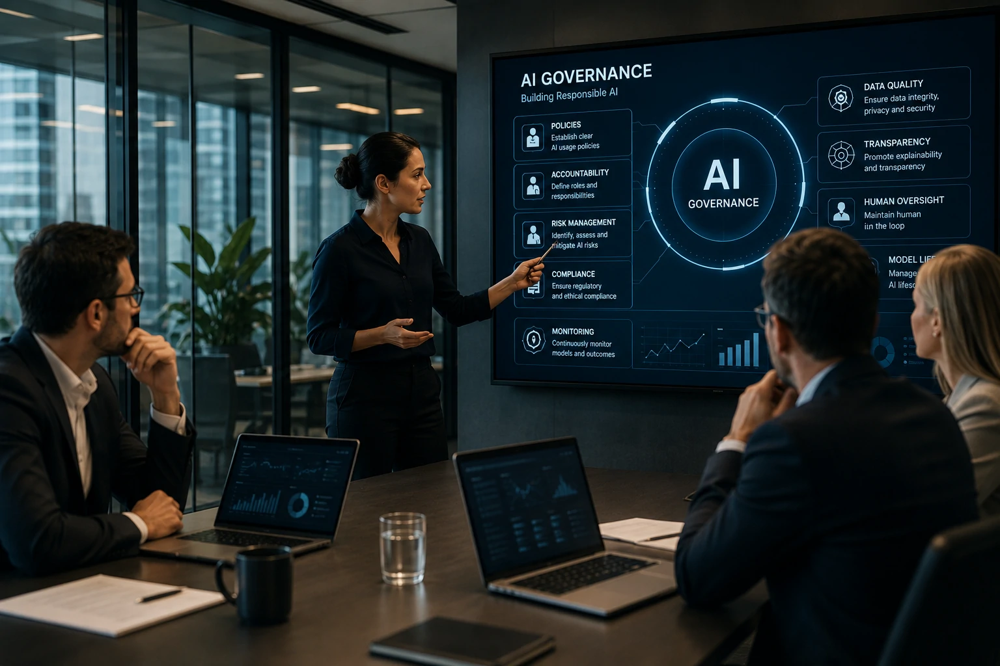
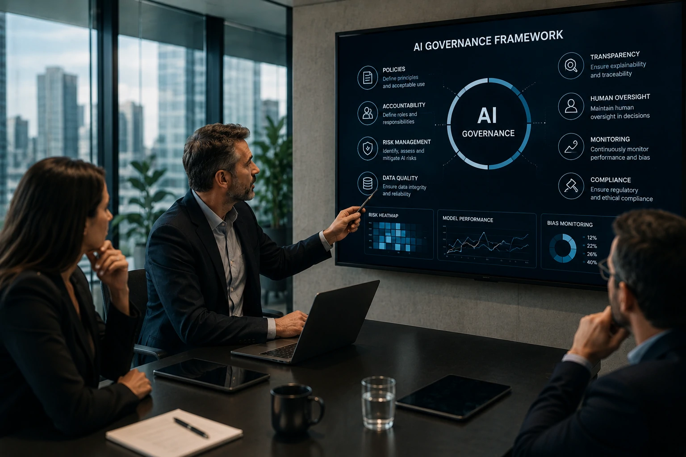

*À medida que a inteligência artificial passa a participar de decisões críticas nas empresas, governar essa tecnologia deixa de ser uma preocupação exclusiva das áreas de compliance. AI Governance tornou-se um componente estratégico para reduzir riscos, aumentar confiança e permitir que organizações escalem projetos de IA com segurança e responsabilidade.*

# O que é AI Governance? Guia Completo para Empresas que usam Inteligência Artificial

Empresas de todos os setores estão acelerando investimentos em **Inteligência Artificial**, mas poucas conseguem responder uma pergunta fundamental: quem controla essas decisões automatizadas?

É justamente nesse ponto que surge a **AI Governance**, um conjunto de práticas que define como modelos de IA devem ser desenvolvidos, monitorados e utilizados dentro das organizações.

Assim como a governança corporativa estabelece regras para proteger empresas e investidores, a governança de IA cria mecanismos para garantir que sistemas inteligentes sejam confiáveis, transparentes e alinhados aos objetivos do negócio.

Esse tema ganhou ainda mais relevância com a popularização da **IA Generativa**, dos **Agentes de IA**, das regulamentações internacionais e do crescimento do uso da tecnologia em áreas críticas como finanças, saúde, recursos humanos e atendimento ao cliente.

## O que é AI Governance?

AI Governance é o conjunto de políticas, processos, responsabilidades e controles que orientam todo o ciclo de vida da inteligência artificial dentro de uma organização.

*Empresas utilizam AI Governance para estabelecer políticas, responsabilidades e mecanismos de controle durante todo o ciclo de vida da inteligência artificial.*

Em vez de focar apenas na tecnologia, a **AI Governance** estabelece como pessoas, processos e algoritmos devem trabalhar juntos para produzir resultados seguros e confiáveis.

### Mais do que conformidade

Embora muitas empresas associem governança apenas ao cumprimento de normas, seu papel é muito mais amplo.

Uma estratégia madura busca equilibrar inovação e controle, permitindo que novas soluções sejam implementadas sem aumentar riscos operacionais, jurídicos ou reputacionais.

A governança também facilita auditorias, padroniza processos e cria critérios claros para aprovação de novos projetos baseados em IA.

### O ciclo de vida da governança

Uma estrutura de AI Governance normalmente acompanha todas as etapas do uso da inteligência artificial:

- definição dos objetivos do projeto;
- seleção e qualidade dos dados;
- treinamento dos modelos;
- validação técnica;
- implantação;
- monitoramento contínuo;
- atualização ou descontinuação do modelo.

Esse acompanhamento reduz falhas e melhora a confiabilidade das decisões automatizadas.

## Por que AI Governance se tornou prioridade para empresas?

A governança de IA tornou-se prioridade porque organizações estão utilizando inteligência artificial em decisões que impactam clientes, colaboradores e resultados financeiros.

*À medida que a IA assume funções críticas dentro das empresas, cresce a necessidade de mecanismos permanentes de supervisão e gestão de riscos.*

Quanto maior a autonomia dos modelos, maior também a necessidade de supervisão humana.

### Crescimento acelerado da IA corporativa

Ferramentas baseadas em **Large Language Models (LLMs)**, plataformas de automação e agentes inteligentes passaram a executar tarefas antes realizadas exclusivamente por profissionais.

Esse avanço aumenta produtividade, mas também amplia riscos relacionados a vieses, decisões incorretas, vazamento de informações e uso inadequado de dados.

Empresas que adotam IA sem uma estrutura de governança tendem a enfrentar dificuldades para explicar decisões automatizadas, atender exigências regulatórias e manter a confiança de clientes e parceiros.

### A relação com outros conceitos estratégicos

A AI Governance não funciona isoladamente.

Ela complementa outras iniciativas importantes já abordadas pelo Notícia Tech, como o uso de **Agentic AI** para automatizar processos inteligentes e arquiteturas baseadas em **Model Context Protocol (MCP)** para integração segura entre agentes e sistemas corporativos.

Para aprofundar esses temas, vale conferir:

- [O que é Agentic AI? Guia Completo sobre Agentes de IA](https://noticiatech.com.br/inteligencia-artificial/o-que-e-agentic-ai-guia-completo-agentes-ia/)

- [Como implementar MCP nas empresas](https://noticiatech.com.br/inteligencia-artificial/como-implementar-mcp-empresas-arquitetura-integracao-agentes-ia/)

## Como implementar AI Governance na prática?

Implementar **AI Governance** significa criar uma estrutura permanente de gestão para todo o ciclo de vida da inteligência artificial, envolvendo tecnologia, pessoas, processos e regras de negócio.

*Uma estrutura eficiente de AI Governance integra tecnologia, gestão de riscos, compliance e supervisão humana para garantir o uso responsável da inteligência artificial.*

Empresas mais maduras não tratam governança como um projeto isolado. Ela passa a fazer parte da estratégia corporativa e acompanha cada novo modelo implantado.

### Os pilares de uma estratégia eficiente

Embora existam diferentes frameworks internacionais, a maioria compartilha pilares semelhantes.

Uma estrutura robusta normalmente inclui:

- políticas claras para uso de IA;
- definição de responsabilidades;
- critérios de qualidade dos dados;
- supervisão humana nas decisões críticas;
- monitoramento contínuo dos modelos;
- auditorias periódicas;
- gestão de riscos;
- documentação completa dos projetos.

Esses componentes permitem que a organização evolua seus sistemas de IA sem perder controle operacional.

### O papel da liderança

A governança não deve ficar restrita ao departamento de tecnologia.

Áreas como **Compliance**, **Jurídico**, **Segurança da Informação**, **Gestão de Riscos**, **Recursos Humanos** e líderes de negócio precisam participar da definição das políticas de uso da inteligência artificial.

Esse alinhamento reduz conflitos internos e facilita a adoção de padrões únicos para toda a empresa.

## Quais são os benefícios da AI Governance?

Uma estratégia de AI Governance aumenta a confiança nas decisões automatizadas e reduz riscos que podem comprometer projetos de inteligência artificial.

Os ganhos vão muito além da conformidade regulatória.

### Maior segurança e transparência

Empresas conseguem identificar rapidamente falhas nos modelos, corrigir vieses e documentar como cada decisão automatizada foi produzida.

Essa rastreabilidade facilita auditorias e melhora a relação com clientes, parceiros e órgãos reguladores.

Além disso, organizações conseguem responder com mais facilidade a questionamentos sobre uso de dados e funcionamento dos algoritmos.

### Escalabilidade sustentável

Projetos de IA costumam crescer rapidamente.

Sem governança, cada equipe cria seus próprios processos, aumentando custos e dificultando integrações.

Com uma estrutura padronizada, novos modelos podem ser implantados com mais velocidade, mantendo qualidade e consistência.

Essa abordagem também fortalece iniciativas de automação inteligente, como explicado no artigo sobre [O que é automação de processos com IA para empresas](https://noticiatech.com.br/automacao/o-que-e-automacao-processos-ia-empresas/).

## O futuro da AI Governance nas empresas

A AI Governance tende a deixar de ser um diferencial competitivo para se tornar um requisito básico da transformação digital.

O avanço da **IA Generativa**, dos **Agentes de IA**, dos modelos multimodais e da automação empresarial amplia a necessidade de mecanismos permanentes de supervisão.

Nos próximos anos, frameworks internacionais, normas como a **ISO/IEC 42001**, regulamentações nacionais e plataformas de monitoramento deverão fazer parte da rotina das organizações que utilizam inteligência artificial em larga escala.

Ao mesmo tempo, cresce a expectativa de clientes, investidores e parceiros por sistemas mais transparentes, explicáveis e responsáveis.

Nesse cenário, empresas que estruturarem uma governança sólida conseguirão acelerar inovação com menor exposição a riscos jurídicos, operacionais e reputacionais.

A inteligência artificial continuará evoluindo rapidamente. O verdadeiro diferencial competitivo não será apenas adotar novos modelos, mas desenvolver capacidade para utilizá-los com responsabilidade, segurança e visão estratégica. É exatamente esse papel que a **AI Governance** assume dentro das organizações modernas.

---