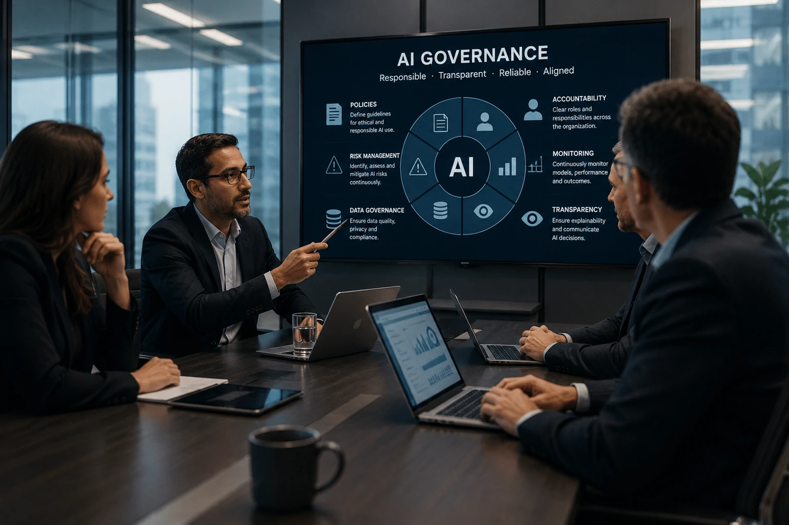
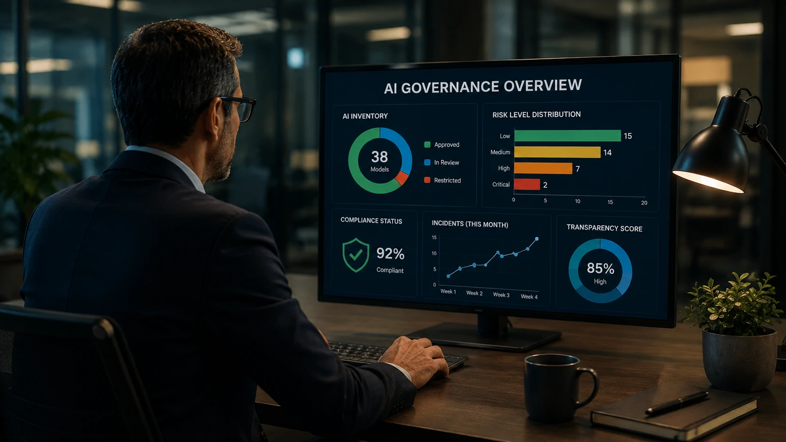

*À medida que a inteligência artificial passa a participar das decisões das empresas, cresce também a necessidade de controlar como ela é utilizada. Mais do que adotar novas ferramentas, organizações precisam estabelecer regras capazes de reduzir riscos, garantir transparência e transformar a IA em um ativo estratégico de longo prazo.*

## AI Governance estabelece regras para que a inteligência artificial seja utilizada de forma segura e estratégica

*Executivos estruturam políticas para garantir o uso responsável da inteligência artificial nas organizações.*

**AI Governance** é o conjunto de políticas, processos, responsabilidades e controles que orientam o uso da **Inteligência Artificial** dentro de uma organização.

Na prática, ela funciona como um sistema de governança semelhante ao que já existe para segurança da informação, privacidade de dados ou compliance corporativo. O objetivo é garantir que modelos de IA produzam resultados confiáveis, transparentes e alinhados aos interesses da empresa.

Sem uma estrutura de governança, diferentes departamentos podem utilizar ferramentas como **ChatGPT**, **Gemini**, **Claude** ou **Copilot** de maneiras completamente distintas, aumentando riscos jurídicos, operacionais e reputacionais.

### A governança vai além da tecnologia

Embora envolva aspectos técnicos, **AI Governance** não pertence apenas ao departamento de TI.

Ela reúne áreas como jurídico, compliance, segurança da informação, gestão de riscos, recursos humanos e liderança executiva para definir como a IA pode ser utilizada em toda a organização.

### O crescimento acelerado da IA aumenta a necessidade de controle

A popularização dos agentes inteligentes, automações e modelos generativos fez com que empresas passassem a depender da IA em atividades críticas.

Esse cenário amplia a importância de estruturas capazes de supervisionar decisões automatizadas e estabelecer critérios claros para seu uso.

Para entender como a automação inteligente evolui dentro das organizações, vale conhecer também o artigo sobre **[AI Process Automation](https://noticiatech.com.br/automacao/o-que-e-ai-process-automation-automacao-processos-inteligencia-artificial/)**.

## Por que AI Governance será prioridade para empresas nos próximos anos

A principal razão é simples: quanto maior o uso da IA, maior também o risco associado às decisões tomadas pelos modelos.

Empresas já utilizam IA para atendimento, recrutamento, análise financeira, marketing, vendas e desenvolvimento de software. Em todos esses cenários, erros podem gerar prejuízos financeiros, problemas regulatórios ou perda de confiança dos clientes.

Além disso, investidores e parceiros comerciais começam a avaliar se organizações possuem mecanismos formais para controlar seus sistemas inteligentes.

### Transparência passa a ser vantagem competitiva

Clientes querem entender quando estão interagindo com IA, quais dados são utilizados e como decisões automatizadas são produzidas.

Organizações capazes de explicar seus processos tendem a transmitir maior confiança ao mercado.

### Regulamentações aceleram a adoção

Diversos países discutem regras específicas para inteligência artificial.

Mesmo empresas brasileiras que não estejam diretamente sujeitas a legislações internacionais podem precisar demonstrar boas práticas para atender clientes globais e cadeias internacionais de fornecimento.

## Quais são os pilares de uma estratégia eficiente de AI Governance

*Governança eficiente depende da integração entre tecnologia, processos e liderança.*

Uma estratégia consistente de **AI Governance** combina tecnologia, processos e gestão. O objetivo não é impedir o uso da **Inteligência Artificial**, mas criar mecanismos que permitam utilizá-la com segurança e previsibilidade.

Empresas mais maduras costumam tratar a governança como um processo contínuo, revisando políticas conforme novos modelos, regulamentações e riscos surgem.

### Políticas claras para utilização da IA

O primeiro passo é definir quais ferramentas podem ser utilizadas pelos colaboradores, quais dados podem ser compartilhados e quais atividades exigem validação humana.

Essas políticas reduzem riscos relacionados ao vazamento de informações, decisões automatizadas inadequadas e uso indevido da tecnologia.

### Gestão de riscos e auditoria contínua

Outro pilar fundamental é acompanhar o desempenho dos modelos utilizados.

Isso inclui monitorar possíveis vieses, avaliar qualidade das respostas, registrar decisões automatizadas e manter histórico das alterações realizadas ao longo do tempo.

À medida que empresas adotam múltiplos modelos simultaneamente, soluções de orquestração também ganham importância. O tema é aprofundado no artigo sobre **[AI Orchestration](https://noticiatech.com.br/automacao/o-que-e-ai-orchestration-substitui-disputa-modelos-ia-empresas/)**.

## Como empresas podem começar a implementar AI Governance

*Governança de IA começa com pequenas políticas e evolui para uma estrutura estratégica.*

A implementação de **AI Governance** não exige uma grande transformação inicial. Na maioria das organizações, ela pode começar com iniciativas simples que evoluem conforme a adoção da IA cresce.

O importante é criar uma base sólida antes que dezenas de ferramentas sejam incorporadas aos processos da empresa.

### Definir responsáveis pela governança

Empresas devem estabelecer quem responde pelas decisões relacionadas ao uso da IA.

Dependendo do porte da organização, essa função pode ficar com um comitê multidisciplinar ou ser compartilhada entre tecnologia, compliance, jurídico e liderança executiva.

### Criar um inventário de ferramentas de IA

Também é recomendável manter uma lista atualizada das soluções utilizadas pela empresa.

Esse inventário facilita auditorias, reduz riscos operacionais e ajuda a identificar rapidamente quais processos dependem de **Inteligência Artificial**.

### Capacitar colaboradores continuamente

A governança não depende apenas de tecnologia.

Funcionários precisam compreender limites, responsabilidades e boas práticas ao utilizar ferramentas de IA no dia a dia, reduzindo erros operacionais e aumentando a qualidade das decisões.

O avanço da maturidade organizacional também está relacionado ao desenvolvimento da **AI Fluency**, conceito explicado em **[O que é AI Fluency e por que ela se tornou a habilidade mais importante para profissionais e empresas](https://noticiatech.com.br/inteligencia-artificial/o-que-e-ai-fluency-habilidade-profissionais-empresas/)**.

A tendência é que **AI Governance** deixe de ser um tema restrito às grandes empresas e passe a fazer parte da rotina de organizações de todos os portes. À medida que modelos generativos se tornam protagonistas em processos corporativos, governança, transparência e responsabilidade passam a representar vantagem competitiva. Empresas que estruturarem esses pilares desde agora estarão mais preparadas para atender exigências regulatórias, conquistar confiança do mercado e utilizar a **Inteligência Artificial** de forma sustentável pelos próximos anos.

---