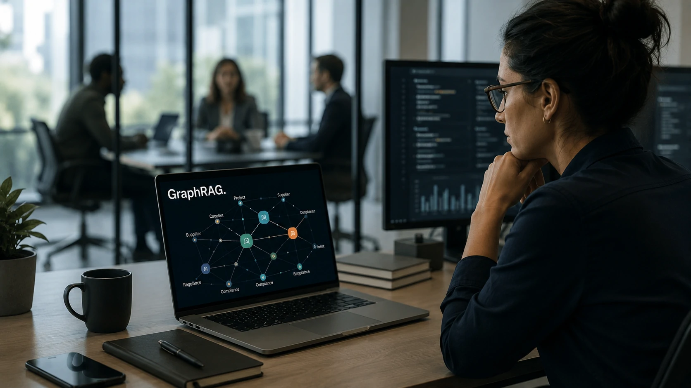
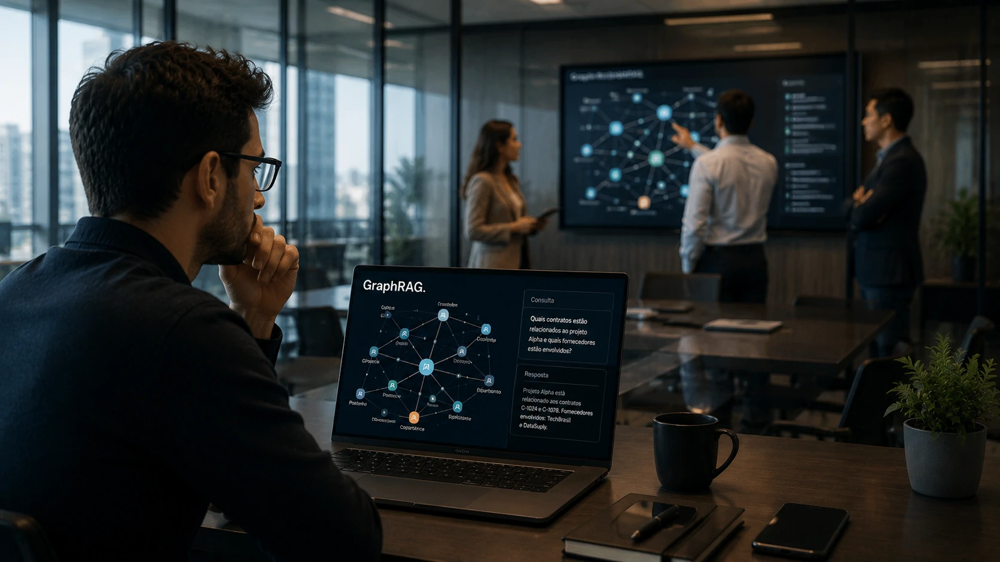
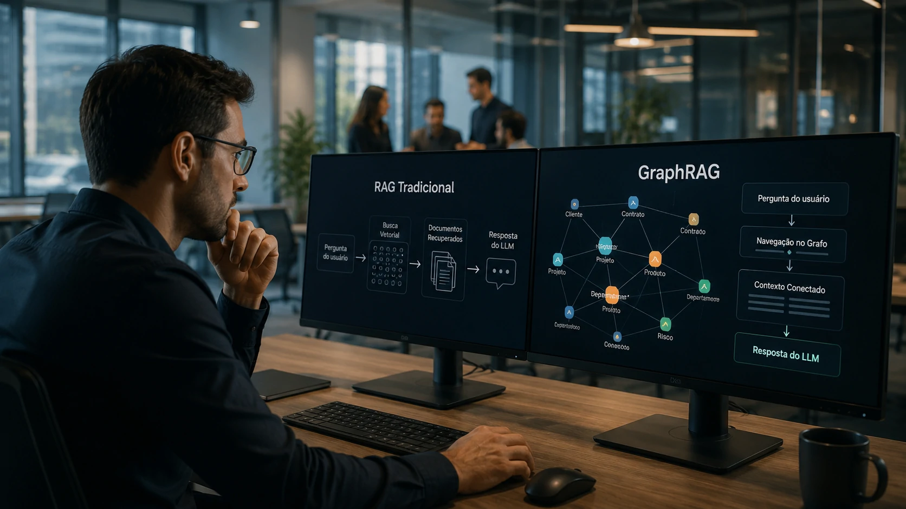

*À medida que as empresas ampliam o uso da **Inteligência Artificial**, cresce também a necessidade de oferecer respostas mais confiáveis, contextualizadas e explicáveis. É justamente nesse cenário que surge o **GraphRAG**, uma evolução da arquitetura RAG tradicional capaz de conectar informações por meio de grafos de conhecimento.*

*Embora o **RAG (Retrieval-Augmented Generation)** continue sendo uma das tecnologias mais importantes da IA generativa, especialistas já enxergam o **GraphRAG** como o próximo passo para aplicações corporativas que dependem de informações complexas e altamente relacionadas.*

## O que é GraphRAG?



*O GraphRAG conecta documentos, entidades e relações em um grafo de conhecimento antes da geração da resposta.*

O **GraphRAG** é uma arquitetura que combina **LLMs**, mecanismos de recuperação de informações e **Knowledge Graphs** para fornecer respostas mais inteligentes do que aquelas obtidas apenas por busca vetorial.

Enquanto o **RAG tradicional** procura documentos semelhantes utilizando embeddings, o **GraphRAG** adiciona uma camada semântica que entende como pessoas, empresas, departamentos, produtos e eventos estão relacionados.

Na prática, isso permite que a IA responda perguntas mais complexas sem depender apenas da proximidade estatística entre textos.

### Como funciona

O processo normalmente segue esta sequência:

1. Os documentos são processados.
2. Entidades importantes são identificadas.
3. As relações entre essas entidades formam um grafo.
4. A consulta percorre esse grafo.
5. O **LLM** utiliza esse contexto para produzir a resposta.

Essa abordagem reduz ambiguidades e melhora significativamente a compreensão do contexto.

### Por que isso importa?

Em ambientes corporativos, informações raramente estão isoladas.

Um contrato pode estar ligado a um fornecedor, que está ligado a um projeto, que depende de um cliente específico.

O **GraphRAG** consegue navegar por essas conexões antes de responder, algo que o **RAG tradicional** nem sempre faz de maneira eficiente.

Para entender como diferentes arquiteturas trabalham em conjunto, vale conhecer também o artigo sobre [O que é AI Orchestration? Por que ela substitui a disputa entre modelos de IA nas empresas](https://noticiatech.com.br/automacao/ai-orchestration-empresas-multiplos-agentes-ia/).

## RAG tradicional versus GraphRAG

O **RAG tradicional** revolucionou a IA generativa ao permitir que modelos consultassem bases de conhecimento atualizadas.

Entretanto, ele possui limitações quando o assunto envolve múltiplas relações entre informações.

O **GraphRAG** foi criado justamente para resolver esse problema.

### Como o RAG trabalha

O fluxo costuma ser:

- usuário faz uma pergunta;
- sistema realiza busca vetorial;
- documentos semelhantes são recuperados;
- o **LLM** gera a resposta.

Esse modelo funciona muito bem para consultas diretas.

Entretanto, perguntas que dependem de diversas conexões podem gerar respostas incompletas.

### Como o GraphRAG melhora esse processo

Antes de recuperar documentos, o sistema percorre o grafo de conhecimento.

Isso permite descobrir relações indiretas entre informações.

Em vez de localizar apenas um documento semelhante, a IA consegue compreender toda a cadeia de contexto envolvida na pergunta.

Esse tipo de arquitetura também complementa iniciativas como [Como criar um servidor MCP para empresas integrar IA aos sistemas](https://noticiatech.com.br/automacao/como-criar-servidor-mcp-empresas-integrar-ia-sistemas/), onde diferentes agentes precisam compartilhar conhecimento consistente.

## Onde o GraphRAG gera mais valor nas empresas



*O GraphRAG permite conectar informações espalhadas entre departamentos, sistemas e documentos corporativos.*

A maior vantagem do **GraphRAG** aparece quando o conhecimento corporativo está distribuído em diversos sistemas e depende de relações entre pessoas, processos e documentos.

Nesses cenários, recuperar apenas documentos semelhantes normalmente não é suficiente. É preciso compreender como cada informação se conecta às demais para produzir uma resposta confiável.

### Casos de uso com maior retorno

Entre as aplicações mais promissoras estão:

- **Centrais de atendimento** com milhares de artigos técnicos.
- **Departamentos jurídicos** que relacionam contratos, clientes e processos.
- **Hospitais**, conectando prontuários, exames e protocolos clínicos.
- **Instituições financeiras**, relacionando clientes, produtos, riscos e regulamentações.
- **Indústrias**, integrando manuais técnicos, manutenção e cadeia de fornecedores.

Quanto maior a complexidade da base de conhecimento, maior tende a ser o ganho proporcionado pelo **GraphRAG**.

### Agentes de IA também se beneficiam

Os novos **agentes de IA** precisam consultar conhecimento antes de executar tarefas.

Um agente responsável por atendimento, por exemplo, pode consultar políticas internas, contratos, histórico do cliente e documentação técnica antes de responder.

Essa capacidade aumenta significativamente a confiabilidade das decisões automatizadas.

Esse conceito complementa arquiteturas apresentadas no artigo [Como os agentes de IA estão transformando a automação de processos nas empresas além do ChatGPT Work](https://noticiatech.com.br/automacao/agentes-ia-transformando-automacao-processos-empresas-alem-chatgpt-work/).

## Como implementar GraphRAG e quais cuidados considerar



*Implementações bem-sucedidas dependem da qualidade do conhecimento corporativo e da supervisão humana.*

Ao contrário do que muitos imaginam, o maior desafio não está no modelo de linguagem, mas na organização dos dados corporativos.

Empresas que já possuem documentação estruturada costumam acelerar bastante a implantação.

### Fluxo lógico de implementação

Um fluxo típico funciona desta maneira:

1. Documentos são coletados de **SharePoint**, **CRM**, **ERP**, bancos de dados ou sistemas internos.
2. Um processo de ingestão identifica entidades relevantes.
3. As relações são armazenadas em um **Knowledge Graph**.
4. A consulta percorre esse grafo para recuperar o contexto.
5. O **LLM** recebe apenas as informações relevantes.
6. A resposta é enviada ao usuário com maior precisão.

Essa arquitetura reduz ruído, melhora a recuperação de contexto e facilita futuras expansões da base de conhecimento.

### Exemplo de prompt para um agente corporativo

```text
Você é um assistente corporativo.

Objetivo:
Responder utilizando apenas informações recuperadas pelo GraphRAG.

Prioridades:
- considerar relações entre clientes, contratos e projetos;
- citar apenas dados encontrados no grafo;
- informar quando houver informações conflitantes;
- nunca inventar respostas.

Formato:
Resumo executivo seguido da justificativa.
```

Esse tipo de instrução ajuda a reduzir respostas inconsistentes e torna o comportamento do agente mais previsível.

### Human-in-the-Loop continua indispensável

Mesmo utilizando **GraphRAG**, a supervisão humana permanece essencial.

O grafo pode conter informações desatualizadas, documentos incorretos ou relações mal classificadas.

Por isso, organizações maduras mantêm processos contínuos de:

- validação da base de conhecimento;
- auditoria das respostas;
- atualização dos relacionamentos;
- revisão dos prompts;
- monitoramento da qualidade das respostas.

O **GraphRAG** melhora significativamente a recuperação de contexto, mas não elimina a necessidade de governança da informação.

À medida que os **LLMs** evoluem e os agentes de IA assumem tarefas mais complexas, arquiteturas baseadas em grafos tendem a ganhar espaço como infraestrutura estratégica para empresas. Mais do que produzir respostas melhores, o **GraphRAG** representa uma mudança na forma como a inteligência artificial acessa, interpreta e conecta o conhecimento corporativo. Para organizações que pretendem escalar agentes inteligentes com segurança, contexto e explicabilidade, essa abordagem desponta como uma das principais evoluções da IA empresarial.

---