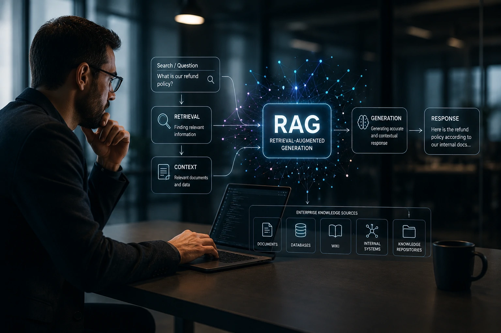
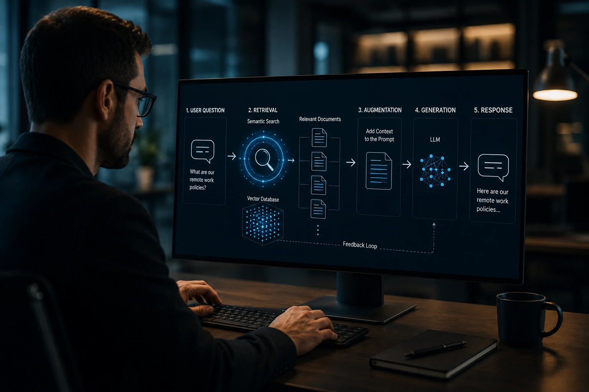
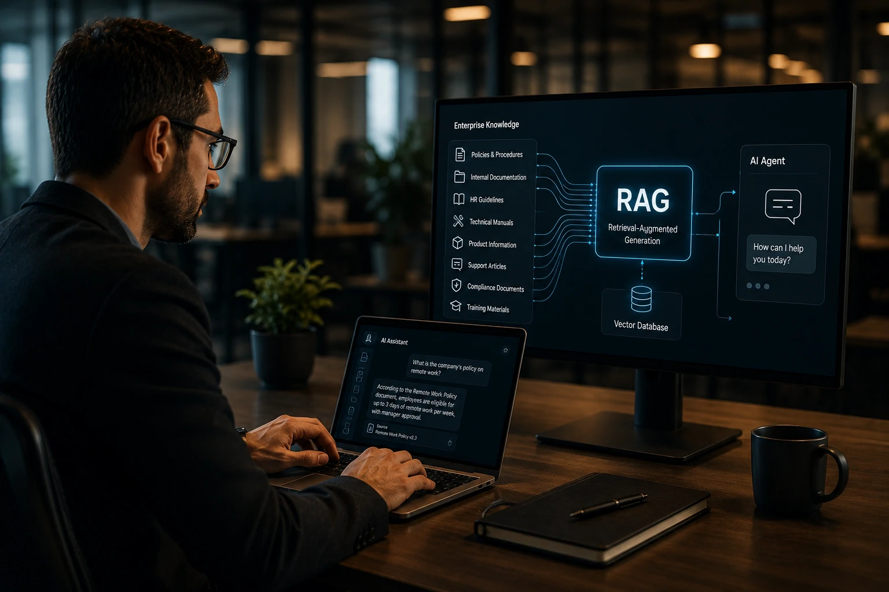

*Enquanto empresas aceleram investimentos em agentes inteligentes, uma nova camada tecnológica começa a se consolidar como peça fundamental da infraestrutura de IA corporativa. O RAG, sigla para Retrieval-Augmented Generation, tornou-se uma das abordagens mais relevantes para conectar modelos de linguagem ao conhecimento real das organizações. Mais do que uma técnica, ele está redefinindo como sistemas inteligentes acessam informações, reduzem alucinações e geram respostas contextualizadas.*

## O que é RAG e por que ele se tornou tão importante

*Arquiteturas RAG permitem que sistemas de IA consultem bases de conhecimento antes de gerar respostas.*

**RAG (Retrieval-Augmented Generation)** é uma arquitetura que combina recuperação de informações com geração de conteúdo por inteligência artificial.

Na prática, um sistema baseado em RAG não depende exclusivamente do conhecimento armazenado dentro do modelo de linguagem. Antes de responder, ele consulta fontes externas relevantes e utiliza essas informações para construir uma resposta mais precisa.

Esse conceito ganhou enorme relevância porque modelos de linguagem possuem uma limitação natural: seu conhecimento pode ficar desatualizado após o treinamento.

O RAG resolve esse problema ao permitir acesso dinâmico a documentos, bancos de dados, wikis corporativas, sistemas internos e repositórios de conhecimento.

Para empresas, isso significa transformar informações dispersas em uma camada operacional acessível para agentes inteligentes.

### O problema que o RAG resolve

Modelos tradicionais podem gerar respostas incorretas quando não possuem informações suficientes.

Esse fenômeno é conhecido como alucinação.

Ao consultar documentos reais antes de responder, o RAG reduz significativamente esse risco.

Além disso, a tecnologia permite trabalhar com dados atualizados sem necessidade de treinar novamente o modelo.

### Por que o mercado está adotando RAG

O crescimento dos agentes corporativos elevou a necessidade de acesso seguro ao conhecimento empresarial.

Organizações que investem em IA precisam garantir que seus sistemas utilizem informações corretas, auditáveis e contextualizadas.

Essa necessidade está diretamente relacionada à evolução de conceitos como [MCP e a infraestrutura que conecta agentes de IA aos sistemas corporativos](https://noticiatech.com.br/inteligencia-artificial/mcp-infraestrutura-conecta-agentes-ia-sistemas-corporativos/).

## Como funciona uma arquitetura RAG

*O processo combina busca contextual e geração de respostas utilizando informações recuperadas em tempo real.*

RAG funciona em duas etapas principais: recuperação e geração.

Primeiro, o sistema recebe uma pergunta do usuário.

Em seguida, mecanismos de busca semântica localizam documentos relevantes dentro de uma base de conhecimento.

Esses documentos são enviados ao modelo de linguagem como contexto adicional.

Somente então a resposta é produzida.

### Etapa 1: Recuperação de informações

A primeira camada utiliza mecanismos vetoriais para localizar conteúdos relevantes.

Os documentos são convertidos em embeddings, representações matemáticas que permitem compreender significado e contexto.

Quando uma consulta é realizada, o sistema identifica os conteúdos semanticamente mais próximos.

Essa etapa garante que apenas informações relevantes sejam utilizadas.

### Etapa 2: Geração da resposta

Após recuperar os documentos adequados, o modelo de IA recebe esse contexto adicional.

A resposta deixa de depender apenas do treinamento original.

Agora ela considera dados atualizados, específicos e alinhados à consulta realizada.

Esse processo melhora qualidade, precisão e confiabilidade.

### O papel dos bancos vetoriais

Grande parte dos projetos RAG utiliza bancos vetoriais para armazenar embeddings.

Esses sistemas permitem consultas extremamente rápidas mesmo em bases contendo milhões de documentos.

Eles se tornaram componentes essenciais da infraestrutura moderna de IA.

## Como empresas estão utilizando RAG na prática

*Empresas utilizam RAG para conectar agentes de IA a documentos, procedimentos e dados internos.*

Empresas estão adotando RAG para transformar conhecimento corporativo em vantagem competitiva.

A tecnologia permite conectar agentes inteligentes diretamente às informações mais relevantes da organização.

Isso reduz tempo de busca, melhora produtividade e aumenta a confiabilidade das decisões.

### Atendimento e suporte interno

Uma das aplicações mais comuns envolve assistentes corporativos.

Funcionários podem consultar políticas internas, procedimentos operacionais e documentação técnica por linguagem natural.

O sistema encontra os documentos corretos e gera respostas contextualizadas.

### Gestão do conhecimento

Muitas organizações possuem milhares de documentos espalhados por diferentes plataformas.

O RAG cria uma camada unificada de acesso.

Isso transforma conhecimento disperso em um ativo estratégico.

Esse movimento possui forte relação com a evolução da [memória corporativa com IA](https://noticiatech.com.br/negocios/mem%C3%B3ria-corporativa-com-ia-por-que-empresas-est%C3%A3o-transformando-conhecimento-interno-em-vantagem-competitiva/).

### Agentes autônomos

Agentes inteligentes dependem de contexto para operar adequadamente.

Sem acesso a informações atualizadas, sua capacidade de tomada de decisão é limitada.

Por isso, muitas arquiteturas modernas combinam agentes de IA com sistemas RAG.

A tendência acompanha o crescimento de áreas como [Context Engineering para agentes corporativos](https://noticiatech.com.br/inteligencia-artificial/context-engineering-agentes-ia-empresas/).

## RAG versus Fine-Tuning: qual a diferença?

RAG e Fine-Tuning são frequentemente confundidos, mas possuem objetivos diferentes.

O Fine-Tuning altera o comportamento do modelo por meio de treinamento adicional.

O RAG adiciona conhecimento externo sem modificar os pesos do modelo.

### Quando utilizar RAG

RAG é mais indicado quando as informações mudam frequentemente.

Exemplos incluem:

- Bases documentais;
- Políticas corporativas;
- Dados financeiros;
- Procedimentos internos;
- Catálogos de produtos.

### Quando utilizar Fine-Tuning

Fine-Tuning é mais adequado para ajustar estilo, linguagem ou comportamento do modelo.

Ele não é ideal para armazenar grandes volumes de conhecimento atualizado.

### O futuro será híbrido

A maioria das empresas está adotando estratégias híbridas.

Modelos ajustados por Fine-Tuning utilizam RAG para acessar informações em tempo real.

Essa combinação oferece personalização e atualização contínua simultaneamente.

## Por que o RAG pode se tornar a infraestrutura invisível da economia dos agentes

RAG está deixando de ser apenas uma técnica de IA para se transformar em uma camada estratégica de infraestrutura digital.

À medida que agentes inteligentes passam a executar tarefas mais complexas, cresce a necessidade de acesso confiável ao conhecimento organizacional.

Empresas não competirão apenas pelos melhores modelos.

Competirão pela qualidade dos dados, pela estrutura de conhecimento e pela capacidade de disponibilizar contexto correto para seus agentes.

Nesse cenário, o RAG surge como uma ponte entre inteligência artificial e informação corporativa.

A tecnologia permite que organizações transformem documentos, processos, políticas e conhecimento acumulado em recursos operacionais acessíveis por sistemas inteligentes.

Assim como bancos de dados impulsionaram a era do software e a computação em nuvem redefiniu a infraestrutura digital, o RAG pode se tornar uma das fundações invisíveis da próxima geração de agentes de IA empresariais.

---