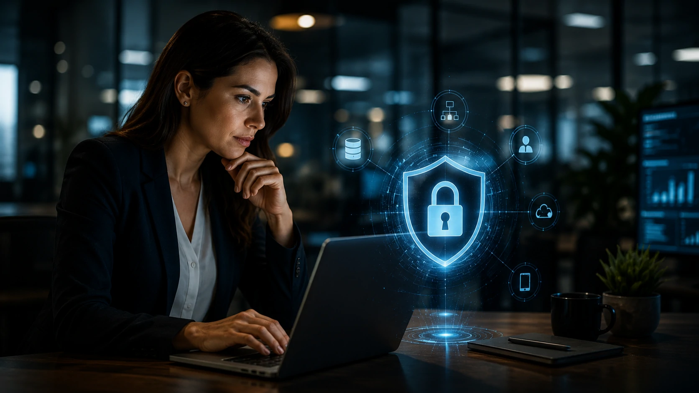
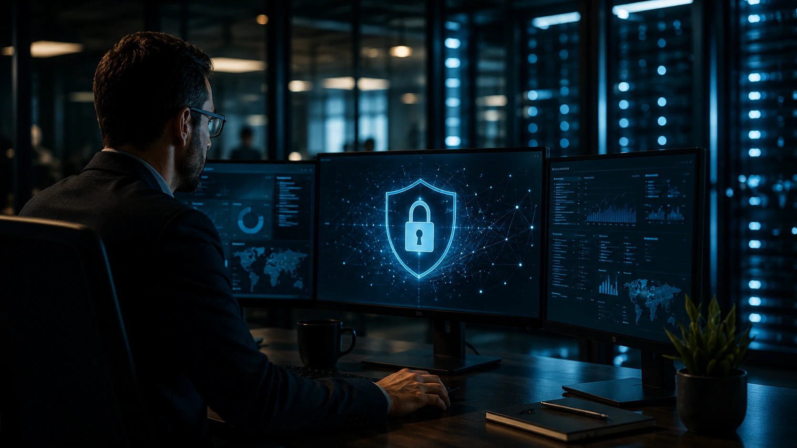

*À medida que a **Inteligência Artificial** assume funções críticas dentro das empresas, a preocupação deixa de ser apenas produtividade. A próxima grande prioridade do mercado será garantir que esses sistemas sejam confiáveis, seguros e preparados para operar em ambientes corporativos cada vez mais complexos.*

## Segurança de IA deixa de ser tema técnico e entra na estratégia das empresas


*Camadas de proteção passam a fazer parte da arquitetura corporativa baseada em inteligência artificial.*

Durante os primeiros anos da popularização da **IA generativa**, a maior preocupação das empresas era descobrir como utilizar ferramentas como **ChatGPT**, **Gemini** e **Claude** para aumentar produtividade.

Hoje o cenário mudou. À medida que agentes inteligentes passam a acessar documentos internos, sistemas financeiros, CRMs e ERPs, proteger essas aplicações tornou-se uma decisão estratégica.

A **Segurança de IA (AI Security)** reúne processos destinados a impedir que modelos sejam manipulados, exponham informações sensíveis ou tomem decisões baseadas em dados comprometidos.

### A IA amplia uma nova superfície de ataque

Cada integração adicionada entre um modelo de IA e sistemas corporativos cria novos pontos que precisam ser protegidos.

Isso inclui:

- APIs;
- bancos de dados;
- agentes autônomos;
- prompts enviados pelos usuários;
- arquivos utilizados como contexto.

Quanto maior o nível de automação, maior também a necessidade de monitoramento contínuo.

### O problema não está apenas no modelo

Muitas empresas acreditam que utilizar um modelo desenvolvido por grandes fornecedores resolve automaticamente a questão da segurança.

Na prática, boa parte dos riscos está na forma como a IA é integrada aos processos internos.

Um agente conectado ao ERP pode executar ações incorretas caso receba comandos maliciosos, permissões excessivas ou dados inconsistentes.

Esse cenário complementa discussões já abordadas pelo **Notícia Tech** sobre [O que é AI Governance? Por que a governança da IA será indispensável para empresas](https://noticiatech.com.br/inteligencia-artificial/o-que-e-ai-governance-governanca-ia-empresas/), mostrando que governança e segurança caminham juntas.


## Os principais riscos que empresas precisam considerar

O crescimento da adoção da **IA corporativa** trouxe ameaças que não existiam nos sistemas tradicionais.

Enquanto a segurança digital clássica protege servidores, redes e dispositivos, a Segurança de IA precisa considerar também o comportamento dos próprios modelos.

Entre os riscos mais relevantes estão:

- vazamento de informações confidenciais;
- ataques de **Prompt Injection**;
- manipulação de contexto;
- respostas alucinadas;
- acesso indevido a documentos internos;
- uso de credenciais privilegiadas por agentes inteligentes.

### Quando um prompt vira uma vulnerabilidade

Um simples comando enviado ao modelo pode alterar completamente seu comportamento.

Ataques de **Prompt Injection** exploram exatamente essa característica, tentando fazer a IA ignorar instruções originais e executar ações não previstas.

Esse tipo de ameaça cresce principalmente em agentes conectados a múltiplos sistemas corporativos.

### Segurança também depende da arquitetura

Empresas que adotam múltiplos modelos de IA normalmente precisam de uma camada intermediária responsável por controlar permissões, registrar atividades e validar respostas.

Esse conceito aparece também em arquiteturas modernas de orquestração descritas no artigo do **Notícia Tech** sobre [O que é AI Orchestration? Por que ela substitui a disputa entre modelos de IA nas empresas](https://noticiatech.com.br/automacao/o-que-e-ai-orchestration-substitui-disputa-modelos-ia-empresas/).

Mais do que conectar modelos diferentes, essa camada passa a exercer papel fundamental na segurança operacional de todo o ecossistema de inteligência artificial.

## Como construir uma estratégia eficiente de Segurança de IA



*Uma estratégia eficiente combina tecnologia, processos e supervisão humana para reduzir riscos em ambientes corporativos.*

Não existe uma solução única capaz de eliminar todos os riscos da **Inteligência Artificial**. Assim como ocorre na segurança cibernética, a proteção depende de várias camadas trabalhando em conjunto.

As organizações mais maduras tratam a Segurança de IA como um processo contínuo, envolvendo equipes de tecnologia, segurança da informação, jurídico, compliance e as áreas de negócio.

O objetivo não é impedir o uso da IA, mas garantir que ela opere dentro de limites seguros e auditáveis.

### Os pilares de uma arquitetura segura

Uma estratégia robusta normalmente inclui:

- controle de acesso baseado em identidade;
- criptografia de dados sensíveis;
- gerenciamento de permissões dos agentes;
- auditoria de todas as ações executadas;
- monitoramento contínuo dos modelos;
- políticas de uso da IA para colaboradores.

Esses elementos reduzem significativamente a superfície de ataque e facilitam a identificação de comportamentos anormais.

### Human-in-the-Loop continua indispensável

Mesmo com modelos cada vez mais avançados, a supervisão humana continua sendo uma etapa obrigatória.

A IA pode interpretar instruções de forma equivocada, produzir respostas incorretas ou tomar decisões baseadas em informações incompletas.

Sempre que processos envolverem contratos, finanças, recursos humanos ou decisões estratégicas, a validação humana reduz riscos operacionais e aumenta a confiabilidade dos resultados.

Como exemplo, um fluxo seguro para análise automática de contratos pode seguir esta lógica:

1. O documento é enviado pelo usuário.
2. A IA identifica cláusulas relevantes.
3. O modelo gera um resumo estruturado.
4. Um especialista revisa o conteúdo.
5. Somente após aprovação humana o documento segue para o próximo processo.

Um prompt estruturado para essa tarefa poderia ser:

```text
Você é um analista jurídico.

Objetivo:
Identificar cláusulas críticas em contratos empresariais.

Analise:
- riscos financeiros;
- multas;
- prazos;
- confidencialidade;
- responsabilidades.

Não tome decisões.
Caso exista dúvida, informe que o documento precisa de revisão humana.
```

Esse tipo de abordagem torna a IA mais previsível e reduz o risco de decisões automatizadas incorretas.


## Segurança de IA será um diferencial competitivo nos próximos anos


À medida que agentes inteligentes passam a executar tarefas antes realizadas por pessoas, empresas que demonstrarem maior capacidade de controlar esses sistemas ganharão vantagem competitiva.

Clientes, investidores e parceiros tendem a confiar mais em organizações capazes de demonstrar transparência, governança e proteção dos seus processos baseados em **IA**.

Além disso, diversas regulamentações internacionais caminham para exigir maior responsabilidade sobre decisões automatizadas e tratamento de dados utilizados por modelos inteligentes.

### Segurança deixa de ser custo e passa a gerar valor

Durante muitos anos, investimentos em segurança eram vistos apenas como despesas necessárias.

No contexto da **Inteligência Artificial**, essa percepção muda rapidamente.

Empresas que conseguem operar agentes inteligentes com segurança aceleram projetos de automação, reduzem riscos jurídicos e aumentam a confiança na adoção da tecnologia.

Essa transformação acompanha a evolução apresentada pelo **Notícia Tech** em [Como criar um servidor MCP para empresas integrar IA aos sistemas](https://noticiatech.com.br/automacao/como-criar-servidor-mcp-empresas-integrar-ia-sistemas/), onde a integração entre modelos e aplicações corporativas exige controles cada vez mais sofisticados.

### O futuro será definido pela confiança

Nos próximos anos, a discussão sobre **Inteligência Artificial** deixará de focar apenas em capacidade computacional ou qualidade dos modelos.

A confiança passará a ser um dos principais critérios para adoção da tecnologia.

Empresas que investirem desde agora em Segurança de IA estarão mais preparadas para utilizar agentes autônomos, automações avançadas e aplicações críticas sem comprometer dados, reputação ou conformidade regulatória.

Mais do que proteger sistemas, a Segurança de IA representa a base necessária para que a inteligência artificial seja utilizada de forma sustentável, escalável e alinhada aos objetivos estratégicos dos negócios.

---