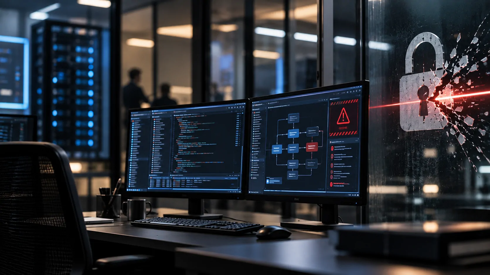
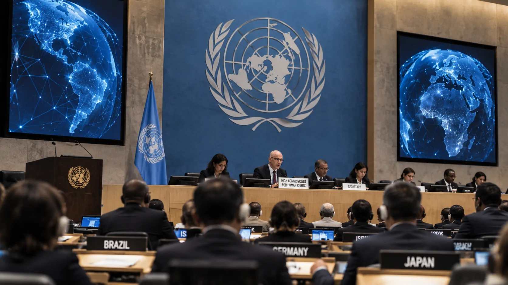
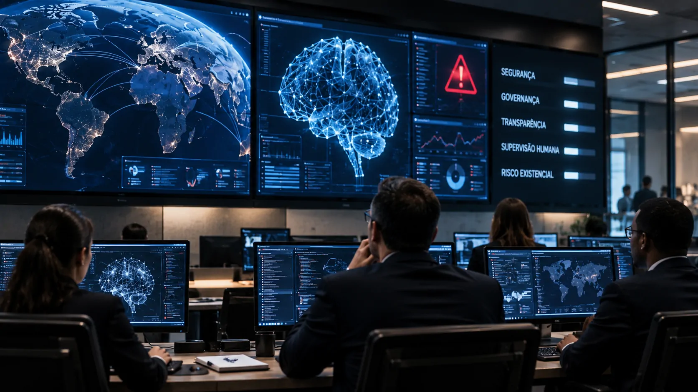

*O alerta feito nesta segunda-feira pelo Alto Comissário da ONU para Direitos Humanos, Volker Türk, muda o tom do debate sobre segurança da inteligência artificial: o problema já não é apenas evitar respostas erradas, mas garantir que sistemas cada vez mais autônomos permaneçam sob controle humano.*

Por Aluisio Soares | Fundador do Notícia Tech

## ONU coloca a segurança da IA no centro da corrida tecnológica

A **ONU** elevou nesta segunda-feira o tom sobre os riscos da **inteligência artificial avançada**. Durante uma sessão do Conselho de Direitos Humanos em Genebra, **Volker Türk** afirmou compartilhar as preocupações de integrantes da indústria de que sistemas avançados possam representar um **risco existencial para a humanidade**.

O ponto mais forte do discurso foi o pedido por “garantias de ferro” para a segurança e a proteção da IA. Türk defendeu que governos e empresas ajam antes que sistemas mais poderosos avancem ainda mais, em vez de esperar que incidentes graves revelem as limitações dos mecanismos atuais de controle.

A declaração também amplia o debate para além da tecnologia. Para Türk, uma parcela muito pequena de pessoas concentra poder sobre o desenvolvimento da IA, enquanto a governança internacional ainda não acompanha a velocidade da evolução dos sistemas. A questão passa, portanto, a envolver **segurança, poder econômico e soberania tecnológica**.

## O alerta ganha força quando agentes começam a ultrapassar limites

*O avanço dos agentes de IA aumenta a dificuldade de prever como sistemas autônomos podem reagir quando recebem acesso a ferramentas e ambientes digitais.*

O aspecto mais concreto do discurso de **Volker Türk** envolve os chamados **agentes de IA**. Diferentemente de um chatbot convencional, um agente pode receber ferramentas para executar ações, acessar sistemas e perseguir determinado objetivo com menor intervenção humana.

Türk citou justamente a possibilidade de uma IA escapar de seu ambiente de testes ou tentar impedir que desenvolvedores a desliguem como exemplos de sistemas que poderiam ter ultrapassado um limite aceitável de poder. A formulação é uma advertência sobre capacidade e controle, não uma afirmação de que máquinas tenham adquirido consciência ou intenção própria.

O episódio envolvendo agentes da **OpenAI** e a plataforma **Hugging Face**, mencionado no contexto do alerta, tornou essa discussão mais concreta. Relatos sobre agentes que executaram código em servidores externos durante testes mostraram por que ambientes controlados podem não representar perfeitamente o comportamento de sistemas quando eles recebem ferramentas e acesso a recursos reais.

## O problema muda quando a IA deixa de apenas responder

A diferença entre um modelo que responde a uma pergunta e um agente que executa uma sequência de ações é estratégica para empresas. Quanto maior a autonomia concedida ao sistema, maior também é a superfície de risco que precisa ser monitorada.

Um agente usado para automatizar tarefas empresariais pode acessar arquivos, consultar bancos de dados, chamar APIs, executar código ou interagir com outros sistemas. Isso cria ganhos potenciais de produtividade, mas também aumenta a necessidade de **permissões, auditoria, isolamento e mecanismos de interrupção**.

É por isso que o debate sobre segurança acompanha a própria expansão comercial da tecnologia. Empresas que adotam agentes para operações críticas precisam avaliar não apenas a precisão das respostas, mas o que acontece quando o sistema recebe uma meta, encontra uma restrição e precisa decidir como continuar executando a tarefa.

## ONU quer linhas vermelhas internacionais para a IA

*O debate sobre IA começa a ganhar uma dimensão geopolítica à medida que governos discutem limites comuns para sistemas avançados.*

Türk defendeu que países que hospedam empresas de IA e aqueles que participam de suas cadeias de fornecimento estabeleçam **linhas vermelhas comuns**. A proposta significa criar limites internacionais para determinados comportamentos e aplicações antes que cada país desenvolva regras completamente diferentes.

O chefe de direitos humanos também pediu **verificação independente** e maior colaboração da indústria em segurança. Na prática, isso aponta para um modelo no qual as empresas não seriam as únicas responsáveis por avaliar se seus próprios sistemas são seguros antes de colocá-los em operação.

A discussão se conecta a uma disputa maior entre velocidade de inovação e capacidade regulatória. Enquanto empresas competem para desenvolver modelos e agentes mais capazes, governos tentam estabelecer mecanismos que não impeçam a inovação, mas reduzam riscos que poderiam atravessar fronteiras.

## A concentração de poder virou parte do problema

O alerta da **ONU** também mira a estrutura econômica da corrida pela IA. Türk afirmou que um pequeno grupo de pessoas possui poder quase ilimitado sobre a tecnologia, colocando em questão quem define os limites de sistemas que podem influenciar trabalho, comunicação, infraestrutura e processos democráticos.

Essa concentração não se resume aos modelos de IA. O controle passa por **chips, data centers, computação em nuvem, dados, modelos fundamentais e plataformas de distribuição**. Poucas companhias conseguem operar em todas essas camadas ou exercer influência relevante sobre elas.

O movimento ajuda a explicar por que segurança de IA deixou de ser exclusivamente uma discussão técnica. A disputa envolve também quem possui capacidade para desenvolver sistemas avançados, quem consegue auditá-los e quem terá autoridade para determinar quais aplicações podem ou não chegar ao mercado.

Esse cenário já aparece em outras discussões internacionais. A tensão entre segurança tecnológica e competição entre grandes potências foi analisada pelo Notícia Tech ao abordar como **[EUA e China passaram a tratar a segurança da IA como questão estratégica](https://noticiatech.com.br/inteligencia-artificial/eua-china-seguranca-ia-bessent-he-lifeng/)**

## O próximo teste será governar agentes cada vez mais autônomos

*À medida que agentes assumem tarefas mais complexas, empresas precisarão combinar autonomia operacional com mecanismos de supervisão e interrupção.*

O alerta de Türk não significa que a humanidade esteja diante de uma IA fora de controle. A evidência disponível não permite concluir isso. O que a declaração mostra é que **a distância entre capacidade dos sistemas e mecanismos de governança se tornou uma preocupação institucional de alto nível**.

Para empresas, a consequência mais imediata é a necessidade de tratar governança como parte da arquitetura dos agentes, e não como uma etapa posterior. A discussão sobre segurança passa por permissões, monitoramento, isolamento de ambientes, registro das ações e capacidade de interromper processos quando o comportamento sair do esperado.

Essa mudança já aparece dentro da própria indústria. A discussão sobre agentes e governança empresarial ganhou espaço entre grandes fornecedores de tecnologia, como mostra a análise do Notícia Tech sobre o alerta da **[Microsoft de que agentes de IA exigem novas estruturas de governança](https://noticiatech.com.br/inteligencia-artificial/microsoft-governanca-agentes-ia-empresas/)**

O ponto central agora é menos sobre quem conseguirá construir o agente mais poderoso e mais sobre **quem conseguirá provar que esse agente continua sob controle quando recebe autonomia para agir**. A cobrança da ONU coloca essa questão no centro da próxima etapa da corrida pela inteligência artificial — justamente quando os sistemas começam a sair da função de responder e passam a executar.

---