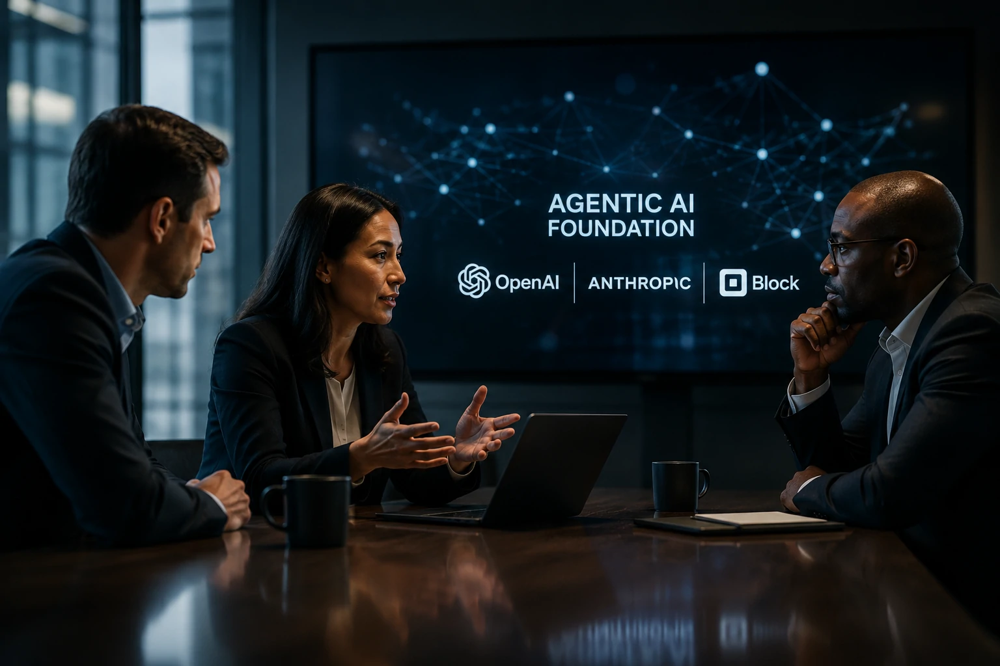
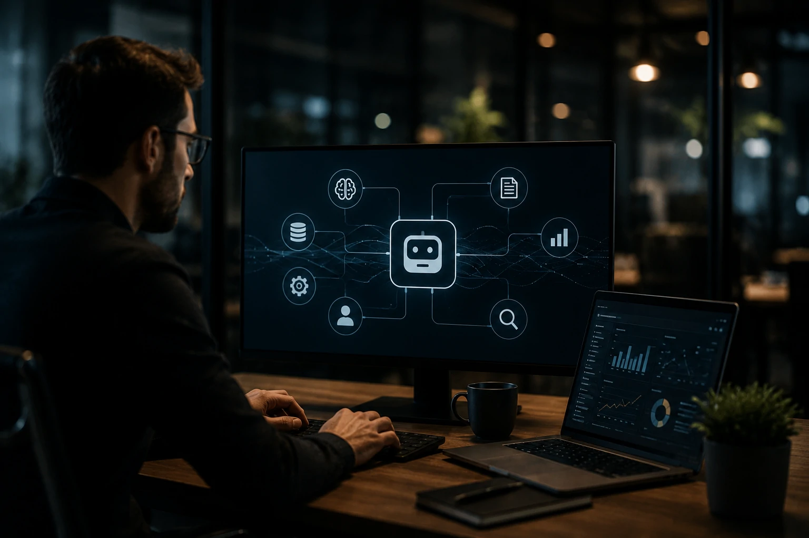

*O mercado de inteligência artificial começa a entrar em uma nova fase. Depois da disputa por modelos cada vez mais poderosos, o foco agora passa a ser a criação de padrões capazes de permitir que agentes de IA trabalhem juntos em ambientes corporativos complexos. É exatamente nesse contexto que surge a Agentic AI Foundation.*

## A criação da Agentic AI Foundation representa uma mudança estratégica para o mercado de IA

*OpenAI, Anthropic e Block unem esforços para criar padrões que favoreçam a interoperabilidade entre agentes inteligentes.*

A criação da **Agentic AI Foundation** mostra que a corrida da inteligência artificial está deixando de ser apenas uma disputa entre modelos para se tornar uma competição pela construção da infraestrutura que sustentará os próximos anos da automação empresarial.

A iniciativa reúne empresas que normalmente disputam clientes, investimentos e liderança tecnológica. Mesmo assim, elas compartilham um objetivo comum: criar um ambiente em que diferentes agentes inteligentes consigam operar utilizando padrões compatíveis.

Essa mudança possui enorme relevância para empresas porque reduz o risco de dependência de um único fornecedor e favorece um ecossistema mais aberto para desenvolvimento de soluções corporativas.

Nos últimos meses, o mercado já vinha demonstrando essa direção com iniciativas voltadas para interoperabilidade, como o crescimento do **MCP (Model Context Protocol)** e o avanço de arquiteturas voltadas para múltiplos agentes.

Essa evolução complementa tendências discutidas anteriormente pelo Notícia Tech, como o crescimento da **AI Orchestration**, que passa a coordenar diferentes modelos dentro das empresas.

https://noticiatech.com.br/automacao/o-que-e-ai-orchestration-substitui-disputa-modelos-ia-empresas/

## O mercado passa da guerra dos modelos para a disputa pela infraestrutura

A competição agora não acontece apenas em torno do melhor modelo de linguagem.

As grandes empresas perceberam que o verdadeiro diferencial competitivo será oferecer um ecossistema completo capaz de integrar modelos, agentes, aplicações corporativas e fluxos automatizados.

Essa estratégia reduz custos de integração, facilita o desenvolvimento de soluções empresariais e acelera projetos de transformação digital.

### O novo diferencial competitivo

Enquanto durante os últimos anos a prioridade foi desenvolver modelos maiores e mais inteligentes, a próxima etapa será permitir que esses modelos trabalhem juntos.

Empresas querem agentes especializados realizando tarefas específicas enquanto compartilham contexto, memória e informações de negócio.

### O papel dos padrões abertos

Padrões abertos aumentam a compatibilidade entre fornecedores.

Isso significa que organizações poderão combinar soluções da **OpenAI**, **Anthropic**, plataformas internas e softwares corporativos sem reconstruir toda a arquitetura tecnológica a cada novo projeto.

## A padronização pode acelerar a adoção de agentes de IA nas empresas

*Empresas buscam reduzir custos de integração e tornar agentes inteligentes compatíveis entre diferentes plataformas.*

A criação de padrões comuns pode reduzir uma das maiores barreiras para projetos corporativos de **Inteligência Artificial**: a integração entre diferentes sistemas.

Hoje, muitas empresas encontram dificuldades para conectar modelos de IA, bancos de dados, CRMs, ERPs e plataformas de automação em um único fluxo operacional.

Ao estimular uma arquitetura aberta, a **Agentic AI Foundation** pode facilitar esse processo e permitir que organizações adotem agentes especializados de forma gradual, sem substituir toda a infraestrutura existente.

### O impacto para pequenas e médias empresas

Pequenas e médias empresas também podem ser beneficiadas.

Em vez de depender exclusivamente de soluções proprietárias, será possível combinar diferentes ferramentas conforme a necessidade do negócio, reduzindo custos e aumentando a flexibilidade tecnológica.

Esse movimento acompanha outra tendência já observada pelo mercado: o crescimento das plataformas de automação com IA, que aproximam recursos antes restritos às grandes empresas.

Quem acompanha essa evolução também pode entender melhor como os agentes inteligentes vêm transformando processos comerciais no artigo sobre **AI SDR** publicado pelo Notícia Tech.

https://noticiatech.com.br/automacao/o-que-e-ai-sdr-agentes-ia-vendas-b2b/

### Interoperabilidade passa a ser vantagem competitiva

A interoperabilidade deixa de ser apenas uma característica técnica.

Ela passa a representar vantagem estratégica para empresas que desejam evitar dependência tecnológica, acelerar projetos de transformação digital e manter liberdade para incorporar novos modelos conforme eles surgirem.

## O que esperar da próxima fase da inteligência artificial corporativa

*O mercado caminha para ecossistemas compostos por múltiplos agentes inteligentes trabalhando de forma coordenada.*

A criação da **Agentic AI Foundation** indica que a próxima etapa da evolução da IA será construída sobre colaboração entre plataformas.

Em vez de um único modelo realizando todas as tarefas, empresas deverão operar ecossistemas completos formados por agentes especializados, conectados por protocolos abertos e capazes de compartilhar contexto continuamente.

### O foco muda da IA para o ecossistema

Nos próximos anos, o diferencial competitivo provavelmente deixará de ser apenas "qual modelo responde melhor".

A atenção do mercado deverá se concentrar na capacidade de integrar agentes, aplicações corporativas, bancos de dados, automações e processos de negócio em uma única arquitetura inteligente.

Essa mudança favorece empresas que investirem desde cedo em infraestrutura preparada para interoperabilidade.

### Um movimento que fortalece todo o setor

Embora **OpenAI**, **Anthropic** e **Block** continuem concorrendo em diferentes segmentos, a colaboração em torno de padrões comuns demonstra que o crescimento do mercado depende de um ecossistema capaz de funcionar de maneira integrada.

Para empresas, isso representa maior liberdade tecnológica.

Para desenvolvedores, cria novas oportunidades de inovação.

E para o mercado de inteligência artificial, sinaliza que a próxima grande disputa não será apenas sobre quem possui o modelo mais avançado, mas sobre quem conseguirá construir o ecossistema mais conectado, interoperável e preparado para suportar a nova geração de agentes inteligentes.

---