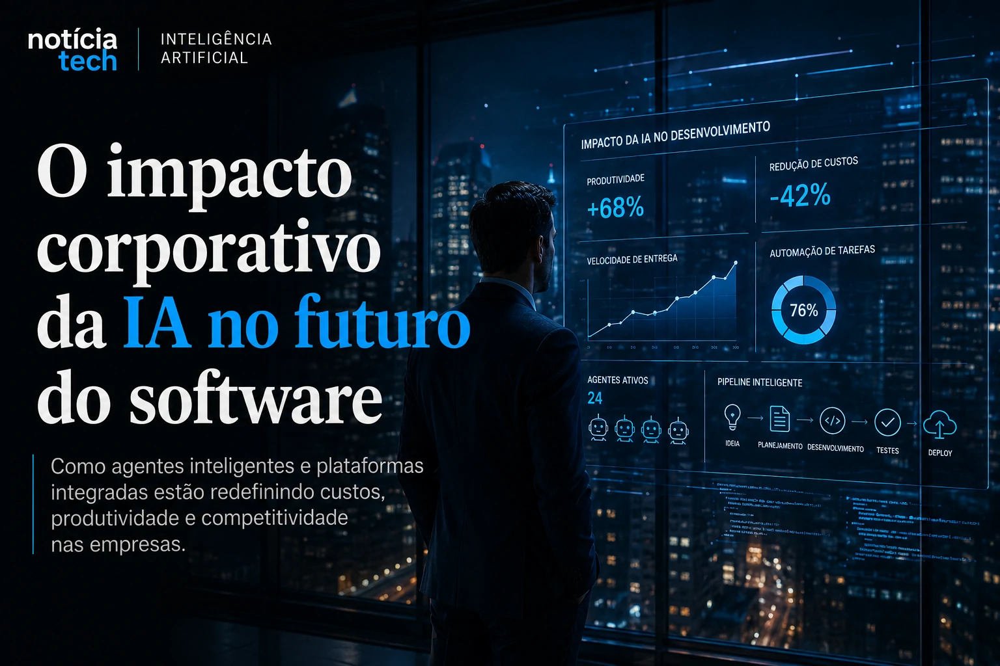

*Durante décadas, sistemas operacionais dominaram a computação ao controlar o ambiente onde softwares eram executados. Agora, a inteligência artificial começa a deslocar esse centro de poder para outro lugar: o ambiente onde o software é criado. Com agentes autônomos, programação assistida por IA e copilots cada vez mais integrados ao fluxo de trabalho, empresas como a OpenAI estão transformando o VS Code em algo muito maior do que um editor de código.*

## O VS Code pode se tornar a principal interface operacional da IA

O mercado de inteligência artificial entrou em uma nova fase. Depois da corrida pelos modelos fundacionais, o foco das grandes empresas começou a migrar para produtividade operacional, automação de desenvolvimento e criação acelerada de software.

Nesse cenário, o Visual Studio Code passou a ocupar uma posição estratégica.

O editor da Microsoft deixou de ser apenas uma ferramenta para programadores e começou a funcionar como uma plataforma operacional onde agentes inteligentes executam tarefas, analisam código, automatizam fluxos e colaboram diretamente com equipes de desenvolvimento.

### O avanço do Codex muda a lógica da programação tradicional

O avanço dos modelos da OpenAI dentro do ecossistema de desenvolvimento reforça uma mudança estrutural no mercado de software.

Ferramentas baseadas em IA já conseguem:
- interpretar documentação;
- sugerir arquiteturas;
- identificar falhas;
- automatizar refatorações;
- criar aplicações completas a partir de prompts.

Na prática, parte do trabalho operacional do desenvolvimento começa a ser transferida para agentes inteligentes especializados.

Esse movimento amplia uma tendência que já vinha aparecendo em plataformas de automação empresarial e agentes corporativos. O próprio Notícia Tech já mostrou como empresas estão acelerando investimentos em IA e agentes inteligentes para automatizar operações internas:

[Empresas dobram investimentos em IA corporativa e Brasil acelera adoção de agentes inteligentes](https://noticiatech.com.br/inteligencia-artificial/empresas-dobram-investimentos-em-ia-corporativa-e-brasil-acelera-ado%C3%A7%C3%A3o-de-agentes-inteligentes/)

Agora, a mesma lógica começa a atingir diretamente a engenharia de software.

### O editor deixa de ser ferramenta e vira ecossistema

Historicamente, sistemas operacionais concentravam valor porque controlavam aplicações, distribuição e experiência do usuário.

Mas a IA pode alterar esse equilíbrio.

O VS Code começa a ganhar importância porque se transforma em um ponto central onde:
- modelos são integrados;
- agentes operam;
- automações são executadas;
- software é criado;
- testes são realizados;
- aplicações são implantadas.

Isso cria uma nova camada operacional da economia digital.

Em vez de disputar apenas usuários finais, empresas passam a disputar o ambiente onde a próxima geração de softwares será produzida.

## A nova corrida bilionária dos agentes programadores

A corrida da IA não está mais concentrada apenas nos chatbots.

O novo foco do mercado envolve agentes capazes de executar tarefas complexas de maneira autônoma.

No desenvolvimento de software, isso significa IA participando diretamente da criação de aplicações, testes, manutenção e integração de sistemas.

### O mercado já entrou em uma disputa por produtividade extrema

Ferramentas como:
- GitHub Copilot;
- Cursor;
- Windsurf;
- agentes baseados em Codex;
- plataformas com IA integrada;

começam a transformar a lógica econômica do desenvolvimento.

A promessa dessas plataformas é reduzir drasticamente:
- tempo de entrega;
- custo operacional;
- dependência de equipes maiores;
- barreiras técnicas para criação de software.

Esse movimento se conecta diretamente ao avanço da industrialização da IA que o Notícia Tech já analisou recentemente:

[2026 virou o ano da industrialização da IA no Brasil](https://noticiatech.com.br/inteligencia-artificial/2026-virou-o-ano-da-industrializa%C3%A7%C3%A3o-da-ia-no-brasil/)

A diferença é que agora a própria produção de software entra no centro dessa transformação.

### Startups menores podem ganhar vantagem competitiva

Uma das mudanças mais relevantes desse novo cenário é a redução do custo de execução.

Com agentes programadores, equipes pequenas conseguem:
- lançar produtos mais rápido;
- validar ideias com menor investimento;
- automatizar tarefas repetitivas;
- operar com estruturas mais enxutas.

Isso altera a dinâmica competitiva do setor.

Empresas que antes precisavam de grandes times técnicos podem começar a operar com equipes menores apoiadas por IA.

Ao mesmo tempo, desenvolvedores passam a atuar menos como operadores manuais de código e mais como arquitetos de sistemas inteligentes.

### O crescimento do “vibe coding” acelera a mudança cultural

Nos últimos meses, o conceito de “vibe coding” começou a ganhar força no ecossistema de IA.

A expressão descreve um modelo de desenvolvimento onde o profissional utiliza linguagem natural, contexto e interação com agentes inteligentes para criar software de maneira muito mais rápida.

Em vez de escrever cada linha manualmente, o usuário passa a coordenar sistemas capazes de:
- gerar estruturas completas;
- interpretar objetivos;
- sugerir melhorias;
- adaptar funcionalidades automaticamente.

Esse movimento pode acelerar uma transformação semelhante à que ocorreu quando ferramentas no-code começaram a ganhar espaço.

A diferença é que agora a IA não elimina apenas complexidade visual. Ela começa a absorver parte da própria lógica operacional do desenvolvimento.

## O impacto corporativo pode mudar a indústria de software nos próximos anos

O impacto dessa transformação vai muito além dos programadores.

A IA aplicada ao desenvolvimento pode alterar:
- custos corporativos;
- velocidade de inovação;
- ciclos de produto;
- competitividade global;
- estrutura das empresas de tecnologia.

### A engenharia de software entra na era da automação inteligente

Nos últimos anos, a automação empresarial avançou sobre:
- atendimento;
- marketing;
- vendas;
- logística;
- análise de dados.

Agora, a própria engenharia de software começa a entrar nesse ciclo.

O Notícia Tech já mostrou anteriormente como a IA vem redesenhando processos internos nas empresas:

[Por que empresas estão redesenhando processos internos com IA em vez de apenas automatizar tarefas](https://noticiatech.com.br/negocios/por-que-empresas-est%C3%A3o-redesenhando-processos-internos-com-ia-e-n%C3%A3o-apenas-automatizando-tarefas/)

Com agentes programadores, esse processo ganha uma nova dimensão.

A criação de software deixa de depender exclusivamente de execução humana manual e passa a incorporar sistemas capazes de produzir partes significativas do trabalho técnico.

### O centro de valor da IA começa a migrar

Durante a primeira onda da IA generativa, o mercado concentrou atenção nos modelos fundacionais.

Agora, o valor começa a migrar para:
- interfaces;
- ecossistemas;
- produtividade;
- integração operacional;
- plataformas capazes de centralizar fluxos inteligentes.

É exatamente por isso que o VS Code se tornou tão estratégico.

Quem controlar o ambiente operacional da criação de software poderá influenciar diretamente:
- o fluxo de desenvolvimento;
- o uso de modelos;
- os padrões de integração;
- o comportamento das equipes;
- a economia da próxima geração de aplicações.

### A próxima disputa da IA pode acontecer dentro do ambiente de desenvolvimento

A transformação do VS Code em uma plataforma operacional para agentes inteligentes pode representar uma das mudanças mais importantes da indústria de software nesta década.

A corrida da IA deixa de ser apenas sobre “quem possui o melhor modelo” e passa a envolver outra pergunta muito mais estratégica:

quem controlará o ambiente onde os softwares do futuro serão criados.

Nos próximos anos, empresas que conseguirem integrar IA diretamente ao fluxo operacional do desenvolvimento poderão acelerar produtividade, reduzir custos e ganhar velocidade competitiva em uma escala que poucas revoluções tecnológicas conseguiram produzir até hoje.