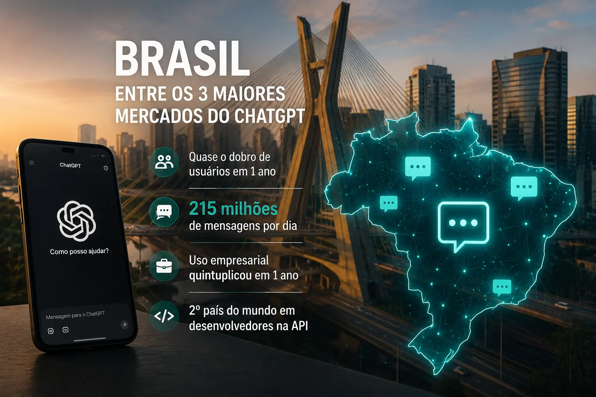
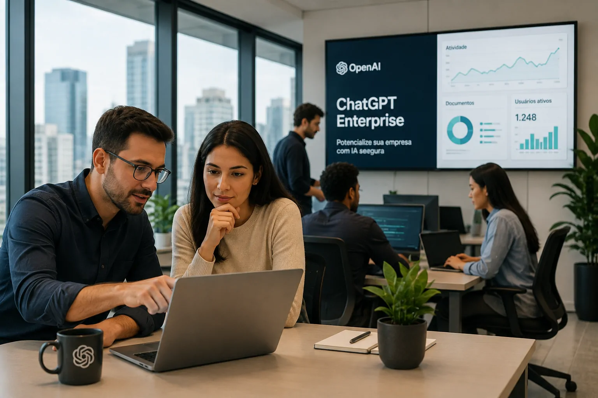
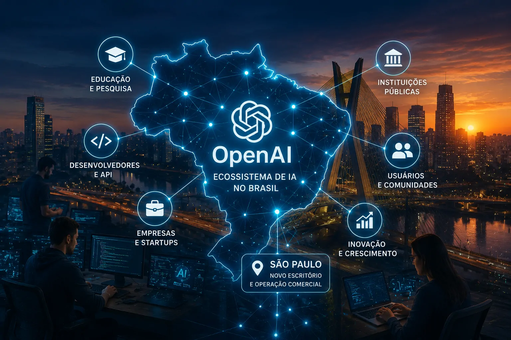

*A abertura da operação comercial da **OpenAI** no Brasil marca uma mudança de escala na relação da empresa com o país. Depois de quase dobrar sua base de usuários em um ano e registrar cerca de 215 milhões de mensagens enviadas ao ChatGPT por dia, a companhia passou a tratar o mercado brasileiro como uma frente estratégica de expansão.*

## OpenAI transforma o Brasil em uma operação comercial

A **OpenAI** anunciou em 27 de agosto o início de suas operações comerciais no Brasil, com uma equipe baseada em **São Paulo**. A estrutura local terá como foco empresas, desenvolvedores, pesquisadores e instituições públicas, ampliando a atuação da companhia além do acesso ao ChatGPT.

O movimento acontece em um mercado que ganhou peso rapidamente dentro do ecossistema da empresa. Segundo a OpenAI, o Brasil está entre os três maiores mercados do **ChatGPT** em número de usuários ativos semanais, enquanto a quantidade de usuários brasileiros quase dobrou nos últimos 12 meses.

O dado que melhor dimensiona essa escala é o volume de utilização. Brasileiros enviam aproximadamente **215 milhões de mensagens ao ChatGPT todos os dias**, mostrando que a ferramenta deixou de ser apenas uma novidade tecnológica e passou a fazer parte de atividades recorrentes de uma parcela relevante dos usuários.

### Uma presença que acompanha a adoção

A criação de uma operação comercial local não significa apenas abrir um escritório. Ela coloca a **OpenAI** mais próxima de organizações que precisam transformar o uso experimental de IA em aplicações concretas.

Esse ponto é particularmente relevante porque a própria empresa identifica uma mudança no comportamento brasileiro. Em junho de 2026, **35% das mensagens classificadas de contas individuais no Brasil estavam relacionadas ao trabalho**, contra 30% globalmente.

### O uso começa a sair da experimentação

Entre as mensagens relacionadas ao trabalho, 53% pediam que o ChatGPT realizasse uma tarefa ou produzisse algum resultado. Os exemplos divulgados incluem elaboração de propostas, análise de informações, programação e criação de materiais de marketing.

Isso ajuda a explicar por que a expansão comercial chega neste momento. O mercado brasileiro não está apenas aumentando o número de usuários, mas também incorporando a IA em atividades que podem ter impacto direto sobre produtividade e operações.

## Os números mostram por que o Brasil ganhou prioridade

*O crescimento da utilização do ChatGPT transformou o Brasil em um dos mercados mais relevantes para a expansão da OpenAI.*

O avanço brasileiro também aparece fora do uso individual. A **OpenAI** informou que o número de vagas do **ChatGPT Enterprise** no Brasil quintuplicou em um ano. O país também está entre os dez maiores mercados da empresa em número de clientes empresariais.

Esse crescimento muda a natureza da oportunidade. Quanto maior a presença da IA dentro das organizações, maior tende a ser a demanda por integração, segurança, governança, treinamento e definição de casos de uso que entreguem retorno mensurável.

### Desenvolvedores também entram no centro da estratégia

O ecossistema de desenvolvimento é outro fator importante. O Brasil ocupa o **segundo lugar no mundo em número de desenvolvedores que utilizam a API da OpenAI**, segundo os dados divulgados pela companhia.

O país também é o maior mercado do **Codex** na América Latina. Desde o início de 2026, a OpenAI afirma que o número de usuários semanais do Codex no Brasil cresceu mais de 11 vezes, enquanto as interações diárias aumentaram quase 30 vezes.

Esse cenário cria uma segunda camada para a operação brasileira. Além de vender e apoiar produtos de IA, a empresa passa a atuar mais próxima de uma comunidade capaz de construir aplicações próprias sobre sua tecnologia.

### A demanda corporativa pode ser o próximo estágio

A diferença entre usar uma ferramenta de IA e incorporá-la a uma operação empresarial é significativa. Empresas precisam conectar sistemas, estabelecer políticas de uso, proteger informações e definir quais processos realmente devem ser automatizados.

É nesse contexto que a expansão local ganha importância. A operação brasileira pode aproximar a **OpenAI** de organizações que já experimentam o ChatGPT e agora precisam avançar para projetos mais estruturados.

## A OpenAI quer transformar adoção em impacto econômico

O movimento também está relacionado a uma discussão maior sobre produtividade. A OpenAI afirma que um estudo independente do RegLab, financiado pela empresa, estima que a IA poderia acrescentar quase **R$ 1 trilhão à economia brasileira até 2030**.

Esse número é uma estimativa, e não um resultado já realizado. A própria OpenAI destaca que transformar potencial tecnológico em impacto econômico exige capacitação, pesquisa, implementação responsável e colaboração com instituições brasileiras.

A diferença é importante porque evita interpretar o crescimento do ChatGPT como sinônimo automático de produtividade. Ter muitos usuários não significa, por si só, que empresas estejam capturando ganhos equivalentes.

### O desafio passa a ser a implementação

Para o mercado corporativo, a próxima etapa é menos sobre simplesmente disponibilizar um chatbot e mais sobre definir onde a tecnologia pode gerar valor.

Empresas podem utilizar IA para produzir documentos, analisar informações, apoiar equipes comerciais, automatizar tarefas e acelerar desenvolvimento de software. Mas cada aplicação exige avaliação de dados, segurança, custos e supervisão humana.

O próprio crescimento do uso relacionado ao trabalho indica que essa transição já começou. A operação comercial da **OpenAI** coloca a empresa em uma posição mais próxima das organizações que estão tentando transformar esse uso em processos permanentes.

### O mercado brasileiro ganha importância estratégica

A decisão também sinaliza que o Brasil passou a ser relevante não apenas pelo tamanho de sua população conectada, mas pela intensidade e diversidade do uso da IA.

A combinação entre usuários, empresas e desenvolvedores cria um ecossistema mais amplo. Para a **OpenAI**, isso significa um mercado capaz de consumir produtos, construir aplicações e produzir novos casos de uso ao mesmo tempo.

Essa combinação pode ser especialmente importante em um momento em que empresas de IA competem não apenas pela qualidade dos modelos, mas também pela capacidade de colocá-los dentro das operações reais dos clientes.

## O que a operação brasileira pode mudar para as empresas

*A expansão comercial aproxima a OpenAI de empresas brasileiras que buscam transformar o uso experimental de IA em aplicações corporativas.*

A presença local pode reduzir a distância entre a tecnologia oferecida pela **OpenAI** e as necessidades específicas de organizações brasileiras. Isso não significa que todos os obstáculos de adoção desaparecerão, mas cria condições para uma atuação mais próxima do mercado.

Para gestores, a principal mudança não está necessariamente no ChatGPT que já utilizam. O impacto potencial está na expansão das possibilidades de implementação empresarial, parcerias e projetos desenvolvidos diretamente no país.

### Empresas podem acelerar projetos de IA

Uma operação comercial dedicada pode ajudar a ampliar o relacionamento com clientes corporativos e identificar aplicações específicas para diferentes setores.

Esse movimento ocorre enquanto a própria **OpenAI** amplia produtos voltados ao trabalho. O Notícia Tech já analisou como a **[OpenAI lançou um plugin para administrar empresas no ChatGPT](https://noticiatech.com.br/inteligencia-artificial/openai-lanca-plugin-admin-administrar-empresas-chatgpt/)**, uma discussão que ganha ainda mais relevância diante do crescimento da adoção corporativa no Brasil.

A questão central para as empresas brasileiras passa a ser menos “devemos testar IA?” e mais “em quais processos a IA pode gerar valor mensurável?”. A resposta dependerá de cada organização, mas a infraestrutura comercial da OpenAI tende a tornar essa conversa mais presente no mercado.

### Desenvolvedores podem ganhar espaço

O crescimento da API e do Codex também indica uma oportunidade para empresas brasileiras criarem aplicações próprias em vez de depender exclusivamente de interfaces prontas.

Esse modelo permite construir produtos e fluxos específicos para setores, departamentos ou necessidades particulares. Ao mesmo tempo, aumenta a importância de arquitetura, governança e integração com sistemas existentes.

Para quem acompanha a evolução da IA empresarial, essa mudança é relevante porque amplia a discussão de ferramentas para **infraestrutura de negócios baseada em IA**.

## A expansão acontece junto com outras iniciativas no país

A operação comercial não chega isoladamente. A **OpenAI** anunciou iniciativas envolvendo o **Instituto Tecnológico de Aeronáutica (ITA)**, a startup jurídica **Enter** e a **Prodam**, mostrando que a estratégia brasileira também inclui relações com educação, setor público e empresas.

Essas iniciativas ajudam a indicar como a companhia pretende construir presença local. Em vez de concentrar a expansão apenas na venda do ChatGPT, a empresa está buscando diferentes pontos de contato com o ecossistema brasileiro.

### Educação e pesquisa entram na estratégia

A aproximação com instituições de ensino e pesquisa pode contribuir para ampliar a formação de profissionais e a experimentação de aplicações de IA.

Esse componente é importante porque a expansão de uma tecnologia avançada depende também de pessoas capazes de utilizá-la de forma adequada. A disponibilidade de modelos não elimina a necessidade de conhecimento técnico e capacidade de implementação.

### Setor público também aparece no radar

A colaboração com a **Prodam** mostra que o interesse não está limitado ao setor privado. Instituições públicas também podem se tornar importantes ambientes de aplicação de IA, especialmente em serviços, análise de dados e automação de processos.

Ainda é cedo para medir o impacto dessas iniciativas. O que já está confirmado é a intenção de construir uma presença mais próxima de diferentes setores da economia brasileira.

## O Brasil deixa de ser apenas mercado consumidor de IA

*A nova operação aproxima a OpenAI de um ecossistema brasileiro que reúne usuários, empresas, desenvolvedores, pesquisadores e instituições públicas.*

A principal mudança provocada pelo anúncio está na posição que o Brasil passa a ocupar dentro da estratégia da **OpenAI**. Os números de uso, o crescimento empresarial e a expansão entre desenvolvedores mostram um mercado que já possui escala suficiente para justificar uma estrutura comercial própria.

Isso também muda a forma como empresas brasileiras devem observar a evolução da IA. A expansão da OpenAI acontece em paralelo ao avanço de outras plataformas e modelos, aumentando a competição por clientes corporativos e desenvolvedores.

A estratégia da empresa também envolve a própria infraestrutura necessária para sustentar essa expansão. O Notícia Tech já mostrou como a **[OpenAI prepara chip próprio para acelerar respostas do ChatGPT](https://noticiatech.com.br/inteligencia-artificial/openai-chip-proprio-acelerar-respostas-chatgpt-reduzir-dependencia-nvidia/)**, movimento que ajuda a dimensionar o esforço da companhia para ampliar sua capacidade tecnológica.

O próximo movimento relevante será acompanhar se a presença local conseguirá transformar a enorme utilização do **ChatGPT** em projetos empresariais mais profundos, novas aplicações e ganhos concretos de produtividade.

Para o mercado brasileiro, esse é provavelmente o aspecto mais importante do anúncio. A abertura do escritório não cria a demanda por IA. Ela é, em grande medida, uma resposta ao fato de que essa demanda já alcançou uma escala que a **OpenAI** considera estratégica.

O Brasil, portanto, não está apenas recebendo uma operação comercial. Está se tornando um dos ambientes em que a empresa poderá testar, desenvolver e ampliar novas formas de adoção da inteligência artificial em empresas, governos e comunidades de desenvolvedores.

---