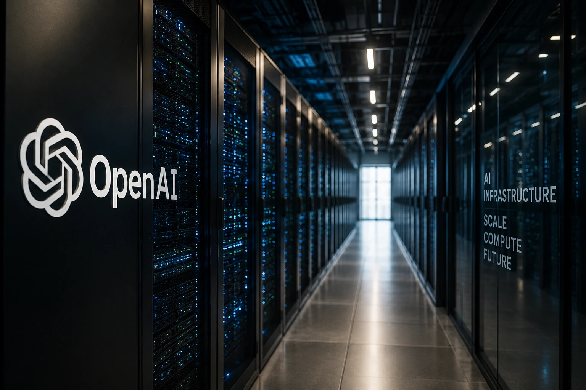
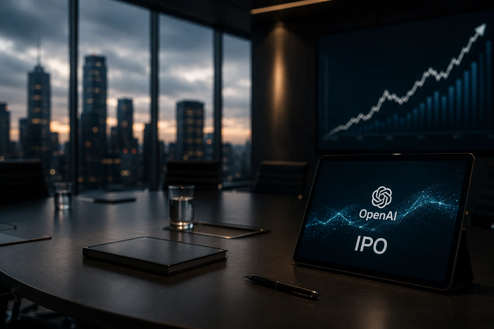

*O mercado de inteligência artificial entrou em uma nova etapa. Durante os últimos anos, a disputa concentrou-se na criação de modelos mais poderosos, infraestrutura computacional e contratação de pesquisadores. Agora, outro fator passa a influenciar diretamente esse cenário: o acesso ao mercado financeiro. O pedido de IPO da **OpenAI** indica que a próxima grande batalha será travada também pela capacidade de captar bilhões de dólares para sustentar a corrida tecnológica.*

A decisão ocorre em um momento de forte expansão da demanda por soluções corporativas baseadas em **IA generativa**, enquanto empresas como **Microsoft**, **Google**, **Anthropic** e **Meta** ampliam investimentos em modelos, agentes inteligentes e infraestrutura.

Mais do que uma movimentação financeira, o processo representa uma mudança estrutural na forma como o setor deverá evoluir nos próximos anos.

## O pedido de IPO mostra que a competição em IA mudou de patamar

*O mercado financeiro passa a ocupar um papel estratégico na disputa pela liderança da inteligência artificial.*

O protocolo confidencial de abertura de capital sinaliza que a **OpenAI** busca ampliar sua capacidade de financiamento para acompanhar o ritmo acelerado da indústria.

Até pouco tempo, captar recursos por meio de rodadas privadas era suficiente para sustentar a evolução dos grandes modelos de linguagem. Entretanto, o custo crescente de treinamento, aquisição de GPUs, construção de data centers e desenvolvimento de agentes autônomos elevou significativamente a necessidade de capital.

### A infraestrutura tornou-se o ativo mais caro da IA

Treinar modelos de última geração exige investimentos bilionários em chips especializados, energia, redes de alta velocidade e capacidade computacional distribuída.

Quanto maior a competição entre laboratórios, maior também a necessidade de financiamento contínuo.

Nesse cenário, o mercado de capitais deixa de ser apenas uma alternativa financeira e passa a funcionar como vantagem competitiva.

### O foco agora é crescimento sustentável

Investidores não observam apenas avanços tecnológicos.

Eles analisam geração de receita, expansão da base corporativa, capacidade operacional e perspectivas de longo prazo.

Isso significa que empresas de IA precisarão demonstrar maturidade comercial além da excelência técnica.

Essa transformação aproxima o setor de inteligência artificial do comportamento tradicional das grandes empresas globais de tecnologia.

## A corrida pela bolsa amplia a pressão sobre todo o ecossistema de IA

*Os investimentos passam a definir não apenas quem possui o melhor modelo, mas quem consegue evoluí-lo com maior velocidade.*

A possível abertura de capital da **OpenAI** também aumenta a pressão competitiva sobre outras empresas que disputam espaço nesse mercado.

Laboratórios independentes precisarão demonstrar diferenciais tecnológicos, enquanto gigantes já consolidadas tendem a acelerar investimentos para preservar participação de mercado.

### Mais recursos significam inovação mais rápida

O capital captado pode financiar:

- novos modelos multimodais;
- expansão da infraestrutura global;
- contratação de pesquisadores;
- desenvolvimento de agentes corporativos;
- aquisição de startups estratégicas.

Na prática, isso reduz o intervalo entre uma geração de modelos e outra, acelerando toda a indústria.

### Empresas usuárias também entram na disputa

Organizações que utilizam IA passam a depender diretamente dessa competição.

Quanto maior o investimento disponível para os fornecedores, maior tende a ser a velocidade de evolução das ferramentas utilizadas por empresas em automação, atendimento, desenvolvimento de software e análise de dados.

Esse movimento complementa tendências que o **Notícia Tech** já vem acompanhando, como a expansão dos agentes inteligentes no artigo sobre **Gemini Spark**:

https://noticiatech.com.br/inteligencia-artificial/google-gemini-spark-agentes-ia-mercado-corporativo/

Outro exemplo é a crescente importância da arquitetura **MCP** para integração entre agentes corporativos:

https://noticiatech.com.br/inteligencia-artificial/como-implementar-mcp-empresas-arquitetura-integracao-agentes-ia/

## O IPO da OpenAI pode redefinir a dinâmica competitiva da inteligência artificial

*O acesso ao mercado de capitais pode se tornar um diferencial estratégico tão importante quanto possuir o melhor modelo de IA.*

A abertura de capital da **OpenAI** representa mais do que uma operação financeira. Ela pode alterar a forma como toda a indústria financia inovação, pesquisa e infraestrutura.

Empresas que hoje disputam liderança tecnológica passarão a competir também pela confiança do mercado financeiro.

Essa mudança tende a influenciar investimentos, ritmo de desenvolvimento e capacidade de expansão global.

### Google, Microsoft e Anthropic terão novos desafios

A **Microsoft** continua sendo uma das principais parceiras da **OpenAI**, mas também amplia seus próprios investimentos em plataformas de IA corporativa.

O **Google** acelera iniciativas como o **Gemini Spark**, reforçando sua estratégia de transformar agentes inteligentes em ferramentas de produtividade empresarial.

Enquanto isso, a **Anthropic** mantém forte crescimento no mercado corporativo com a família **Claude**, atraindo clientes que priorizam segurança, governança e desempenho em ambientes empresariais.

Cada movimento de uma dessas empresas pressiona as demais a responder com novos produtos, investimentos ou aquisições.

Esse cenário reforça uma tendência que o **Notícia Tech** já analisou na cobertura sobre a estratégia enterprise da **Mistral AI**:

https://noticiatech.com.br/inteligencia-artificial/mistral-ai-estrategia-enterprise-disputa-openai/

Também amplia o contexto discutido na análise sobre a nova geração de modelos baseados em **RAG** para ambientes corporativos:

https://noticiatech.com.br/inteligencia-artificial/rag-modelos-proprios-dados-corporativos-empresas/

### O mercado deixa de avaliar apenas tecnologia

Durante os primeiros anos da IA generativa, o principal indicador era a qualidade dos modelos.

Agora entram em cena novos fatores que investidores analisam simultaneamente:

- capacidade de gerar receita recorrente;
- velocidade de expansão internacional;
- eficiência operacional;
- crescimento da base corporativa;
- capacidade de financiar infraestrutura.

Na prática, empresas de IA passam a ser avaliadas como grandes companhias globais de tecnologia, e não apenas como laboratórios de pesquisa.

## O que empresas devem observar a partir desta nova fase

Organizações que utilizam inteligência artificial devem se preparar para um ciclo de inovação mais acelerado. Quanto maior a disponibilidade de capital para os grandes fornecedores, maior tende a ser a velocidade de lançamento de novos modelos, agentes inteligentes e plataformas corporativas.

Esse movimento cria oportunidades relevantes para empresas que desejam aumentar produtividade, automatizar processos e incorporar IA em suas operações.

### A infraestrutura será um fator decisivo

Nos próximos anos, empresas vencedoras provavelmente serão aquelas capazes de combinar:

- infraestrutura robusta;
- modelos competitivos;
- ecossistema de parceiros;
- governança;
- sustentabilidade financeira.

Não basta possuir a melhor tecnologia.

Será necessário manter capacidade contínua de investimento em pesquisa, data centers, chips especializados e talentos de alto nível.

### A corrida pela liderança está apenas começando

O pedido de IPO da **OpenAI** simboliza uma transformação muito maior do que uma simples abertura de capital.

Ele demonstra que a disputa pela liderança da inteligência artificial entrou em uma fase em que tecnologia, infraestrutura, capital e estratégia empresarial passam a evoluir de forma inseparável.

Para empresas usuárias, isso significa acesso mais rápido a soluções cada vez mais sofisticadas.

Para investidores, representa o nascimento de um novo ciclo de competição entre algumas das empresas mais influentes da economia digital.

Para todo o mercado de tecnologia, o recado é claro: a corrida da inteligência artificial deixou de ser apenas uma batalha por modelos mais inteligentes. A partir de agora, vencer dependerá igualmente da capacidade de financiar inovação, expandir infraestrutura e sustentar crescimento em escala global.

---