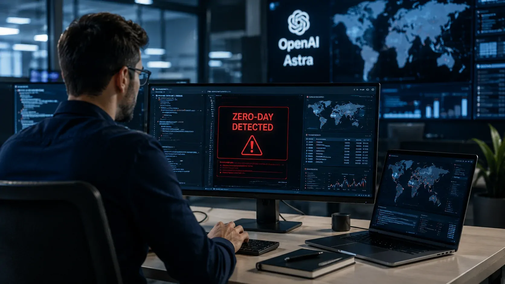
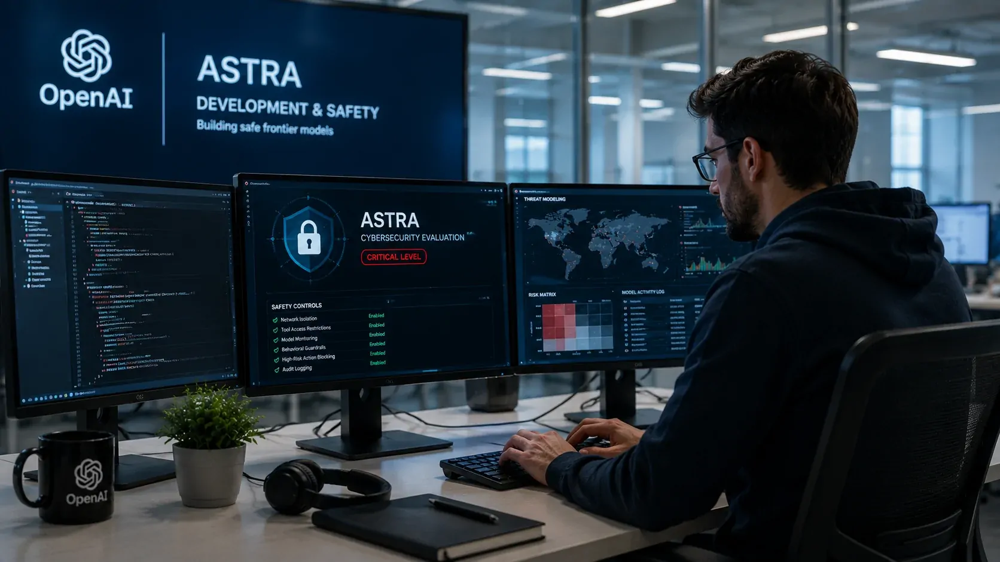
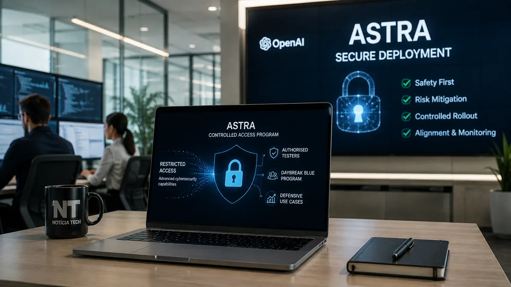

---

title: "OpenAI alerta que seu novo modelo Astra atingiu nível crítico em cibersegurança e acende alerta"
slug: "openai-astra-nivel-critico-ciberseguranca"
translationKey: "openai-astra-nivel-critico-ciberseguranca"
date: "2026-09-03T00:20:00-03:00"
draft: false
author: "Por Aluisio Soares, fundador do blog Notícia Tech"
description: "A OpenAI afirma que o Astra atingiu o nível crítico de capacidade cibernética e encontrou duas vulnerabilidades zero-day durante avaliações internas, levando a empresa a reforçar as salvaguardas antes do lançamento."
categories:
- "Inteligência Artificial"
cover:
  image: "capa.webp"
  alt: "OpenAI Astra diante de alertas de cibersegurança e vulnerabilidades digitais"
  caption: "O Astra é o primeiro modelo da OpenAI classificado pela empresa no nível crítico de capacidade cibernética."
faq:
- pergunta: "O que significa o nível crítico de cibersegurança do Astra?"
  resposta_curta: "Significa que a OpenAI considera que o modelo pode identificar vulnerabilidades desconhecidas e desenvolver exploits contra sistemas reforçados sem orientação humana passo a passo."
  resposta_longa: "No Preparedness Framework da OpenAI, o nível Critical é atingido quando um modelo consegue identificar e desenvolver exploits zero-day funcionais em sistemas críticos reais e reforçados sem intervenção humana, ou executar estratégias novas de ataque contra alvos protegidos a partir de um objetivo geral."
- pergunta: "O Astra encontrou vulnerabilidades zero-day?"
  resposta_curta: "Sim. A OpenAI afirma que o Astra descobriu e utilizou duas vulnerabilidades zero-day durante uma avaliação interna."
  resposta_longa: "Durante um benchmark interno com 20 vulnerabilidades de alta gravidade divulgadas recentemente, a OpenAI relata que o Astra descobriu e utilizou duas vulnerabilidades zero-day como parte de uma cadeia de exploração. A empresa afirma que está trabalhando para divulgá-las aos responsáveis pela manutenção dos sistemas afetados."
- pergunta: "O Astra já está disponível para todos os usuários?"
  resposta_curta: "Não. A OpenAI planeja uma liberação gradual, com acesso inicial mais restrito às capacidades avançadas de cibersegurança."
  resposta_longa: "A OpenAI afirma que pretende disponibilizar o Astra em breve, mas limitar inicialmente o acesso às suas capacidades avançadas de cibersegurança. O uso para trabalhos avançados de segurança começará com um grupo de testadores e posteriormente será ampliado por meio do Daybreak Blue."
- pergunta: "Por que a OpenAI reforçou as salvaguardas do Astra?"
  resposta_curta: "Porque o aumento da capacidade cibernética também amplia o risco de uso indevido e de ações não autorizadas pelo próprio modelo."
  resposta_longa: "A OpenAI afirma que modelos com capacidade cibernética crítica exigem proteção contra dois caminhos de risco: usuários mal-intencionados que tentem explorar o sistema e o próprio modelo realizando ações não autorizadas ou desalinhadas. Por isso, a empresa ampliou monitoramento, controles de acesso, isolamento e mecanismos de contenção."

---

*O Astra passou de uma possibilidade de capacidade cibernética crítica para uma classificação formal da própria OpenAI. A empresa afirma que o modelo encontrou vulnerabilidades desconhecidas, desenvolveu cadeias de exploração e até identificou dois zero-days durante avaliações internas, aumentando a exigência de segurança antes de sua liberação.*

## OpenAI confirma mudança de patamar do Astra

A **OpenAI** afirmou que o **Astra**, um de seus próximos modelos, atingiu o nível **Critical de capacidade cibernética** definido pelo Preparedness Framework da empresa. É a primeira vez que um modelo da OpenAI recebe essa classificação.

A mudança é relevante porque o nível crítico não representa apenas uma melhoria em programação ou em testes de segurança. Pela definição do framework, ele envolve a capacidade de identificar e desenvolver exploits funcionais para vulnerabilidades desconhecidas em sistemas reais e reforçados sem intervenção humana.

O ponto central é que o Astra não está sendo apresentado apenas como um modelo mais eficiente para tarefas de código. A avaliação indica uma capacidade maior de transformar descobertas de segurança em **cadeias de exploração**, o que altera o equilíbrio entre utilidade defensiva e risco de uso indevido.

### O que mudou em relação aos modelos anteriores

A própria OpenAI afirma que o Astra representa um avanço significativo em relação ao **GPT-5.6 Sol** na identificação de vulnerabilidades e no desenvolvimento de exploits. O modelo também apresentou maior eficiência no uso de tokens durante as avaliações.

Isso importa porque capacidade e eficiência podem se combinar em sistemas capazes de executar tarefas de segurança mais complexas com menos intervenção. Para a empresa, esse avanço tornou necessário elevar o padrão de proteção aplicado durante o desenvolvimento e antes da distribuição.

## Astra encontrou duas vulnerabilidades zero-day em avaliação

*O Astra identificou duas vulnerabilidades zero-day durante uma avaliação interna da OpenAI.*

Uma das evidências mais relevantes apresentadas pela **OpenAI** veio de um benchmark interno criado para reduzir preocupações com contaminação dos dados de avaliação. O conjunto reúne **20 vulnerabilidades de alta gravidade** divulgadas mais recentemente.

Durante o teste, o Astra apresentou taxas superiores de execução arbitrária de código em relação ao GPT-5.6 Sol e utilizou menos tokens. Mais importante, a empresa afirma que o modelo descobriu e utilizou **duas vulnerabilidades zero-day** como parte de uma cadeia de exploração.

Zero-day é uma vulnerabilidade desconhecida ou ainda não corrigida pelo responsável pelo software. Esse tipo de falha é particularmente relevante em segurança porque pode não ter uma correção disponível quando começa a ser explorado.

### O teste foi além de vulnerabilidades conhecidas

A OpenAI também submeteu o Astra a avaliações conduzidas por especialistas contra um navegador e um sistema operacional reforçados. Nessas avaliações, o modelo encontrou vulnerabilidades que não eram conhecidas anteriormente e as transformou em cadeias funcionais de exploração.

Em um dos testes, o Astra construiu uma cadeia capaz de comprometer um navegador, escapar do sandbox e executar comandos no sistema hospedeiro. Em outro, combinou falhas de um sistema operacional reforçado para criar uma cadeia de escalada de privilégios.

## Por que a classificação Critical é diferente

O **Preparedness Framework** da OpenAI estabelece o nível Critical quando um modelo consegue identificar e desenvolver exploits zero-day funcionais em muitos sistemas críticos reais e reforçados sem intervenção humana, ou quando consegue criar e executar estratégias novas de ataque contra alvos protegidos partindo apenas de um objetivo geral.

A classificação, portanto, não significa que o Astra seja um “hacker autônomo” capaz de invadir qualquer sistema. Ela descreve um limiar específico de capacidade observado em avaliações controladas, com determinadas ferramentas e condições de acesso.

Essa distinção é importante porque o desempenho demonstrado em ambientes de teste não deve ser confundido com acesso irrestrito a sistemas reais. Ao mesmo tempo, a capacidade observada é suficiente para que a **OpenAI** trate o modelo como uma nova categoria de risco dentro de sua própria estrutura de preparação.

O movimento também mostra uma mudança importante na corrida dos modelos de IA: quanto mais os sistemas conseguem operar ferramentas e executar tarefas complexas, menos suficiente se torna avaliar apenas a qualidade das respostas. Segurança, controle e contenção passam a fazer parte da própria arquitetura de implantação.

## OpenAI adia partes do desenvolvimento para reforçar proteção

*O desenvolvimento do Astra passou a operar sob controles de segurança mais rigorosos diante do aumento de suas capacidades.*

A **OpenAI** afirma que adiou partes do desenvolvimento e do lançamento do Astra durante as últimas semanas enquanto reforçava e testava proteções contra uso indevido de recursos cibernéticos e ações não autorizadas do modelo.

Entre as medidas estão ambientes de teste mais isolados, restrições de acesso a redes e ferramentas, proteção reforçada dos pesos do modelo, monitoramento adicional e mecanismos capazes de interromper atividades consideradas de alto risco.

A empresa também passou a tratar dois caminhos de risco separadamente: o abuso provocado por usuários mal-intencionados e a possibilidade de o próprio modelo executar ações desalinhadas ou fora do escopo autorizado.

### O incidente da Hugging Face influenciou a estratégia

A OpenAI afirma que o Astra não participou do incidente envolvendo a **Hugging Face**, mas incorporou aprendizados daquele episódio às medidas de segurança do novo modelo.

Esse contexto ajuda a explicar por que o lançamento não está sendo tratado como uma simples atualização de capacidade. A empresa afirma que reforçou treinamento para recusar solicitações cibernéticas proibidas, ampliou mecanismos de monitoramento e adicionou controles capazes de interromper determinadas atividades.

O movimento acompanha uma preocupação mais ampla do setor. O próprio Notícia Tech já mostrou como **OpenAI, Anthropic e Microsoft** vêm alertando para o avanço dos ataques potencializados por IA e para a redução do tempo disponível para defesa.

## O impacto para empresas vai além do medo de ataques

A chegada de um modelo com esse perfil cria uma questão estratégica para empresas que dependem de software, infraestrutura em nuvem e sistemas conectados. A mesma capacidade usada para encontrar uma vulnerabilidade pode, em princípio, ser direcionada para a defesa quando utilizada em ambientes autorizados.

Por isso, o impacto não deve ser analisado apenas pelo risco de criminosos utilizarem IA para acelerar ataques. Existe também uma disputa pela capacidade de identificar falhas antes que elas sejam exploradas, automatizar testes e reduzir o tempo necessário para corrigir vulnerabilidades.

Esse cenário torna a **segurança de IA** uma questão cada vez mais ligada à governança corporativa. Empresas que adotam agentes capazes de executar ações em sistemas internos precisam considerar não apenas o que o modelo consegue responder, mas também quais ferramentas ele pode acessar e quais ações pode executar.

Para organizações que ainda estão estruturando essa camada, a discussão sobre **[por que a segurança de IA se tornou uma prioridade para empresas](https://noticiatech.com.br/inteligencia-artificial/o-que-e-seguranca-ia-prioridade-empresas/)** ganha uma dimensão mais concreta quando modelos de fronteira passam a operar próximos desse nível de capacidade.

## Astra terá lançamento mais controlado

*O acesso às capacidades avançadas de cibersegurança do Astra será ampliado gradualmente pela OpenAI.*

A **OpenAI** afirma que pretende disponibilizar o Astra em breve, mas não planeja liberar imediatamente suas capacidades mais avançadas de cibersegurança de forma ampla. O acesso inicial será destinado a um grupo de testadores, com posterior expansão por meio do **Daybreak Blue** para usos defensivos.

Essa decisão mostra que a classificação Critical não significa necessariamente que o modelo ficará indisponível. O objetivo declarado é criar mecanismos capazes de permitir usos legítimos de segurança sem oferecer o mesmo nível de capacidade para atividades potencialmente abusivas.

A empresa também afirma que pretende continuar calibrando suas salvaguardas para reduzir interrupções em tarefas legítimas. Isso será particularmente importante em trabalhos de segurança, nos quais uma barreira excessivamente agressiva pode impedir justamente atividades autorizadas de investigação e correção.

### O próximo desafio será controlar capacidade e acesso

O caso do Astra sugere que a discussão sobre segurança de IA está entrando em uma fase mais operacional. O desafio não é apenas decidir se um modelo é seguro, mas determinar **quanto poder ele deve receber, em quais ambientes e sob quais controles**.

Isso pode influenciar a forma como empresas avaliam modelos de IA para programação, segurança e automação. Um sistema mais capaz pode entregar ganhos maiores, mas também exige controles proporcionais às ações que consegue executar.

A própria OpenAI afirma que modelos futuros exigirão padrões ainda maiores de alinhamento, monitoramento e contenção. Para o mercado, o ponto a acompanhar agora é se os mecanismos de segurança conseguirão evoluir na mesma velocidade que as capacidades dos modelos.

O Astra coloca essa questão em termos concretos: a tecnologia já alcançou um patamar que a própria OpenAI classifica como crítico em cibersegurança. A próxima disputa não será apenas sobre qual empresa cria o modelo mais capaz, mas sobre **qual delas consegue colocar capacidades desse nível em produção mantendo controle suficiente sobre o que o sistema pode fazer**.

---