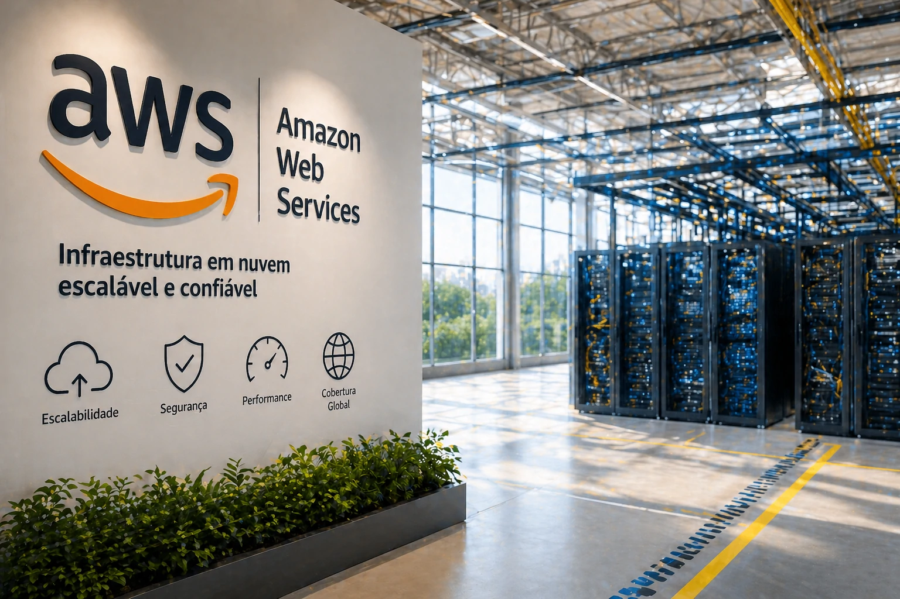
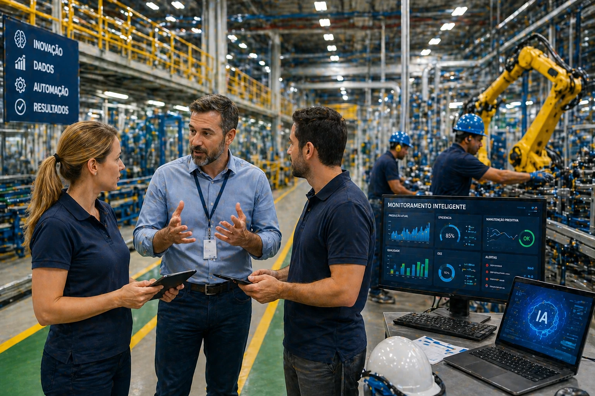

O mercado corporativo de inteligência artificial está entrando em uma nova fase de disputa estratégica.

A OpenAI está ampliando sua atuação empresarial e fortalecendo sua infraestrutura com apoio da Amazon, em um movimento que amplia sua capacidade de competir no mercado corporativo.

O avanço mostra que a disputa pela liderança da IA não está mais focada apenas em tecnologia.

Agora a batalha está na infraestrutura, escalabilidade e adoção empresarial.

Para empresas brasileiras, isso significa mais opções, mais concorrência e mais acesso a soluções corporativas de IA.

## O que mudou na estratégia da OpenAI

A OpenAI vem ampliando seu foco no ambiente corporativo.

O movimento inclui expansão de infraestrutura, crescimento de soluções empresariais e fortalecimento operacional.

Isso permite:

- maior estabilidade de operação  
- mais capacidade de processamento  
- expansão de serviços corporativos  
- crescimento em escala empresarial  

A infraestrutura passou a ser peça central.

## Por que a Amazon entrou nesse movimento

A Amazon fortalece esse ecossistema através da sua estrutura de cloud computing.

Esse suporte amplia a capacidade da OpenAI de atender empresas em larga escala.

Isso afeta diretamente:

### velocidade de resposta

Soluções mais rápidas.

### estabilidade operacional

Menos risco de falhas.

### escalabilidade

Capacidade de crescimento.

### capacidade empresarial

Mais empresas usando IA simultaneamente.

## O que isso significa para empresas brasileiras

Empresas brasileiras podem se beneficiar desse movimento de mercado.

A concorrência entre grandes players acelera inovação.

Na prática isso gera:

- ferramentas melhores  
- mais integração empresarial  
- custos mais competitivos  
- novas soluções corporativas  

O ambiente empresarial tende a ganhar.

## A nova corrida corporativa da inteligência artificial

O mercado de IA está migrando de uma fase experimental para uma fase operacional.

A disputa agora não é sobre quem criou o melhor modelo.

É sobre quem entrega melhor solução empresarial.

Para negócios brasileiros isso representa oportunidade.

Quem começar a usar IA agora pode ganhar vantagem competitiva antes que o mercado amadureça completamente.