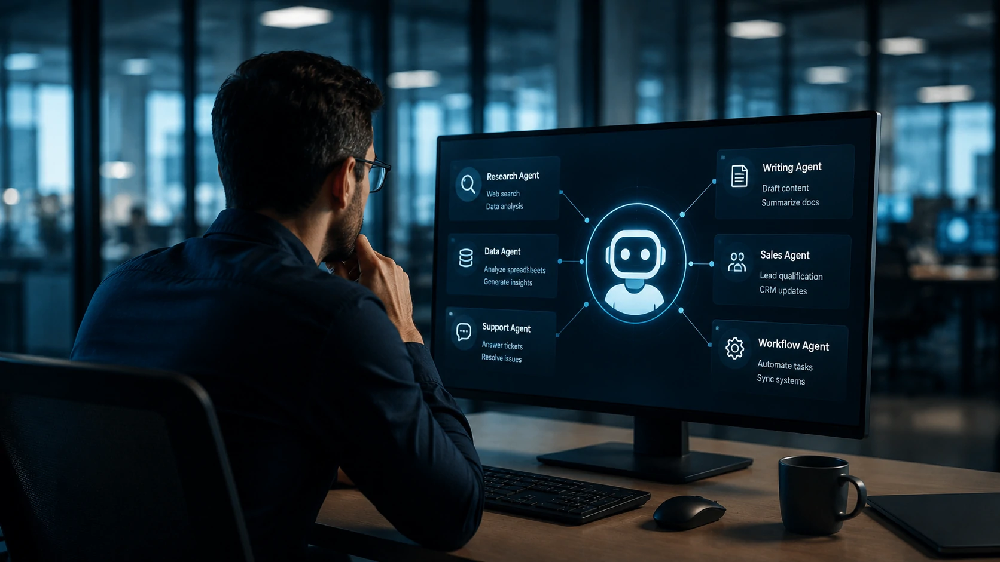
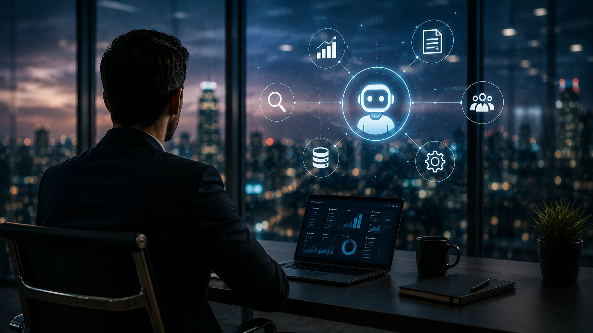

*Os agentes de inteligência artificial deixaram de representar apenas uma evolução dos chatbots. O crescimento da **OpenAI** para cerca de 10 milhões de usuários utilizando seus agentes demonstra que a próxima disputa tecnológica não será apenas entre modelos de IA, mas pela substituição gradual da interface tradicional dos softwares corporativos. Para empresas, o movimento pode redefinir produtividade, automação e competitividade nos próximos anos.*

## O crescimento da OpenAI confirma que agentes de IA estão entrando na rotina das empresas

Empresas começam a tratar **agentes de IA** como ferramentas operacionais capazes de executar tarefas completas, e não apenas responder perguntas. O crescimento acelerado da **OpenAI** mostra que esse mercado já ultrapassou a fase experimental.

*Agentes inteligentes começam a assumir atividades que antes dependiam de múltiplos sistemas e intervenção humana.*

Enquanto os primeiros modelos de linguagem eram utilizados principalmente para criação de textos, a nova geração evolui para executar processos inteiros, acessar documentos, consultar bancos de dados, navegar por sistemas internos e interagir com aplicações empresariais.

### Da assistência para a execução

O diferencial dos agentes atuais está na capacidade de agir. Em vez de apenas sugerir uma ação, eles conseguem iniciar fluxos de trabalho, organizar informações e produzir resultados com pouca intervenção humana.

Esse comportamento aproxima a inteligência artificial de um colaborador digital, reduzindo o tempo gasto em tarefas administrativas e operacionais.

### O número de usuários reforça uma mudança de mercado

Alcançar aproximadamente **10 milhões de usuários** representa um sinal importante para o setor de tecnologia. Grandes plataformas costumam atingir esse nível quando deixam de atrair apenas entusiastas e passam a integrar processos reais de empresas.

O movimento também fortalece a estratégia iniciada com o **ChatGPT Work**, que já havia mostrado como agentes inteligentes poderiam transformar ambientes corporativos.

Nesse contexto, vale entender como o mercado caminha para modelos cada vez mais autônomos, como mostramos em:

[Agentes de IA estão transformando a automação de processos nas empresas além do ChatGPT Work](https://noticiatech.com.br/automacao/agentes-ia-transformando-automacao-processos-empresas-alem-chatgpt-work/)

## A nova disputa acontece pela substituição da interface tradicional dos softwares

A principal mudança não está apenas na evolução da inteligência artificial. O mercado passa a disputar quem controlará a interface utilizada pelos profissionais durante o trabalho diário.

*Os agentes de IA tendem a reduzir a necessidade de navegar manualmente entre diversos sistemas empresariais.*

Hoje um profissional alterna constantemente entre **CRM**, planilhas, e-mail, ERP, plataformas de atendimento e ferramentas de colaboração.

### Um único agente para diversos sistemas

A proposta dos agentes é simplificar essa experiência.

Em vez de abrir vários programas, o usuário poderá solicitar uma atividade em linguagem natural. O agente identifica quais sistemas precisam ser acessados, executa as operações e devolve o resultado consolidado.

Esse conceito reduz atritos operacionais e aumenta significativamente a produtividade.

### O software deixa de ser o protagonista

Isso não significa que CRMs, ERPs ou plataformas de gestão desaparecerão.

Na prática, esses sistemas tendem a funcionar como infraestrutura, enquanto o agente de IA assume o papel de interface principal entre pessoas e aplicações.

Esse cenário explica por que empresas estão investindo fortemente em integração, orquestração e servidores especializados para conectar modelos de IA aos sistemas corporativos.

Esse movimento também se relaciona diretamente com a expansão do **Model Context Protocol (MCP)**, tema abordado em nosso guia:

[Como criar um servidor MCP para integrar IA aos sistemas das empresas](https://noticiatech.com.br/automacao/como-criar-servidor-mcp-empresas-integrar-ia-sistemas/)

## Empresas que adotarem agentes de IA primeiro podem ganhar vantagem competitiva

Organizações que incorporarem **agentes de IA** aos processos internos tendem a reduzir custos operacionais, acelerar decisões e aumentar a produtividade. Mais do que uma tendência tecnológica, a adoção antecipada pode se tornar um diferencial competitivo.

*Empresas que integram agentes de IA aos processos internos podem acelerar ganhos de produtividade e reduzir atividades repetitivas.*

O impacto é semelhante ao observado durante a adoção da computação em nuvem. Inicialmente, muitas organizações enxergaram a tecnologia apenas como redução de custos. Poucos anos depois, a nuvem tornou-se um requisito básico para inovação.

Com os agentes inteligentes, a transformação pode ocorrer em ritmo ainda mais acelerado.

### A automação deixa de depender apenas de regras fixas

A automação tradicional exige fluxos previamente definidos.

Já um **agente de IA** consegue interpretar contexto, adaptar respostas e decidir qual ferramenta utilizar para executar determinada atividade.

Essa evolução amplia significativamente o número de processos que podem ser automatizados dentro das empresas.

Áreas como atendimento, vendas, marketing, compras, recursos humanos e suporte técnico passam a compartilhar uma mesma camada inteligente capaz de conectar diferentes plataformas.

### O efeito se estende para todo o ecossistema corporativo

O crescimento da **OpenAI** pressiona concorrentes como **Google**, **Anthropic** e **Microsoft** a acelerar investimentos em agentes cada vez mais autônomos.

Ao mesmo tempo, fornecedores de softwares empresariais precisam adaptar seus produtos para funcionar integrados a essas novas plataformas inteligentes.

Esse movimento também reforça a importância da governança da inteligência artificial nas organizações, especialmente quando agentes passam a acessar informações estratégicas.

Para entender esse desafio, vale conferir também:

[O que é AI Governance e por que empresas precisarão dela nos próximos anos](https://noticiatech.com.br/inteligencia-artificial/o-que-e-ai-governance-governanca-ia-empresas/)

## A corrida pelos agentes de IA redefine o futuro dos softwares corporativos

A marca de **10 milhões de usuários** indica que os agentes inteligentes deixaram de ser apenas um recurso adicional e começam a se consolidar como a principal interface entre pessoas e tecnologia.

Em vez de substituir completamente os softwares atuais, eles tendem a transformar a forma como esses sistemas são utilizados.

### A competição passa a acontecer no ecossistema

Nos próximos anos, a vantagem competitiva não dependerá apenas do melhor modelo de linguagem.

Empresas capazes de construir o ecossistema mais completo, conectando agentes, dados, aplicações, automações e infraestrutura, terão maior capacidade de atrair organizações e desenvolvedores.

É justamente por isso que a disputa entre **OpenAI**, **Google**, **Anthropic**, **Microsoft** e outras empresas vem se intensificando em torno de protocolos de integração, plataformas de agentes e ferramentas corporativas.

### O mercado entra em uma nova fase

O crescimento acelerado dos agentes de IA mostra que a transformação digital passa por uma nova etapa.

Se, na última década, as empresas aprenderam a digitalizar processos, a próxima provavelmente será marcada pela delegação crescente de atividades para sistemas inteligentes capazes de executar tarefas completas.

Nesse cenário, o verdadeiro ativo estratégico deixa de ser apenas possuir inteligência artificial e passa a ser construir uma infraestrutura capaz de trabalhar em conjunto com agentes autônomos.

A marca alcançada pela **OpenAI** funciona como um forte indicativo de que essa mudança já começou. Para gestores e empresas, a principal questão deixa de ser **se** os agentes de IA farão parte da rotina corporativa e passa a ser **quando** estarão integrados aos processos críticos do negócio. Quem iniciar essa adaptação mais cedo terá melhores condições de explorar ganhos de produtividade, inovação e competitividade em um mercado cada vez mais orientado por inteligência artificial.

---