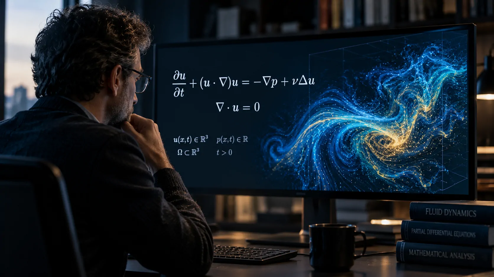
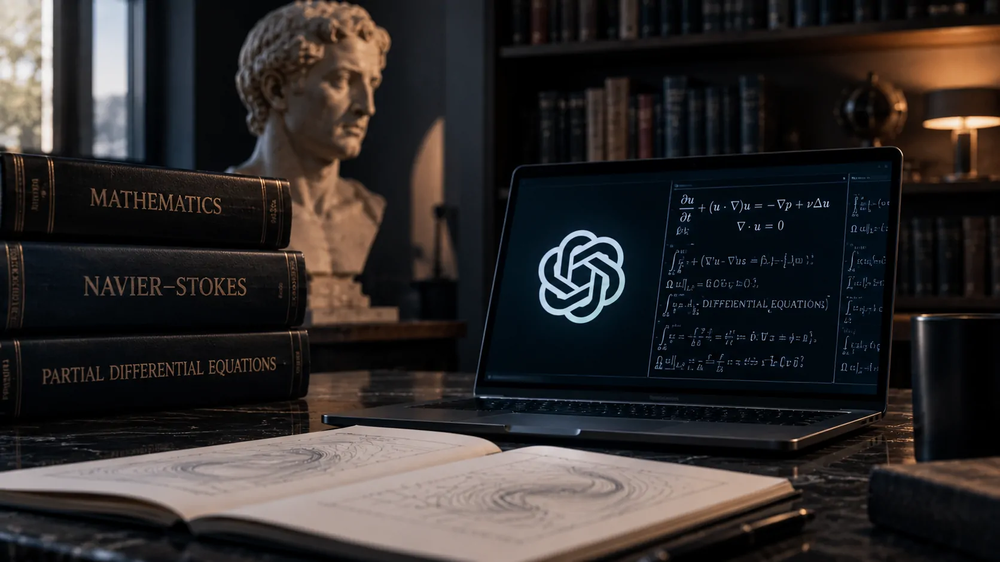
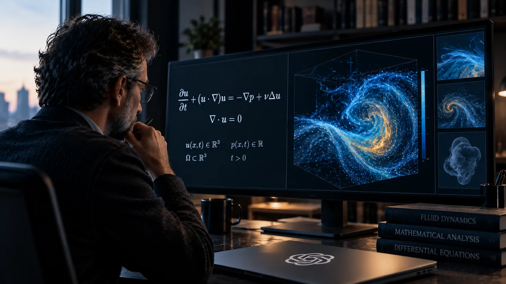

*Um dos problemas matemáticos mais famosos do mundo entrou no centro da corrida pela inteligência artificial, enquanto pesquisadores discutem não apenas se uma máquina consegue encontrar uma prova, mas o que essa capacidade significa para a própria ciência.*

## O que a OpenAI apresentou sobre Navier-Stokes

### Um problema que atravessou gerações

As **equações de Navier-Stokes** estão entre as ferramentas matemáticas fundamentais para descrever o movimento de fluidos. Elas aparecem em problemas relacionados a fenômenos como circulação do ar, dinâmica da água e comportamento de fluidos em diferentes sistemas físicos.

O desafio mais famoso associado a essas equações é um dos **sete Problemas do Milênio**, conjunto criado pelo Clay Mathematics Institute para representar algumas das questões mais profundas ainda abertas na matemática.

No caso de Navier-Stokes, a pergunta está relacionada à existência e à regularidade das soluções em três dimensões. Em termos simplificados, os matemáticos querem saber se uma solução que começa de maneira suave pode permanecer assim indefinidamente ou se pode desenvolver uma singularidade em tempo finito.

### A alegação feita pela empresa

Em 8 de setembro de 2026, a **OpenAI** anunciou que um sistema interno de inteligência artificial havia produzido uma solução para o problema de existência e suavidade de Navier-Stokes.

Segundo a empresa, o sistema encontrou uma **prova analítica** e também produziu uma formalização utilizando **Lean**, uma linguagem utilizada para verificar matematicamente se determinados passos de uma prova obedecem às regras formais especificadas.

A OpenAI afirma que o resultado mostra que um fluido inicialmente suave pode desenvolver uma singularidade em tempo finito sob determinadas condições. A empresa também deixou claro que não pretende reivindicar o **Prêmio do Milênio** pelo resultado.

O anúncio representa um avanço importante na demonstração do que sistemas de IA podem fazer em matemática avançada. Mas existe uma diferença fundamental entre uma empresa divulgar uma prova e a comunidade matemática aceitar que essa prova está correta.

## Por que o anúncio provocou tanta discussão

*O avanço envolve uma questão matemática centenária, mas também levanta perguntas sobre como provas produzidas por sistemas de IA devem ser avaliadas.*

### A questão não é apenas chegar à resposta

Uma das características mais importantes da matemática é que uma resposta não basta. É necessário apresentar uma **demonstração rigorosa**, capaz de ser examinada passo a passo por outros pesquisadores.

Isso torna o caso especialmente interessante. A IA pode encontrar estruturas matemáticas que seriam difíceis de descobrir manualmente, testar possibilidades em grande escala e coordenar diferentes etapas de uma investigação.

O desafio passa a ser determinar se essa capacidade está produzindo conhecimento matemático confiável ou apenas resultados que ainda dependem de uma extensa interpretação humana.

### A disputa envolve também o processo científico

A discussão ganhou força porque o anúncio da OpenAI ocorreu em um ambiente no qual outros pesquisadores também trabalhavam com problemas relacionados a equações de fluidos.

A empresa investigou se interações anteriores entre seu sistema de programação Codex e pesquisadores externos poderiam ter influenciado o resultado. Segundo a OpenAI, a investigação concluiu que os prompts de Tristan Buckmaster não poderiam ter influenciado o sistema.

Buckmaster e Levent Alpöge haviam trabalhado em um resultado relacionado às equações de Euler. A OpenAI afirma que os trabalhos são significativamente diferentes: o resultado atribuído a Alpöge e Buckmaster envolve uma situação com força externa, enquanto o resultado divulgado pela OpenAI trata de uma configuração sem essa força externa.

Esse episódio adiciona uma camada importante à discussão: quando sistemas de IA participam de descobertas científicas, **origem, prioridade e influência** podem se tornar muito mais difíceis de estabelecer.

## Os 25 matemáticos ampliaram o debate

### Uma declaração que vai além da OpenAI

Poucos dias depois do anúncio, uma declaração assinada inicialmente por **25 matemáticos, todos medalhistas Fields**, levou a discussão para um nível mais amplo.

A **Medalha Fields** é uma das mais importantes premiações da matemática mundial e é frequentemente chamada de “Prêmio Nobel da Matemática”, embora não exista oficialmente um Nobel específico para a área. Concedida a cada quatro anos durante o Congresso Internacional de Matemáticos, a premiação reconhece pesquisadores por contribuições matemáticas de destaque e pelo potencial de novas contribuições. Há ainda uma regra de idade: o matemático não pode completar 40 anos antes de 1º de janeiro do ano em que a medalha é concedida

Entre os signatários está o matemático **Terence Tao**, que publicou o texto explicando o contexto da declaração. O documento não se limita a questionar um resultado específico da OpenAI. Ele aborda uma preocupação maior sobre a direção que a corrida pela inteligência artificial pode tomar dentro da matemática.

A preocupação central é que sistemas cada vez mais capazes podem ser incentivados a resolver problemas extraordinariamente difíceis sem necessariamente reproduzir os caminhos de compreensão conceitual que tradicionalmente acompanham uma descoberta matemática.

### Resolver problemas não é todo o trabalho de um matemático

Na matemática, o valor de uma descoberta não está somente em produzir uma resposta correta. A compreensão de **por que** determinado resultado funciona pode abrir portas para novos teoremas, métodos e aplicações.

É justamente essa dimensão que a expansão da IA coloca em discussão.

Um sistema pode eventualmente encontrar uma demonstração correta que seja difícil para seres humanos compreenderem em sua totalidade. Nesse cenário, a matemática ganharia uma resposta, mas poderia enfrentar uma nova pergunta: **quanto da descoberta realmente foi compreendido?**

Esse problema não significa que provas produzidas por IA sejam menos importantes. Pelo contrário. Ele pode indicar que a comunidade precisará desenvolver novos métodos para avaliar, explicar e utilizar descobertas geradas por máquinas.

## O ponto mais delicado é quem recebe o crédito

*Quando uma IA participa da descoberta, a fronteira entre ferramenta, colaborador e autor científico se torna menos evidente.*

### A autoria fica mais complexa com agentes de IA

A OpenAI descreveu o sistema responsável pelo resultado como uma arquitetura baseada em **agentes coordenadores**, capaz de organizar diferentes tarefas durante a investigação matemática.

Isso é diferente de simplesmente pedir a um chatbot que responda a uma questão. O sistema foi desenvolvido para realizar uma sequência de operações voltadas à busca de uma solução.

A mudança é relevante porque aproxima a IA de um papel mais ativo no processo de pesquisa. Em vez de funcionar apenas como uma ferramenta de consulta, ela pode participar da formulação, exploração e verificação de caminhos matemáticos.

### A prioridade científica também muda

Tradicionalmente, estabelecer quem descobriu um resultado envolve manuscritos, datas, publicações, colaboração entre pesquisadores e registros do desenvolvimento da prova.

Com agentes de IA, esse processo pode ficar mais complexo.

Se uma empresa possui um sistema interno capaz de explorar milhares de caminhos matemáticos, surge a necessidade de documentar quais ideias vieram dos pesquisadores, quais foram geradas pelo sistema e como cada etapa foi validada.

Esse tipo de rastreabilidade pode se tornar tão importante quanto a própria capacidade de resolver problemas.

## O impacto pode chegar à própria forma de fazer ciência

### A validação humana ganha novo peso

A existência de uma prova produzida por uma IA não elimina a necessidade de pesquisadores humanos. Na verdade, pode aumentar a importância deles em uma etapa diferente: **auditar, interpretar e contextualizar o resultado**.

Formalizações em sistemas como Lean ajudam a verificar estruturas lógicas de maneira rigorosa. Ainda assim, compreender a relevância de um resultado, sua relação com trabalhos anteriores e suas consequências matemáticas continua sendo uma tarefa intelectual complexa.

Isso pode criar um novo modelo de colaboração científica no qual a máquina explora espaços de possibilidades e o pesquisador determina quais resultados merecem ser compreendidos, publicados e utilizados.

A própria evolução recente da OpenAI mostra como esses sistemas estão deixando de ser ferramentas exclusivamente conversacionais e avançando para tarefas cada vez mais especializadas, como já ocorreu em **[outros avanços da empresa em sistemas de IA capazes de lidar com problemas complexos](https://noticiatech.com.br/inteligencia-artificial/openai-astra-nivel-critico-ciberseguranca/)**.

### Empresas de IA passam a disputar autoridade científica

Existe também uma consequência institucional.

Quando uma empresa privada anuncia uma possível solução para um problema matemático que atravessou décadas de pesquisa, ela não está apenas apresentando uma nova capacidade tecnológica. Está entrando diretamente em um território tradicionalmente ocupado por universidades, institutos de pesquisa e comunidades científicas.

Isso muda a relação entre **tecnologia e ciência**.

Empresas de IA passam a ter sistemas, infraestrutura computacional e equipes capazes de investigar problemas que anteriormente exigiam grupos especializados durante longos períodos. Ao mesmo tempo, a comunidade científica precisa estabelecer como esses resultados serão examinados e incorporados ao conhecimento existente.

A disputa deixa de ser apenas sobre quem possui o melhor modelo. Passa a envolver também **quem produz conhecimento e como esse conhecimento é legitimado**.

## Navier-Stokes pode ser apenas o começo da discussão

*O verdadeiro impacto do caso pode estar menos em uma única solução e mais na mudança da relação entre pesquisadores e sistemas de IA.*

### A prova ainda precisa viver fora do laboratório

O anúncio da OpenAI é significativo, mas o caminho científico não termina quando uma empresa publica seu resultado.

Uma prova destinada a resolver um dos Problemas do Milênio precisa resistir à análise de especialistas independentes. Pesquisadores precisam verificar cada etapa, identificar possíveis lacunas e determinar se as conclusões realmente correspondem ao problema proposto.

Esse processo é particularmente importante porque sistemas de IA podem produzir resultados sofisticados que parecem plausíveis antes de serem submetidos a uma análise rigorosa.

A validação externa, portanto, não é um detalhe burocrático. É parte essencial da transformação de uma alegação em conhecimento científico aceito.

### A questão maior é o que significa descobrir com IA

O caso Navier-Stokes talvez seja mais importante pelo debate que desencadeia do que pela resposta isolada.

Se sistemas de IA começarem a resolver regularmente problemas matemáticos que permaneceram abertos durante décadas, a ciência terá de repensar algumas de suas próprias práticas. Será necessário definir como documentar descobertas, atribuir crédito, validar provas e preservar a compreensão humana sobre resultados produzidos por máquinas.

Essa transformação já pode ser percebida em outras frentes da corrida por agentes de IA, como a busca da **[Anthropic por sistemas capazes de executar tarefas complexas com agentes](https://noticiatech.com.br/inteligencia-artificial/anthropic-claude-fable-5-1-custo-agentes-ia/)**.

No caso de Navier-Stokes, entretanto, existe uma questão ainda mais profunda. A grande mudança talvez não seja simplesmente uma máquina conseguir chegar onde matemáticos ainda não chegaram. É descobrir **o que a matemática fará depois que máquinas começarem a chegar lá com frequência**.

Se a prova da OpenAI sobreviver à análise independente, o episódio poderá representar um marco importante na história da matemática e da inteligência artificial. Mas, mesmo antes disso, ele já expôs uma questão que dificilmente desaparecerá: **quando uma IA descobre algo que humanos ainda não conseguem compreender completamente, estamos diante de uma nova forma de fazer ciência ou apenas de uma nova ferramenta para praticar a ciência de sempre?**

---