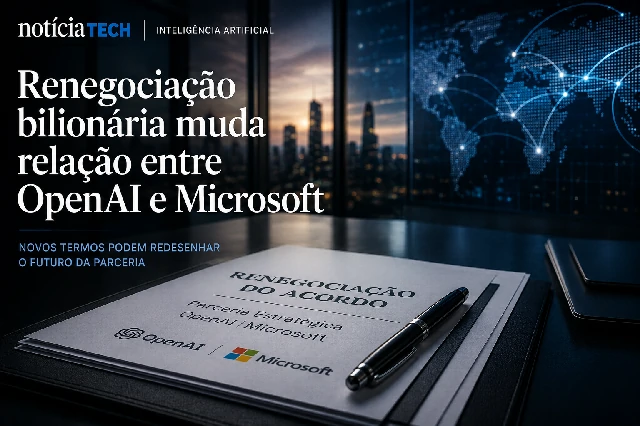
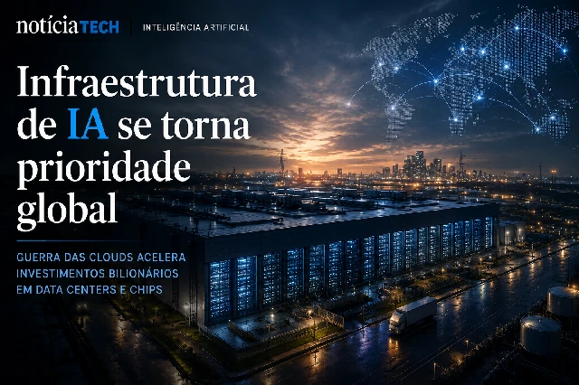

*Durante anos, a parceria entre OpenAI e Microsoft foi tratada como uma das alianças mais poderosas da indústria de tecnologia. Agora, os sinais de mudança começam a revelar uma disputa silenciosa que pode redefinir a infraestrutura global da inteligência artificial, alterar o equilíbrio entre Big Techs e abrir uma nova corrida bilionária pelo controle da próxima geração de IA corporativa.*

## OpenAI começa a se afastar da dependência da Microsoft

A relação entre **OpenAI** e **Microsoft** continua estratégica, mas já não parece ter o mesmo nível de dependência visto nos últimos anos.

Segundo informações divulgadas por veículos internacionais do setor de tecnologia e mercado financeiro, a OpenAI iniciou uma renegociação estrutural do acordo firmado com a Microsoft, limitando o compartilhamento de receitas e ampliando sua liberdade para fechar novas parcerias de infraestrutura com outras gigantes da tecnologia.

O movimento é interpretado por analistas como um passo importante para reduzir a dependência operacional da empresa em relação ao ecossistema Azure.

Até pouco tempo atrás, a Microsoft era vista praticamente como a principal base operacional da OpenAI:
- infraestrutura computacional;
- capacidade de treinamento de modelos;
- distribuição corporativa;
- integração com produtos empresariais.

Mas o crescimento explosivo da IA generativa transformou infraestrutura em poder estratégico.

Agora, a OpenAI parece buscar algo ainda mais importante:
autonomia.

### A infraestrutura virou o centro da guerra da IA

Nos primeiros anos da explosão da IA generativa, o foco do mercado estava nos modelos.

Hoje, o centro da disputa mudou.

O verdadeiro diferencial competitivo passou a ser:
- acesso massivo a GPUs;
- energia computacional;
- data centers;
- capacidade global de processamento;
- distribuição corporativa.

Isso explica por que gigantes como:
- Google;
- Amazon;
- Microsoft;
- Meta;
- Oracle;
- Nvidia;

estão investindo dezenas de bilhões de dólares em infraestrutura para IA.

A OpenAI entende que depender excessivamente de uma única parceira pode limitar sua expansão futura.

Por isso, o movimento atual não parece um rompimento direto com a Microsoft, mas sim uma tentativa de equilibrar poder dentro da cadeia global de IA.

## O mercado corporativo pode entrar em uma nova fase

O impacto dessa mudança vai muito além da relação entre duas empresas.

Na prática, o mercado pode estar entrando em uma nova etapa da corrida da inteligência artificial:
a guerra da infraestrutura corporativa.

Empresas que antes disputavam usuários agora disputam:
- capacidade computacional;
- acesso a chips;
- contratos corporativos;
- distribuição de IA empresarial;
- ecossistemas de agentes inteligentes.

Essa transformação já começa a afetar:
- plataformas de produtividade;
- softwares corporativos;
- ferramentas de automação;
- soluções empresariais baseadas em IA.

O cenário também fortalece uma tendência que o mercado vem acelerando nos últimos meses:
a criação de empresas “AI-first”.

Em vez de apenas integrar IA em produtos existentes, companhias começam a reorganizar operações inteiras em torno de modelos inteligentes, agentes autônomos e automação avançada.

Esse movimento se conecta diretamente com outras transformações que já vêm acontecendo no mercado corporativo, como mostramos no artigo sobre como a IA está mudando o desenvolvimento de software nas empresas:

https://noticiatech.com.br/inteligencia-artificial/ia-acelera-produ%C3%A7%C3%A3o-de-software-e-muda-o-papel-dos-programadores-nas-empresas/

### A disputa agora envolve controle do futuro digital

O avanço da IA generativa criou uma nova realidade:
quem controlar infraestrutura terá enorme vantagem econômica nos próximos anos.

Isso inclui:
- servidores;
- chips;
- distribuição corporativa;
- APIs;
- plataformas de agentes;
- integração com softwares empresariais.

Por trás da disputa tecnológica existe uma questão ainda maior:
quem controlará o fluxo operacional da economia digital.

A IA deixou de ser apenas ferramenta de produtividade.
Ela começa a se tornar a camada operacional central das empresas.

## OpenAI tenta ampliar poder estratégico no mercado global

Ao buscar maior independência operacional, a OpenAI também ganha liberdade para:
- negociar novos contratos;
- expandir infraestrutura;
- reduzir riscos estratégicos;
- acelerar distribuição global;
- aumentar seu poder de negociação.

Isso pode impactar diretamente o mercado corporativo de IA nos próximos anos.

Empresas clientes começam a perceber que o setor talvez não caminhe para um monopólio absoluto de uma única Big Tech, mas sim para um ecossistema altamente competitivo envolvendo:
- OpenAI;
- Microsoft;
- Google;
- Amazon;
- Nvidia;
- Meta.

O resultado pode ser uma aceleração ainda maior da inovação.

Ao mesmo tempo, a disputa tende a elevar:
- investimentos em data centers;
- consumo energético;
- corrida por chips avançados;
- consolidação de plataformas empresariais.

Esse cenário também se conecta ao avanço da automação corporativa e dos agentes inteligentes que começam a substituir processos tradicionais dentro das empresas:

https://noticiatech.com.br/automacao/como-empresas-usam-ia-para-automatizar-processos/

### A próxima batalha da IA será invisível para o usuário comum

Enquanto consumidores continuam focados em chatbots e aplicativos, a verdadeira disputa do mercado acontece nos bastidores.

A próxima fase da IA será definida por:
- infraestrutura;
- poder computacional;
- capacidade operacional;
- integração empresarial;
- domínio dos ecossistemas corporativos.

E nesse cenário, a renegociação entre OpenAI e Microsoft pode representar apenas o primeiro sinal visível de uma transformação muito maior no mercado global de tecnologia.