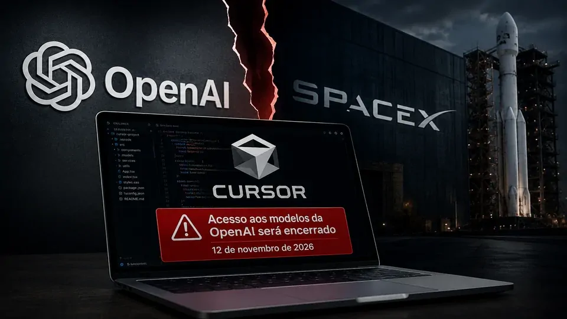
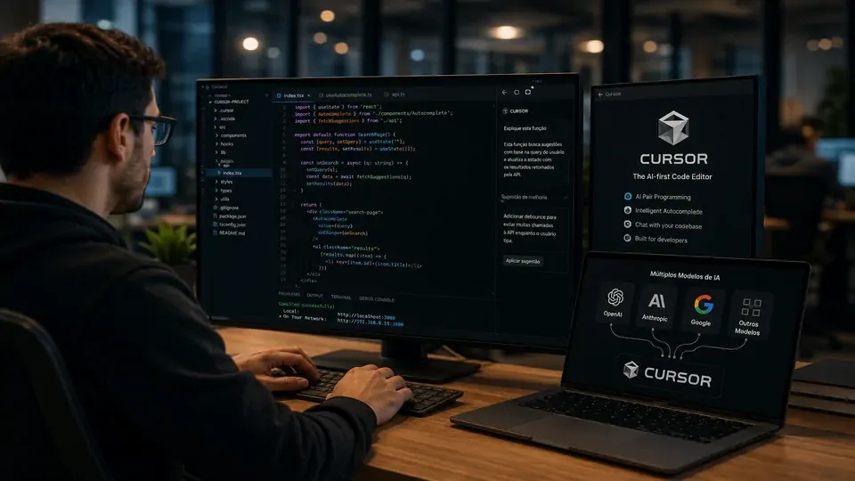
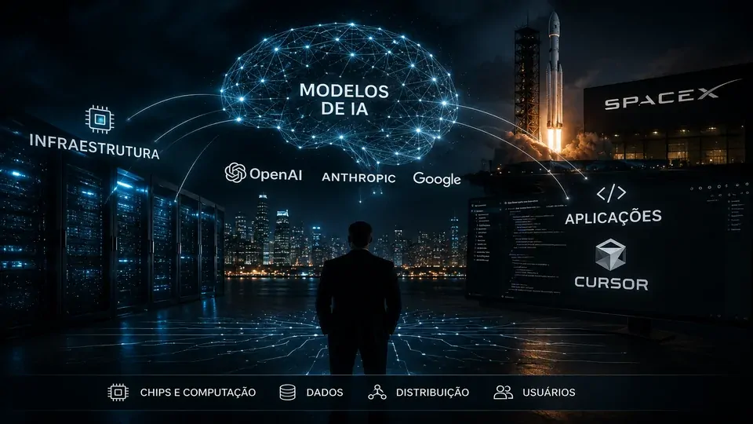

*O **Cursor**, uma ferramenta de programação baseada em inteligência artificial, deverá perder o acesso aos modelos da **OpenAI** depois de sua aquisição pela **SpaceX**, empresa de **Elon Musk**. O caso revela uma disputa que vai além das duas empresas e levanta uma questão estratégica para negócios que constroem produtos sobre modelos de IA de terceiros.*

## O que aconteceu entre OpenAI, Cursor e SpaceX

A **OpenAI** decidiu encerrar o fornecimento de seus modelos ao **Cursor**, plataforma de programação com inteligência artificial que passou recentemente para o controle da **SpaceX**. A empresa comunicou que pretende desligar o acesso aos seus modelos em **12 de novembro de 2026**, dando tempo para a plataforma reorganizar sua oferta.

O **Cursor** é uma ferramenta utilizada por desenvolvedores para escrever, modificar, revisar e trabalhar com código usando recursos de inteligência artificial. Em vez de ser apenas um editor tradicional, a plataforma utiliza modelos de IA para participar de diferentes etapas do desenvolvimento de software.

A decisão ganhou outra dimensão depois que a **SpaceX**, empresa liderada por **Elon Musk**, concluiu a aquisição do Cursor. Uma relação que antes podia ser vista como uma parceria entre fornecedor e cliente passou a envolver empresas com interesses próprios na disputa pelo mercado de inteligência artificial.

### A mudança não significa que o Cursor vai desaparecer

O **Cursor** não é um modelo de inteligência artificial. Ele funciona como uma plataforma de desenvolvimento que pode utilizar modelos de diferentes fornecedores para oferecer recursos de programação assistida por IA.

Por isso, a decisão da **OpenAI** não significa que o serviço deixará de funcionar. O impacto direto está na retirada dos modelos da OpenAI da plataforma depois do prazo anunciado.

A questão mais importante é quanto uma empresa pode depender de uma tecnologia externa quando essa tecnologia se torna uma parte essencial do seu produto.

### Por que a aquisição mudou a relação

Antes da aquisição, o relacionamento entre **OpenAI** e **Cursor** podia ser interpretado principalmente como uma relação comercial entre um fornecedor de modelos e uma empresa que utilizava essa tecnologia em seu produto.

Com a entrada da **SpaceX**, a situação ganhou uma dimensão estratégica. O novo controlador do Cursor também possui interesse no desenvolvimento de infraestrutura e tecnologias próprias de inteligência artificial.

A **OpenAI** afirmou que sua decisão está relacionada a preocupações contratuais e ao cumprimento de seus termos de serviço. O caso, portanto, não deve ser reduzido simplesmente a uma disputa pessoal entre **Sam Altman** e **Elon Musk**.

## Por que o Cursor é importante para a indústria de IA

*O Cursor funciona como uma camada de aplicação que transforma modelos de IA em ferramentas para desenvolvedores.*

O **Cursor** ocupa uma posição estratégica porque transforma modelos de inteligência artificial em uma ferramenta diretamente utilizada por desenvolvedores. Em vez de o usuário interagir apenas com um chatbot, a IA passa a participar do próprio processo de criação e manutenção de software.

Isso faz com que a plataforma dependa de uma combinação de modelos, infraestrutura e experiência de usuário. O valor do produto não está apenas no modelo utilizado, mas também na forma como essa tecnologia é integrada ao trabalho cotidiano de quem desenvolve software.

O caso também ajuda a explicar por que plataformas de aplicação podem se tornar importantes na cadeia de valor da IA. Elas controlam a experiência do usuário mesmo quando parte da inteligência utilizada vem de fornecedores externos.

### O modelo é apenas uma parte do produto

Uma empresa pode utilizar um modelo da **OpenAI**, **Anthropic** ou **Google** sem precisar construir um modelo próprio. Essa estratégia reduz a barreira de entrada e permite lançar produtos sofisticados de IA com mais velocidade.

O problema aparece quando uma aplicação começa a depender excessivamente de uma única tecnologia. Uma mudança de preço, contrato, política de uso ou disponibilidade pode obrigar a empresa a alterar uma parte importante do produto.

É justamente por isso que a decisão envolvendo o **Cursor** chama atenção. A ferramenta continua existindo, mas uma das tecnologias que ajudavam a compor sua experiência precisará ser substituída ou reorganizada.

### A disputa também envolve infraestrutura

A aquisição do **Cursor** pela **SpaceX** adiciona outra camada à história. A empresa compradora possui acesso a uma infraestrutura computacional de grande escala e vem demonstrando interesse crescente em inteligência artificial.

Isso cria a possibilidade de uma integração mais verticalizada, na qual infraestrutura, modelos e aplicações ficam cada vez mais próximos dentro de um mesmo ecossistema.

A própria **OpenAI** também vem buscando maior controle sobre sua infraestrutura. O **[movimento da OpenAI para desenvolver seu próprio chip de IA](https://noticiatech.com.br/inteligencia-artificial/openai-chip-proprio-acelerar-respostas-chatgpt-reduzir-dependencia-nvidia/)** mostra como a competição deixou de estar concentrada apenas na qualidade dos modelos e passou a envolver também a capacidade de computação necessária para executá-los.

## A aquisição pela SpaceX muda o cálculo estratégico

A compra do **Cursor** pela **SpaceX** pode ser interpretada como parte de uma tendência maior do mercado de tecnologia: empresas estão tentando controlar mais etapas da cadeia de inteligência artificial.

Durante a primeira fase da corrida da IA generativa, a principal vantagem competitiva estava concentrada nos modelos. Agora, infraestrutura, chips, capacidade computacional, plataformas e distribuição também estão se tornando ativos estratégicos.

Para o **Cursor**, a aquisição representa uma mudança importante porque aproxima sua plataforma de uma empresa que possui capacidade própria de infraestrutura e interesses no desenvolvimento de tecnologias de IA.

### O controle da distribuição ganha importância

Uma empresa que controla apenas o modelo depende de outras companhias para levar sua tecnologia ao usuário final. Uma empresa que controla a aplicação possui uma relação mais direta com o consumidor ou com o cliente corporativo.

Quando as duas camadas pertencem ao mesmo grupo, existe potencial para maior integração entre tecnologia e distribuição.

Esse é um dos motivos pelos quais a aquisição do **Cursor** é relevante. A **SpaceX** passou a controlar uma plataforma utilizada por desenvolvedores e conectada diretamente ao ecossistema de desenvolvimento de software com IA.

### A verticalização pode mudar a competição

A verticalização pode oferecer vantagens de custo, desempenho e integração. Uma empresa com acesso próprio a infraestrutura computacional pode experimentar modelos e recursos com mais liberdade.

Mas também existe um risco para o mercado: quanto mais camadas importantes estiverem concentradas dentro de grandes grupos tecnológicos, maior pode ser a disputa pelo acesso às tecnologias essenciais.

O caso entre **OpenAI** e **Cursor** mostra justamente essa tensão. Um fornecedor de modelos pode decidir que determinadas relações comerciais deixaram de ser estratégicas depois que o cliente passou para o controle de um concorrente.

## O risco para empresas que dependem de APIs de IA

*Empresas que dependem de APIs de IA precisam considerar o risco de ficar excessivamente vinculadas a um único fornecedor de modelos.*

Para empresas que incorporam inteligência artificial aos próprios produtos, o episódio oferece uma lição mais importante do que a disputa entre **OpenAI** e **SpaceX**.

Uma API de IA pode parecer apenas uma ferramenta técnica durante o desenvolvimento de um produto. Com o tempo, porém, ela pode se transformar em uma dependência crítica para a operação do negócio.

O problema é especialmente relevante quando a inteligência artificial deixa de ser um recurso complementar e passa a executar funções importantes dentro de processos empresariais.

### O fornecedor de IA também é um risco operacional

Ao escolher um modelo, empresas normalmente analisam preço, velocidade, qualidade das respostas e capacidade técnica. Esses fatores continuam importantes, mas não são suficientes para determinar a resiliência de uma arquitetura de IA.

Também é necessário considerar disponibilidade, condições contratuais, políticas de uso, mudanças de preços e possibilidade de substituição.

O caso do **Cursor** demonstra por que uma empresa que depende de modelos externos deveria saber responder a uma pergunta simples: **o que acontece com meu produto se eu perder acesso ao meu principal fornecedor de IA?**

### Diversificação pode reduzir dependência

Uma estratégia possível é utilizar diferentes fornecedores de modelos quando a arquitetura do produto permitir. Isso não significa necessariamente utilizar vários modelos em todas as funcionalidades.

A empresa pode manter um fornecedor principal e desenvolver uma arquitetura que permita substituir ou adicionar alternativas quando necessário.

Essa preocupação se torna ainda mais relevante conforme agentes de IA passam a executar tarefas diretamente dentro das empresas. O crescimento dos riscos de segurança envolvendo sistemas de inteligência artificial, tema abordado em **[alertas de OpenAI, Anthropic e Microsoft sobre ataques com IA](https://noticiatech.com.br/inteligencia-artificial/openai-anthropic-microsoft-ataques-ia-crescer-proximos-meses/)**, reforça que dependência tecnológica e segurança precisam ser avaliadas como partes da mesma estratégia.

## O que muda para o Cursor e seus usuários

A consequência mais imediata da decisão da **OpenAI** será a retirada de seus modelos do **Cursor** após o prazo anunciado.

Até lá, a plataforma possui tempo para ajustar sua arquitetura e ampliar a utilização de outras tecnologias. Para os usuários, o principal ponto de atenção será entender quais modelos estarão disponíveis e se haverá mudanças de desempenho, preço ou experiência.

O cenário também pode alterar a percepção sobre plataformas de programação que oferecem acesso a múltiplos modelos. A capacidade de trocar de fornecedor pode se tornar um diferencial competitivo em um mercado cada vez mais dependente de inteligência artificial.

### O Cursor pode ganhar mais independência

Existe uma possível consequência positiva para a plataforma. Ao reduzir sua dependência dos modelos da **OpenAI**, o **Cursor** pode ampliar sua capacidade de trabalhar com diferentes fornecedores.

Isso pode dar à empresa maior liberdade para escolher modelos específicos para determinadas tarefas. Uma aplicação pode utilizar uma tecnologia para geração de código e outra para análise, revisão ou raciocínio.

Essa arquitetura também pode aumentar o poder de negociação da plataforma diante dos fornecedores.

### Mas trocar de modelo não é uma operação simples

A substituição de um modelo de IA não funciona necessariamente como trocar um componente convencional de software.

Modelos diferentes apresentam comportamentos, capacidades, limites de contexto, velocidades e padrões de resposta distintos. Uma mudança pode exigir testes, ajustes de prompts, avaliação de qualidade e alterações na experiência do usuário.

Por isso, o impacto real da decisão da **OpenAI** dependerá de como o **Cursor** executará essa transição e de quais alternativas estarão disponíveis para seus usuários.

## A disputa revela uma nova camada da competição em IA

*O conflito entre OpenAI e Cursor mostra como modelos, infraestrutura e aplicações estão se tornando partes inseparáveis da competição em IA.*

O caso envolvendo **OpenAI**, **Cursor** e **SpaceX** mostra que a próxima fase da competição em inteligência artificial pode ser menos sobre quem possui o melhor modelo e mais sobre **quem controla a cadeia completa que leva a IA até o usuário**.

Modelos continuam sendo fundamentais, mas infraestrutura, chips, aplicações, distribuição e relacionamento com clientes também passaram a ter importância estratégica.

Para empresas que utilizam IA em seus produtos, a principal lição é evitar que uma dependência tecnológica se transforme em um ponto único de falha.

### O que as empresas devem observar

O caso sugere pelo menos quatro pontos que empresas deveriam considerar ao estruturar produtos baseados em IA:

- **Diversificação:** avaliar mais de um fornecedor quando tecnicamente viável.
- **Portabilidade:** evitar arquiteturas excessivamente dependentes de um único modelo.
- **Contratos:** analisar condições de uso, alterações e encerramento de acesso.
- **Continuidade:** definir previamente o que acontecerá se um fornecedor deixar de disponibilizar determinado modelo.

Nenhuma dessas medidas elimina completamente a dependência de fornecedores externos. Elas, porém, podem reduzir o impacto de uma mudança inesperada.

### A disputa pode antecipar uma mudança maior

Ainda é cedo para afirmar que o caso **OpenAI-Cursor** representa uma nova regra para toda a indústria. O encerramento anunciado está ligado a circunstâncias específicas envolvendo contratos e a mudança de controle da empresa.

Mas o episódio evidencia uma tendência que merece atenção: à medida que a inteligência artificial se torna infraestrutura empresarial, **quem fornece o modelo passa a ter influência sobre uma parte crítica do produto de seus clientes**.

Para o mercado, a questão deixada pela disputa é maior do que o futuro do **Cursor**. É saber se as empresas que constroem produtos sobre modelos de terceiros estarão preparadas para trocar de fornecedor quando uma relação comercial, tecnológica ou societária mudar de direção.

---