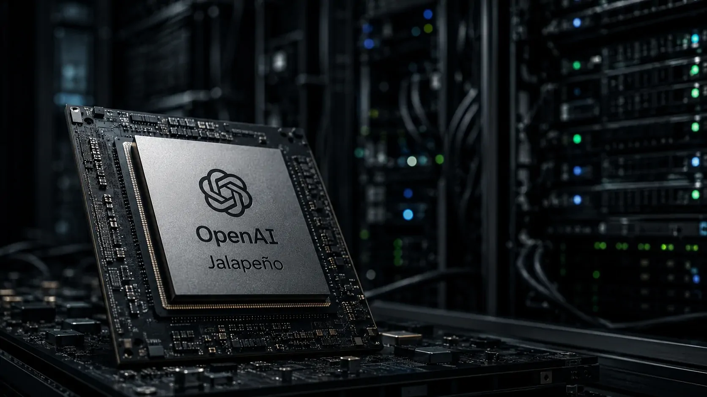
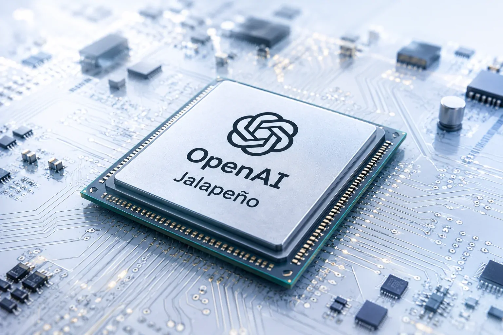
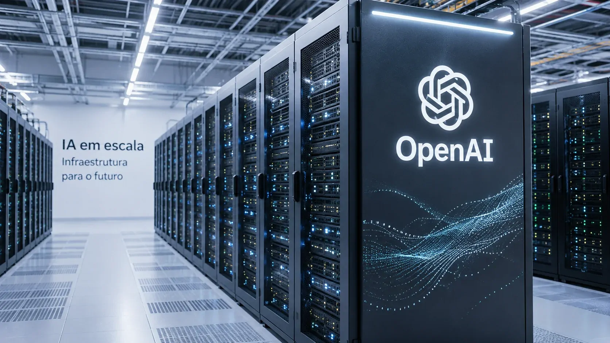

*OpenAI está avançando de uma empresa que desenvolve modelos de inteligência artificial para uma companhia que também quer controlar parte da infraestrutura responsável por executá-los. Os primeiros resultados do Jalapeño mostram que a disputa pela IA está entrando em uma nova etapa: além de modelos mais capazes, eficiência de processamento, energia e custo passam a ser fatores estratégicos.*

## O que a OpenAI está fazendo com seu próprio chip

A **OpenAI** apresentou os primeiros resultados medidos do **Jalapeño**, seu primeiro chip próprio desenvolvido especificamente para executar modelos de linguagem. A empresa afirma que o acelerador conseguiu combinar maior quantidade de trabalho processado por unidade de energia com menor latência em relação aos sistemas comerciais utilizados na comparação.

### O chip foi criado para executar modelos de IA

O ponto central do projeto não é criar um processador para substituir todos os computadores usados pela OpenAI. O **Jalapeño** foi desenhado desde o início para cargas de trabalho de modelos de linguagem, considerando características de memória, processamento e comunicação que aparecem quando uma IA precisa responder aos usuários.

Isso permite que a empresa otimize diferentes partes da infraestrutura em conjunto. Em vez de adaptar um acelerador de propósito mais amplo às necessidades de seus modelos, a OpenAI pode projetar hardware, memória, rede e software considerando o tipo de processamento que seus produtos exigem.

### O objetivo é ganhar velocidade e eficiência

Nos testes divulgados pela empresa, o Jalapeño apresentou entre **1,5 e 1,9 vez mais trabalho de IA por watt** no pico de processamento e entre **1,7 e 3,6 vezes menor latência** do que os sistemas usados como comparação, dependendo do modelo e da configuração avaliados.

Esses números são resultados divulgados pela própria OpenAI e devem ser interpretados dentro das condições dos testes. Ainda assim, eles mostram por que a empresa considera o chip importante para sua estratégia de infraestrutura.

## O que significa inferência e por que ela importa

A palavra **inferência** aparece constantemente quando se fala do Jalapeño, mas o conceito é mais simples do que parece. Em inteligência artificial, inferência é o processo pelo qual um modelo já treinado recebe uma solicitação e produz uma resposta.

### É quando a IA efetivamente responde ao usuário

Quando uma pessoa pergunta algo ao **ChatGPT**, o modelo precisa processar aquela solicitação e gerar uma resposta. Essa etapa acontece depois do treinamento do modelo e é chamada de inferência.

Uma analogia simples ajuda: o treinamento é como ensinar alguém a resolver problemas; a inferência é o momento em que essa pessoa recebe uma pergunta e utiliza o conhecimento adquirido para respondê-la.

Por isso, cada conversa com um serviço de IA exige capacidade computacional. Quanto maior o número de usuários e quanto mais complexas forem as tarefas realizadas pelos agentes, maior será a quantidade de processamento necessária.

### Mais usuários significam mais pressão sobre a infraestrutura

O crescimento da inteligência artificial transforma a eficiência da inferência em uma questão econômica. Uma pequena melhoria no custo ou no consumo de energia por resposta pode representar uma diferença enorme quando o sistema precisa atender milhões de solicitações.

Esse efeito é ainda mais relevante para agentes de IA. Um chatbot pode responder uma pergunta em uma sequência relativamente curta, enquanto um agente pode precisar executar diversas etapas para completar uma tarefa. A própria OpenAI destaca que atrasos podem se acumular quando um sistema precisa realizar muitos passos em sequência.

É nesse ponto que um chip especializado pode fazer diferença: **não necessariamente porque executa tarefas mais simples, mas porque foi projetado para executar esse tipo específico de processamento com maior eficiência**.

## Por que a OpenAI quer depender menos da Nvidia

*O Jalapeño faz parte de uma estratégia maior da OpenAI para integrar hardware, software e modelos em uma mesma arquitetura.*

A criação do Jalapeño não significa que a **Nvidia** deixará de fornecer hardware para a OpenAI. Pelo contrário. A empresa afirma explicitamente que continuará implantando aceleradores da Nvidia e de outros parceiros tanto para treinamento quanto para inferência.

### A estratégia é diversificar a infraestrutura

A relação entre **OpenAI e Nvidia** passa, portanto, por uma mudança mais sutil. A OpenAI quer ter diferentes tipos de aceleradores disponíveis e escolher a infraestrutura mais adequada para cada carga de trabalho.

Isso reduz o risco de depender de uma única arquitetura de hardware e dá à empresa maior capacidade para controlar custos, consumo de energia e desempenho.

A estratégia também acompanha uma tendência maior da indústria. Grandes empresas de tecnologia estão desenvolvendo aceleradores personalizados porque a quantidade de computação necessária para IA tornou o hardware uma parte central da estratégia empresarial.

O movimento da Anthropic segue uma lógica semelhante. O Notícia Tech já analisou essa disputa em **[Anthropic prepara chips próprios para o Claude e ameaça reduzir a dependência da Nvidia](https://noticiatech.com.br/anthropic-prepara-chips-proprios-claude-ameaca-reduzir-dependencia-nvidia/)**.

### O hardware virou parte da competição entre empresas de IA

Durante boa parte da atual corrida da inteligência artificial, a atenção ficou concentrada nos modelos: quem tinha o modelo mais capaz, o melhor chatbot ou o agente mais avançado.

Agora, a infraestrutura começa a ganhar o mesmo peso.

A OpenAI está tentando controlar uma parte maior da chamada cadeia completa de IA, incluindo **modelos, software, produtos, chips, memória, redes e sistemas de implantação**. A empresa descreve essa estratégia como uma abordagem full-stack, na qual cada camada pode ser otimizada em conjunto.

Isso não elimina a Nvidia. Mas cria uma alternativa estratégica para determinados tipos de processamento.

## O que muda para o ChatGPT e para as empresas

O impacto mais fácil de perceber para o usuário pode ser uma resposta mais rápida. Mas a consequência empresarial potencialmente mais importante está no custo para executar inteligência artificial em grande escala.

*O ganho de eficiência no processamento pode se transformar em respostas mais rápidas e maior capacidade para atender à demanda por IA.*

### Respostas mais rápidas podem melhorar agentes de IA

A OpenAI afirma que o Jalapeño foi desenvolvido considerando especialmente produtos interativos, incluindo **ChatGPT**, **Codex**, API e futuros produtos baseados em agentes.

Para o usuário, isso pode aparecer como menor espera entre uma solicitação e uma resposta. Para empresas, o efeito pode ser mais amplo.

Um agente que precisa executar dez ou vinte etapas para concluir uma tarefa pode se beneficiar de cada redução de latência. Quando esses ganhos são multiplicados por milhões de tarefas, a eficiência do hardware passa a ter impacto direto na capacidade operacional do serviço.

### Eficiência também pode afetar o preço da IA

A infraestrutura representa uma parcela importante do custo de operar serviços de inteligência artificial. Se uma empresa consegue produzir mais trabalho útil utilizando a mesma quantidade de energia e capacidade computacional, ela pode atender mais demanda sem aumentar os custos na mesma proporção.

A OpenAI afirma que o Jalapeño pode melhorar sua eficiência operacional ao permitir que o trabalho útil cresça mais rapidamente do que o custo para servi-lo.

Isso não significa automaticamente que o ChatGPT ficará mais barato para o consumidor. O ganho pode ser utilizado para ampliar capacidade, financiar novos modelos, melhorar produtos ou sustentar margens. O efeito comercial dependerá das decisões da própria empresa.

## A OpenAI está construindo uma infraestrutura própria de IA

O Jalapeño também representa uma mudança de posicionamento. A **OpenAI** não quer depender exclusivamente de componentes disponíveis no mercado para sustentar o crescimento de seus produtos.

### O projeto vai além de um único chip

A empresa afirma que o Jalapeño é o primeiro passo de uma plataforma de computação multigeracional. A implantação inicial está planejada para começar até o fim de 2026, enquanto as gerações seguintes já estão em desenvolvimento.

Isso significa que a OpenAI não está tratando o projeto como um experimento isolado.

A intenção é criar uma sequência de gerações de hardware que possa acompanhar a evolução dos modelos e dos produtos da companhia. Quanto mais a empresa aprender sobre os padrões de processamento de seus sistemas, maior pode ser sua capacidade de ajustar o hardware às necessidades futuras.

### A OpenAI também avança no hardware para consumidores

O movimento da OpenAI não está limitado à infraestrutura de servidores. A empresa também avançou para o desenvolvimento de dispositivos próprios voltados ao consumidor.

O Notícia Tech já analisou esse movimento em **[OpenAI entra na guerra do hardware e prepara nova geração de dispositivos para o ChatGPT](https://noticiatech.com.br/openai-entra-na-guerra-do-hardware-prepara-nova-geracao-dispositivos-chatgpt/)**.

Nesse caso, a disputa acontece em outra camada: enquanto o Jalapeño atua na infraestrutura que executa a IA, os dispositivos buscam aproximar o ChatGPT da experiência computacional cotidiana.

### A Nvidia continua fazendo parte da estratégia

Esse ponto precisa ser preservado para entender corretamente a notícia. **A OpenAI não está abandonando a Nvidia.**

A própria empresa afirma que continuará implantando aceleradores da **Nvidia** e de outros parceiros em workloads de treinamento e inferência.

A mudança é que a OpenAI passa a ter mais uma opção sob seu próprio controle. Em vez de depender exclusivamente de hardware comprado de terceiros, poderá combinar diferentes arquiteturas de acordo com desempenho, custo, disponibilidade e características de cada tarefa.

## O que essa mudança revela sobre o futuro da IA

A importância do Jalapeño vai além de um benchmark de chips. O projeto mostra que a corrida da inteligência artificial está se tornando uma disputa por toda a infraestrutura necessária para transformar modelos em produtos utilizados em escala.

*À medida que a demanda por IA cresce, controlar processamento, energia e infraestrutura se torna uma vantagem competitiva cada vez mais relevante.*

### A próxima disputa pode ser por custo de processamento

Modelos mais inteligentes exigem mais computação. Agentes capazes de executar tarefas longas também aumentam a quantidade de processamento necessária.

Nesse cenário, não basta desenvolver um modelo mais capaz. É preciso conseguir executá-lo rapidamente, com confiabilidade e a um custo que permita sua utilização em larga escala.

É por isso que chips personalizados podem se tornar cada vez mais importantes para empresas que operam serviços de IA em grande escala.

### A corrida agora envolve o sistema inteiro

O movimento da **OpenAI** também aproxima a empresa de uma estratégia adotada por outras gigantes de tecnologia: desenvolver componentes próprios para controlar melhor a infraestrutura crítica.

O diferencial está na integração. Se a OpenAI consegue usar seus próprios modelos para ajudar a projetar chips, otimizar software e entender os padrões reais de uso de seus produtos, pode criar um ciclo no qual cada camada melhora a seguinte.

O Jalapeño ainda é apenas a primeira geração dessa estratégia. A OpenAI planeja começar sua implantação até o fim de 2026 e já trabalha nas próximas gerações.

A questão mais importante, portanto, não é se o chip próprio vai substituir a **Nvidia**. **A própria OpenAI diz que continuará usando seus aceleradores.** O ponto estratégico é outro: quanto mais controle a OpenAI conquistar sobre a infraestrutura que executa seus modelos, maior será sua capacidade de decidir como, onde e a que custo a inteligência artificial será processada.

---