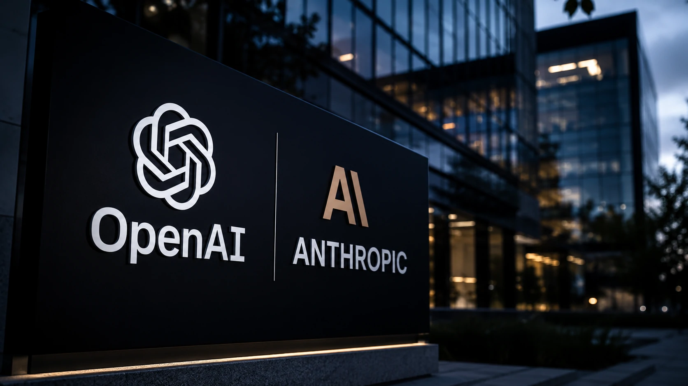
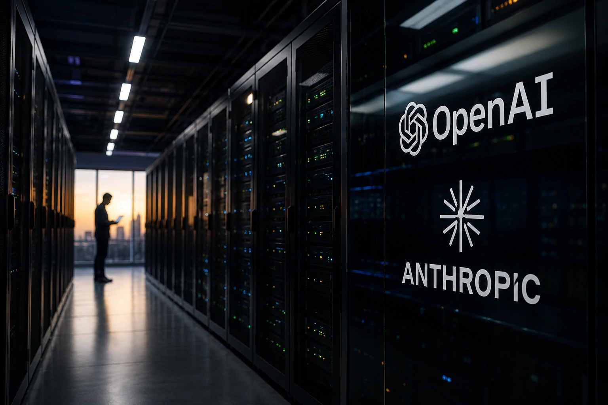
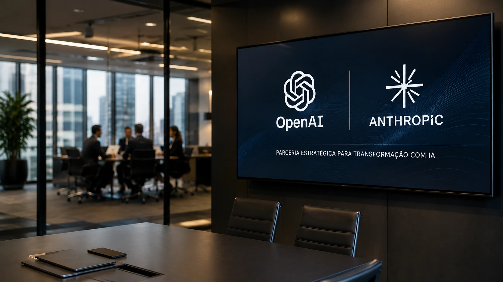

*Depois de revolucionar o mercado de tecnologia, a **inteligência artificial** entra em uma nova etapa. A disputa entre **OpenAI**, **Anthropic** e outras desenvolvedoras passa a ser definida não apenas pela qualidade dos modelos, mas também pela capacidade de captar bilhões de dólares para financiar a próxima geração da infraestrutura global de IA.*

## A corrida pelo mercado de capitais mostra que a IA entrou na fase empresarial

Empresas de **inteligência artificial** estão deixando de atuar como startups altamente inovadoras para assumir características de grandes companhias globais.

*OpenAI e Anthropic entram em uma nova etapa de expansão, impulsionada por investimentos bilionários.*

Essa mudança acontece porque desenvolver modelos de fronteira exige investimentos cada vez maiores em pesquisa, infraestrutura e capacidade computacional.

A possibilidade de uma abertura de capital da **OpenAI**, somada aos movimentos da **Anthropic** e de outras empresas do setor, demonstra que a disputa pela liderança mundial passou a depender também do acesso contínuo a recursos financeiros.

### O desenvolvimento da IA ficou muito mais caro

Nos primeiros anos da IA generativa, pequenas equipes conseguiam produzir avanços relevantes utilizando infraestrutura relativamente limitada.

Hoje, o cenário é completamente diferente.

Treinar modelos de última geração exige milhares de GPUs, consumo elevado de energia, grandes centros de processamento de dados e equipes multidisciplinares espalhadas pelo mundo.

### A competição agora envolve infraestrutura

O diferencial competitivo deixou de ser apenas lançar um modelo melhor.

Empresas precisam construir ecossistemas completos capazes de atender milhões de usuários e grandes organizações simultaneamente, mantendo desempenho, disponibilidade e segurança.

## O investimento bilionário passa a ser uma vantagem competitiva

A capacidade financeira tornou-se um dos principais ativos estratégicos da indústria de IA.

*Infraestrutura computacional tornou-se um dos maiores diferenciais competitivos da inteligência artificial.*

Companhias como **OpenAI**, **Anthropic**, **Google**, **Microsoft** e **Meta** disputam continuamente acesso aos chips mais avançados produzidos pela **NVIDIA**, além de expandirem suas operações em nuvem.

Quanto maior a infraestrutura disponível, maior também a velocidade para desenvolver novos modelos, reduzir tempo de treinamento e atender clientes corporativos.

### Data centers se tornaram ativos estratégicos

A construção de data centers especializados passou a representar uma vantagem comparável à construção de fábricas durante grandes revoluções industriais.

Essa infraestrutura determina quantos modelos podem ser treinados, quantos usuários podem ser atendidos e qual velocidade de inovação cada empresa consegue manter.

### O custo operacional cresce continuamente

Além da compra de hardware, existe uma cadeia completa de despesas envolvendo energia elétrica, refrigeração, redes de alta velocidade, armazenamento e profissionais altamente especializados.

Essa realidade explica por que o acesso permanente a novas fontes de capital se tornou um elemento estratégico para toda a indústria.

Para compreender como a infraestrutura influencia diretamente a evolução dos modelos, vale conhecer também o artigo sobre **AI Fluency**, disponível em:

https://noticiatech.com.br/inteligencia-artificial/o-que-e-ai-fluency-habilidade-profissionais-empresas/

## Empresas clientes passam a exigir fornecedores mais sólidos

Empresas que adotam **inteligência artificial** em processos críticos também acompanham essa transformação.

*O mercado corporativo passa a valorizar fornecedores capazes de sustentar investimentos de longo prazo.*

Para grandes organizações, escolher uma plataforma de IA deixou de ser apenas uma decisão tecnológica.

Agora também envolve fatores como:

- estabilidade financeira;
- capacidade de inovação contínua;
- governança corporativa;
- expansão internacional;
- suporte empresarial.

Quanto maior a previsibilidade do fornecedor, menor tende a ser o risco de interrupções, mudanças bruscas de estratégia ou redução na capacidade de investimento.

### A confiança passa a ser um diferencial competitivo

Empresas que desenvolvem soluções críticas precisam demonstrar que possuem condições financeiras para continuar evoluindo seus modelos durante muitos anos.

Essa percepção aumenta a importância de indicadores financeiros, governança e planejamento de longo prazo.

### O mercado corporativo busca continuidade

Projetos de IA costumam exigir integração com processos internos, treinamento de equipes e adaptação operacional.

Por isso, organizações tendem a priorizar parceiros capazes de oferecer estabilidade e evolução contínua da plataforma utilizada.

Esse movimento também está relacionado ao fortalecimento da governança de IA nas empresas, tema abordado em:

https://noticiatech.com.br/inteligencia-artificial/o-que-e-ai-governance-guia-completo-empresas-inteligencia-artificial/

## A próxima disputa será decidida fora dos laboratórios

A corrida pela liderança da **inteligência artificial** continua sendo impulsionada por inovação tecnológica, mas o próximo vencedor dificilmente será definido apenas pela qualidade de um modelo.

A vantagem competitiva passa a depender da combinação entre pesquisa, infraestrutura, acesso a capital, governança e capacidade de expansão global.

Enquanto novos modelos continuam sendo lançados, investidores observam outro indicador igualmente importante: quais empresas conseguirão financiar a próxima década da inteligência artificial.

Para gestores e empresas, esse cenário reforça que a escolha de plataformas de IA deve considerar não apenas desempenho técnico, mas também sustentabilidade financeira, estratégia de longo prazo e capacidade de inovação contínua.

Os próximos anos devem consolidar um novo estágio da indústria, no qual a disputa deixa de acontecer apenas entre algoritmos e passa a envolver ecossistemas completos de tecnologia, infraestrutura e mercado de capitais.

---