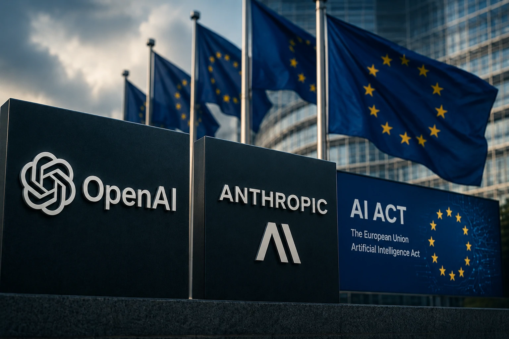
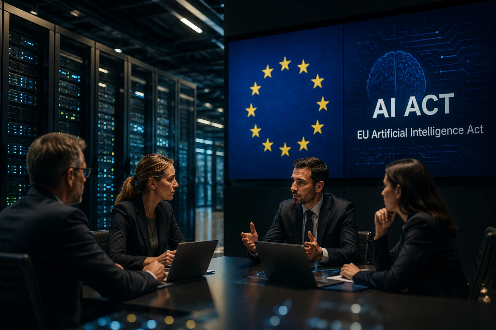
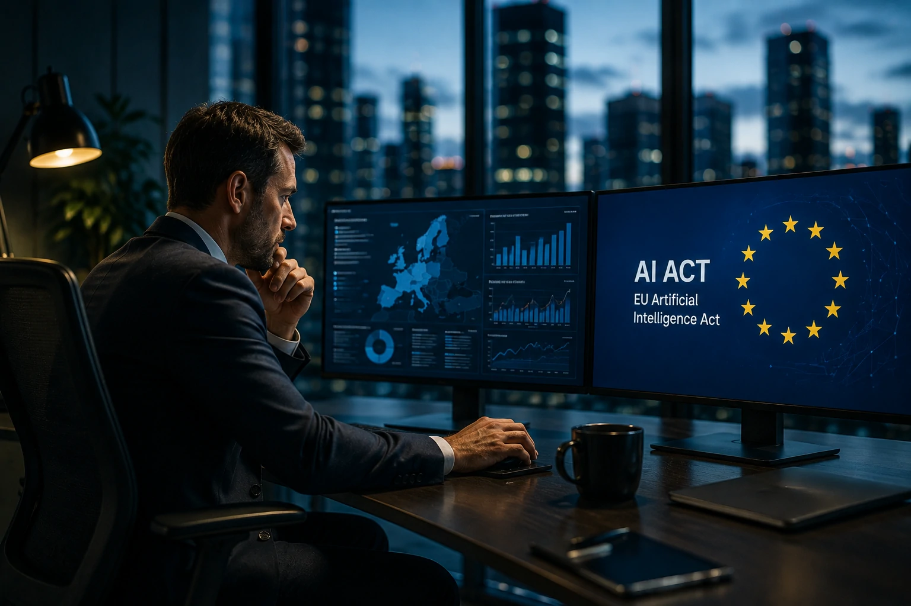

*A corrida pela inteligência artificial entra em uma nova fase. Se até agora a disputa entre **OpenAI**, **Anthropic**, **Google** e outras gigantes era definida principalmente pela velocidade de inovação, a entrada em vigor da **AI Act** mostra que a regulamentação também passa a ser um fator competitivo capaz de redefinir o mercado global.*

A decisão da **União Europeia** de ampliar o diálogo com empresas responsáveis pelos modelos mais avançados de inteligência artificial representa um marco para toda a indústria. O objetivo não é interromper a inovação, mas garantir que sistemas cada vez mais poderosos sejam desenvolvidos dentro de padrões mínimos de segurança, transparência e responsabilidade.

Mais do que uma discussão jurídica, o movimento evidencia uma mudança estrutural: governos começam a tratar a inteligência artificial como infraestrutura crítica para economia, segurança digital e competitividade internacional.

## A AI Act inaugura uma nova etapa para a inteligência artificial

*O novo marco regulatório europeu amplia as exigências sobre empresas que desenvolvem modelos avançados de IA.*

A **AI Act** é a primeira legislação abrangente criada para regular sistemas de inteligência artificial em larga escala. Diferentemente de normas focadas apenas em privacidade, o regulamento estabelece critérios específicos para avaliação de risco, transparência e responsabilidade dos fornecedores.

O foco está especialmente nos chamados modelos de propósito geral, categoria onde estão soluções desenvolvidas por **OpenAI** e **Anthropic**. Esses sistemas podem ser utilizados em diferentes aplicações, desde atendimento ao cliente até desenvolvimento de software, análise financeira e automação empresarial.

### Mais responsabilidade para modelos avançados

Na prática, empresas precisarão demonstrar maior capacidade de documentar seus modelos, avaliar riscos e adotar mecanismos que reduzam usos indevidos.

Esse movimento reforça uma tendência que já vinha sendo discutida após o crescimento acelerado dos **agentes de IA**, tema que o **Notícia Tech** já explorou em conteúdos como:

- **[O que é AI Agent Identity? O guia completo sobre identidade de agentes de IA para empresas](https://noticiatech.com.br/inteligencia-artificial/ai-agent-identity-identidade-agentes-ia-empresas/)**

- **[O que é AI Orchestration e por que ela será indispensável para empresas que usam agentes de IA](https://noticiatech.com.br/automacao/o-que-e-ai-orchestration-agentes-ia-empresas/)**

### A regulamentação deixa de ser um tema secundário

Até recentemente, empresas concentravam esforços principalmente em desempenho e capacidade dos modelos.

Agora, governança, auditoria e conformidade passam a influenciar diretamente decisões de investimento e adoção corporativa.

## Por que OpenAI e Anthropic passaram a ser prioridade para os reguladores?

A resposta é direta: porque ambas lideram parte da evolução tecnológica da inteligência artificial generativa.

## A nova legislação pode alterar a disputa global pela liderança da IA

*Grandes desenvolvedoras de inteligência artificial passam a considerar a conformidade regulatória como vantagem competitiva.*

A resposta é sim. A **AI Act** não altera apenas a forma como a **OpenAI** e a **Anthropic** desenvolvem seus modelos, mas influencia toda a estratégia do setor de inteligência artificial.

Empresas que pretendem atuar no mercado europeu precisarão incorporar requisitos regulatórios desde as primeiras etapas do desenvolvimento dos modelos. Isso reduz riscos futuros, facilita auditorias e aumenta a confiança de clientes corporativos.

Na prática, conformidade deixa de ser apenas uma obrigação jurídica e passa a fazer parte da estratégia de produto.

### O mercado corporativo tende a acelerar investimentos em governança

Nos últimos anos, empresas concentraram investimentos em produtividade e automação. Agora, cresce a demanda por soluções capazes de oferecer também transparência, rastreabilidade e gestão de riscos.

Esse movimento fortalece um conceito cada vez mais discutido no mercado: a arquitetura corporativa de inteligência artificial.

Quem deseja compreender como empresas estão estruturando esse novo ambiente pode aprofundar a leitura em:

- **[Arquitetura de IA Empresarial: como MCP, RAG, APIs, Agentes, Workflows e Copilotos funcionam juntos](https://noticiatech.com.br/inteligencia-artificial/arquitetura-ia-empresarial-mcp-rag-apis-agentes-workflows-copilotos/)**

### Segurança passa a ser diferencial competitivo

O avanço dos modelos generativos trouxe ganhos significativos de produtividade, mas também aumentou preocupações relacionadas à segurança, uso indevido e confiabilidade.

Nos últimos meses, diversos estudos apontaram vulnerabilidades em modelos avançados de IA, reforçando a necessidade de mecanismos mais robustos de proteção.

Esse contexto complementa análises já publicadas pelo **Notícia Tech** sobre segurança em inteligência artificial:

- **[O que é Segurança de IA e por que ela será prioridade para empresas nos próximos anos](https://noticiatech.com.br/inteligencia-artificial/o-que-e-seguranca-ia-prioridade-empresas/)**

- **[Pesquisa aponta quais IAs ainda podem ser burladas e acende alerta para empresas que usam ChatGPT, Gemini e Grok](https://noticiatech.com.br/inteligencia-artificial/pesquisa-ias-burladas-chatgpt-gemini-grok-seguranca/)**

## Empresas brasileiras também devem acompanhar a AI Act

*A regulamentação europeia pode influenciar estratégias de empresas muito além das fronteiras da União Europeia.*

Mesmo organizações brasileiras que não operam diretamente na Europa podem sentir os efeitos da nova legislação.

Muitas plataformas utilizadas por empresas nacionais são desenvolvidas por fornecedores globais. Caso esses fornecedores adaptem produtos para cumprir a **AI Act**, parte dessas mudanças poderá chegar naturalmente aos clientes de outros países.

### O impacto vai além da tecnologia

A discussão deixa de envolver apenas algoritmos.

Ela passa a incluir:

- governança corporativa;
- gestão de riscos;
- compliance;
- responsabilidade jurídica;
- transparência na utilização da inteligência artificial.

Isso transforma a IA em uma pauta estratégica para conselhos administrativos, áreas jurídicas e equipes de inovação.

### O próximo passo da corrida pela inteligência artificial

Durante os últimos anos, o mercado mediu a evolução da IA principalmente por benchmarks, número de parâmetros e novos recursos.

A partir da consolidação da **AI Act**, outro indicador começa a ganhar relevância: a capacidade das empresas de desenvolver inteligência artificial confiável, auditável e compatível com exigências regulatórias cada vez mais rigorosas.

Para **OpenAI**, **Anthropic** e todo o setor, a disputa pela liderança deixa de depender apenas da velocidade de inovação. A confiança, a governança e a conformidade passam a integrar o conjunto de fatores que determinarão quais plataformas conquistarão espaço no mercado corporativo nos próximos anos.

---