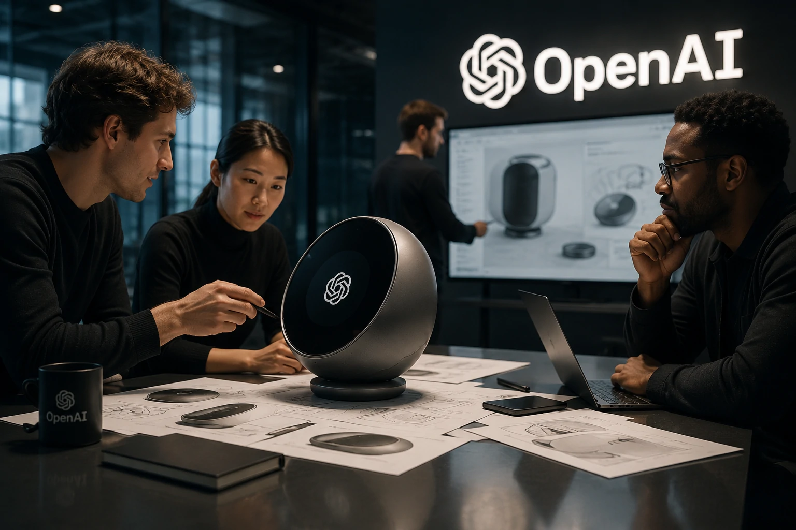
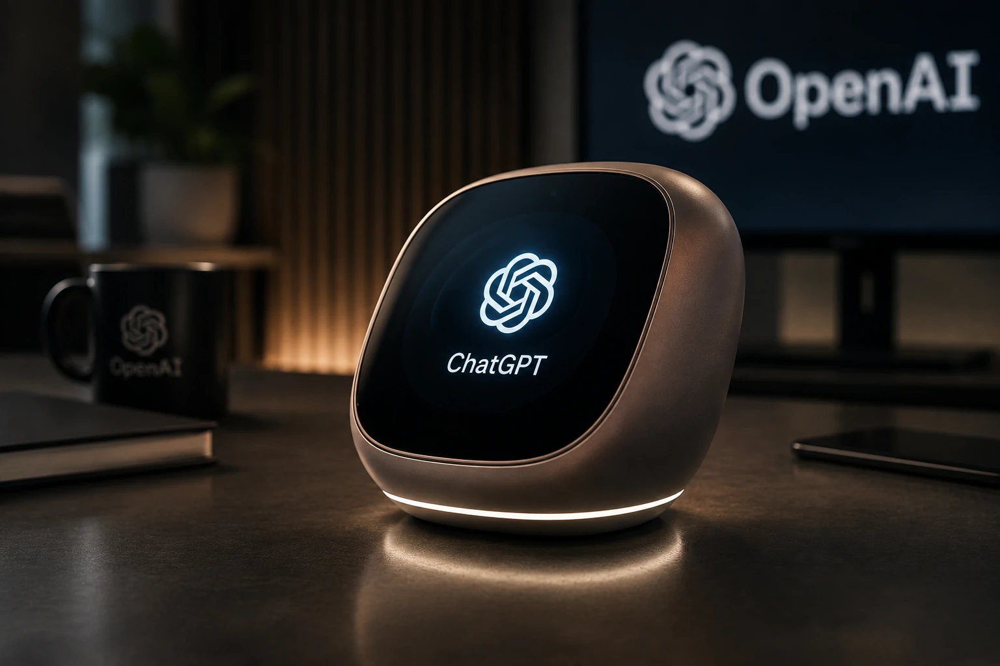
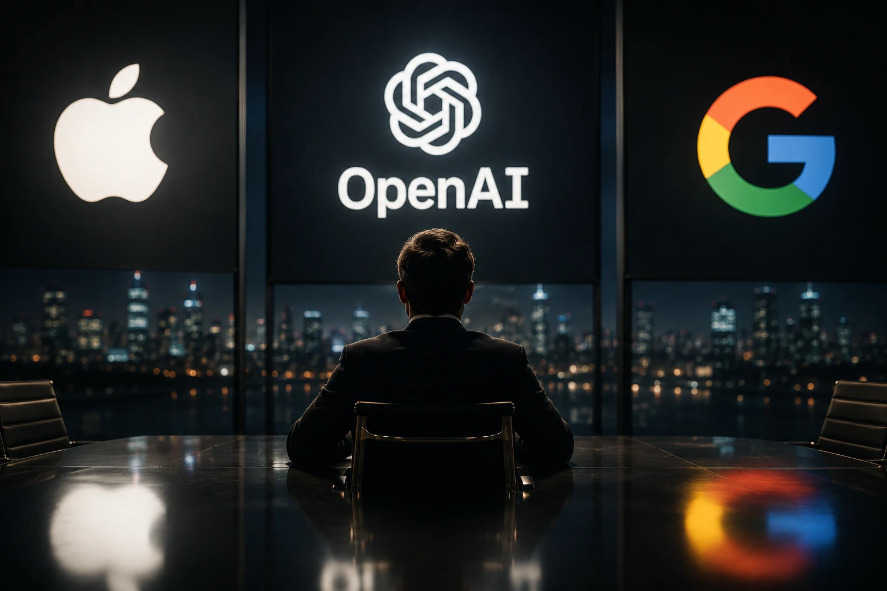

*Durante os últimos anos, a **OpenAI** transformou o mercado de software com o **ChatGPT**. Agora, a empresa parece mirar um objetivo ainda maior: controlar também o hardware que dará acesso à inteligência artificial. Caso essa estratégia avance, o impacto poderá redesenhar a disputa tecnológica hoje dominada por **Apple**, **Google** e outros fabricantes.*

## A OpenAI quer controlar toda a experiência da inteligência artificial

A **OpenAI** confirmou que trabalha em uma nova família de dispositivos próprios voltados para inteligência artificial. Mais do que lançar um novo produto, a iniciativa sinaliza uma mudança estratégica: deixar de ser apenas uma desenvolvedora de modelos de IA para controlar também a forma como as pessoas utilizam essa tecnologia.

*Executivos da OpenAI indicam que o futuro da empresa passa pela integração entre hardware e inteligência artificial.*

Essa decisão aproxima a empresa de um modelo semelhante ao da **Apple**, que combina hardware, sistema operacional e serviços em um único ecossistema.

### O software já não basta

Durante os últimos anos, empresas como **Microsoft**, **Google** e **Apple** disputaram o mercado adicionando IA aos produtos existentes.

A **OpenAI** parece seguir um caminho diferente: criar dispositivos concebidos desde o início para operar com inteligência artificial como elemento central.

### Uma mudança semelhante à chegada do smartphone

O movimento lembra a transformação ocorrida quando os smartphones deixaram de ser apenas telefones para se tornarem plataformas completas de computação.

Agora, a próxima interface pode deixar de ser uma tela tradicional para se tornar uma experiência totalmente orientada por IA.

## O hardware pode se tornar a nova vantagem competitiva da OpenAI

A entrada da empresa no segmento de dispositivos representa muito mais do que uma diversificação de produtos.

*Controlar hardware e software pode permitir experiências de IA impossíveis em plataformas tradicionais.*

Ao controlar hardware e software simultaneamente, a **OpenAI** poderá otimizar desempenho, reduzir latência e oferecer recursos que seriam difíceis de implementar em dispositivos desenvolvidos por terceiros.

### Menos dependência de plataformas externas

Hoje, o **ChatGPT** depende principalmente de computadores, navegadores e smartphones fabricados por outras empresas.

Com dispositivos próprios, a empresa ganha liberdade para definir como seus modelos serão utilizados.

### Dados, desempenho e experiência

Outro benefício é a possibilidade de integrar sensores, processamento local e novos formatos de interação, reduzindo custos de processamento em nuvem e melhorando a experiência do usuário.

Essa estratégia dialoga diretamente com tendências já discutidas pelo **Notícia Tech**, como a evolução da arquitetura corporativa de IA e dos agentes inteligentes.

Para entender como essa transformação acontece dentro das empresas, vale conhecer o guia sobre arquitetura empresarial de IA:

**[Arquitetura de IA Empresarial: como MCP, RAG, APIs, Agentes, Workflows e Copilotos funcionam juntos](https://noticiatech.com.br/inteligencia-artificial/arquitetura-ia-empresarial-mcp-rag-apis-agentes-workflows-copilotos/)**

E também a análise sobre como o **ChatGPT Work** vem alterando o mercado corporativo:

**[OpenAI muda o mercado com ChatGPT Work: por que empresas estão abandonando softwares tradicionais](https://noticiatech.com.br/inteligencia-artificial/chatgpt-work-empresas-abandonam-softwares-tradicionais/)**

## Apple e Google passam a disputar um novo tipo de concorrência

A estratégia da **OpenAI** amplia a competição no setor de tecnologia ao colocar a empresa em uma posição que antes era ocupada apenas por fabricantes de dispositivos. Se o projeto avançar, a disputa deixará de envolver apenas modelos de IA para alcançar toda a experiência de uso.

*O próximo capítulo da inteligência artificial pode ser decidido pela integração entre hardware, software e experiência do usuário.*

Enquanto a **Apple** aposta na integração da **Apple Intelligence** ao ecossistema do **iPhone** e do **Mac**, e o **Google** amplia o alcance do **Gemini** em dispositivos Android, a **OpenAI** busca criar uma plataforma própria desde a origem.

### O futuro pode ser uma IA sempre presente

A tendência aponta para dispositivos capazes de compreender contexto, antecipar necessidades e executar tarefas de maneira contínua.

Nesse cenário, a inteligência artificial deixa de funcionar apenas como um aplicativo para se tornar a principal interface entre pessoas e tecnologia.

Essa evolução acompanha outra transformação importante discutida pelo **Notícia Tech**: o crescimento da identidade dos agentes inteligentes nas empresas.

**[O que é AI Agent Identity? O guia completo sobre identidade de agentes de IA para empresas](https://noticiatech.com.br/inteligencia-artificial/ai-agent-identity-identidade-agentes-ia-empresas/)**

### O mercado entra em uma nova fase

Nos últimos anos, a disputa girava em torno de qual empresa possuía o melhor modelo de linguagem.

Agora, o diferencial pode estar em quem oferecer a melhor combinação entre dispositivo, software, processamento e experiência do usuário.

Essa mudança pode redefinir cadeias de fornecimento, estimular novos investimentos em chips especializados e acelerar uma nova geração de produtos voltados exclusivamente para inteligência artificial.

## Por que essa decisão pode redefinir o futuro da computação

A entrada da **OpenAI** no mercado de hardware representa mais do que um lançamento de produto. Ela indica que a empresa acredita que o próximo ciclo da computação será construído sobre dispositivos desenvolvidos especificamente para inteligência artificial.

### Uma nova plataforma tecnológica

Assim como os smartphones redefiniram a computação móvel e os serviços em nuvem transformaram o ambiente corporativo, dispositivos concebidos para IA podem inaugurar uma nova categoria tecnológica.

Empresas que hoje lideram seus segmentos precisarão adaptar suas estratégias para competir em um mercado onde hardware e inteligência artificial serão desenvolvidos em conjunto.

### O impacto vai além do consumidor

Para empresas, desenvolvedores e investidores, esse movimento sinaliza uma mudança estrutural na indústria.

Se a **OpenAI** conseguir criar um ecossistema competitivo, poderá reduzir a dependência de plataformas tradicionais, abrir novas fontes de receita e fortalecer ainda mais o **ChatGPT** como ponto central da interação entre pessoas e inteligência artificial.

Mais do que uma corrida por dispositivos, o mercado começa a disputar quem controlará a próxima interface da computação. E, pela primeira vez, a **OpenAI** demonstra que pretende competir não apenas pelo melhor modelo de IA, mas também pelo equipamento onde essa inteligência será utilizada.

---