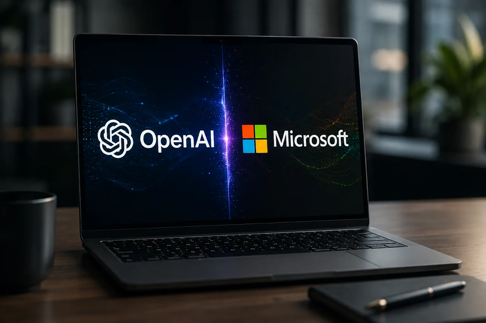
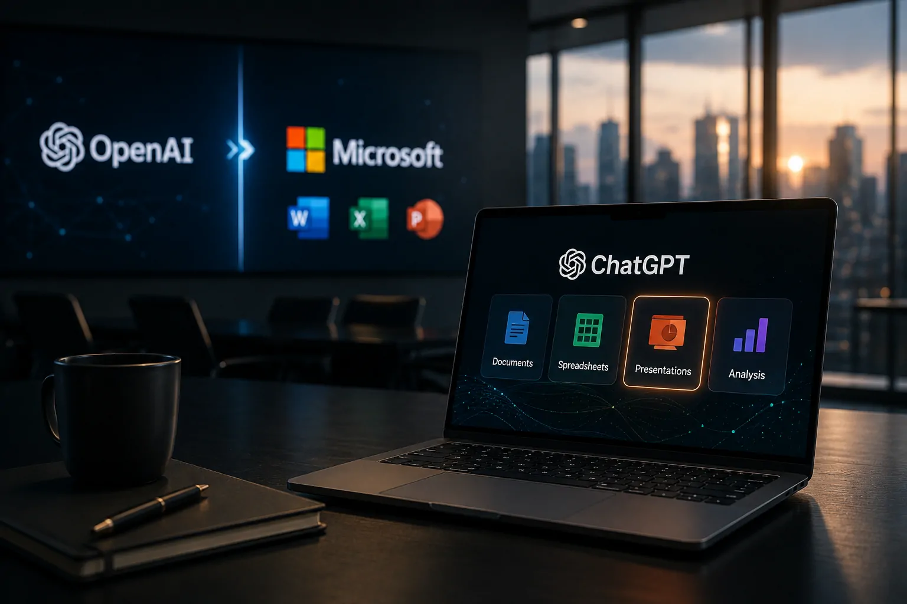
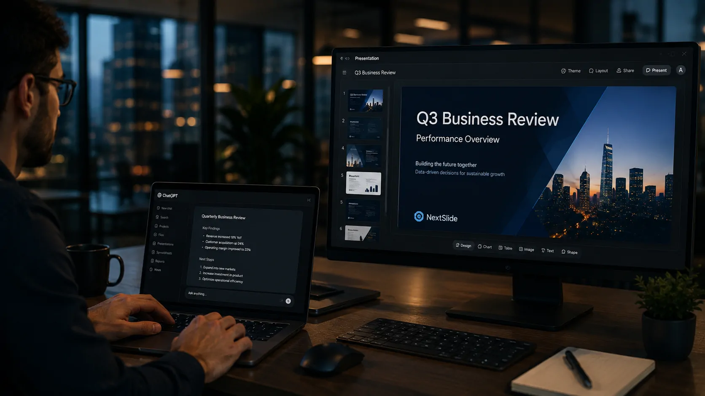

*Por anos, apresentações, documentos e planilhas foram tratados como tarefas executadas dentro de softwares separados. Agora, a OpenAI está tentando aproximar essas atividades do ChatGPT, e a aquisição de uma pequena startup pode revelar uma mudança muito maior na estratégia da empresa.*

## O que a OpenAI comprou e por que a notícia importa

A **OpenAI** adquiriu a **NextSlide**, uma startup especializada em criação de apresentações com inteligência artificial, e incorporou sua equipe ao desenvolvimento do **ChatGPT**. A operação aconteceu no início de 2026, mas só foi divulgada publicamente agora. Os valores financeiros da aquisição não foram revelados. 

A **NextSlide** havia criado uma ferramenta capaz de transformar prompts, notas, documentos ou pesquisas em apresentações editáveis. Na prática, a proposta era reduzir uma das etapas mais trabalhosas do conhecimento corporativo: pegar informações dispersas e transformá-las em uma apresentação organizada.

Esse detalhe é mais importante do que o tamanho da startup. A aquisição coloca dentro da **OpenAI** uma equipe especializada justamente em uma tarefa que pertence ao núcleo do trabalho empresarial. Apresentações são usadas para vender projetos, apresentar resultados, defender investimentos, treinar equipes e comunicar decisões.

*Aquisição da NextSlide aproxima o ChatGPT de uma das atividades mais comuns no trabalho corporativo: transformar informação em apresentações.*

### Uma aquisição pequena com implicações maiores

A **NextSlide** tinha pouco mais de um ano de existência quando foi incorporada pela **OpenAI**. O fundador Ahmed Beshry afirmou que a equipe agora trabalha na empresa e continuará desenvolvendo produtos voltados à criação, comunicação e transformação de ideias em trabalho.

Isso ajuda a explicar por que a aquisição merece atenção mesmo sem um grande valor financeiro divulgado. O ativo mais importante pode não ser a marca da startup, mas a experiência acumulada pela equipe em um problema específico.

Para a **OpenAI**, comprar uma equipe que já trabalhava na geração de apresentações pode ser uma maneira mais rápida de acelerar uma capacidade dentro do **ChatGPT** do que construir tudo internamente desde o início.

O movimento também acontece em um momento em que o ChatGPT está deixando de ser apenas uma ferramenta de perguntas e respostas. A própria OpenAI já descreve o **ChatGPT Work** como um agente capaz de pesquisar, analisar informações, trabalhar com arquivos e aplicativos conectados e produzir documentos, planilhas, apresentações, relatórios e sites.

## Por que a NextSlide coloca a OpenAI no território da Microsoft

A aquisição ganha outra dimensão quando observada pelo mercado de software corporativo. Apresentações são um dos territórios históricos do **Microsoft PowerPoint**, e a Microsoft mantém uma relação estratégica e financeira profunda com a OpenAI.

O ponto central não é afirmar que o **ChatGPT** substituirá o **PowerPoint** imediatamente. Não há anúncio nesse sentido. O que muda é a direção estratégica: a OpenAI está adicionando ao ChatGPT capacidades que pertencem ao conjunto de ferramentas tradicionalmente usado para executar o trabalho.

A diferença é importante. Em vez de começar com um editor de apresentações e adicionar inteligência artificial, a **OpenAI** começa com uma inteligência artificial e passa a incorporar ferramentas capazes de produzir o resultado final.

*O movimento coloca a inteligência artificial no centro de tarefas que tradicionalmente dependiam de softwares especializados.*

### O confronto não é apenas entre dois produtos

A disputa mais interessante não é simplesmente **ChatGPT contra PowerPoint**. É uma disputa sobre onde começa e termina o ambiente de trabalho digital.

A **Microsoft** possui sistemas operacionais, aplicativos corporativos, armazenamento, colaboração e ferramentas de produtividade. A OpenAI possui um dos produtos de inteligência artificial mais conhecidos do mercado e vem ampliando o ChatGPT para executar tarefas cada vez mais complexas.

Essa diferença cria duas estratégias possíveis.

De um lado, empresas como a Microsoft podem manter os softwares que já dominam o ambiente corporativo e incorporar inteligência artificial a eles. Do outro, a OpenAI pode fazer o caminho inverso: colocar a IA no centro e adicionar progressivamente as ferramentas necessárias para realizar o trabalho.

O histórico recente do **ChatGPT** mostra que essa expansão já começou. A plataforma passou a trabalhar com projetos, arquivos e tarefas de longa duração, enquanto o ChatGPT Work foi apresentado como uma forma de executar trabalhos completos, e não apenas responder a uma pergunta isolada.

## A estratégia da OpenAI começa a formar uma plataforma de trabalho

A aquisição da **NextSlide** faz mais sentido quando observada junto dessas outras capacidades. Isoladamente, criar apresentações parece apenas mais uma função. Em conjunto com documentos, arquivos, pesquisa e execução de tarefas, ela pode se tornar parte de uma plataforma de trabalho.

Esse é o ponto estratégico da notícia.

Uma apresentação raramente existe sozinha. Ela normalmente nasce de uma pesquisa, utiliza documentos, números, informações de clientes e dados internos e termina como um material que precisa ser revisado e apresentado. Se uma IA consegue participar de várias dessas etapas, o valor da ferramenta deixa de estar apenas na geração de texto.

O **ChatGPT Work** já foi apresentado pela OpenAI como capaz de pesquisar e analisar informações, trabalhar com aplicativos e arquivos conectados e produzir entregáveis como documentos, planilhas e apresentações. A aquisição da NextSlide adiciona uma equipe especializada justamente em uma dessas etapas.

*O próximo campo de disputa pode ser menos sobre o aplicativo usado e mais sobre qual plataforma controla o fluxo completo de trabalho.*

### Por que isso pode mudar o mercado corporativo

Para uma empresa, a vantagem potencial não está apenas em criar uma apresentação alguns minutos mais rápido. Está em reduzir a quantidade de etapas necessárias para transformar informação em uma decisão ou entrega.

Imagine um fluxo em que uma equipe fornece documentos, dados e objetivos ao **ChatGPT**, recebe uma análise, transforma essa análise em um relatório e depois gera uma apresentação para uma reunião. Quanto mais etapas forem executadas dentro da mesma plataforma, menor pode ser a necessidade de alternar entre ferramentas.

Isso não significa que empresas abandonarão imediatamente seus softwares atuais. Sistemas corporativos possuem integrações, permissões, padrões de segurança e processos estabelecidos que não desaparecem por causa de uma nova função de IA.

Mas a lógica econômica começa a mudar quando a inteligência artificial passa a controlar o fluxo entre essas ferramentas.

É justamente nesse ponto que a aquisição da **NextSlide** deixa de parecer apenas uma compra de uma startup de apresentações e passa a fazer parte de uma disputa maior pelo centro do trabalho digital.

## O que muda para empresas e profissionais que usam IA

Para empresas, a principal mudança potencial está na forma como o trabalho será executado. Se o **ChatGPT** passar a combinar pesquisa, análise, documentos e apresentações dentro de um mesmo fluxo, tarefas que hoje exigem vários aplicativos poderão começar a ser realizadas a partir de uma única interface.

Isso não significa que o **PowerPoint**, os editores de documentos ou outros softwares corporativos desaparecerão. O que pode mudar é o papel desses aplicativos. Em vez de serem o ponto de partida do trabalho, eles podem se transformar em ferramentas utilizadas para revisar, ajustar e finalizar aquilo que uma IA já produziu.

Esse cenário interessa especialmente a profissionais que trabalham com relatórios, vendas, consultoria, marketing, finanças e gestão. Uma apresentação comercial, por exemplo, pode começar com dados de clientes, passar por uma análise automática e terminar em um material visual preparado para uma reunião.

### Menos criação manual, mais revisão e decisão

O efeito mais relevante da IA generativa sobre a produtividade não está necessariamente em eliminar o profissional. Está em deslocar o trabalho humano para etapas de maior valor.

Quando uma ferramenta consegue estruturar informações, criar um primeiro rascunho e organizar uma apresentação, o profissional passa menos tempo formatando conteúdo e mais tempo verificando se a informação está correta, se o argumento faz sentido e se a apresentação realmente ajuda na decisão.

Essa mudança também aumenta a importância da **revisão humana**. Uma apresentação gerada automaticamente pode estar visualmente organizada e ainda assim conter interpretações incorretas, dados desatualizados ou conclusões que não deveriam ser apresentadas a clientes.

É por isso que a expansão do **ChatGPT** para o trabalho corporativo não deve ser analisada apenas como uma corrida por produtividade. Ela também aumenta a necessidade de governança, controle de dados e definição clara de responsabilidades.

Empresas que quiserem avançar nessa direção precisarão pensar não apenas em qual IA contratar, mas em como conectar a IA aos seus processos internos com segurança. O tema se relaciona diretamente ao debate sobre **[governança de IA nas empresas](https://noticiatech.com.br/inteligencia-artificial/governanca-ia-prioridade-empresas/)**, que tende a ganhar ainda mais importância à medida que os sistemas assumem tarefas mais complexas.

## A aquisição revela uma mudança no modelo de competição da IA

A compra da **NextSlide** mostra que a competição entre as grandes empresas de inteligência artificial está deixando de ser apenas uma disputa por modelos melhores.

Durante a primeira fase da corrida, o principal indicador era a capacidade do modelo: raciocínio, programação, geração de texto, compreensão de imagens e desempenho em benchmarks. Agora, a disputa avança para outra camada: quem consegue transformar essa inteligência em uma plataforma capaz de executar o trabalho completo.

É nesse contexto que a estratégia da **OpenAI** começa a ficar mais clara. O **ChatGPT** não precisa necessariamente substituir cada software existente. Basta se tornar o ambiente a partir do qual o usuário acessa esses recursos.

A lógica é semelhante à transformação ocorrida com os sistemas operacionais e plataformas móveis: o valor não está somente em uma função individual, mas na capacidade de reunir diferentes atividades dentro de um ecossistema.

### O software pode deixar de ser o centro da experiência

Se essa tendência continuar, o usuário poderá começar seu trabalho descrevendo o resultado que deseja, em vez de escolher primeiro qual aplicativo utilizar.

Em um cenário hipotético, um gestor poderia pedir ao **ChatGPT** para analisar um conjunto de dados, identificar os principais problemas, preparar um relatório executivo e transformar os resultados em uma apresentação para o conselho.

A diferença é sutil, mas estratégica. Hoje, o profissional normalmente pensa em sequência de ferramentas: planilha, editor de texto, apresentação e sistema de armazenamento. Em uma arquitetura orientada por IA, ele pode pensar primeiro no objetivo e deixar que a plataforma determine quais ferramentas precisam ser utilizadas.

Essa visão já aparece em outros movimentos do mercado. A própria **[estratégia do ChatGPT Work para substituir parte dos softwares tradicionais](https://noticiatech.com.br/inteligencia-artificial/chatgpt-work-empresas-abandonam-softwares-tradicionais/)** aponta para uma mudança semelhante: a IA deixa de ser apenas uma camada adicionada ao software e começa a disputar o controle da experiência.

## Por que a Microsoft precisa acompanhar essa mudança

A **Microsoft** possui uma vantagem difícil de replicar: milhões de empresas já trabalham diariamente com **Word, Excel, PowerPoint, Teams e outros serviços corporativos**. Isso significa que a companhia não precisa convencer o mercado a adotar uma nova plataforma do zero.

A vantagem da **OpenAI** é diferente. O ChatGPT parte de uma interface conversacional que já se tornou familiar para milhões de pessoas e pode transformar essa interface em uma porta de entrada para tarefas cada vez mais complexas.

A aquisição da **NextSlide** aproxima essas duas estratégias.

A Microsoft pode continuar levando IA para dentro das ferramentas que já dominam o ambiente corporativo. A OpenAI pode continuar levando as ferramentas corporativas para dentro da IA. Quanto mais esses caminhos avançarem, maior será a sobreposição entre os dois ecossistemas.

Esse cenário torna ainda mais relevante acompanhar a estratégia da própria **[Microsoft na corrida pela IA corporativa](https://noticiatech.com.br/inteligencia-artificial/microsoft-gpt-5-6-copilot-ia-corporativa/)**, especialmente porque o **Copilot** já ocupa uma posição estratégica dentro do software empresarial.

### O paradoxo da parceria entre OpenAI e Microsoft

Existe ainda uma particularidade nessa disputa: **OpenAI e Microsoft** mantêm uma relação estratégica construída ao longo dos anos, enquanto seus produtos começam a competir por algumas das mesmas tarefas.

Isso cria uma dinâmica incomum no mercado de tecnologia. Uma empresa pode ser simultaneamente parceira estratégica e concorrente em determinadas camadas do produto.

A aquisição da **NextSlide** não muda essa relação por si só. Mas adiciona mais uma peça à disputa pelo futuro da produtividade.

O ponto decisivo será descobrir até onde o **ChatGPT** avançará na execução de tarefas tradicionalmente associadas aos softwares corporativos e até onde a **Microsoft** conseguirá incorporar inteligência artificial sem perder a centralidade de seus próprios aplicativos.

## O próximo passo pode ser transformar o ChatGPT em ambiente de trabalho

A aquisição da **NextSlide** não garante que todas essas mudanças acontecerão, mas fornece um sinal concreto da direção escolhida pela **OpenAI**.

A empresa não está apenas tentando melhorar a capacidade do ChatGPT de conversar. Está incorporando equipes e tecnologias que podem transformar respostas em entregáveis utilizados diretamente no trabalho.

Isso ajuda a explicar por que pequenas aquisições podem ter importância estratégica desproporcional ao tamanho das empresas compradas. O objetivo pode ser adquirir conhecimento específico, acelerar um produto e reduzir o tempo necessário para transformar uma capacidade experimental em recurso comercial.

Nos próximos meses, o mercado deverá observar principalmente três movimentos: o avanço das capacidades de criação de apresentações dentro do **ChatGPT**, a integração dessas funções com outros tipos de arquivos e tarefas e a reação das plataformas tradicionais de produtividade.

### O que empresas devem observar agora

Para gestores, o principal sinal não é abandonar imediatamente ferramentas existentes. É acompanhar como a IA começa a atravessar as fronteiras entre aplicativos.

Se o **ChatGPT** conseguir pesquisar, analisar, escrever, organizar dados e criar apresentações dentro de um mesmo fluxo, a questão para as empresas deixará de ser apenas qual aplicativo oferece o melhor recurso.

A pergunta passará a ser qual plataforma consegue coordenar melhor todo o trabalho.

Essa transformação também explica por que a discussão sobre **[agentes de IA e produtividade corporativa](https://noticiatech.com.br/inteligencia-artificial/chatgpt-work-era-agentes-ia-produtividade-corporativa/)** ganhou força. Um agente é um sistema de IA capaz de executar uma sequência de ações para atingir um objetivo, em vez de apenas produzir uma resposta isolada.

Quanto mais essas capacidades forem integradas, mais a vantagem competitiva poderá migrar do software individual para a plataforma que consegue conectar contexto, dados, ferramentas e execução.

É nesse ponto que a compra da **NextSlide** ganha seu verdadeiro peso estratégico. A startup não representa apenas uma ferramenta para fazer slides. Ela adiciona à **OpenAI** uma peça de um mercado muito maior: o mercado pelo controle da forma como pessoas e empresas transformam informação em trabalho.

E se o **ChatGPT** continuar avançando nessa direção, a próxima disputa entre **OpenAI** e **Microsoft** poderá acontecer menos dentro de uma apresentação específica e mais na pergunta que vem antes dela: **quem será a plataforma escolhida para realizar o trabalho inteiro?**

---