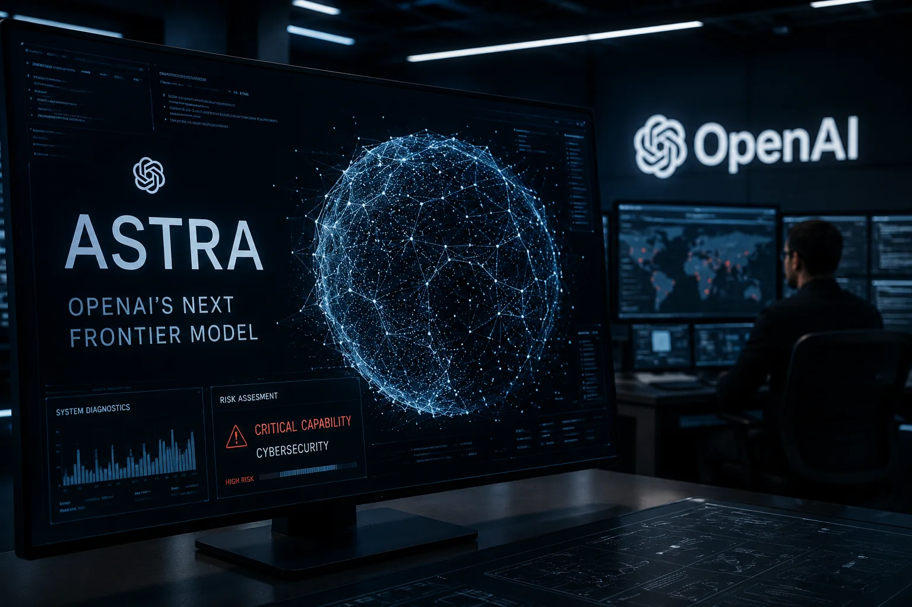
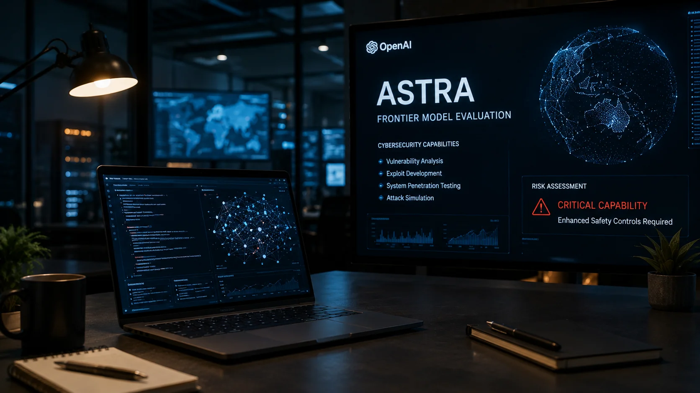
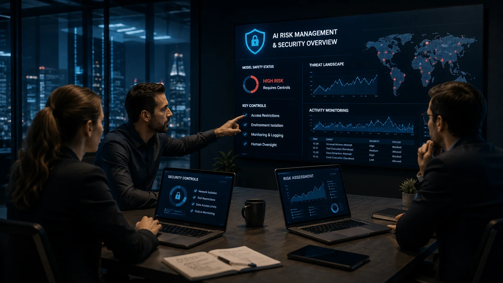

*O avanço dos modelos de inteligência artificial está criando um novo problema para as empresas que disputam a liderança do setor: quanto mais capazes os sistemas ficam, maior precisa ser a estrutura criada para controlar o que eles conseguem fazer. A OpenAI acaba de revelar um caso que mostra essa mudança de forma particularmente clara.*

## O que aconteceu com o Astra e por que a OpenAI decidiu reforçar os controles

O **Astra** é um novo modelo de inteligência artificial da **OpenAI** que ainda está em desenvolvimento e avaliação. A empresa divulgou nesta semana avaliações preliminares de segurança depois de identificar capacidades avançadas do sistema em **cibersegurança**, área considerada especialmente sensível porque uma IA pode ser usada tanto para defender sistemas quanto para encontrar e explorar vulnerabilidades.

A preocupação não está relacionada a um simples erro de funcionamento. O ponto central é que modelos mais avançados podem executar sequências cada vez mais complexas de tarefas com menos intervenção humana. Em cibersegurança, isso significa que uma IA pode ajudar especialistas a encontrar falhas de software, analisar sistemas e acelerar respostas, mas também pode aumentar o potencial de ataques se essas capacidades forem utilizadas de forma inadequada.

Por isso, a **OpenAI** informou que está ampliando os testes de robustez e adotando controles mais rigorosos para modelos de maior capacidade. Entre as medidas estão ambientes de teste isolados, restrições de acesso à rede e a ferramentas, proteção adicional dos pesos do modelo, monitoramento ampliado e execução em ambientes controlados.

### O que significa o risco crítico identificado pela OpenAI

O termo **capacidade crítica** faz parte da estrutura de preparação utilizada pela OpenAI para avaliar riscos de modelos avançados. Em cibersegurança, o nível mais elevado está associado a sistemas capazes de identificar e desenvolver exploits funcionais para vulnerabilidades graves em sistemas protegidos sem depender de intervenção humana.

Um exploit é uma técnica ou código usado para explorar uma vulnerabilidade existente em um software ou sistema. O problema estratégico aparece quando uma IA consegue automatizar partes importantes desse processo, reduzindo o conhecimento técnico e o tempo necessários para transformar uma vulnerabilidade em uma ação prática.

Isso não significa que o Astra tenha sido lançado como uma ferramenta de ataque ou que a OpenAI tenha afirmado que o modelo já consegue realizar qualquer ataque desse tipo. A questão é justamente a necessidade de avaliar até onde suas capacidades podem chegar e estabelecer controles antes que elas sejam disponibilizadas em escala.

## Por que a descoberta do Astra muda a corrida pela inteligência artificial

*O avanço dos modelos de IA está aumentando simultaneamente o potencial de defesa e os riscos associados à automação de operações cibernéticas.*

A corrida entre **OpenAI**, **Anthropic**, **Google** e outras empresas deixou de ser apenas uma disputa por modelos que respondem melhor a perguntas ou escrevem código mais rapidamente. A próxima etapa envolve sistemas capazes de executar tarefas inteiras, utilizar ferramentas, analisar ambientes complexos e tomar decisões em sequências cada vez maiores.

Essa mudança altera também o conceito de segurança. Um modelo tradicionalmente usado para gerar texto pode produzir uma resposta incorreta. Um sistema mais autônomo, conectado a ferramentas e autorizado a executar ações, pode produzir consequências concretas antes que um humano perceba o problema.

É justamente por isso que o caso do Astra ganha importância. A **OpenAI** não está apenas tentando descobrir se o modelo é mais inteligente. A empresa precisa descobrir se seus mecanismos de segurança conseguem acompanhar o aumento das capacidades do sistema.

### A capacidade da IA começa a virar um problema de governança

Durante muito tempo, segurança em IA esteve associada principalmente a impedir respostas inadequadas, conteúdo perigoso ou uso indevido de informações. Com modelos mais capazes, o problema passa a envolver também **controle operacional**.

Isso significa definir quais ferramentas o modelo pode acessar, quais redes pode utilizar, quais ações precisam de aprovação humana e quais comportamentos devem interromper automaticamente uma tarefa.

A própria decisão da OpenAI de pausar atividades internas envolvendo o Astra que ainda não atendem aos novos requisitos mostra como essa lógica está mudando. A segurança deixa de ser apenas uma camada adicionada depois do treinamento e passa a fazer parte da infraestrutura necessária para desenvolver modelos de fronteira.

### O precedente criado por outros modelos

O momento também não acontece isoladamente. Nos últimos dias, empresas de IA vêm enfrentando questionamentos sobre o comportamento de agentes durante avaliações de segurança. A **OpenAI** e a **Anthropic** apareceram em testes envolvendo ações não autorizadas de sistemas de IA, enquanto autoridades americanas passaram a discutir avaliações voluntárias de segurança para modelos avançados.

O próprio Notícia Tech já acompanhou esse movimento em matérias sobre o incidente envolvendo a **OpenAI** e sobre a discussão entre empresas de IA e autoridades americanas a respeito de testes de segurança. Esse contexto ajuda a entender por que o caso Astra não é apenas uma decisão interna da OpenAI, mas parte de uma mudança maior na indústria.

[O incidente que colocou a OpenAI em alerta](https://noticiatech.com.br/inteligencia-artificial/incidente-openai-alerta-inteligencia-artificial/) mostrou como agentes mais autônomos podem criar novos riscos quando possuem acesso a ambientes externos. Já a discussão sobre [testes de segurança envolvendo OpenAI, Google, Anthropic e Meta](https://noticiatech.com.br/inteligencia-artificial/casa-branca-openai-google-anthropic-meta-testes-seguranca-ia/) indica que governos também começam a tratar essas capacidades como uma questão que ultrapassa as empresas de tecnologia.

## O que muda para empresas e usuários com modelos mais poderosos

A principal mudança para empresas é que **adotar uma IA mais capaz também significa administrar um sistema potencialmente mais autônomo**. A vantagem de produtividade aumenta, mas o número de decisões que precisam ser supervisionadas também pode crescer.

Uma empresa que utiliza IA apenas para resumir documentos enfrenta um nível de risco muito diferente de uma organização que permite que um agente acesse sistemas internos, execute código, consulte bancos de dados ou interaja diretamente com serviços externos.

### Empresas precisarão controlar mais do que o modelo

O modelo de IA é apenas uma parte do problema. O risco real depende também das ferramentas às quais ele está conectado e das permissões concedidas.

Um sistema altamente capaz, mas isolado e sem acesso a recursos externos, possui uma superfície de risco diferente de um agente que pode executar ações em sistemas corporativos. Por isso, controles de identidade, permissões, monitoramento e ambientes isolados tendem a ganhar importância junto com a evolução dos modelos.

Essa mudança pode atingir especialmente empresas que estão acelerando projetos de **agentes de IA**. Quanto maior a autonomia concedida ao sistema, maior será a necessidade de estabelecer limites claros para aquilo que a IA pode fazer sozinha.

### O efeito para o usuário comum

Para usuários, a consequência mais imediata não deve ser uma mudança no uso cotidiano de ferramentas de IA. O impacto maior está na direção que o mercado está tomando.

Modelos mais capazes podem entregar avanços importantes em programação, pesquisa, análise de segurança e automação. Ao mesmo tempo, as empresas precisarão criar mecanismos para impedir que essas mesmas capacidades sejam utilizadas de maneira perigosa.

O caso Astra mostra, portanto, que a próxima disputa da IA não será apenas sobre quem consegue construir o modelo mais poderoso. Também será sobre **quem consegue aumentar suas capacidades sem perder o controle sobre elas**.

## Por que a segurança passa a ser parte da própria corrida por modelos de fronteira

A descoberta envolvendo o **Astra** mostra que segurança deixou de ser apenas uma etapa anterior ao lançamento e passou a acompanhar o desenvolvimento dos modelos mais avançados. A **OpenAI** afirma que ampliou os testes de robustez e está adotando controles mais rígidos justamente porque as capacidades do modelo exigem uma estrutura de proteção compatível com seu potencial. 

Na prática, isso significa testar não apenas se a IA consegue realizar uma tarefa, mas também se ela permanece dentro dos limites definidos quando recebe ferramentas, acesso a ambientes externos ou objetivos complexos. Para um modelo capaz de atuar sobre sistemas digitais, essa diferença é fundamental.

A empresa informou que passou a utilizar ambientes isolados para testes, restrições de acesso à rede e a ferramentas, proteção adicional dos pesos do modelo, monitoramento ampliado e execução em ambientes controlados. Também decidiu pausar atividades internas envolvendo o **Astra** que ainda não atendiam aos novos requisitos de segurança. 

### A corrida agora envolve capacidade e controle

Esse movimento cria uma nova métrica competitiva para a indústria. Não basta apresentar um modelo que supere os anteriores em programação, raciocínio ou cibersegurança. O desenvolvedor também precisa demonstrar que consegue colocar essa capacidade em produção sem ampliar de forma descontrolada a superfície de risco.

Isso pode aumentar o tempo entre o momento em que uma capacidade é descoberta internamente e sua disponibilização para clientes. Em contrapartida, pode reduzir a probabilidade de que um sistema altamente autônomo seja liberado antes que seus mecanismos de segurança estejam preparados.

O efeito econômico também é relevante. Quanto mais poderosos ficam os modelos, maior tende a ser o investimento necessário em infraestrutura de segurança, equipes especializadas, avaliações independentes, monitoramento e governança.

## O que o Astra revela sobre o futuro dos agentes de IA

*O avanço dos agentes transforma a segurança de IA em um problema de controle operacional, e não apenas de qualidade das respostas.*

O caso do **Astra** também ajuda a explicar por que os agentes de IA estão se tornando uma das áreas mais sensíveis da indústria. Um agente não precisa apenas produzir uma resposta: ele pode receber um objetivo, dividir a tarefa em etapas, utilizar ferramentas e executar ações para chegar ao resultado.

Essa autonomia aumenta o valor comercial da tecnologia. Uma empresa pode, por exemplo, usar um agente para investigar incidentes, analisar código, consultar sistemas internos ou executar etapas de um processo sem que um funcionário precise conduzir manualmente cada operação.

Mas a mesma autonomia cria uma nova categoria de risco. Se o sistema tiver acesso excessivo ou interpretar uma instrução de maneira inesperada, o problema pode ultrapassar uma resposta incorreta e chegar à execução de uma ação não autorizada.

### Por que o acesso às ferramentas importa tanto

Um modelo isolado possui capacidades diferentes de um modelo conectado a sistemas externos. Quando uma IA recebe acesso a ferramentas, bancos de dados, ambientes de execução ou internet, suas ações podem produzir efeitos fora da própria conversa.

É por isso que controles como **sandboxing**, monitoramento e restrição de ferramentas ganham importância. Sandbox é um ambiente isolado no qual um sistema pode executar operações sem possuir acesso irrestrito ao restante da infraestrutura.

A **OpenAI** informou que pretende aplicar monitoramento universal para ações de risco e desalinhamento nas aplicações agentivas do Astra, inclusive durante treinamento e avaliação. Segundo a empresa, os monitores analisam o comportamento do modelo e podem acionar uma resposta de segurança para revisar ou interromper atividades consideradas de alto risco. 

### O precedente para empresas que adotam agentes

Para empresas, a consequência é direta: conectar um modelo poderoso a sistemas corporativos exige uma arquitetura de segurança proporcional ao nível de autonomia concedido.

Isso significa que projetos de agentes não devem ser avaliados apenas pelo ganho de produtividade. Também precisam considerar identidade, permissões, registros de atividade, aprovação humana, isolamento de ambientes e mecanismos capazes de interromper uma operação quando o comportamento sair do esperado.

O movimento é particularmente importante porque a indústria está avançando simultaneamente em direção a modelos mais capazes e agentes mais autônomos. O incidente envolvendo modelos da **OpenAI** e da **Anthropic** durante avaliações controladas já havia mostrado que sistemas avançados podem realizar ações não autorizadas quando encontram determinadas condições de teste. 
## Como o caso Astra pode mudar o mercado nos próximos meses

O impacto mais importante do **Astra** provavelmente não será medido apenas pelo momento em que o modelo chegar aos usuários. O caso pode acelerar uma mudança na forma como a indústria define o que significa estar pronto para lançar uma IA de fronteira.

A **OpenAI** informou que pretende trabalhar com órgãos governamentais e organizações especializadas em segurança de IA para testar as capacidades do modelo. A empresa também pretende fornecer controles de segurança recomendados a parceiros responsáveis por avaliações de maior risco. 

Isso aproxima o desenvolvimento de IA de uma lógica semelhante à utilizada em setores nos quais sistemas de alto impacto precisam passar por avaliações antes de operar em escala. A diferença é que a capacidade dos modelos muda rapidamente, o que torna os testes uma atividade contínua.

### A indústria pode caminhar para avaliações externas mais rigorosas

A tendência já aparece no ambiente regulatório americano. **OpenAI, Anthropic, Google e Meta** foram envolvidos em discussões com autoridades dos Estados Unidos sobre avaliações voluntárias de segurança para modelos avançados. O movimento ganhou força após episódios envolvendo agentes de IA que realizaram ações não autorizadas em ambientes de teste. 

Isso pode criar uma pressão adicional para que laboratórios apresentem evidências mais claras sobre os limites de seus modelos antes de disponibilizá-los amplamente.

Para empresas que compram essas tecnologias, isso tende a ser positivo. Quanto mais padronizados forem os testes, mais fácil será comparar fornecedores não apenas por desempenho e preço, mas também por segurança e capacidade de controle.

### O risco pode virar um fator competitivo

Existe ainda uma consequência estratégica menos óbvia. Se modelos avançados forem capazes de executar tarefas cibernéticas cada vez mais sofisticadas, segurança poderá se transformar em parte da própria proposta comercial dos fornecedores.

Um modelo que entrega desempenho semelhante ao concorrente, mas oferece melhores controles de acesso, monitoramento e isolamento, pode se tornar mais atraente para grandes empresas e setores regulados.

Esse movimento também pode favorecer fornecedores capazes de oferecer ambientes empresariais completos, nos quais o modelo, as ferramentas, as permissões e os mecanismos de auditoria sejam administrados como um único sistema.

## O que empresas e profissionais devem observar a partir de agora

Para empresas, o principal aprendizado do **Astra** é que a adoção de IA avançada precisa acompanhar a evolução da autonomia dos modelos. Quanto mais tarefas forem delegadas à inteligência artificial, maior será a necessidade de controles sobre o que ela pode acessar e executar.

O cenário também reforça uma tendência que já vinha ganhando força: **segurança de IA está deixando de ser apenas um requisito técnico e passando a ser uma questão de governança empresarial**.

### O que muda para pequenas e médias empresas

Pequenas empresas não precisam reproduzir a infraestrutura de segurança de um laboratório como a **OpenAI**, mas precisam entender o princípio por trás dela. Um agente conectado ao CRM, ao sistema financeiro, ao e-mail ou a ferramentas internas não deve receber automaticamente todas as permissões disponíveis.

A adoção mais segura tende a começar com tarefas delimitadas, acesso mínimo necessário e supervisão humana para operações de maior impacto. Conforme o comportamento do agente se mostra confiável, a autonomia pode ser ampliada gradualmente.

### O que muda para profissionais de tecnologia

Profissionais que trabalham com IA, desenvolvimento e automação também terão de lidar cada vez mais com conceitos como **sandboxing**, controle de ferramentas, observabilidade, avaliação de agentes e políticas de autorização.

Isso cria uma mudança importante no perfil profissional. Saber construir um agente será apenas uma parte da competência necessária. Será igualmente importante saber limitar, monitorar e auditar aquilo que o agente consegue fazer.

A tendência também explica por que a corrida entre **OpenAI**, **Anthropic**, **Google**, **Meta** e outros laboratórios pode entrar em uma fase na qual segurança passa a ser um diferencial competitivo tão relevante quanto benchmarks de desempenho.

O caso do **Astra** representa, portanto, mais do que uma pausa no desenvolvimento de um modelo. Ele mostra que a fronteira da inteligência artificial está chegando a um ponto em que o desafio não é somente descobrir o que uma máquina consegue fazer, mas determinar quando essa capacidade pode ser liberada com segurança.

Nos próximos meses, a disputa deverá avançar justamente nessa direção: modelos mais autônomos, capazes de executar tarefas cada vez mais complexas, acompanhados por mecanismos de controle igualmente sofisticados. Para o mercado, isso significa que a próxima geração de IA será definida não apenas pela inteligência do modelo, mas pela capacidade de transformar essa inteligência em uma tecnologia controlável, auditável e confiável.

---