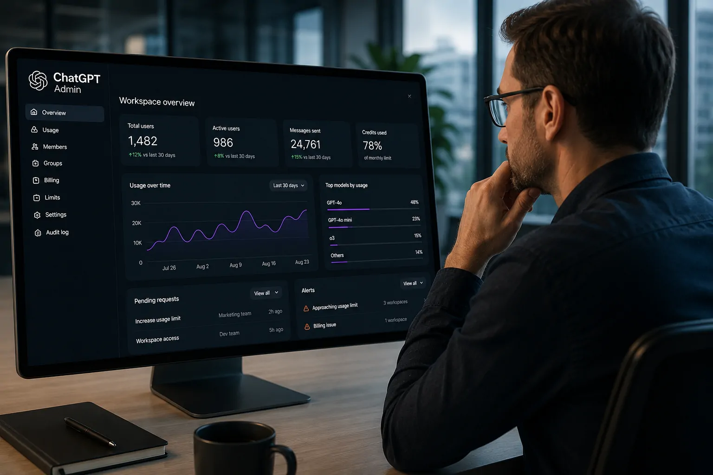
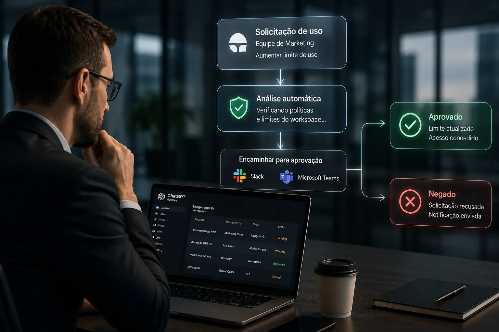
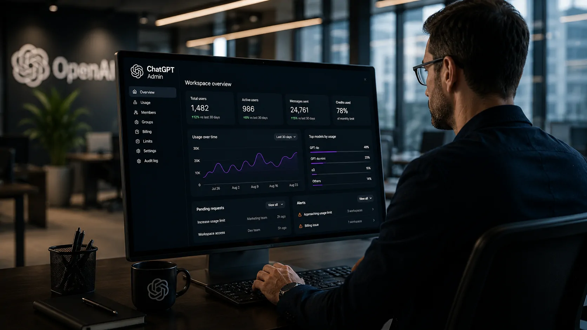

*O novo Admin plugin conecta análise, permissões e ações administrativas ao ChatGPT Work e ao Codex, sinalizando uma mudança importante: o ChatGPT começa a ocupar também uma camada operacional da gestão de ambientes corporativos de IA.*

## OpenAI coloca a administração do workspace dentro do ChatGPT

A **OpenAI** lançou nesta terça-feira, 25 de agosto, o **Admin plugin para ChatGPT Work e Codex**. A novidade permite que administradores consultem informações do ambiente de trabalho, analisem utilização, alterem configurações e executem ações administrativas autorizadas diretamente em uma conversa.

A mudança é relevante porque reduz a necessidade de alternar entre diferentes telas de administração, relatórios e ferramentas para entender um problema e agir sobre ele. O administrador pode fazer uma pergunta, investigar os dados, solicitar uma alteração e verificar o resultado no mesmo fluxo.

O movimento também amplia o papel do **ChatGPT Work** dentro das empresas. A plataforma deixa de ser apenas um ambiente para executar tarefas com IA e passa a incorporar recursos que ajudam a administrar o próprio ambiente em que esses sistemas são utilizados.

Essa é a principal mudança trazida pelo lançamento: **a conversa com a IA começa a funcionar também como uma interface para operações administrativas corporativas**.

## O que o Admin plugin permite administrar

*O Admin plugin reúne informações de uso, acesso e administração em uma única interface conversacional.*

### Uso e adoção

O administrador pode consultar a atividade e o consumo de créditos de **ChatGPT Work** e **Codex**. A ferramenta também pode ajudar a identificar membros ou grupos que estejam próximos de limites de utilização.

Isso muda a forma de acompanhar a adoção porque o gestor não precisa necessariamente começar por um painel estático. A informação pode ser solicitada dentro de uma conversa e analisada de acordo com o contexto da situação.

### Membros, grupos e permissões

O plugin também permite executar tarefas relacionadas a membros e grupos, incluindo processos de entrada e saída de usuários e alterações na estrutura do workspace.

Outro ponto importante é o gerenciamento de acesso. O administrador pode revisar permissões efetivas, investigar problemas de acesso e controlar a disponibilidade de determinados recursos ou modelos de acordo com funções e grupos.

Na prática, a **OpenAI** está aproximando três atividades que normalmente ficam separadas: **entender o que está acontecendo, decidir o que precisa ser feito e executar a mudança**.

## A novidade não elimina os controles administrativos

O aspecto mais importante para empresas não está apenas no que o plugin consegue fazer, mas também no que ele não pode fazer.

### Permissões continuam valendo

Segundo a **OpenAI**, o Admin plugin funciona dentro das funções e permissões que cada administrador já possui. A instalação da ferramenta não concede automaticamente acesso mais amplo ao ambiente.

Cada solicitação é associada a uma ação administrativa compatível com as permissões existentes. Alterações de maior impacto também podem exigir revisão antes de serem aplicadas.

Essa arquitetura é importante porque uma interface conversacional pode tornar uma operação muito mais simples, mas simplificar a execução não significa eliminar as regras que controlam quem pode executar determinada ação.

### Ações ficam registradas no próprio fluxo

O administrador também consegue verificar o que solicitou, se a ação foi concluída e o que efetivamente mudou.

Essa confirmação reduz um dos problemas de processos administrativos distribuídos entre diferentes ferramentas: a dificuldade de saber exatamente qual alteração foi feita depois que uma solicitação é executada.

Para empresas que ampliam rapidamente o uso de IA, esse controle pode se tornar tão importante quanto a velocidade de execução.

## OpenAI quer automatizar parte da rotina dos administradores

*O plugin também foi projetado para automatizar verificações e solicitações administrativas recorrentes.*

O **Admin plugin** não foi criado apenas para responder perguntas sobre o workspace. A **OpenAI** também prevê seu uso em automações administrativas recorrentes.

Entre os exemplos apresentados está o encaminhamento de solicitações de utilização para **Slack** ou **Microsoft Teams**, onde revisores autorizados podem aprovar ou negar pedidos dentro das ferramentas que já utilizam.

Outro fluxo permite monitorar solicitações de acesso a recursos e conceder acesso automaticamente quando determinados critérios são atendidos, enquanto exceções são encaminhadas para análise humana.

### Menos trabalho manual, sem retirar a decisão humana

A proposta é especialmente relevante para equipes responsáveis por administrar ambientes de IA em crescimento.

Em vez de verificar manualmente diferentes painéis, identificar uma solicitação, consultar políticas e depois executar uma mudança, parte desse fluxo pode ser conduzida pela própria interface conversacional.

A **OpenAI**, porém, mantém uma distinção importante: **automação não significa autonomia irrestrita**. Os administradores continuam responsáveis pelas decisões e as ações seguem permissões, políticas e requisitos de aprovação.

## O lançamento amplia a estratégia do ChatGPT para empresas

O novo recurso precisa ser observado dentro de uma mudança maior na estratégia da **OpenAI**.

Em julho, a empresa apresentou o **ChatGPT Work** como um agente capaz de trabalhar com aplicativos e arquivos, executar tarefas complexas e permanecer trabalhando em projetos durante períodos mais longos. O Codex também deixou de ser apenas uma ferramenta voltada a programação e passou a ocupar um espaço mais amplo dentro dos fluxos profissionais.

Essa evolução ocorre ao mesmo tempo em que o **ChatGPT** vem sendo integrado a ferramentas corporativas. Um exemplo é a conexão com o Google Drive, que levou arquivos e informações empresariais para dentro dos fluxos de trabalho da IA. **[ChatGPT ganha integração com Google Drive e amplia uso de IA nas empresas](https://noticiatech.com.br/inteligencia-artificial/chatgpt-google-drive-ia-empresas/)**.

O Admin plugin adiciona outra camada a essa estratégia: **a própria administração do ambiente de IA passa a fazer parte do fluxo conversacional**.

Essa evolução também ajuda a explicar por que a **OpenAI** vem ampliando o conceito de plugins. Em vez de funcionarem apenas como extensões que acrescentam uma capacidade específica, eles podem reunir recursos necessários para executar fluxos de trabalho completos dentro do ChatGPT e do Codex.

Nesse contexto, o lançamento não representa simplesmente uma nova ferramenta para administradores. Ele mostra uma tentativa de transformar a interface de conversa em uma porta de entrada para diferentes operações corporativas.

## A gestão de IA pode ficar cada vez mais conversacional

*O Admin plugin aponta para uma gestão em que consultas e ações administrativas podem ocorrer no mesmo fluxo de trabalho.*

A consequência mais interessante do lançamento ainda não está em uma funcionalidade específica. Está na mudança de interface.

Durante anos, administrar software corporativo significou navegar por painéis, menus, relatórios e sistemas especializados. O **Admin plugin** propõe uma alternativa: o administrador descreve o que precisa entender ou fazer e o sistema conecta a solicitação às ferramentas administrativas disponíveis.

Isso pode reduzir o atrito de operações rotineiras, especialmente quando uma empresa possui muitos usuários, grupos, permissões e limites diferentes.

Mas a experiência conversacional também aumenta a importância de governança. Quanto mais ações puderem ser iniciadas pela linguagem natural, mais importante será definir **quem pode pedir o quê, quais ações precisam de aprovação e como as alterações são auditadas**.

Esse ponto ganha ainda mais importância à medida que agentes de IA passam a executar ações em nome das empresas. O Notícia Tech já analisou como essa autonomia cria uma nova questão de responsabilidade para organizações que utilizam agentes capazes de agir diretamente em sistemas corporativos. **[Agentes de IA criam novo problema para empresas: quem responde pelas ações autônomas?](https://noticiatech.com.br/inteligencia-artificial/agentes-ia-responsabilidade-empresas-acoes-autonomas/)**.

O movimento da **OpenAI**, portanto, não significa que o ChatGPT esteja substituindo os sistemas administrativos tradicionais. O que o lançamento mostra é algo mais específico: a empresa está tentando colocar o ChatGPT entre o usuário e uma parte crescente das operações corporativas.

Para as empresas, o próximo ponto a observar será justamente até onde essa camada administrativa pode avançar. Se a **OpenAI** continuar conectando conversa, contexto, permissões e execução, o ChatGPT poderá deixar de ser apenas o lugar onde funcionários usam IA e se tornar também uma das interfaces pelas quais as organizações **operam e governam seus ambientes de IA**.

---