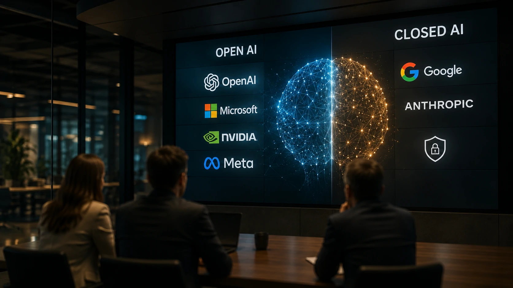
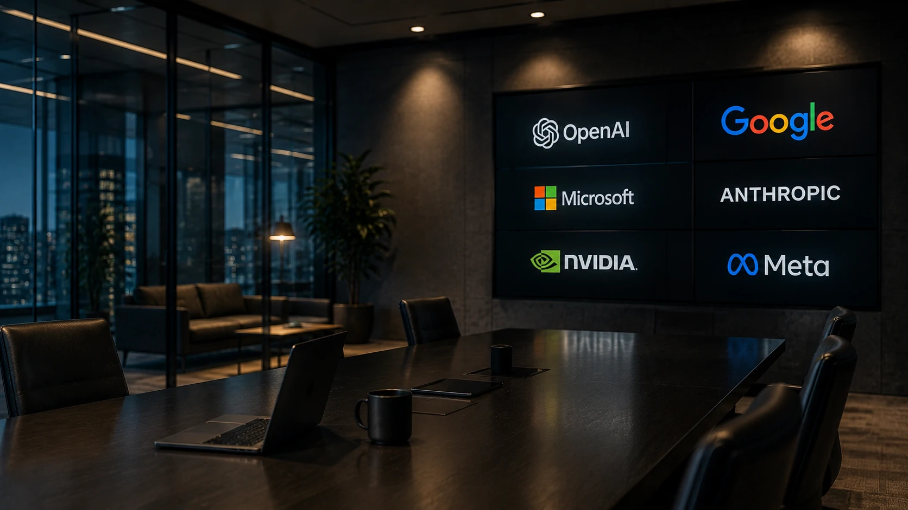

*O mercado de inteligência artificial entrou em uma nova fase. A discussão já não gira apenas em torno de qual modelo responde melhor às perguntas dos usuários. Agora, a disputa envolve quem controlará a infraestrutura tecnológica que sustentará a próxima geração de aplicações empresariais de IA.*

## A disputa entre IA aberta e IA fechada ganhou um novo protagonista

Empresas de tecnologia estão mudando o foco da competição. Em vez de discutir apenas desempenho dos modelos, o debate passou a envolver o grau de abertura da inteligência artificial e o impacto dessa decisão para governos, empresas e desenvolvedores.

*Modelos open-weight ampliam a competição entre fornecedores e criam novas possibilidades para empresas.*

Nesse contexto, **OpenAI**, **Microsoft**, **Nvidia** e **Meta** passaram a defender publicamente uma regulamentação que permita maior desenvolvimento de modelos **open-weight**, considerados mais flexíveis para pesquisadores e organizações.

### O que mudou na estratégia da OpenAI?

A mudança chama atenção porque a **OpenAI** sempre foi identificada principalmente pelo desenvolvimento de modelos proprietários.

Agora, o discurso da empresa demonstra preocupação com possíveis restrições regulatórias que possam limitar a inovação em modelos mais abertos e reduzir a competitividade do setor.

Esse movimento também responde ao crescimento acelerado do ecossistema de modelos abertos, impulsionado por empresas como **Meta** e **Mistral AI**, além de diversos projetos independentes.

### Por que essa mudança é importante?

A discussão deixou de ser apenas tecnológica.

Hoje ela envolve competitividade internacional, soberania digital, infraestrutura de IA e capacidade de inovação das empresas nos próximos anos.

Esse cenário reforça uma tendência que o mercado já acompanha desde a popularização dos **agentes de IA** e da computação corporativa baseada em modelos generativos.

Para compreender como essa transformação afeta a arquitetura das empresas, vale conhecer também o guia sobre **arquitetura de IA empresarial**, publicado pelo Notícia Tech:

[Arquitetura de IA Empresarial: guia completo para entender RAG, MCP, agentes de IA, automação e copilotos](https://noticiatech.com.br/inteligencia-artificial/arquitetura-ia-empresarial-rag-mcp-agentes-automacao-copilotos/)

## Modelos open-weight podem acelerar a adoção corporativa da IA

Modelos open-weight oferecem maior liberdade para implantação em ambientes corporativos, permitindo personalização, controle de infraestrutura e integração com sistemas internos.

Essa característica desperta interesse principalmente em setores que lidam com dados sensíveis, como bancos, saúde, indústria e governo.

*Empresas buscam maior autonomia para implantar inteligência artificial em ambientes próprios.*

### Mais autonomia para empresas

Ao utilizar modelos open-weight, organizações podem reduzir a dependência de serviços externos, adaptar modelos às próprias bases de conhecimento e implementar políticas específicas de segurança.

Esse movimento complementa a evolução dos ambientes baseados em **RAG**, **MCP** e múltiplos agentes inteligentes, tendência já explorada pelo Notícia Tech em conteúdos sobre infraestrutura corporativa de IA.

Outro exemplo dessa transformação pode ser visto no crescimento do **ChatGPT Work**, que evidencia como a inteligência artificial está substituindo plataformas tradicionais em diversas operações empresariais.

[OpenAI muda o mercado com ChatGPT Work: por que empresas estão abandonando softwares tradicionais](https://noticiatech.com.br/inteligencia-artificial/chatgpt-work-empresas-abandonam-softwares-tradicionais/)

### A concorrência tende a aumentar

Quanto maior o número de modelos disponíveis, maior será a competição entre fornecedores.

Isso pode acelerar a inovação, reduzir custos e ampliar o acesso de pequenas e médias empresas às tecnologias de inteligência artificial.

Ao mesmo tempo, cresce a necessidade de governança, segurança e critérios claros para selecionar quais modelos serão utilizados em ambientes críticos.

## Google e Anthropic seguem um caminho diferente

Enquanto parte da indústria defende modelos mais abertos, **Google** e **Anthropic** continuam adotando uma postura mais cautelosa. As duas empresas priorizam modelos proprietários e controles mais rígidos para reduzir riscos relacionados à segurança, ao uso indevido da IA e à proteção da propriedade intelectual.

*As estratégias divergentes mostram que a disputa pela liderança da IA vai muito além da qualidade dos modelos.*

### Segurança versus inovação

Os defensores da IA aberta argumentam que modelos open-weight aceleram a pesquisa, reduzem barreiras para startups e ampliam a concorrência entre fornecedores.

Já empresas favoráveis aos modelos fechados defendem que um controle maior reduz riscos de uso malicioso, fortalece mecanismos de segurança e protege investimentos bilionários em pesquisa e desenvolvimento.

Na prática, essas duas abordagens deverão coexistir por muitos anos. Cada organização escolherá o modelo mais adequado conforme suas necessidades de governança, privacidade, infraestrutura e conformidade regulatória.

### O impacto para o mercado corporativo

Para as empresas, o principal efeito dessa nova disputa é o aumento das opções disponíveis.

Organizações que precisam de maior controle sobre seus dados poderão implantar modelos open-weight em ambientes próprios, personalizando a IA conforme seus processos internos.

Por outro lado, empresas que priorizam velocidade de implantação, atualizações automáticas e suporte especializado provavelmente continuarão utilizando plataformas proprietárias oferecidas pelos grandes provedores de inteligência artificial.

Esse cenário cria um ambiente de competição mais intenso, favorecendo inovação contínua, redução de custos e maior diversidade de soluções para empresas de todos os portes.

## A nova disputa redefine o futuro da inteligência artificial

A discussão entre modelos abertos e fechados deixou de ser apenas um tema técnico e passou a influenciar investimentos, regulamentações, estratégias empresariais e a própria dinâmica competitiva do setor de tecnologia.

Mais importante do que escolher entre **ChatGPT**, **Gemini**, **Claude** ou qualquer outro modelo será definir qual arquitetura de IA oferece maior flexibilidade, segurança, governança e retorno para cada organização.

Nos próximos anos, a vantagem competitiva não estará apenas no modelo utilizado, mas na capacidade das empresas de integrar inteligência artificial aos seus processos, combinar diferentes modelos quando necessário e construir uma infraestrutura preparada para evoluir continuamente.

Nesse contexto, a mudança de posicionamento da **OpenAI**, acompanhada por **Microsoft**, **Nvidia** e **Meta**, enquanto **Google** e **Anthropic** seguem uma estratégia mais conservadora, representa uma das transformações mais importantes da atual fase da inteligência artificial.

A corrida deixou de ser apenas por respostas mais inteligentes. Agora, o verdadeiro desafio é definir quem construirá a infraestrutura tecnológica que sustentará a próxima geração de aplicações corporativas baseadas em IA.

---