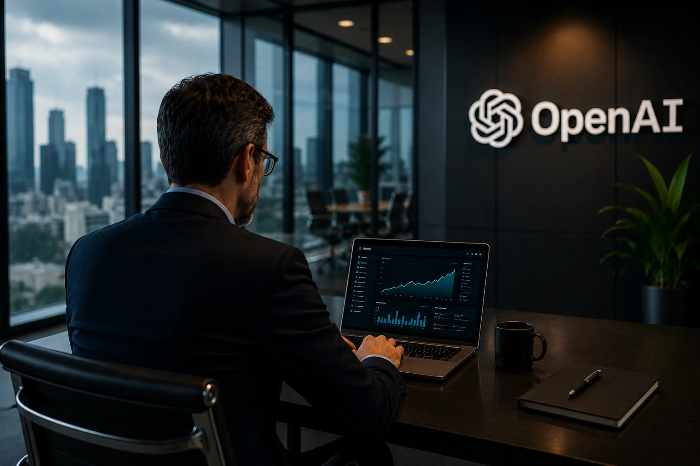
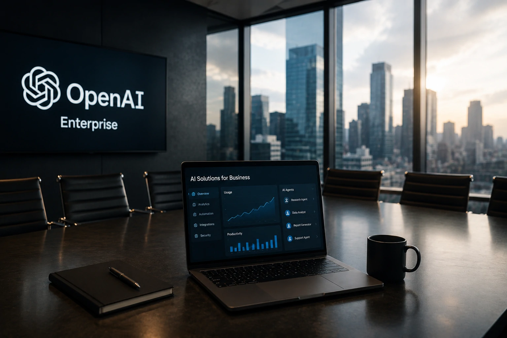

*A corrida pela inteligência artificial deixa de ser apenas uma disputa por usuários e passa a ser uma competição por contratos corporativos. A nova estratégia da **OpenAI** mostra que o próximo capítulo do mercado será decidido dentro das empresas, onde estão as maiores receitas e as oportunidades de longo prazo.*

## A OpenAI muda de foco para fortalecer sua posição antes do IPO

*Empresas tornam-se prioridade na estratégia comercial da OpenAI.*

Nos últimos meses, a **OpenAI** acelerou o lançamento de soluções voltadas ao ambiente corporativo. O movimento vai além do lançamento de novos produtos e indica uma mudança estratégica na forma como a companhia pretende crescer nos próximos anos.

Embora o **ChatGPT** continue disponível para milhões de usuários, a empresa passou a direcionar investimentos para planos empresariais, agentes inteligentes e integrações capazes de automatizar processos de trabalho.

### A prioridade deixa de ser apenas quantidade de usuários

Durante a primeira fase da IA generativa, conquistar usuários rapidamente era fundamental para consolidar liderança.

Agora, a lógica muda.

O mercado começa a valorizar empresas capazes de transformar popularidade em receita recorrente, especialmente por meio de contratos corporativos de longo prazo.

### Receita recorrente ganha importância

Clientes empresariais costumam contratar centenas ou milhares de licenças simultaneamente.

Além disso, demandam infraestrutura dedicada, suporte especializado, segurança, governança e integração com sistemas internos.

Esse modelo gera maior previsibilidade financeira, característica valorizada por investidores em uma eventual abertura de capital.

## A disputa pela IA corporativa entra em uma nova fase

*O segmento Enterprise passa a concentrar os maiores investimentos em inteligência artificial.*

A mudança da **OpenAI** também altera a dinâmica competitiva do setor.

Em vez de competir apenas pela melhor conversa com o usuário, as empresas agora disputam quem consegue entregar maior produtividade para organizações inteiras.

Nesse cenário, agentes inteligentes, automação de processos e integração entre aplicações tornam-se diferenciais muito mais relevantes do que apenas responder perguntas.

### Agentes de IA passam a representar vantagem competitiva

Ferramentas capazes de acessar documentos, criar apresentações, gerar planilhas, consultar sistemas internos e executar tarefas completas representam uma evolução importante da IA generativa.

Essa transformação aproxima a inteligência artificial do conceito de funcionário digital, capaz de apoiar diferentes áreas da empresa.

Não por acaso, o Notícia Tech já analisou como essa evolução marca uma nova etapa para o mercado em **ChatGPT Work e a era dos agentes de IA**, mostrando que o valor da IA está migrando da conversa para a execução.

https://noticiatech.com.br/inteligencia-artificial/chatgpt-work-era-agentes-ia-produtividade-corporativa/

### A competição deixa de ser tecnológica

Os modelos de linguagem continuam importantes.

Entretanto, o diferencial passa a estar na capacidade de integrar esses modelos ao cotidiano das empresas, reduzindo custos operacionais e aumentando produtividade.

Isso favorece empresas que conseguem construir ecossistemas completos, e não apenas modelos mais inteligentes.

## O impacto para empresas vai além da OpenAI

*O foco em soluções corporativas redefine a próxima etapa da competição entre as grandes empresas de IA.*

Para gestores e empresas, essa mudança representa mais do que uma alteração na estratégia comercial da **OpenAI**.

Ela sinaliza que o mercado de inteligência artificial está amadurecendo rapidamente.

Em vez de ferramentas isoladas, o objetivo passa a ser criar plataformas completas capazes de apoiar praticamente todas as atividades do ambiente corporativo.

### Governança e segurança tornam-se diferenciais

À medida que mais empresas utilizam IA em processos críticos, cresce também a preocupação com privacidade, auditoria e conformidade regulatória.

Não basta que um modelo seja inteligente.

Ele precisa operar dentro das políticas da empresa, registrar decisões e proteger informações estratégicas.

Essa necessidade explica por que temas como governança passaram a ganhar tanta importância dentro da IA corporativa.

Quem deseja compreender essa evolução pode aprofundar o tema no artigo do Notícia Tech sobre Governança de IA.

https://noticiatech.com.br/inteligencia-artificial/o-que-e-ai-governance-governanca-ia-empresas/

### O usuário gratuito continua importante

Apesar da maior atenção ao segmento Enterprise, o usuário gratuito continua desempenhando papel estratégico.

É por meio dele que a empresa amplia reconhecimento de marca, coleta feedback e apresenta novos recursos ao mercado.

No entanto, a tendência é que as maiores inovações cheguem primeiro aos planos pagos e, principalmente, às soluções corporativas.

Esse comportamento já é observado em diversos serviços de software empresarial e tende a se repetir na inteligência artificial.

## O que esperar da corrida pela inteligência artificial nos próximos anos

O reposicionamento da **OpenAI** dificilmente será um movimento isolado.

Empresas como **Google**, **Anthropic**, **Microsoft**, **Amazon** e **Meta** também disputam contratos corporativos e devem ampliar seus investimentos em agentes inteligentes, automação e plataformas empresariais.

Essa competição pode acelerar o desenvolvimento de soluções cada vez mais integradas aos processos de negócios.

### A disputa será por produtividade

Nos próximos anos, a vantagem competitiva não estará apenas no melhor modelo de linguagem.

Ela dependerá da capacidade de transformar IA em resultados concretos para empresas, reduzindo custos, aumentando eficiência e automatizando atividades de alto valor.

Organizações que conseguirem incorporar essas tecnologias mais rapidamente poderão ganhar produtividade significativa frente aos concorrentes.

### Um novo ciclo para o mercado de IA

A possível abertura de capital da **OpenAI** aumenta a pressão por crescimento sustentável e receitas previsíveis.

Isso reforça a importância do mercado Enterprise e indica que a inteligência artificial entra em uma fase mais madura, na qual o sucesso será medido menos pelo número de usuários e mais pela capacidade de gerar valor para empresas.

Mais do que uma mudança de estratégia comercial, esse movimento mostra que a próxima grande disputa da IA acontecerá dentro das organizações. As empresas que entenderem essa transformação desde agora estarão mais preparadas para aproveitar a nova geração de plataformas inteligentes, agentes autônomos e soluções corporativas que deverão definir o mercado nos próximos anos.

---