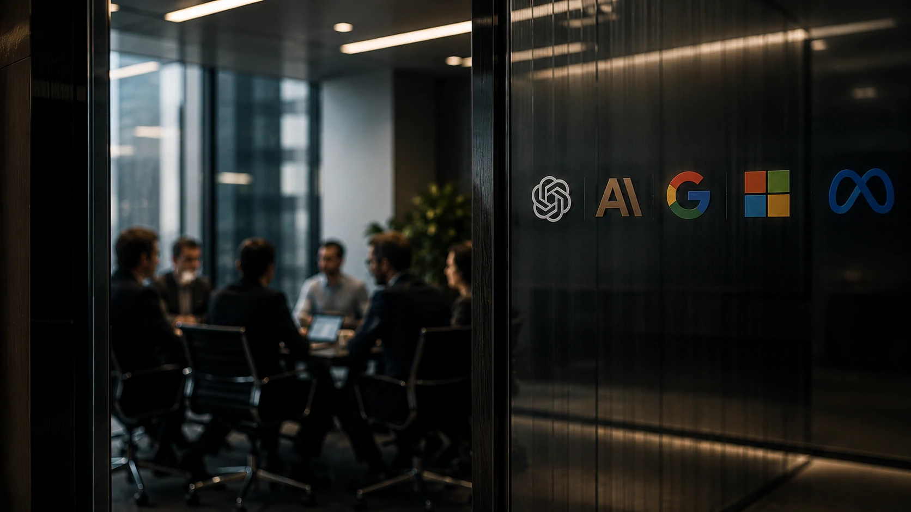
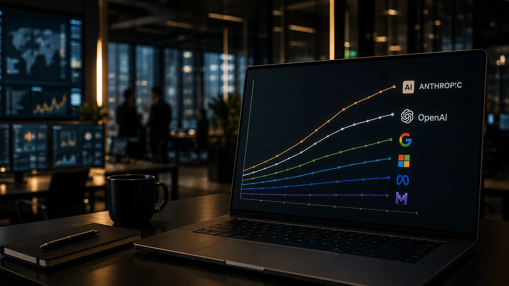
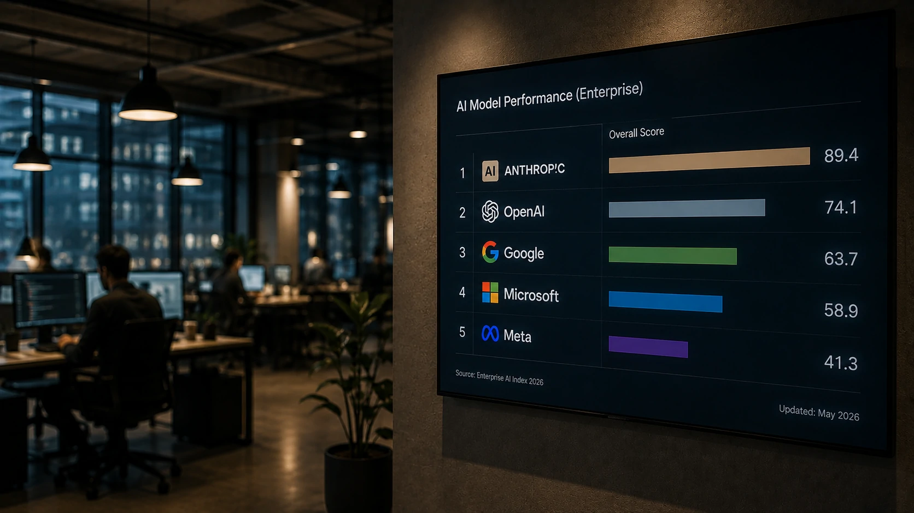

*Depois de quase três anos de domínio da **OpenAI**, os sinais do mercado começam a indicar uma mudança importante. A ascensão da **Anthropic** entre empresas e desenvolvedores alimenta uma pergunta que até pouco tempo parecia improvável: a liderança da inteligência artificial está mudando de mãos? Mais do que uma disputa tecnológica, trata-se de uma batalha que pode redefinir investimentos bilionários, estratégias corporativas e o futuro da IA generativa.*

## A disputa pela liderança da IA deixou de ser apenas uma questão de popularidade

*Empresas passam a avaliar diferentes plataformas de IA conforme custo, desempenho e confiabilidade.*

A liderança da **OpenAI** sempre foi sustentada pela enorme popularidade do **ChatGPT**, responsável por acelerar a adoção da inteligência artificial em escala global.

Nos últimos meses, porém, o cenário começou a mudar. A **Anthropic** ampliou sua presença no mercado corporativo e passou a conquistar empresas que procuram modelos mais previsíveis para aplicações críticas.

Essa mudança não significa que a OpenAI deixou de ser relevante. O que mudou foi o critério utilizado pelo mercado para medir liderança: além do número de usuários, investidores e empresas passaram a observar receita recorrente, adoção empresarial e capacidade de retenção de clientes.

### O mercado corporativo tornou-se o principal campo de batalha

Grandes contratos empresariais passaram a valer mais do que milhões de usuários gratuitos.

Empresas que integram IA em seus produtos buscam estabilidade, segurança e menor risco operacional, fatores que favoreceram o crescimento da Anthropic.

### A popularidade já não garante vantagem permanente

A OpenAI continua sendo a marca mais conhecida do setor.

Entretanto, a competição deixou de acontecer apenas na percepção do consumidor e passou a ocorrer dentro das empresas, onde contratos multimilionários definem quem liderará a próxima fase da inteligência artificial.

Como mostramos anteriormente na análise sobre o **[ChatGPT Work e a transformação do software corporativo](https://noticiatech.com.br/inteligencia-artificial/chatgpt-work-empresas-abandonam-softwares-tradicionais/)**, o mercado empresarial tornou-se o principal objetivo das grandes desenvolvedoras de IA.

## O avanço da Anthropic mostra que a corrida da IA entrou em uma nova fase

*O foco das empresas deixa de ser apenas desempenho e passa a incluir segurança, governança e produtividade.*

A resposta curta é clara: a **Anthropic** está deixando de ser apenas uma alternativa ao **ChatGPT** para se tornar uma concorrente direta na disputa pelos clientes mais valiosos do mercado.

Enquanto a **OpenAI** continua acelerando o desenvolvimento de novos produtos, a Anthropic concentrou esforços em conquistar organizações que utilizam inteligência artificial em operações críticas, como atendimento, desenvolvimento de software, análise de documentos e automação de processos.

Essa estratégia vem alterando o equilíbrio competitivo do setor.

### A preferência das empresas mudou

O mercado corporativo avalia fatores diferentes daqueles observados pelo consumidor comum.

Além da qualidade das respostas, empresas analisam:

- confiabilidade do modelo;
- segurança das informações;
- facilidade de integração;
- custo operacional;
- previsibilidade dos resultados.

Foi justamente nesse ambiente que os modelos **Claude** passaram a ganhar espaço.

### A disputa vai além de OpenAI e Anthropic

Embora os holofotes estejam voltados para essas duas empresas, a corrida permanece extremamente competitiva.

**Google**, **Microsoft**, **Meta**, **Mistral AI**, **xAI** e outras organizações continuam investindo bilhões para conquistar participação em um mercado que cresce rapidamente.

Essa competição beneficia empresas clientes, que passam a contar com modelos cada vez mais especializados para diferentes necessidades.

Quem deseja entender como essas arquiteturas vêm evoluindo pode conferir também o guia do Notícia Tech sobre **[Arquitetura de IA empresarial com MCP, RAG e agentes](https://noticiatech.com.br/inteligencia-artificial/arquitetura-ia-empresarial-mcp-rag-apis-agentes-workflows-copilotos/)**.

## O que essa disputa significa para empresas e para o futuro da inteligência artificial

*Empresas passam a escolher plataformas de IA considerando estratégia de longo prazo e não apenas popularidade.*

A principal consequência dessa mudança é simples: a liderança da inteligência artificial deixou de ser definitiva.

O setor entrou em um estágio semelhante ao que ocorreu com a computação em nuvem, quando diferentes fornecedores passaram a dominar segmentos específicos em vez de existir apenas um vencedor absoluto.

### A inovação tende a acelerar

Com concorrentes disputando os mesmos clientes, cresce a pressão para lançar modelos mais eficientes, reduzir custos e oferecer novos recursos.

Na prática, organizações terão acesso a ferramentas mais avançadas em um intervalo cada vez menor.

Essa dinâmica também favorece a criação de aplicações especializadas para setores como saúde, finanças, indústria, educação e atendimento ao cliente.

### A liderança poderá mudar diversas vezes

O mercado de inteligência artificial ainda está longe da maturidade.

Novos modelos, mudanças regulatórias, evolução da infraestrutura e investimentos bilionários podem alterar novamente o cenário nos próximos meses.

Por isso, mais importante do que identificar quem lidera hoje é acompanhar quais empresas conseguem transformar inovação tecnológica em vantagem competitiva sustentável.

Nesse contexto, a disputa entre **OpenAI** e **Anthropic** representa apenas um capítulo de uma corrida muito maior, na qual velocidade de inovação, confiança empresarial e capacidade de execução poderão pesar mais do que popularidade.

Para empresas, investidores e profissionais de tecnologia, acompanhar essa movimentação deixou de ser apenas uma curiosidade sobre inteligência artificial. Tornou-se uma decisão estratégica capaz de influenciar investimentos, produtividade e competitividade nos próximos anos.

---