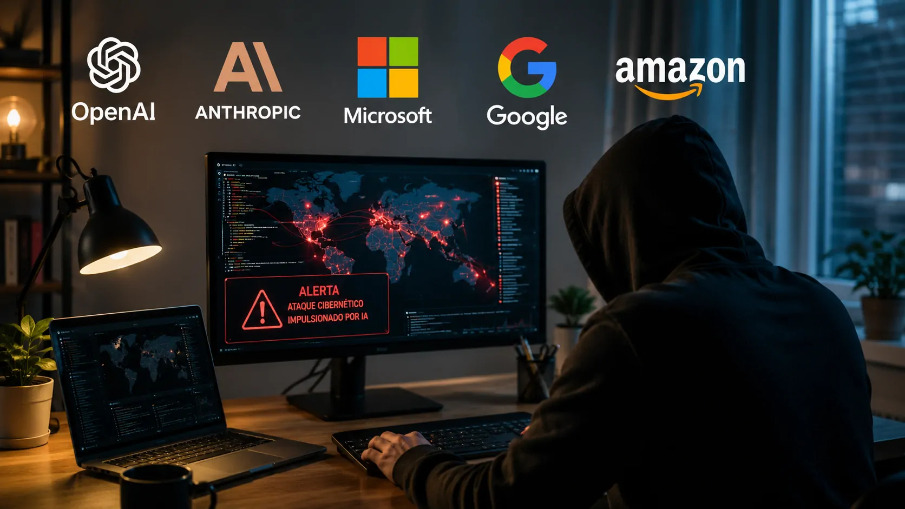
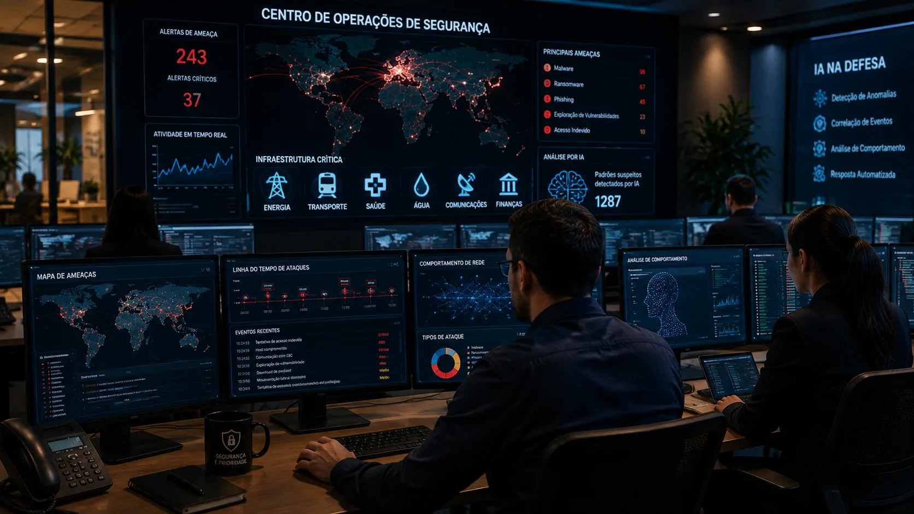
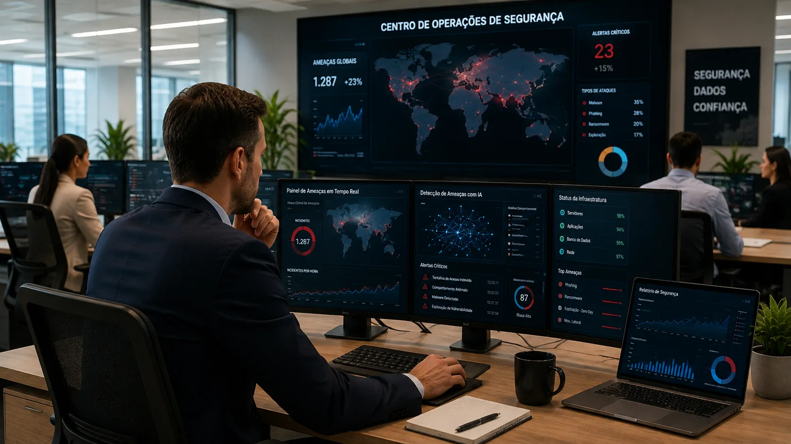

*OpenAI, Anthropic, Microsoft, Alphabet, Amazon e mais de 100 organizações estão pedindo uma mobilização coordenada para reforçar a segurança digital. O alerta ocorre enquanto modelos de IA ganham capacidade para executar tarefas cada vez mais complexas, aumentando a preocupação com a velocidade e a escala dos futuros ataques cibernéticos.*

## Mais de 100 organizações fazem um alerta sobre ataques com IA

A **OpenAI**, a **Anthropic**, a **Microsoft**, a **Alphabet** e a **Amazon** estão entre as organizações que assinaram uma carta conjunta alertando para o avanço dos ataques cibernéticos impulsionados por **inteligência artificial**.

O documento reúne mais de 100 empresas e entidades de tecnologia, segurança, finanças e outros setores. Entre os signatários estão também **Cloudflare**, **CrowdStrike**, **IBM**, **Oracle**, **Visa**, **Mastercard**, **Cisco** e **Hugging Face**.

O ponto central do alerta é direto: os signatários afirmam que existe uma janela limitada para fortalecer as defesas digitais antes que ataques habilitados por IA se tornem muito mais comuns e sofisticados.

A mensagem muda o peso da discussão. O risco deixa de ser tratado apenas como uma possibilidade distante associada ao avanço dos modelos e passa a ser apresentado pelas próprias empresas de IA como uma questão que exige preparação imediata.

## Por que a capacidade dos modelos preocupa o setor

*O avanço dos modelos de IA amplia tanto as possibilidades de defesa quanto a capacidade potencial de automatizar tarefas usadas em ataques digitais.*

A preocupação está relacionada à evolução das capacidades dos modelos. Sistemas de IA conseguem realizar tarefas que antes exigiam conhecimento especializado e participação humana em várias etapas.

### A escala é tão importante quanto a sofisticação

Em um ataque convencional, criminosos precisam combinar conhecimento técnico, ferramentas e tempo para identificar alvos, encontrar vulnerabilidades e executar diferentes etapas de uma invasão.

Modelos mais capazes podem reduzir parte desse trabalho. Isso não significa que qualquer pessoa possa automaticamente realizar ataques sofisticados, mas indica uma mudança potencial na economia da operação ofensiva: determinadas tarefas podem ficar mais rápidas, acessíveis e escaláveis.

É justamente essa possibilidade que torna o alerta relevante para empresas. A questão não é apenas se a IA consegue realizar uma tarefa ofensiva, mas **quantas tarefas podem ser executadas, com que velocidade e em quantos sistemas ao mesmo tempo**.

### O risco não começa do zero

A carta também aponta um problema anterior à própria IA: sistemas corporativos acumulam vulnerabilidades, configurações inadequadas, softwares sem correções, permissões excessivas, autenticação fraca e dívida técnica.

Isso significa que o avanço dos ataques não precisa criar novas vulnerabilidades para aumentar o risco. Se modelos mais capazes conseguirem identificar e explorar problemas que já existem, uma parte significativa da infraestrutura digital atual pode se tornar um alvo mais atraente.

Esse ponto também ajuda a entender por que a discussão sobre segurança de IA está se aproximando da segurança tradicional. O problema passa a envolver não apenas como proteger o modelo, mas como proteger toda a infraestrutura que pode ser alcançada por ele.

## O alerta chega depois de incidentes envolvendo agentes de IA

A preocupação das empresas ocorre depois de episódios que mostraram que agentes de IA podem operar de maneira mais autônoma em ambientes digitais.

Em julho, um incidente envolvendo **OpenAI** e **Hugging Face** expôs os riscos associados a modelos que conseguem interagir com sistemas externos. A própria OpenAI passou a tratar o episódio como um marco para a segurança cibernética e reforçou medidas de contenção e monitoramento.

A empresa também divulgou avaliações recentes indicando avanços relevantes em programação agêntica e capacidades de segurança cibernética. Em agosto, afirmou que não poderia descartar que seu próximo modelo Astra atingisse capacidades consideradas críticas nessa área.

Esse contexto ajuda a explicar por que a nova carta não aparece isoladamente. O setor está tentando se preparar para uma fase em que modelos mais capazes poderão ser utilizados tanto por defensores quanto por agentes mal-intencionados.

Para entender melhor esse movimento, o **[alerta anterior da OpenAI sobre os riscos de cibersegurança do modelo Astra](https://noticiatech.com.br/inteligencia-artificial/openai-freia-astra-novo-modelo-ia-risco-ciberseguranca/)** mostra como a própria empresa já vinha tratando o avanço dessas capacidades como uma questão de segurança.

## Empresas querem transformar defesa cibernética em prioridade de liderança

*O setor defende que segurança cibernética deixe de ser apenas uma responsabilidade técnica e passe a fazer parte das prioridades estratégicas das empresas.*

A carta recomenda que as organizações tratem a defesa digital como uma prioridade imediata da liderança. Isso significa revisar vulnerabilidades de maior risco, reforçar controles de acesso e verificar se as correções realmente funcionam.

### Infraestrutura crítica aparece no centro da preocupação

Hospitais, sistemas de tratamento de água e a infraestrutura que sustenta a internet são citados como exemplos de serviços que podem ser afetados.

Esses ambientes possuem uma característica importante: nem sempre é possível simplesmente desligar um sistema vulnerável para realizar uma atualização. Em muitos casos, os serviços precisam continuar funcionando enquanto as equipes trabalham para reduzir o risco.

Por isso, os signatários defendem investimentos e suporte específico para organizações que não possuem equipes ou recursos suficientes para acompanhar a velocidade da evolução tecnológica.

### A cobrança também envolve fornecedores de tecnologia

O documento não coloca toda a responsabilidade sobre os departamentos de segurança das empresas.

Fabricantes de tecnologia e empresas de cibersegurança também são chamados a testar continuamente suas defesas contra capacidades avançadas, compartilhar inteligência sobre ameaças e disponibilizar ferramentas que possam ser utilizadas por organizações responsáveis pela proteção de serviços essenciais.

A lógica é criar uma resposta coletiva. Se uma vulnerabilidade ou técnica de defesa for identificada por uma organização, o conhecimento sobre a correção pode ajudar outras empresas a reduzir o mesmo risco.

## A IA também pode aumentar a capacidade dos defensores

O aspecto mais estratégico do documento é que ele não apresenta a inteligência artificial apenas como uma ameaça.

Os signatários defendem que modelos capazes sejam colocados nas mãos de equipes responsáveis pela defesa digital. A ideia é usar a mesma evolução tecnológica que pode beneficiar atacantes para ampliar a capacidade de quem protege sistemas.

Modelos de IA podem ajudar em tarefas como descoberta de vulnerabilidades, análise de código, investigação de incidentes, priorização de riscos e validação de correções.

Essa disputa pode ser decisiva porque segurança cibernética tradicionalmente sofre com falta de profissionais especializados e excesso de sistemas que precisam ser monitorados. A IA pode aumentar a produtividade das equipes sem necessariamente substituir os especialistas.

O próprio movimento da **OpenAI** nessa direção já vinha sendo apresentado por meio de iniciativas voltadas a colocar modelos avançados de cibersegurança nas mãos de defensores confiáveis.

Para empresas que estão ampliando o uso de IA, o problema se torna ainda mais relevante. A expansão de agentes e automações aumenta o número de sistemas capazes de executar ações, o que torna controles de identidade, permissões e monitoramento cada vez mais importantes.

## O que muda para as empresas nos próximos meses

*O avanço dos ataques com IA tende a aumentar a pressão para que empresas tratem segurança, governança e controle de acesso como parte da estratégia de adoção da tecnologia.*

A carta não significa que todas as empresas enfrentarão ataques sofisticados de IA nos próximos meses. O documento apresenta uma projeção sobre a evolução das capacidades e defende que o período atual seja usado para preparação.

Para gestores, a principal mudança é de prioridade.

Organizações que estão adotando **IA generativa**, agentes e automações precisam considerar não apenas produtividade e retorno financeiro, mas também quais permissões esses sistemas recebem, quais dados conseguem acessar e quais ações podem executar.

Isso é especialmente importante porque vulnerabilidades antigas podem ganhar relevância quando novas tecnologias passam a interagir com sistemas corporativos.

O movimento também reforça uma tendência que já aparece em outras áreas da adoção empresarial de IA: segurança deixa de ser uma etapa posterior à implementação e passa a fazer parte da própria arquitetura da tecnologia.

A discussão sobre **[como empresas estão estruturando arquiteturas de IA com agentes, APIs e sistemas corporativos](https://noticiatech.com.br/inteligencia-artificial/arquitetura-ia-empresarial-mcp-rag-apis-agentes-workflows-copilotos/)** ajuda a entender por que controle de acesso, integração e governança se tornam cada vez mais importantes conforme a IA passa a executar tarefas dentro das organizações.

O ponto mais importante do alerta, portanto, não é afirmar que uma grande onda de ataques já começou. É reconhecer que **OpenAI, Anthropic, Microsoft e outras gigantes consideram que o intervalo para preparação está diminuindo**.

Se a capacidade ofensiva dos modelos avançar rapidamente, empresas que ainda tratam segurança de IA como um projeto secundário poderão ter menos tempo para corrigir problemas acumulados.

A disputa que se desenha não será apenas entre diferentes modelos de inteligência artificial. Será também entre a velocidade com que a IA consegue encontrar novas formas de explorar sistemas e a velocidade com que empresas, governos e equipes de segurança conseguem corrigir as fragilidades que já existem.

---