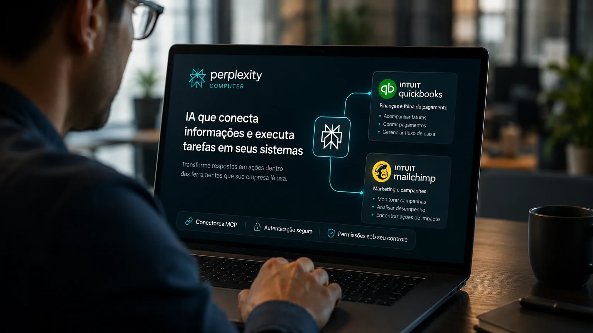
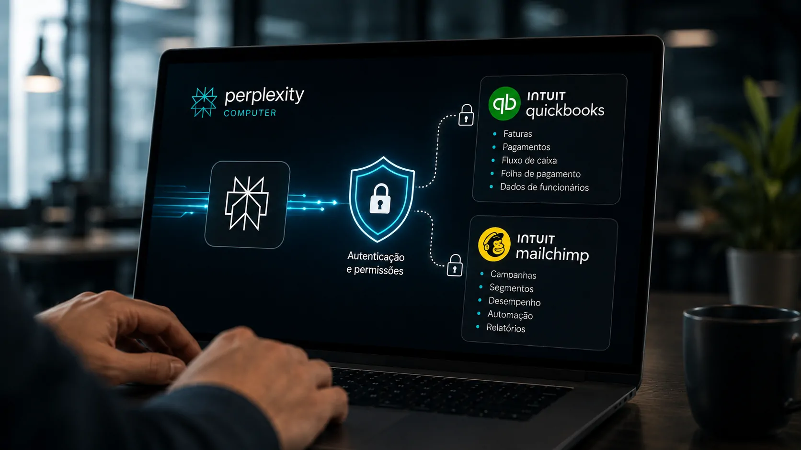
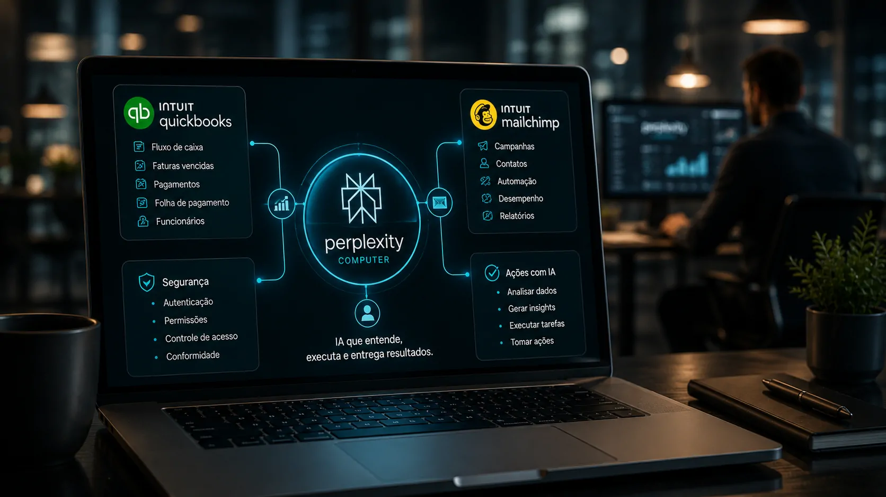

*O acordo entre **Perplexity** e **Intuit** coloca o Perplexity Computer mais perto da operação real das empresas. Com **QuickBooks** e **Mailchimp** conectados por MCP, a IA passa a transformar informações em ações financeiras, administrativas e de marketing, sinalizando uma mudança importante na forma como agentes de IA podem interagir com softwares corporativos.*

## Perplexity leva a IA para dentro dos sistemas empresariais

**A Perplexity integrou o QuickBooks e o Mailchimp ao Perplexity Computer para permitir que usuários transformem respostas e informações obtidas pela IA em ações dentro de sistemas empresariais.** A parceria foi anunciada pela **Intuit** em 31 de agosto de 2026 e utiliza conectores MCP para estabelecer a conexão entre as plataformas.

O movimento é importante porque muda o papel do **Perplexity Computer**. Em vez de funcionar apenas como uma interface para pesquisar informações, analisar dados e produzir respostas, o Computer passa a atuar sobre ferramentas utilizadas diretamente na operação de uma empresa.

A própria **Perplexity** já posiciona o Computer como um agente capaz de executar fluxos de trabalho em diferentes plataformas. A integração com os produtos da Intuit amplia esse modelo para áreas especialmente sensíveis, como finanças, folha de pagamento e marketing.

### O que está por trás da integração

O **MCP**, sigla para Model Context Protocol, funciona como uma camada de conexão entre sistemas externos e aplicações de inteligência artificial. Na prática, ele permite que uma IA interaja com ferramentas e dados de serviços compatíveis, respeitando autenticação e permissões.

Nesse caso, a conexão leva as capacidades do **QuickBooks** e do **Mailchimp** para dentro do fluxo de trabalho do **Perplexity Computer**, aproximando pesquisa, análise e execução em uma mesma interface.

## QuickBooks e Mailchimp transformam respostas em ações

*QuickBooks e Mailchimp passam a fazer parte dos fluxos de trabalho executados pelo Perplexity Computer.*

**A principal novidade é que o Perplexity Computer pode executar tarefas que antes exigiam acesso direto a diferentes sistemas empresariais.** No QuickBooks, isso envolve atividades relacionadas ao fluxo de caixa e às contas a receber.

### Finanças deixam de ser apenas informação

Entre os exemplos apresentados pela **Intuit** estão o acompanhamento de faturas vencidas, a configuração de faturas recorrentes e o envio de links de pagamento. O Computer também pode recuperar contracheques e acessar informações de funcionários relacionadas à folha de pagamento.

Isso cria uma diferença relevante entre uma IA que simplesmente responde "quais clientes estão com pagamentos atrasados?" e uma IA capaz de consultar os dados e avançar para uma ação dentro do sistema, desde que tenha autorização para fazê-lo.

O modelo se aproxima do conceito de **agente de IA**, no qual a tecnologia não apenas interpreta uma solicitação, mas também utiliza ferramentas para cumprir etapas de uma tarefa.

### Marketing também entra no mesmo fluxo

No **Mailchimp**, a integração permite acompanhar o desempenho de campanhas e identificar ações de maior impacto. A ideia é reduzir a distância entre análise e execução.

Para uma empresa, isso significa que uma pergunta sobre desempenho de marketing pode deixar de terminar em um relatório. O mesmo fluxo de trabalho pode conectar a interpretação dos dados às ações disponíveis na plataforma.

Esse princípio já aparece em outras plataformas de IA. O **[Gemini passou a executar tarefas por meio de agentes de IA](https://noticiatech.com.br/ferramentas/google-gemini-live-executar-tarefas-agentes-ia/)**, mostrando que a disputa está avançando da geração de respostas para a execução de atividades.

## O que muda quando a IA pode operar sistemas

**A mudança mais importante é a passagem de uma IA orientada a respostas para uma IA orientada a execução.** O usuário continua fazendo uma solicitação em linguagem natural, mas o resultado pode envolver operações em diferentes sistemas conectados.

Esse modelo reduz a necessidade de alternar entre plataformas. Uma pessoa pode utilizar uma interface de IA para consultar informações, interpretar os dados e iniciar tarefas que antes exigiam uma sequência manual de acessos.

### O valor está na integração, não apenas no modelo

O avanço não depende somente da capacidade do modelo de linguagem. O acesso às ferramentas, a qualidade dos dados, as permissões e os mecanismos de segurança passam a ter peso equivalente.

É por isso que a integração entre **Perplexity**, **QuickBooks** e **Mailchimp** é mais relevante do que uma simples conexão entre aplicativos. Ela demonstra uma arquitetura na qual a IA pode funcionar como uma camada operacional sobre softwares que já fazem parte da rotina empresarial.

Esse movimento também ajuda a explicar por que os **agentes de IA** estão ganhando espaço no ambiente corporativo. A vantagem potencial não está apenas em produzir conteúdo mais rapidamente, mas em reduzir etapas entre uma decisão e sua execução.

## Segurança passa a ser parte central da estratégia

*O acesso aos sistemas depende de autenticação e das permissões concedidas pelo usuário.*

**Quanto mais autonomia uma IA recebe dentro de sistemas empresariais, maior passa a ser a importância de segurança, permissões e governança.** No caso anunciado pela Intuit, os usuários precisam autenticar suas contas existentes para permitir o acesso aos dados.

### Acesso autorizado limita a autonomia

A integração não significa que o **Perplexity Computer** tenha acesso irrestrito às contas de uma empresa. A utilização depende da autenticação e das permissões associadas aos serviços conectados.

Esse detalhe é fundamental quando a IA começa a lidar com informações financeiras, dados de funcionários ou métricas de campanhas. O risco deixa de estar apenas em uma resposta incorreta e passa a incluir a possibilidade de uma ação incorreta dentro de um sistema real.

Por isso, a evolução dos agentes empresariais tende a exigir controles mais sofisticados sobre quais ferramentas podem ser acessadas, quais ações podem ser executadas e em quais circunstâncias uma aprovação humana deve ser solicitada.

### A autonomia cria uma nova camada de responsabilidade

O próprio debate sobre **[agentes de IA e responsabilidade por ações autônomas nas empresas](https://noticiatech.com.br/inteligencia-artificial/agentes-ia-responsabilidade-empresas-acoes-autonomas/)** mostra por que essa mudança merece atenção. Quando a IA passa de observadora para executora, erros podem produzir consequências operacionais concretas.

Nesse cenário, governança deixa de ser apenas uma questão de privacidade ou conformidade. Ela passa a envolver a definição dos limites de atuação do agente e a rastreabilidade das ações realizadas.

## A disputa pela IA empresarial entra em uma nova fase

**A integração mostra que a competição entre plataformas de IA está avançando para o território dos sistemas onde as empresas realmente trabalham.** Ter um modelo capaz de responder perguntas é importante, mas controlar uma camada que conecta pesquisa, dados e execução pode representar uma vantagem diferente.

O **Perplexity Computer** já busca ocupar esse espaço ao combinar pesquisa, execução de ferramentas e fluxos de trabalho. A chegada do **QuickBooks** e do **Mailchimp** adiciona duas áreas relevantes da operação empresarial: finanças e marketing.

### A interface pode mudar mais do que o software

Durante décadas, empresas organizaram suas operações em torno de aplicativos específicos. Funcionários aprenderam a abrir um sistema financeiro para consultar contas, uma plataforma de marketing para acompanhar campanhas e outras ferramentas para executar tarefas distintas.

A lógica dos agentes pode inverter essa relação. Em vez de o usuário navegar por cada aplicação, a IA pode se tornar a interface que coordena diferentes sistemas.

Isso não significa que os softwares tradicionais deixarão de existir. O que pode mudar é a forma como as pessoas interagem com eles. O sistema continua armazenando e processando os dados, enquanto a IA passa a funcionar como uma camada de interpretação e execução.

## Perplexity aposta em uma IA que não termina na resposta

*O novo modelo aproxima a interface de IA das operações executadas diariamente pelas empresas.*

**A parceria entre Perplexity e Intuit sugere que o próximo estágio da IA empresarial será definido menos pela capacidade de responder e mais pela capacidade de executar com segurança.** QuickBooks e Mailchimp são exemplos concretos de como essa mudança pode chegar às rotinas financeiras e de marketing.

### A diferença estará na capacidade de agir

Uma IA que identifica uma fatura vencida oferece informação. Uma IA conectada ao sistema financeiro e autorizada a iniciar uma ação pode participar do processo operacional. A diferença parece pequena na interface, mas é grande para a arquitetura de uma empresa.

O mesmo vale para marketing. Analisar uma campanha é uma atividade de inteligência. Conectar essa análise ao sistema que administra campanhas aproxima a IA da execução.

É essa fronteira que **Perplexity** começa a explorar com a integração. A empresa deixa de competir apenas pela qualidade das respostas e passa a disputar espaço na camada que conecta inteligência artificial às ferramentas utilizadas diariamente pelos negócios.

### O próximo desafio será confiança

A disponibilidade inicial das novas experiências de **QuickBooks** e **Mailchimp** foi anunciada para usuários nos Estados Unidos. A adoção em escala dependerá não apenas da utilidade das integrações, mas também da confiança das empresas em permitir que agentes atuem sobre sistemas críticos.

O ponto central, portanto, não é apenas que o **Perplexity Computer** ganhou dois novos conectores. É que a IA está começando a atravessar uma fronteira importante: sair da tela onde responde perguntas e entrar nos sistemas onde decisões empresariais são transformadas em operações.

---