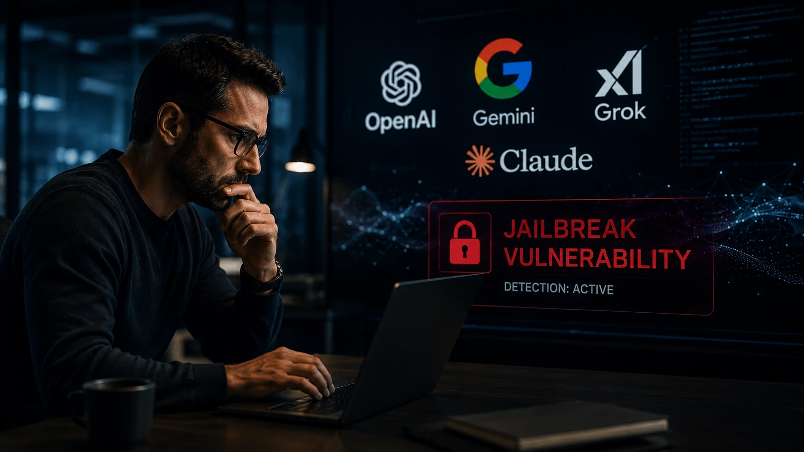
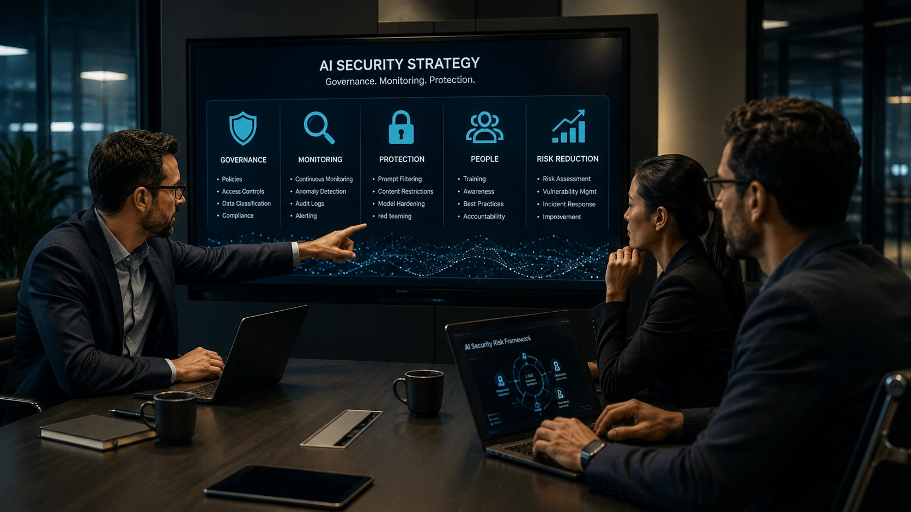
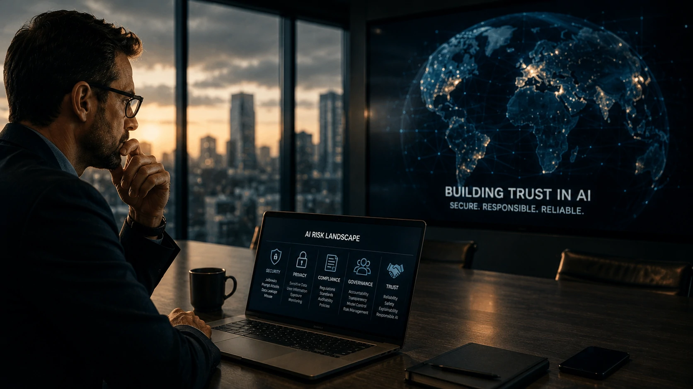

*À medida que a inteligência artificial se torna parte das operações das empresas, cresce também a preocupação com a segurança desses sistemas. Uma nova pesquisa mostra que nem mesmo os modelos mais avançados estão totalmente protegidos contra tentativas de manipulação, ampliando o debate sobre governança e uso responsável da IA.*

## Uma pesquisa recente conduzida por especialistas em segurança digital reacendeu um debate importante: 
**modelos como ChatGPT, Gemini, Grok e Claude ainda podem ser manipulados por técnicas conhecidas como jailbreak**.

Embora essas plataformas possuam diversas camadas de proteção, os pesquisadores demonstraram que determinados comandos conseguem contornar parte dessas restrições, fazendo a IA produzir respostas que normalmente seriam bloqueadas.

O estudo não afirma que essas ferramentas sejam inseguras para o uso cotidiano. O principal alerta é que **a segurança da inteligência artificial continua sendo uma corrida permanente entre quem desenvolve mecanismos de proteção e quem tenta superá-los**.

## O que significa "burlar" uma inteligência artificial?

Burlar uma IA significa convencer o modelo a ignorar algumas de suas regras internas de segurança. Em vez de invadir servidores ou quebrar criptografia, o atacante utiliza uma sequência de instruções cuidadosamente elaboradas para influenciar o comportamento do sistema.

### O que é um jailbreak?

O termo **jailbreak** descreve esse tipo de tentativa de manipulação. Em linguagem simples, é como encontrar uma forma de convencer um funcionário a ignorar um procedimento interno sem alterar oficialmente as regras da empresa.

Para usuários comuns, esses ataques costumam parecer apenas conversas aparentemente normais com a IA. Nos bastidores, porém, utilizam técnicas sofisticadas de engenharia de prompts.

### Por que isso preocupa as empresas?

Quanto mais organizações utilizam **ChatGPT**, **Gemini**, **Claude** e **Grok** para automatizar processos, maior passa a ser a preocupação com informações confidenciais, tomada de decisão e geração de conteúdo.

Esse cenário reforça a importância da **governança de IA**, tema que já vem ganhando espaço nas empresas e complementa discussões apresentadas em nosso conteúdo sobre **[o que é segurança de IA e por que ela se tornou prioridade para empresas](https://noticiatech.com.br/inteligencia-artificial/o-que-e-seguranca-ia-prioridade-empresas/)**.

## Nenhum dos principais modelos é considerado totalmente imune

*A segurança dos modelos de IA evolui continuamente, mas pesquisadores afirmam que nenhum sistema atual é totalmente imune a tentativas de manipulação.*

Os pesquisadores concluíram que **nenhum dos grandes modelos disponíveis atualmente apresentou proteção absoluta** contra todas as técnicas testadas.

Cada plataforma respondeu de maneira diferente. Algumas bloquearam rapidamente os ataques, enquanto outras conseguiram ser induzidas em determinados cenários específicos.

Isso mostra que a disputa deixou de ser apenas sobre quem possui a IA mais inteligente. A capacidade de resistir a ataques também começa a influenciar decisões de empresas e governos.

### Segurança virou critério competitivo

Durante os últimos anos, a competição entre **OpenAI**, **Google**, **xAI**, **Anthropic** e outras empresas esteve concentrada em desempenho e velocidade.

Agora, cresce um novo fator de comparação: **quem consegue entregar o modelo mais seguro para ambientes corporativos**.

Essa mudança acompanha outra tendência importante do mercado, na qual empresas passam a investir em arquiteturas mais robustas para controlar agentes inteligentes, tema abordado em nossa análise sobre **[AI Orchestration para empresas](https://noticiatech.com.br/automacao/o-que-e-ai-orchestration-agentes-ia-empresas/)**.

### O impacto vai além da tecnologia

Para especialistas, a discussão não envolve apenas engenharia de software.

Ela afeta compliance, privacidade, proteção de dados, reputação das empresas e confiança dos usuários. À medida que agentes de IA recebem mais autonomia para executar tarefas, pequenas falhas podem gerar consequências muito maiores do que simples respostas incorretas.

## Como empresas podem reduzir os riscos ao utilizar inteligência artificial

*A combinação entre tecnologia, políticas internas e treinamento reduz significativamente os riscos associados ao uso corporativo da IA.*

Empresas não precisam abandonar a **inteligência artificial** por causa dessas pesquisas. O principal aprendizado é que a adoção da tecnologia deve ser acompanhada por práticas de segurança, assim como acontece com servidores, bancos de dados e sistemas corporativos.

Especialistas recomendam tratar modelos como **ChatGPT**, **Gemini**, **Claude** e **Grok** como qualquer outra ferramenta estratégica: com regras de acesso, auditoria e monitoramento contínuo.

### A governança de IA ganha protagonismo

A chamada **governança de IA** reúne processos, políticas e controles que garantem o uso seguro da inteligência artificial dentro das organizações.

Isso inclui definir quem pode utilizar determinadas ferramentas, quais informações podem ser compartilhadas e como monitorar possíveis comportamentos inesperados.

Empresas que utilizam agentes inteligentes também vêm fortalecendo arquiteturas mais robustas, como explicado no artigo sobre **[AI Agent Identity e a identidade digital dos agentes de IA](https://noticiatech.com.br/inteligencia-artificial/ai-agent-identity-identidade-agentes-ia-empresas/)**.

### Funcionários continuam sendo a primeira linha de defesa

Grande parte dos incidentes de segurança não acontece porque a tecnologia falhou, mas porque um usuário forneceu informações sensíveis sem perceber os riscos.

Treinamentos simples ajudam colaboradores a identificar situações em que dados estratégicos não devem ser enviados para plataformas públicas de IA.

Na prática, segurança depende tanto das pessoas quanto da tecnologia.

## O que essa pesquisa indica para o futuro da inteligência artificial

*A próxima fase da competição entre as grandes empresas de IA deve envolver não apenas desempenho, mas também segurança e confiabilidade.*

A pesquisa mostra que o mercado entrou em uma nova etapa. Até pouco tempo, a principal comparação entre os modelos era velocidade, capacidade de programação ou qualidade das respostas.

Agora, a **segurança** passa a ser um dos fatores decisivos para empresas que pretendem integrar IA aos seus processos.

### A corrida pela IA mais segura começou

Empresas como **OpenAI**, **Google**, **Anthropic**, **xAI** e **Microsoft** vêm investindo continuamente em novas camadas de proteção, enquanto pesquisadores independentes seguem identificando possíveis vulnerabilidades.

Esse ciclo é comum na área de segurança digital: cada avanço defensivo costuma ser acompanhado por novas tentativas de contornar essas barreiras.

Por isso, especialistas consideram improvável que exista um modelo totalmente imune. O objetivo passa a ser reduzir continuamente as possibilidades de exploração.

### Confiança será tão importante quanto desempenho

Nos próximos anos, organizações deverão avaliar critérios como conformidade regulatória, proteção de dados e resistência a ataques antes mesmo de comparar velocidade ou qualidade das respostas.

Essa mudança pode redefinir a competição entre os principais desenvolvedores de IA e acelerar investimentos em segurança corporativa.

Para o **Notícia Tech**, o estudo reforça uma tendência clara: à medida que a inteligência artificial assume funções cada vez mais estratégicas dentro das empresas, confiança, governança e proteção deixam de ser diferenciais e passam a ser requisitos fundamentais para qualquer plataforma que pretenda liderar a próxima fase da transformação digital.

---