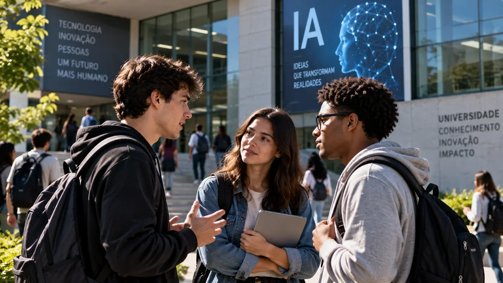

*Uma pesquisa internacional mostra que a preocupação com os efeitos da inteligência artificial sobre o trabalho deixou de ser uma questão restrita aos grandes mercados de tecnologia. No Brasil, o receio aparece com força entre a população e também cresce entre os jovens, justamente quando as empresas aceleram a adoção da tecnologia.*

## O temor de perder empregos já aparece em grande parte do mundo

A percepção de que a **inteligência artificial** poderá reduzir empregos está presente em grande parte dos países analisados pelo **Pew Research Center**. Na pesquisa divulgada em setembro de 2026, pessoas em **34 dos 37 países** considerados na análise geral tendem a acreditar que a IA levará a menos empregos do que a mais vagas nas próximas duas décadas.

O levantamento ouviu **42.151 pessoas em 36 países** entre fevereiro e maio de 2026. Os Estados Unidos foram analisados separadamente por meio de duas pesquisas realizadas em períodos diferentes. O Pew é uma organização de pesquisa independente que produz estudos sobre opinião pública, comportamento social e tendências econômicas e tecnológicas.

A preocupação não é uniforme. Nos países de alta renda analisados, a mediana de adultos que esperam redução dos empregos chega a **55%**, contra **36%** nos países de renda média. Ao mesmo tempo, uma parcela relevante dos entrevistados ainda não sabe qual será o efeito da tecnologia sobre o mercado de trabalho.

### A percepção não significa desemprego já provocado pela IA

Essa diferença é importante porque a pesquisa mede **expectativas da população**, e não contabiliza quantos empregos já desapareceram por causa da inteligência artificial.

O resultado mostra como trabalhadores e cidadãos estão interpretando uma transformação tecnológica que ainda está em andamento. A expectativa de redução de vagas pode refletir tanto experiências concretas com automação quanto incertezas sobre como as empresas utilizarão ferramentas capazes de executar tarefas antes realizadas por pessoas.

O cenário também ajuda a explicar por que a discussão sobre IA e empregos ganhou uma dimensão global. A tecnologia passou de uma ferramenta restrita a departamentos de tecnologia para sistemas utilizados em atendimento, programação, análise de documentos, marketing, pesquisa e operações empresariais.

## No Brasil, 42% esperam redução de empregos com a IA

*No Brasil, 42% dos entrevistados esperam que a inteligência artificial reduza o número de empregos nas próximas duas décadas.*

No **Brasil**, a preocupação aparece em dois níveis. O levantamento mostra que **52% dos brasileiros estão mais preocupados do que animados com o avanço da inteligência artificial**, percentual acima da mediana global de 37%.

Quando a pergunta é diretamente sobre empregos, **42% dos brasileiros acreditam que a IA reduzirá o número de vagas nos próximos 20 anos**. Apenas **13%** esperam aumento no número de empregos, enquanto uma parcela significativa ainda não sabe qual será o resultado.

Esse resultado coloca o mercado de trabalho no centro da percepção brasileira sobre a tecnologia. O receio não significa necessariamente rejeição à IA, mas mostra que uma parte relevante da população ainda não enxerga com clareza como os ganhos de produtividade poderão se transformar em novas oportunidades profissionais.

### A preocupação brasileira acontece enquanto a adoção avança

Existe aí um contraste importante. Enquanto a população demonstra cautela, as empresas brasileiras estão ampliando o uso da tecnologia.

Um estudo da **Strand Partners** realizado para a **AWS** aponta que **50% das empresas brasileiras já utilizam IA**, o equivalente a cerca de 12 milhões de negócios. O percentual era de 40% no levantamento anterior.

A mesma pesquisa mostra, porém, que adoção não significa maturidade. Entre as **[empresas brasileiras que já usam IA em nível avançado](https://noticiatech.com.br/inteligencia-artificial/empresas-brasileiras-usam-ia-nivel-avancado/)**, **58% estão em um nível básico**, 27% em nível intermediário e apenas **15%** chegaram ao nível avançado.

O movimento cria uma situação em que trabalhadores e empresas avançam sobre o mesmo processo de transformação, mas a partir de perspectivas diferentes: organizações buscam produtividade e novos modelos de operação, enquanto profissionais tentam entender quais tarefas e competências continuarão valorizadas.

## Geração Z entra no mercado com uma relação diferente com a IA

Os jovens adultos têm uma relação particularmente complexa com a inteligência artificial. A pesquisa do **Pew Research Center** mostra que pessoas de **18 a 34 anos** são mais propensas que adultos de 50 anos ou mais a dizer que ouviram ou leram muito sobre IA nos países analisados.

Isso não significa que os jovens sejam simplesmente mais otimistas ou pessimistas. Em muitos países, eles apresentam sentimentos mistos: demonstram interesse pela tecnologia ao mesmo tempo em que reconhecem riscos associados ao seu impacto.

No Brasil, a preocupação entre os jovens também aumentou. O Pew identifica o país entre aqueles em que adultos mais jovens passaram a demonstrar maior apreensão com a IA em relação ao levantamento anterior.

### O problema para quem ainda está construindo carreira

Para quem está no início da vida profissional, a discussão sobre IA tem uma característica diferente. Um trabalhador experiente já possui conhecimento acumulado, histórico profissional e domínio de processos. Quem está começando ainda precisa conquistar a primeira oportunidade para desenvolver essas competências.

Esse ponto encontra respaldo em dados recentes do **Stanford Digital Economy Lab**. Um estudo baseado em dados de folha de pagamento da ADP nos Estados Unidos não encontrou evidência de deslocamento generalizado de empregos em toda a economia, mas identificou uma diferença relevante entre trabalhadores jovens e experientes.

Entre trabalhadores de **22 a 25 anos** em ocupações altamente expostas à IA, o nível de emprego estava cerca de **19% abaixo** do que teria ocorrido se acompanhasse a evolução observada entre jovens da mesma idade em ocupações menos expostas. Os pesquisadores indicam que o efeito aparece principalmente na **menor contratação de jovens**, e não em uma onda de demissões.

O dado é específico do mercado americano e não pode ser aplicado automaticamente ao Brasil. Ainda assim, ele ajuda a explicar por que a entrada no mercado de trabalho pode se tornar uma das áreas mais observadas durante a expansão da IA.

## Empresas aceleram a IA enquanto trabalhadores tentam entender o impacto

*Empresas brasileiras aceleram a adoção da IA, mas ainda enfrentam desafios de capacitação, governança e mensuração dos resultados.*

A adoção empresarial mostra que a inteligência artificial já está sendo incorporada às operações, mesmo que seus efeitos sobre o emprego ainda estejam em disputa.

No Brasil, o estudo da **AWS e Strand Partners** aponta que 68% das organizações aumentaram seus investimentos em IA no último ano. Entre as empresas que utilizam a tecnologia, **72% relatam ganhos de produtividade** e 79% esperam que a IA contribua para o crescimento dos negócios nos 12 meses seguintes.

O avanço não acontece apenas em grandes empresas de tecnologia. A inteligência artificial está sendo incorporada a áreas como programação, atendimento, análise de dados, produção de conteúdo, pesquisa e processos administrativos.

Um exemplo desse movimento já apareceu no próprio **Notícia Tech**, em uma análise sobre como a **[B3 utiliza IA para programação e reduziu em 35% o tempo de entrega](https://noticiatech.com.br/inteligencia-artificial/b3-usa-ia-programar-reduz-35-tempo-entrega/)**. O caso ajuda a visualizar uma das formas mais imediatas de adoção: a tecnologia não necessariamente substitui uma função inteira, mas pode alterar o tempo e a quantidade de tarefas executadas por uma equipe.

### O desafio passa a ser medir o que a IA realmente muda

A pesquisa da AWS mostra também que a adoção ainda encontra obstáculos. **48% das empresas** apontam a falta de habilidades digitais e de IA como uma das principais barreiras.

Isso significa que a transformação não depende apenas da disponibilidade de ferramentas. Empresas precisam definir onde a IA será aplicada, preparar profissionais, estabelecer processos de governança e medir se o investimento realmente produz resultados.

Para os trabalhadores, a mudança cria uma consequência paralela: a familiaridade com ferramentas de IA pode se tornar parte do conjunto de competências exigidas em determinadas funções, enquanto tarefas mais rotineiras podem ser progressivamente automatizadas ou reorganizadas.

## Os dados não mostram uma substituição generalizada mas mostram mudança

Os estudos disponíveis apontam para um cenário mais complexo do que a ideia de que a IA simplesmente eliminará empregos.

Na América Latina e no Caribe, uma análise da **Organização Internacional do Trabalho** estima que entre **26% e 38% dos empregos** estão expostos à inteligência artificial generativa. Entretanto, apenas cerca de **2% a 5%** dos empregos apresentam potencial de automação completa considerando as capacidades atuais da tecnologia.

A maior parte da exposição está relacionada à possibilidade de **transformação das tarefas**. Em outras palavras, uma profissão pode continuar existindo enquanto parte significativa de suas atividades passa a ser realizada com auxílio de sistemas de IA.

Esse cenário ajuda a colocar os números do Pew em perspectiva. O fato de milhões de pessoas esperarem redução de empregos não significa que os empregos já tenham sido substituídos nessa mesma proporção.

### O primeiro impacto pode aparecer na forma de contratar

O estudo de Stanford oferece uma pista importante. Em determinadas ocupações mais expostas à automação, a diferença entre jovens e trabalhadores experientes aparece principalmente na contratação.

Isso muda a pergunta que empresas e profissionais precisam acompanhar. Em vez de observar somente quantas pessoas foram demitidas após a adoção de IA, também será necessário observar **quais funções estão deixando de contratar iniciantes, quais competências estão sendo exigidas e quais tarefas passaram a ser automatizadas**.

A transformação também pode criar novas oportunidades. O levantamento da PwC sobre empregos relacionados à IA aponta que, no Brasil, a participação de vagas que exigem competências em inteligência artificial aumentou de **1,1% para 3,6% entre 2024 e 2025**, quase triplicando em participação.

Esses dados não eliminam o risco de deslocamento em determinadas funções, mas mostram por que o impacto da IA no trabalho não pode ser resumido a uma contagem de empregos perdidos.

## O futuro do trabalho começa a ser definido antes de sabermos o resultado

*Para os profissionais mais jovens, a questão não é apenas evitar a substituição, mas entender quais competências ganharão valor em um mercado cada vez mais apoiado por IA.*

A combinação dos levantamentos revela um paradoxo. **A população teme uma redução de empregos ao mesmo tempo em que as empresas aceleram a adoção da tecnologia e relatam ganhos de produtividade.**

No Brasil, esse contraste é ainda mais evidente porque a preocupação com a IA está acima da mediana global, enquanto metade das empresas já utiliza algum tipo de inteligência artificial.

Para a **Geração Z**, o ponto mais sensível pode estar na porta de entrada do mercado. Se determinadas tarefas iniciais forem automatizadas, empresas podem precisar encontrar novas maneiras de formar profissionais, distribuir responsabilidades e desenvolver experiência.

Para as empresas, o desafio será diferente: transformar adoção tecnológica em produtividade sem perder a capacidade de formar talentos. Para os profissionais, a questão passa por entender quais atividades a IA consegue executar e quais capacidades humanas continuam necessárias para supervisionar, decidir, criar e assumir responsabilidade pelos resultados.

Os dados disponíveis ainda não permitem dizer exatamente quantos empregos a inteligência artificial eliminará ou criará. Eles mostram algo mais imediato: **a mudança já entrou na percepção das pessoas, nas estratégias das empresas e, em alguns mercados, na forma como trabalhadores jovens estão sendo contratados**.

O que está em disputa agora não é apenas o número de empregos que existirão no futuro. É também **como será o trabalho que dará acesso a esses empregos**.

---