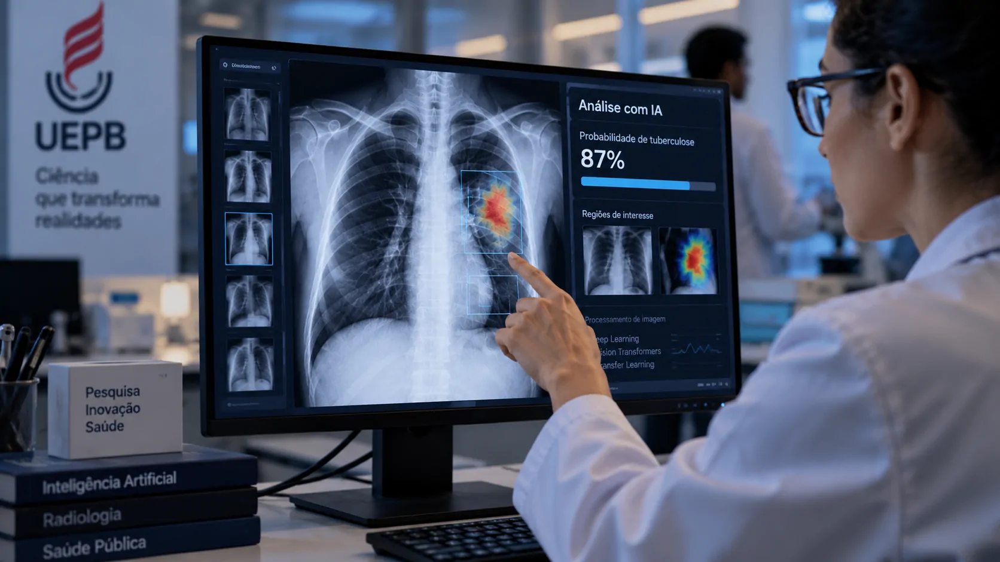
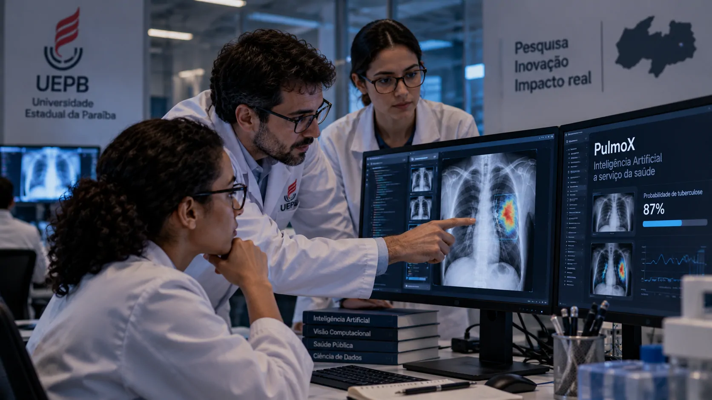

*Pesquisadores da Universidade Estadual da Paraíba desenvolveram uma ferramenta de inteligência artificial capaz de analisar imagens de raio-X e estimar a probabilidade de tuberculose. O projeto mostra como universidades do Nordeste estão aplicando IA a problemas concretos de saúde, mas também evidencia a diferença entre uma ferramenta experimental de apoio e um diagnóstico médico definitivo.*

## Uma IA desenvolvida na Paraíba para analisar imagens de raio-X

Pesquisadores da **Universidade Estadual da Paraíba (UEPB)**, em **Campina Grande**, desenvolveram uma ferramenta de **inteligência artificial** capaz de analisar imagens de raio-X e estimar a probabilidade de um paciente ter **tuberculose**.

O projeto ganhou nova visibilidade em setembro de 2026 após ser apresentado pelo **Univerciência**, programa dedicado à divulgação da produção científica do Nordeste. A pesquisa foi destacada entre outros projetos desenvolvidos por universidades e instituições da região.

A proposta chama atenção porque coloca a **IA médica** diante de um problema que continua relevante para o sistema de saúde brasileiro. Em vez de utilizar inteligência artificial apenas para tarefas administrativas ou produtividade, os pesquisadores estão aplicando modelos de aprendizado de máquina diretamente à análise de imagens médicas.

### O que os pesquisadores desenvolveram

A tecnologia é chamada **PulmoX** e foi desenvolvida por pesquisadores do **Laboratório de Análise de Dados e Inteligência Artificial (LANA)** da **UEPB**.

O sistema foi concebido para classificar doenças pulmonares a partir de imagens de raio-X de tórax. Entre as técnicas utilizadas estão **Deep Learning**, **Transfer Learning** e **Vision Transformers (ViT)**.

Na prática, o modelo procura padrões nas imagens que possam estar associados a determinadas alterações pulmonares. No caso da pesquisa relacionada à tuberculose, o objetivo é estimar a probabilidade de que uma radiografia apresente características compatíveis com a doença.

### Por que o raio-X entra nessa equação

A radiografia de tórax é uma ferramenta importante na investigação de doenças pulmonares. Para a **tuberculose**, porém, a imagem não deve ser interpretada como uma confirmação isolada da doença.

É justamente aí que uma ferramenta de IA pode ter utilidade: ajudar a organizar a análise dos exames e indicar quais imagens podem exigir uma avaliação mais cuidadosa.

O ganho potencial está menos em substituir o profissional e mais em criar uma camada adicional de análise capaz de processar imagens de forma padronizada.

## Como funciona o PulmoX e o treinamento da IA

*O PulmoX utiliza técnicas de aprendizado profundo para identificar padrões em imagens de raio-X de tórax.*

O **PulmoX** utiliza modelos de **aprendizado profundo**, uma área da inteligência artificial capaz de identificar padrões complexos a partir de grandes conjuntos de dados.

Para o desenvolvimento do sistema, os pesquisadores utilizaram mais de **7 mil imagens rotuladas**. Essas imagens serviram como base para o treinamento do modelo, permitindo que o sistema aprendesse associações entre características presentes nas radiografias e as classificações utilizadas na pesquisa.

O projeto também utilizou infraestrutura de **computação em nuvem** com GPUs de alta capacidade. Esse tipo de processamento é necessário porque o treinamento de modelos de visão computacional pode exigir grande capacidade computacional.

### Vision Transformers aplicados à radiologia

Um dos elementos técnicos do PulmoX é o uso de **Vision Transformers**, conhecidos pela sigla **ViT**.

A arquitetura permite que o modelo processe informações visuais e identifique relações entre diferentes regiões de uma imagem. No contexto do projeto, essa capacidade é aplicada às radiografias de tórax para buscar padrões relacionados às doenças pulmonares.

Outro recurso utilizado é o **Transfer Learning**, técnica que permite aproveitar conhecimentos aprendidos por um modelo em uma tarefa anterior para adaptá-lo a uma nova aplicação.

Essa combinação pode reduzir parte do esforço necessário para desenvolver modelos especializados quando existe uma quantidade limitada de dados específicos para determinada aplicação.

### Do modelo experimental ao uso na saúde

A UEPB informa que o software foi desenvolvido para apoiar a classificação de doenças pulmonares e que as pesquisas iniciais tiveram foco na **tuberculose**.

A universidade também registrou o software junto ao **Instituto Nacional da Propriedade Industrial (INPI)**. O registro do programa aparece como **BR 51 2025006240-0**, associado ao PulmoX.

Esse registro não significa, por si só, que a ferramenta esteja liberada para uso clínico amplo. Ele formaliza a proteção do programa de computador e dos direitos relacionados ao desenvolvimento.

## Por que a tuberculose é um alvo relevante para a IA

A escolha da tuberculose não acontece em um cenário de baixa demanda. A doença continua sendo um problema de saúde pública no Brasil.

Segundo o **Ministério da Saúde**, o país registrou **84.368 casos novos de tuberculose em 2025**, com coeficiente de incidência de 39,5 casos por 100 mil habitantes. O mesmo boletim contabilizou **6.376 mortes por tuberculose em 2024**.

Esses números ajudam a dimensionar o problema que tecnologias de apoio ao diagnóstico tentam enfrentar.

### Uma doença que ainda exige capacidade de detecção

A tuberculose pulmonar é a forma mais frequente da doença e tem papel central na transmissão do **Mycobacterium tuberculosis**.

A identificação de casos depende de uma combinação de avaliação clínica, exames de imagem e testes laboratoriais. Portanto, uma ferramenta capaz de auxiliar a análise de radiografias não elimina as demais etapas do processo.

O possível benefício está em acrescentar velocidade e padronização a uma etapa da investigação.

### Onde a IA pode ajudar

Em um cenário de uso assistido, um sistema como o **PulmoX** pode funcionar como uma camada de triagem: analisar imagens, apontar padrões de interesse e ajudar o profissional a priorizar determinados exames para avaliação.

Essa possibilidade é particularmente relevante quando existe grande volume de imagens para análise.

A lógica é semelhante à de outras aplicações de IA médica: o algoritmo não precisa substituir o especialista para gerar valor. Ele pode atuar como uma ferramenta complementar dentro do fluxo de trabalho.

Para acompanhar outras aplicações brasileiras de IA na saúde, o leitor também pode conhecer como **[sistemas de IA já estão sendo usados para tornar UTIs mais inteligentes no SUS](https://noticiatech.com.br/inteligencia-artificial/sus-utis-inteligentes-central-ia-tempo-real/)**.

## O que muda para profissionais e serviços de saúde

*Ferramentas de IA podem atuar como uma camada complementar na análise de exames médicos, mantendo o profissional no centro da decisão clínica.*

Para hospitais, clínicas e centros de pesquisa, a principal possibilidade está na **otimização do fluxo de análise de imagens**.

A UEPB descreve o PulmoX como uma ferramenta voltada à classificação de doenças pulmonares e aponta possibilidades de integração com fluxos utilizados em ambientes médicos, incluindo padrões de imagem e sistemas hospitalares.

### Menos tempo de análise não significa diagnóstico automático

É importante separar duas coisas: velocidade computacional e decisão médica.

Um algoritmo pode analisar uma imagem rapidamente, mas isso não significa que o resultado possa ser tratado como um diagnóstico independente. A interpretação precisa considerar sintomas, histórico do paciente, exames complementares e critérios clínicos.

Por isso, o termo mais adequado para explicar a aplicação é **apoio à avaliação** ou **triagem**, e não substituição do profissional.

Essa distinção também reduz um dos principais riscos de aplicações de IA na saúde: transformar uma estimativa algorítmica em uma certeza clínica.

### O impacto potencial está no fluxo de trabalho

Se validada e incorporada adequadamente a ambientes clínicos, uma ferramenta desse tipo poderia ajudar a organizar a análise de grandes volumes de exames e reduzir parte da variabilidade do processo.

Isso não significa que todos os serviços de saúde passariam a utilizar a tecnologia imediatamente. Há etapas entre uma pesquisa universitária e uma aplicação clínica ampla, incluindo validação, avaliação de desempenho, segurança, integração tecnológica e requisitos regulatórios.

O valor do projeto, neste momento, está justamente em demonstrar uma aplicação concreta de **IA desenvolvida no Brasil** para uma necessidade específica.

## A pesquisa também mostra a força da IA produzida fora do eixo tradicional

A origem do projeto é parte importante da história.

A **UEPB** desenvolveu a tecnologia em **Campina Grande**, reforçando um movimento de produção de conhecimento tecnológico no Nordeste que vai além da simples adoção de ferramentas criadas por grandes empresas estrangeiras.

Esse aspecto ganha relevância quando a inteligência artificial passa a ser analisada também como capacidade de pesquisa, desenvolvimento e criação de soluções próprias.

### Universidade como laboratório de aplicações de IA

O caso do **PulmoX** mostra uma universidade trabalhando na interseção entre **computação, estatística, inteligência artificial e saúde**.

A composição da equipe também reflete esse caráter multidisciplinar. O projeto envolve pesquisadores ligados à computação e à estatística, além da estrutura de inovação tecnológica da universidade.

Esse modelo permite que a IA seja direcionada para problemas específicos que dificilmente seriam resolvidos apenas pela adoção de uma ferramenta genérica.

### O Nordeste aparece como produtor de tecnologia

A pesquisa também se encaixa em um conjunto mais amplo de iniciativas científicas desenvolvidas na região.

Nos últimos meses, diferentes universidades nordestinas vêm aparecendo em projetos que aplicam **IA, automação, visão computacional e outras tecnologias** a problemas de saúde, agricultura, clima e serviços públicos.

No caso do PulmoX, o diferencial é a aplicação de modelos de inteligência artificial sobre imagens médicas, uma área que exige tanto capacidade computacional quanto conhecimento específico sobre o problema analisado.

Outro exemplo de aplicação brasileira de IA em saúde pode ser encontrado na pesquisa que criou uma ferramenta para auxiliar pacientes com câncer, mostrando como diferentes equipes estão buscando aplicações práticas para a tecnologia em áreas médicas distintas: **[veja como a IA foi usada para ajudar pacientes com câncer](https://noticiatech.com.br/inteligencia-artificial/biologo-criou-aplicativo-ajudou-26-mil-pacientes-cancer/)**.

## O principal desafio agora é transformar pesquisa em ferramenta confiável

*O próximo passo de uma tecnologia de IA médica é demonstrar que seus resultados permanecem confiáveis em diferentes condições de uso.*

A existência do **PulmoX** demonstra que pesquisadores brasileiros já conseguem construir modelos especializados para analisar imagens médicas. Mas a parte mais importante da trajetória de uma ferramenta desse tipo começa justamente depois do desenvolvimento do modelo.

### Validação é diferente de treinamento

Treinar uma IA com milhares de imagens é apenas uma etapa do processo.

Para uma aplicação clínica, é necessário verificar como o modelo se comporta diante de imagens que não fizeram parte do treinamento e em diferentes contextos de atendimento. Também é necessário compreender situações em que o algoritmo pode produzir resultados incorretos.

Essa diferença é fundamental porque um modelo pode apresentar bom desempenho dentro do conjunto de dados utilizado durante a pesquisa e encontrar dificuldades quando exposto a dados de outras populações, equipamentos ou condições de aquisição.

### O que acompanhar daqui para frente

A pesquisa da **UEPB** merece ser acompanhada principalmente pela evolução de sua validação e pela eventual transformação do software em uma ferramenta incorporada a ambientes reais de saúde.

A própria documentação da universidade aponta que o projeto foi estruturado para classificação de doenças pulmonares e que a pesquisa inicial teve foco na tuberculose.

Isso abre espaço para futuras extensões, mas ainda não permite afirmar que a ferramenta esteja pronta para substituir métodos diagnósticos ou profissionais de saúde.

O aspecto mais relevante da iniciativa, portanto, está em outro ponto: **uma universidade pública da Paraíba desenvolveu uma aplicação de IA especializada para um problema concreto de saúde pública brasileira**. O desafio agora é transformar essa capacidade tecnológica em uma solução suficientemente validada, segura e integrada ao sistema de saúde para produzir impacto fora do ambiente de pesquisa.

---