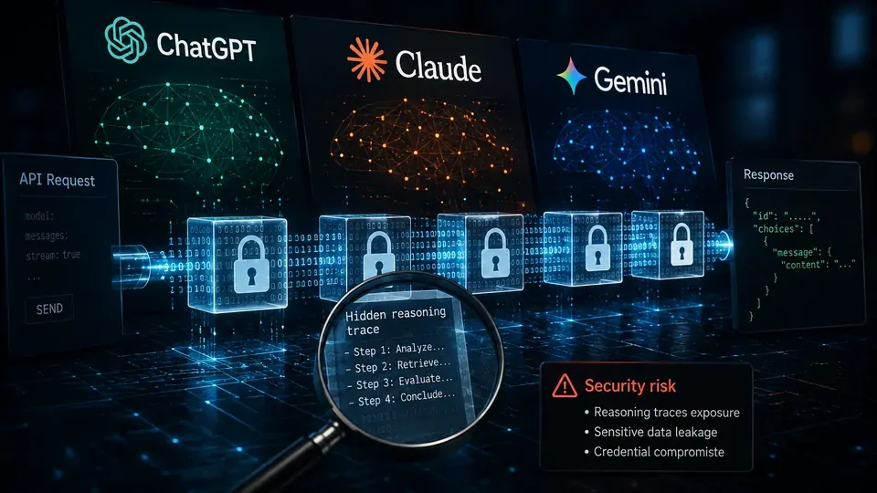
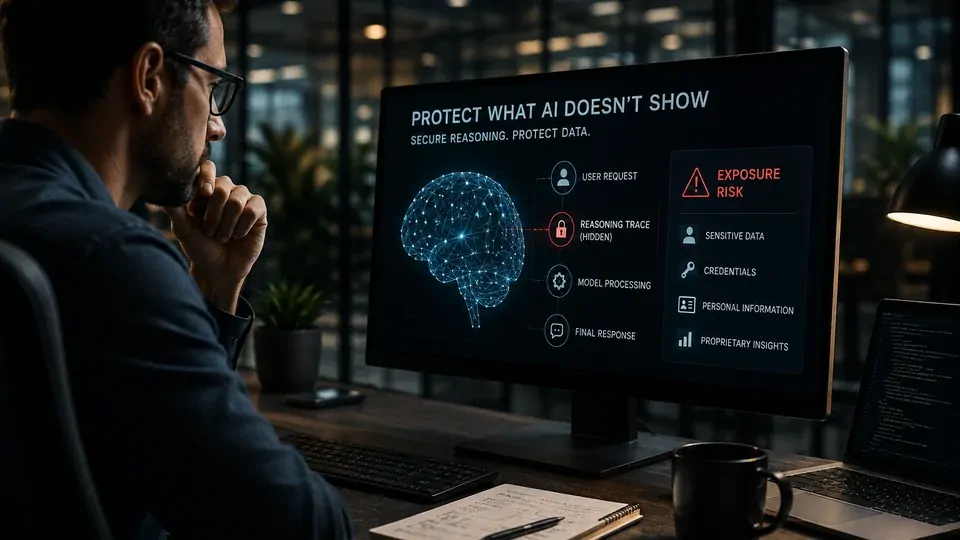

*Uma pesquisa de segurança revelou uma fragilidade inesperada em uma camada que grandes empresas de IA mantinham protegida: os blocos de raciocínio usados por modelos avançados. O estudo envolve **OpenAI**, **Anthropic** e **Google** e mostra por que a segurança de uma IA não termina na resposta que aparece na tela.*

## Pesquisadores encontraram uma forma de recuperar o raciocínio oculto de grandes IAs

Pesquisadores descobriram uma vulnerabilidade que permitia recuperar partes do raciocínio oculto produzido por modelos de inteligência artificial acessados por APIs. O estudo analisou sistemas ligados à **OpenAI**, **Anthropic** e **Google** e mostrou que determinados blocos protegidos poderiam ser reutilizados de uma maneira não prevista pelos mecanismos de segurança.

O chamado **chain-of-thought**, ou cadeia de raciocínio, corresponde às etapas intermediárias que um modelo utiliza para resolver determinadas tarefas. Em modelos avançados, essas informações podem ser mantidas fora da resposta apresentada ao usuário porque carregam valor técnico, informações proprietárias ou dados que não deveriam ser expostos.

O problema identificado pelos pesquisadores não significa que alguém tenha invadido os servidores da **OpenAI**, da **Anthropic** ou do **Google**. A descoberta ocorreu na própria arquitetura de comunicação entre modelos e aplicações.

### O que é o raciocínio oculto de uma IA

Um **LLM**, sigla para Large Language Model, é um modelo de linguagem treinado em grandes volumes de dados para compreender instruções e produzir respostas. Modelos modernos podem realizar etapas intermediárias para resolver problemas complexos antes de entregar o resultado final.

Essas etapas podem envolver análise, planejamento, verificação e decomposição de uma tarefa. O usuário, entretanto, normalmente recebe apenas a resposta final ou um resumo controlado desse processo.

O estudo publicado pelos pesquisadores mostra que essa separação entre o que o modelo processa e o que o usuário visualiza pode criar uma superfície adicional de segurança.

### Por que as empresas escondem esses dados

A proteção do raciocínio possui uma dimensão estratégica. O processo interno de um modelo pode revelar informações úteis para quem pretende estudar, reproduzir ou treinar outro sistema com base no comportamento de um modelo proprietário.

Existe também uma questão de privacidade. Um modelo pode processar informações fornecidas por usuários ou aplicações que não aparecem diretamente na resposta final.

Por isso, **OpenAI**, **Anthropic** e **Google** adotaram mecanismos para manter determinados traces de raciocínio protegidos. A pesquisa mostra que esconder essas informações na interface não é suficiente se os dados continuarem circulando em outras partes da arquitetura.

## A falha estava na forma como os traces eram enviados pelas APIs

A descoberta aconteceu porque os pesquisadores identificaram uma característica incomum nos blocos criptografados de raciocínio utilizados por diferentes modelos dentro dos ecossistemas dos provedores.

*Blocos de raciocínio protegidos podem circular entre aplicações durante as interações com APIs de IA.*

Uma **API de IA** é uma interface que permite que um software converse automaticamente com um modelo. Em vez de uma pessoa abrir um chatbot, uma empresa pode enviar uma solicitação diretamente de seu sistema para o modelo e receber uma resposta de forma programática.

Segundo a pesquisa, determinados blocos criptografados retornados pelas APIs podiam ser reutilizados entre sessões, usuários e modelos dentro do mesmo ecossistema. Essa compatibilidade criou uma oportunidade que os pesquisadores conseguiram explorar.

### Um modelo mais fraco podia ajudar a revelar dados do modelo mais poderoso

O mecanismo demonstrado pelos pesquisadores é particularmente relevante porque não exigia atacar diretamente o modelo mais avançado.

Em determinadas condições, um bloco de raciocínio produzido por um modelo mais poderoso poderia ser apresentado a outro modelo, menos protegido, dentro do mesmo ecossistema.

Esse segundo modelo poderia então ser induzido a transformar o conteúdo protegido em texto legível.

Na prática, a arquitetura criava uma espécie de caminho indireto: em vez de tentar convencer o modelo mais poderoso a revelar seu próprio raciocínio, os pesquisadores exploravam a compatibilidade entre diferentes modelos do mesmo fornecedor.

### O problema não era simplesmente quebrar uma criptografia

Esse detalhe é fundamental para entender a notícia.

Os pesquisadores não afirmam ter quebrado a criptografia utilizada pelos provedores nem obtido chaves privadas das empresas. O problema estava na maneira como os blocos protegidos podiam ser reutilizados e interpretados dentro do ecossistema de modelos.

A pesquisa descreve esse comportamento como uma vulnerabilidade arquitetural. O risco nasce da interação entre componentes que, isoladamente, podem parecer seguros.

Esse tipo de problema é especialmente relevante para o mercado corporativo porque sistemas de IA modernos raramente funcionam como um único modelo isolado. Eles combinam **APIs**, modelos diferentes, agentes, ferramentas, bancos de dados e sistemas internos.

## O impacto foi maior quando os pesquisadores analisaram dados reais

A segunda descoberta elevou a gravidade do caso: os traces não continham apenas informações relacionadas ao raciocínio dos modelos.

Ao analisar **315.320 blocos de raciocínio** obtidos de logs públicos, os pesquisadores encontraram **367 artefatos de informações de identificação pessoal** e **182 credenciais**.

Isso significa que informações que pareciam protegidas ou invisíveis para quem analisava uma sessão poderiam estar presentes em camadas intermediárias dos dados.

### Logs de IA podem esconder informações que o usuário não vê

Logs são registros produzidos por sistemas para acompanhar operações, erros, solicitações e respostas. Em ambientes de desenvolvimento, é comum que equipes compartilhem logs publicamente para demonstrar projetos, investigar problemas ou facilitar colaboração.

O problema é que uma sessão de IA pode conter muito mais informação do que aquilo que aparece na tela.

Um usuário pode visualizar uma pergunta e uma resposta aparentemente inofensivas, enquanto o sistema registra dados intermediários utilizados durante o processamento.

A pesquisa mostra por que essa diferença precisa ser considerada na segurança de aplicações baseadas em IA.

### O alerta para empresas é maior do que parece

Para uma empresa, o problema não se limita à possibilidade de alguém observar como um modelo chegou a determinada resposta.

Se credenciais, informações pessoais ou outros dados sensíveis estiverem presentes em traces ou logs, a exposição pode criar consequências operacionais e regulatórias.

Esse cenário reforça uma preocupação que o **Notícia Tech** já abordou ao explicar **[por que a segurança de IA se tornou uma prioridade para empresas](https://noticiatech.com.br/inteligencia-artificial/o-que-e-seguranca-ia-prioridade-empresas/)**.

A diferença agora é que a pesquisa mostra um exemplo concreto de como uma camada intermediária da arquitetura pode se transformar em vetor de exposição.

## O problema revela uma nova preocupação para a segurança de IA

A descoberta é importante porque mostra que proteger apenas a resposta final de um modelo não é suficiente.

Em sistemas corporativos, a inteligência artificial costuma funcionar como uma cadeia de componentes. Uma aplicação envia uma solicitação para uma API, o modelo processa a informação, outros modelos podem participar da tarefa e os resultados podem ser registrados em sistemas de monitoramento.

Cada uma dessas etapas pode gerar dados.

Quando esses dados intermediários contêm informações sensíveis, uma falha em qualquer ponto da cadeia pode criar uma exposição que o usuário final sequer percebe.

### O risco para empresas que usam IA

O impacto potencial é maior para organizações que utilizam modelos de IA em atividades envolvendo dados internos.

Departamentos financeiros podem enviar documentos e informações de negócio. Equipes de tecnologia podem utilizar IA para analisar código-fonte. Áreas comerciais podem trabalhar com dados de clientes. Agentes de IA podem receber permissões para consultar sistemas internos e executar tarefas.

Isso faz com que a proteção dos dados intermediários seja tão importante quanto a segurança da resposta.

Uma empresa pode ter controles rígidos sobre quem acessa seu banco de dados e, ainda assim, criar uma nova superfície de exposição ao enviar essas informações para uma aplicação de IA sem compreender completamente como os dados são processados, armazenados e registrados.

## OpenAI, Anthropic e Google foram afetadas pela descoberta

A pesquisa envolveu modelos de diferentes grandes laboratórios de IA, incluindo sistemas da OpenAI, Anthropic e Google.

*OpenAI, Anthropic e Google foram envolvidos na pesquisa que revelou uma nova superfície de ataque em APIs de IA.*

Os pesquisadores seguiram um processo de divulgação responsável antes de tornar o estudo público. As empresas foram informadas sobre a vulnerabilidade e adotaram medidas para mitigar o comportamento explorado.

Isso é importante porque a publicação da pesquisa não deve ser interpretada como uma indicação de que qualquer pessoa possa simplesmente acessar o raciocínio interno de todos os usuários desses serviços.

O estudo demonstra uma técnica de exploração em determinadas condições.

### A descoberta não significa que todas as conversas estejam expostas

Existe uma diferença importante entre demonstrar uma vulnerabilidade e afirmar que milhões de conversas foram roubadas.

A pesquisa mostra que determinados traces poderiam ser recuperados utilizando a técnica apresentada. Ela não demonstra que todo o conteúdo processado por ChatGPT, Claude ou Gemini esteja disponível publicamente.

Também não significa que os pesquisadores tenham obtido acesso irrestrito à infraestrutura das empresas.

O alerta é outro: **uma arquitetura considerada segura pode apresentar comportamentos inesperados quando diferentes modelos e componentes interagem entre si.**

Essa distinção é importante para evitar interpretações exageradas da notícia.

### Por que a correção é mais complexa do que parece

Corrigir uma vulnerabilidade desse tipo não significa simplesmente desligar uma função.

Grandes modelos de IA são utilizados por milhões de aplicações. APIs precisam manter compatibilidade com softwares existentes, enquanto os provedores precisam equilibrar segurança, desempenho, custos e capacidade dos modelos.

Além disso, os modelos de raciocínio estão se tornando uma parte cada vez mais importante dos produtos de IA.

Quanto mais essas arquiteturas forem utilizadas por agentes capazes de executar tarefas, maior será a quantidade de dados intermediários gerados durante uma operação.

Por isso, a descoberta pode influenciar não apenas as correções imediatas, mas também o desenho das próximas gerações de APIs de inteligência artificial.

## O que muda para usuários e profissionais

Para o usuário comum, a descoberta não significa que seja necessário abandonar ChatGPT, Claude ou Gemini.

O principal aprendizado é evitar inserir informações altamente sensíveis em qualquer serviço de IA sem entender como aquele serviço trata os dados.

Isso vale especialmente para senhas, chaves de API, documentos confidenciais, informações financeiras e dados pessoais.

*O crescimento dos agentes de IA aumenta a importância de proteger não apenas prompts e respostas, mas todo o fluxo de dados.*

Para profissionais que desenvolvem aplicações com IA, o alerta é ainda mais direto.

É necessário avaliar quais dados chegam ao modelo, quais informações aparecem nos logs, quem pode acessar esses registros e por quanto tempo eles permanecem armazenados.

### A segurança precisa acompanhar o avanço dos agentes de IA

Os agentes de IA estão mudando a forma como empresas utilizam modelos de linguagem.

Em vez de apenas responder a perguntas, um agente pode consultar sistemas, buscar informações, executar comandos e encadear diferentes etapas para atingir um objetivo.

Isso aumenta a produtividade, mas também amplia a superfície de ataque.

Um sistema que simplesmente responde a uma pergunta produz menos etapas intermediárias do que um agente capaz de consultar um CRM, acessar documentos, executar código e enviar uma resposta automaticamente.

A consequência é clara: **quanto maior a autonomia da IA, maior precisa ser o controle sobre os dados que circulam durante sua execução.**

Esse movimento também se conecta à evolução da arquitetura empresarial de IA, que já combina modelos, APIs, agentes, RAG e outras tecnologias para integrar inteligência artificial aos processos corporativos.

## A descoberta pode mudar a corrida pela IA nos próximos meses

A pesquisa chega em um momento em que os maiores laboratórios estão acelerando o desenvolvimento de modelos capazes de raciocinar e executar tarefas cada vez mais complexas.

Isso torna a proteção dos traces uma questão estratégica.

Se o raciocínio interno de modelos proprietários puder ser recuperado com técnicas indiretas, empresas concorrentes poderão obter informações valiosas sobre o comportamento desses sistemas.

Não significa que seja possível simplesmente copiar um modelo inteiro a partir de seus traces. Modelos de IA dependem de enormes conjuntos de parâmetros, dados de treinamento e infraestrutura computacional.

Mas os traces podem revelar padrões úteis sobre como determinados sistemas resolvem problemas.

### A segurança pode se tornar um diferencial competitivo

Até agora, a corrida da IA foi dominada principalmente por desempenho.

As empresas disputam quem possui o melhor modelo, maior capacidade de raciocínio, menor custo de inferência e maior velocidade.

**Inferência** é o processo no qual um modelo já treinado utiliza seus parâmetros para produzir uma resposta a partir de uma solicitação.

A descoberta acrescenta outra dimensão à disputa: a capacidade de proteger o que acontece durante essa inferência.

Isso pode levar os provedores a desenvolver arquiteturas nas quais os dados intermediários nunca sejam expostos da mesma maneira às aplicações clientes.

Também pode aumentar a utilização de mecanismos de isolamento, controles de acesso mais rigorosos e políticas específicas para traces e logs.

## O que empresas devem observar daqui para frente

A consequência mais imediata da pesquisa é uma mudança de mentalidade.

Empresas que adotam IA não devem avaliar apenas se o modelo escolhido produz respostas corretas. Também precisam entender como os dados entram no sistema, por onde passam e onde podem permanecer registrados.

Isso inclui cinco pontos principais:

1. **Dados enviados:** quais informações podem chegar ao modelo.
2. **Processamento:** quais modelos e ferramentas participam da execução.
3. **Traces e logs:** quais informações intermediárias são armazenadas.
4. **Permissões:** quais sistemas e agentes podem acessar esses dados.
5. **Retenção:** por quanto tempo essas informações permanecem disponíveis.

Essa análise será ainda mais importante conforme os sistemas corporativos passarem de chatbots para agentes autônomos.

### O mercado pode começar a exigir mais transparência

A evolução da IA também deve aumentar a pressão por mecanismos de governança.

Governança de IA significa estabelecer regras para controlar como sistemas de inteligência artificial são desenvolvidos, utilizados e supervisionados.

No ambiente empresarial, isso envolve políticas de segurança, privacidade, acesso, auditoria e responsabilidade.

Uma vulnerabilidade como a descoberta pelos pesquisadores reforça a ideia de que governança não pode se limitar ao comportamento visível do modelo.

Ela precisa considerar também a infraestrutura que permite que o modelo funcione.

## O verdadeiro alerta está por trás da vulnerabilidade

A descoberta dos pesquisadores não revela apenas uma falha específica em APIs de grandes modelos.

Ela mostra uma mudança mais profunda na segurança da inteligência artificial.

Os sistemas mais avançados estão deixando de ser ferramentas isoladas. Eles estão se transformando em plataformas capazes de combinar modelos, dados, ferramentas, APIs e agentes.

Isso cria novas possibilidades para empresas, mas também cria novos caminhos para ataques.

O usuário pode enxergar apenas uma pergunta e uma resposta. Por trás delas, porém, podem existir dezenas de operações intermediárias.

É justamente nesse espaço invisível que a segurança da próxima geração de IA terá de evoluir.

Para OpenAI, Anthropic, Google e outros laboratórios, a prioridade será proteger não apenas os modelos, mas também os dados produzidos durante sua execução.

Para empresas, o recado é igualmente importante: **adotar IA significa assumir responsabilidade por todo o fluxo de informações, e não apenas pelo conteúdo que aparece na tela.**

Nos próximos meses, a tendência é que segurança de traces, proteção de dados intermediários e isolamento entre modelos ganhem mais importância no desenvolvimento das APIs de IA.

A corrida pela inteligência artificial está entrando em uma fase em que desempenho e segurança precisarão avançar juntos.

---