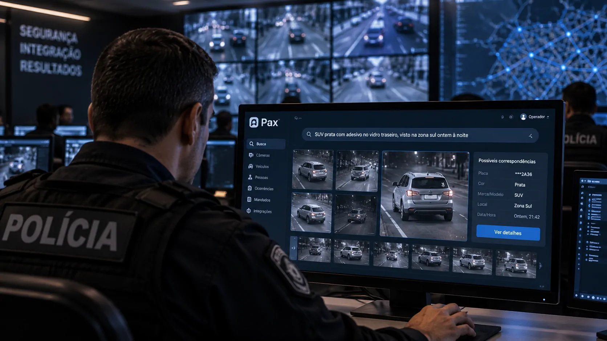
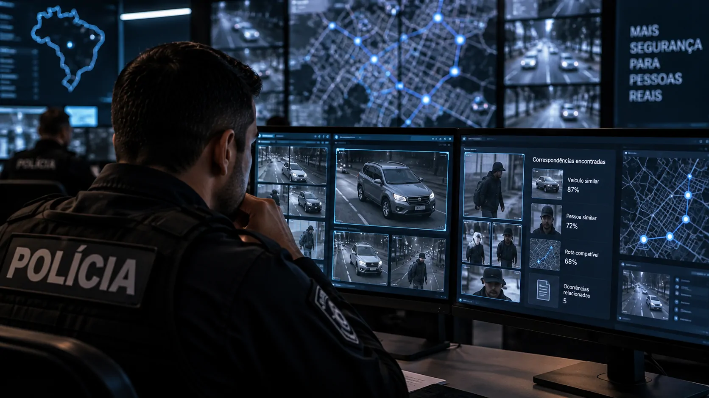
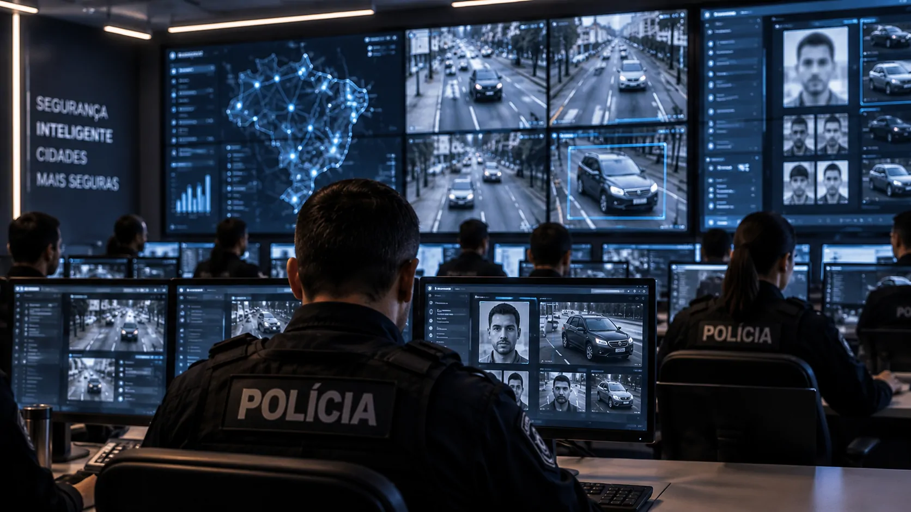

*Uma startup brasileira está colocando inteligência artificial no meio de uma das etapas mais demoradas da investigação policial: transformar grandes volumes de imagens e dados dispersos em pistas que possam ser verificadas rapidamente pelas equipes de segurança.*

## A Pax colocou inteligência artificial dentro da investigação policial

A **Pax**, startup brasileira de inteligência artificial para segurança pública, ultrapassou a marca de **5 mil ocorrências policiais resolvidas com auxílio de sua plataforma**. Segundo os dados divulgados pela empresa, o sistema também está associado a mais de **3,1 mil prisões** e **1,7 mil veículos recuperados** no Brasil.

### Uma nova camada para a investigação

A tecnologia está sendo utilizada em operações nos estados de **Goiás, Paraná e Ceará**. A proposta é atacar um problema específico das investigações modernas: a polícia já possui uma enorme quantidade de informações, mas encontrar conexões entre elas pode consumir horas ou até dias.

A plataforma permite que policiais façam buscas usando **linguagem natural**. Em vez de depender apenas de uma placa, fotografia ou reconhecimento facial, o agente pode descrever características de um veículo ou suspeito e procurar correspondências nas informações disponíveis.

### A IA apoia, mas não substitui o policial

Esse modelo aproxima a **inteligência artificial** da rotina operacional. A tecnologia não toma a decisão policial, mas tenta reduzir o tempo necessário para encontrar uma pista que possa ser investigada por uma equipe humana.

O avanço é importante porque desloca a IA de tarefas administrativas para uma atividade em que velocidade e correlação de dados podem alterar o andamento de uma investigação.

## O policial pode descrever o que viu e deixar a IA procurar

*Busca por características permite que policiais procurem veículos e suspeitos sem depender exclusivamente de placas ou rostos.*

### A busca começa pela característica observada

Uma das diferenças da **Pax** está na forma como a informação pode ser pesquisada. Uma vítima pode não ter conseguido memorizar uma placa, mas talvez tenha percebido que o veículo era prata, possuía um adesivo na traseira ou apresentava uma característica incomum.

Esses detalhes podem ser utilizados como parte da busca. A plataforma cruza as características descritas pelo policial com imagens disponíveis e outras informações associadas à ocorrência.

### Dados dispersos passam a ser pesquisáveis

A empresa afirma que o sistema também consegue relacionar imagens de câmeras com **boletins de ocorrência, mandados e bases de dados** utilizadas pelas forças de segurança.

O ganho potencial está no tempo. Em uma investigação convencional, encontrar determinado veículo em várias horas de gravação pode exigir que agentes analisem grandes quantidades de imagens. Com a IA, a busca pode começar pela característica que chamou a atenção da equipe.

Isso muda a função do videomonitoramento. Em vez de simplesmente armazenar imagens para consulta posterior, a rede de câmeras passa a funcionar como uma fonte que pode ser pesquisada a partir de uma pergunta feita pelo policial.

## Mais de 5 mil casos mostram que a tecnologia saiu do laboratório

O número de ocorrências é relevante porque mostra que a aplicação da **IA na segurança pública** já ultrapassou a fase de demonstração tecnológica e entrou em operações com volume significativo.

### A escala atingida pela plataforma

Segundo a **Pax**, somente em **agosto de 2026 foram encerrados 810 casos**, o maior resultado mensal da história da plataforma. A empresa afirma que o total acumulado passou de 5 mil ocorrências com auxílio da tecnologia.

Os resultados divulgados incluem mais de **3 mil prisões** e aproximadamente **1,7 mil veículos recuperados**. Esses números reúnem diferentes programas e operações realizados com a plataforma no Brasil.

### O problema agora é interpretar o volume

No Paraná, por exemplo, a tecnologia utilizada no programa **Olho Vivo** já havia alcançado cerca de 1,9 mil casos desde o início da operação em dezembro de 2025.

A escala ajuda a explicar por que esse tipo de aplicação interessa às forças de segurança. O desafio não é apenas instalar mais câmeras, mas conseguir interpretar o enorme volume de informações produzido por elas.

Esse princípio aparece em outras aplicações brasileiras. No próprio **Notícia Tech**, mostramos como uma **[IA brasileira usa dados de satélite para prever secas rapidamente](https://noticiatech.com.br/inteligencia-artificial/ia-brasileira-satelites-prever-secas-rapidas/)**, outro exemplo de tecnologia aplicada à interpretação de grandes conjuntos de informações.

## A IA não procura apenas placas: ela tenta encontrar pequenas pistas

*O sistema da Pax cruza diferentes fontes de informação para encontrar relações que podem orientar uma investigação.*

### Características incomuns podem virar pistas

A busca por características é importante porque investigações reais raramente começam com todas as informações necessárias.

Um suspeito pode ter sido visto apenas de costas. Um veículo pode estar sem a placa visível. Uma câmera pode ter registrado apenas parte do automóvel. Uma testemunha pode lembrar de um detalhe aparentemente secundário.

### A ferramenta também pode eliminar caminhos

A plataforma da **Pax** tenta transformar essas informações em elementos pesquisáveis. Entre os exemplos apresentados pela empresa estão características como **adesivos em veículos, lanternas defeituosas e alterações no trajeto**.

Isso amplia o papel da IA dentro da investigação. O sistema não serve apenas para localizar alguém que já foi identificado. Ele pode ajudar a encontrar relações que ainda não estavam evidentes para a equipe.

Há também a possibilidade de **descartar suspeitos** quando as informações disponíveis indicam que determinada pessoa ou veículo não estava relacionado à cena investigada.

## Goiás e Paraná mostram como a tecnologia chega à operação

A experiência em **Goiás e Paraná** mostra que o uso da IA depende menos de uma tecnologia isolada e mais da capacidade de integrá-la à infraestrutura policial existente.

### Goiás foi um dos primeiros testes

A história da **Pax** ganhou escala em Goiás, onde a tecnologia foi utilizada em operações de segurança pública antes da expansão para outros estados.

Em **Luziânia**, a empresa relaciona a implantação da tecnologia a uma redução de **27% nos crimes violentos em seis meses**. O dado foi apresentado pela própria companhia e deve ser interpretado como resultado associado ao programa, não como prova de que a IA, isoladamente, causou a redução.

### Paraná levou a aplicação para outra escala

No Paraná, o programa **Olho Vivo** passou a utilizar inteligência artificial para apoiar policiais na identificação de suspeitos e recuperação de veículos.

Esses casos mostram uma característica importante da tecnologia: ela depende da infraestrutura que já existe. **Câmeras, registros policiais e bases de dados** continuam sendo fundamentais.

A IA funciona como uma camada de interpretação sobre essas informações. Em vez de substituir a infraestrutura, procura extrair mais valor dela.

## O próximo desafio é transformar escala em segurança com controle

*O avanço da IA na segurança pública aumenta a capacidade de análise, mas também exige controle sobre o uso dos dados.*

### Mais capacidade exige mais governança

O caso da **Pax** mostra uma mudança importante na aplicação de inteligência artificial no Brasil: sistemas de IA começam a atuar sobre acontecimentos físicos, e não apenas sobre documentos, textos ou tarefas administrativas.

Na segurança pública, isso significa conectar **câmeras, veículos, pessoas, ocorrências e mandados** para produzir informações que possam ser verificadas pelos agentes.

O potencial é grande, mas a expansão também aumenta a importância da governança. Uma plataforma capaz de cruzar diferentes bases precisa operar com **controles de acesso, rastreabilidade e critérios claros**.

### A decisão final continua sendo humana

Uma correspondência produzida pela máquina não deve ser tratada automaticamente como prova. A IA pode apontar uma pista, mas a investigação precisa confirmar essa pista.

Esse limite é essencial porque uma descrição pode estar errada, uma imagem pode ser inconclusiva e características semelhantes podem aparecer em pessoas ou veículos diferentes.

Essa discussão também está ganhando espaço no Brasil. O **Notícia Tech** já mostrou como a **[ANPD pretende usar inteligência artificial para investigar algoritmos](https://noticiatech.com.br/inteligencia-artificial/anpd-vai-usar-ia-investigar-algoritmos-prendem-atencao-redes-sociais/)**, movimento que ajuda a dimensionar o avanço da tecnologia sobre processos que antes dependiam exclusivamente de análise humana.

O movimento acompanha uma tendência maior de adoção de **IA por organizações brasileiras**. A diferença, neste caso, é que a tecnologia está sendo colocada diretamente em processos de segurança pública.

Para a polícia, o ganho mais importante pode ser simples: diminuir a distância entre uma informação e uma ação.

A marca de **5 mil casos** não significa que a IA esteja resolvendo crimes sozinha. Significa que uma ferramenta de inteligência artificial passou a fazer parte do trabalho de equipes policiais em escala relevante.

E esse talvez seja o ponto mais importante da história da **Pax**: a próxima fronteira da IA brasileira não está apenas em conversar, escrever ou automatizar tarefas. Em determinados setores, ela começa a ser usada para **interpretar o mundo real e ajudar profissionais a agir sobre ele mais rapidamente**.

---