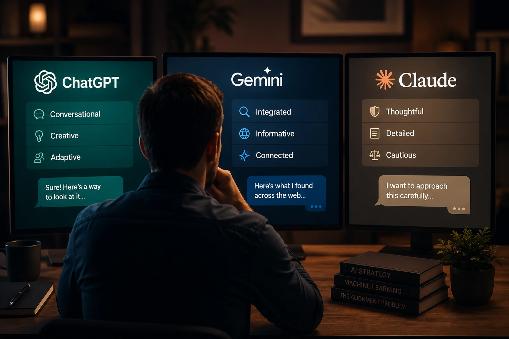
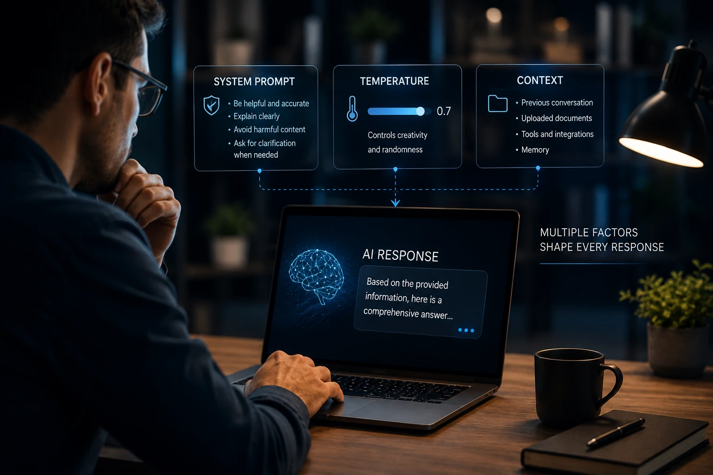
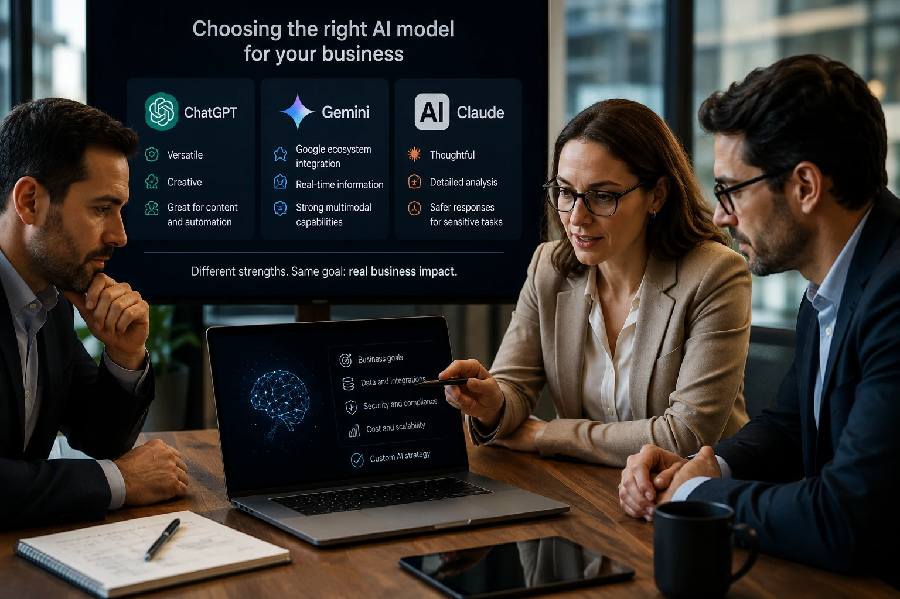

*Ao utilizar diferentes assistentes de inteligência artificial, muitos usuários têm a impressão de conversar com "personalidades" distintas. Essa percepção não é coincidência, mas também não significa que os modelos possuam identidade própria. A diferença está na forma como cada empresa projeta, treina e orienta sua IA para atender objetivos específicos.*

## O que faz uma IA parecer ter personalidade?

*Cada modelo segue objetivos de alinhamento diferentes, produzindo experiências distintas para o usuário.*

Quando alguém alterna entre **ChatGPT**, **Gemini** e **Claude**, normalmente percebe mudanças no estilo das respostas antes mesmo de notar diferenças na qualidade técnica.

Enquanto o **ChatGPT** costuma manter uma conversa fluida e adaptável, o **Claude** frequentemente apresenta respostas mais cautelosas e detalhadas. Já o **Gemini** tende a integrar conhecimentos e formatos alinhados ao ecossistema do **Google**.

Essa impressão leva muitas pessoas a acreditar que cada IA possui uma personalidade própria. Na prática, o comportamento observado é resultado de decisões tomadas durante o desenvolvimento do modelo.

### Personalidade não significa consciência

Os modelos de linguagem não possuem emoções, intenções ou preferências.

O que existe são padrões estatísticos aprendidos durante o treinamento que, posteriormente, são refinados para produzir respostas consideradas úteis, seguras e coerentes.

### O papel do alinhamento

Depois do treinamento inicial, as empresas realizam um processo conhecido como **alinhamento**, cujo objetivo é aproximar o comportamento do modelo das expectativas humanas.

Esse processo influencia fatores como:

- tom de voz;
- nível de formalidade;
- criatividade;
- cautela;
- forma de lidar com dúvidas;
- maneira de explicar conceitos.

Esse mesmo princípio aparece em tecnologias voltadas para empresas, como agentes especializados discutidos em nosso artigo sobre **AI Orchestration**:

## Como treinamento e RLHF moldam o comportamento da IA

O treinamento de um grande modelo de linguagem ocorre em diversas etapas.

Primeiro, o sistema aprende padrões presentes em enormes volumes de texto. Depois, recebe ajustes que aproximam suas respostas do comportamento esperado pelos desenvolvedores.

Esses refinamentos utilizam técnicas como **RLHF (Reinforcement Learning from Human Feedback)**, nas quais avaliadores humanos classificam respostas consideradas melhores ou piores.

### O que o RLHF realmente faz

O RLHF não ensina fatos novos.

Ele modifica a forma como o modelo responde.

Isso influencia diretamente:

- clareza;
- objetividade;
- educação;
- profundidade das explicações;
- tolerância ao risco;
- capacidade de reconhecer limitações.

 Leia também

[Entenda o que é AI Orchestration e por que ela está substituindo a disputa entre modelos de IA nas empresas](https://noticiatech.com.br/automacao/o-que-e-ai-orchestration-substitui-disputa-modelos-ia-empresas/)

### Cada empresa otimiza objetivos diferentes

A **OpenAI**, a **Google** e a **Anthropic** possuem estratégias distintas.

Embora todas busquem respostas úteis, cada organização define prioridades específicas relacionadas à experiência do usuário, segurança, produtividade e aplicações corporativas.

Essa diversidade explica por que dois modelos podem responder corretamente à mesma pergunta utilizando estilos completamente diferentes.

## System Prompt, temperatura e contexto explicam grande parte das diferenças

*As respostas dos modelos não dependem apenas do conhecimento aprendido, mas também das instruções invisíveis e da configuração utilizada durante cada conversa.*

Outro fator decisivo para a percepção de personalidade é o chamado **System Prompt**.

Trata-se de um conjunto de instruções internas definido pelos desenvolvedores antes mesmo da primeira pergunta do usuário. Essas orientações determinam como o modelo deve agir, quais limites deve respeitar e quais prioridades seguir durante toda a interação.

É por isso que dois modelos treinados para responder sobre o mesmo assunto podem apresentar estilos bastante diferentes.

### O System Prompt funciona como um conjunto de regras

Embora o usuário não visualize essas instruções, elas orientam decisões como:

- nível de formalidade;
- profundidade das respostas;
- postura diante de temas sensíveis;
- forma de solicitar esclarecimentos;
- maneira de lidar com informações incompletas.

Na prática, o **System Prompt** estabelece um comportamento consistente ao longo das conversas, reforçando a impressão de que existe uma personalidade própria.

### Temperatura influencia criatividade, não inteligência

Outro conceito importante é a **temperatura do modelo**.

Ela controla o grau de variação das respostas.

Temperaturas menores tendem a produzir respostas mais previsíveis e objetivas.

Temperaturas maiores aumentam a criatividade e a diversidade das respostas, mas também podem elevar o risco de informações imprecisas.

Esse parâmetro costuma ser ajustado automaticamente por aplicações corporativas conforme o objetivo da tarefa.

### O contexto também altera o comportamento

Os modelos modernos analisam continuamente o contexto da conversa.

Isso significa que uma mesma pergunta pode gerar respostas diferentes dependendo das mensagens anteriores.

Além disso, recursos como memória, documentos enviados, ferramentas conectadas e integrações externas ampliam a capacidade de adaptação do assistente.

Esse conceito também aparece em tecnologias que utilizam múltiplos agentes especializados, tema abordado no artigo sobre **Agentes de IA transformando a automação empresarial**:

[Como os Agentes de IA estão transformando a automação de processos nas empresas além do ChatGPT Work](https://noticiatech.com.br/automacao/agentes-ia-transformando-automacao-processos-empresas-alem-chatgpt-work/)

## O que essas diferenças significam para empresas e para o futuro da IA

*O futuro da inteligência artificial tende a combinar modelos especializados, agentes personalizados e estratégias de alinhamento voltadas para objetivos específicos.*

Para empresas, compreender essas diferenças vai muito além da curiosidade.

Escolher um modelo adequado pode influenciar produtividade, qualidade das respostas, experiência do cliente e até decisões estratégicas de negócio.

### Não existe um modelo perfeito

Cada plataforma apresenta vantagens em determinados cenários.

O **ChatGPT** costuma oferecer excelente flexibilidade para criação de conteúdo, produtividade e automação.

O **Claude** destaca-se em tarefas que exigem explicações detalhadas, interpretação de documentos extensos e maior cautela nas respostas.

O **Gemini** possui forte integração com o ecossistema do **Google**, tornando-se uma alternativa interessante para organizações que utilizam seus serviços em larga escala.

A escolha ideal depende da necessidade da empresa, e não apenas da popularidade do modelo.

### A tendência é a personalização

O mercado caminha para um cenário em que organizações deixarão de utilizar apenas assistentes genéricos.

Cada vez mais empresas desenvolverão agentes especializados capazes de compreender processos internos, documentos corporativos e objetivos específicos.

Nesse contexto, conceitos como **RAG**, **memória**, **MCP**, **AI Orchestration** e **Agentes de IA** tornam-se componentes fundamentais da nova geração de aplicações corporativas.

Mais importante do que escolher entre **ChatGPT**, **Gemini** ou **Claude** será construir uma arquitetura capaz de combinar diferentes modelos de forma inteligente.

A impressão de que cada IA possui uma personalidade continuará existindo, mas ela será cada vez mais resultado de estratégias de alinhamento, integração e personalização adotadas pelas empresas. Em outras palavras, o futuro da inteligência artificial não será definido por qual modelo parece mais humano, mas por qual consegue entregar mais valor para pessoas e organizações de maneira consistente.

---