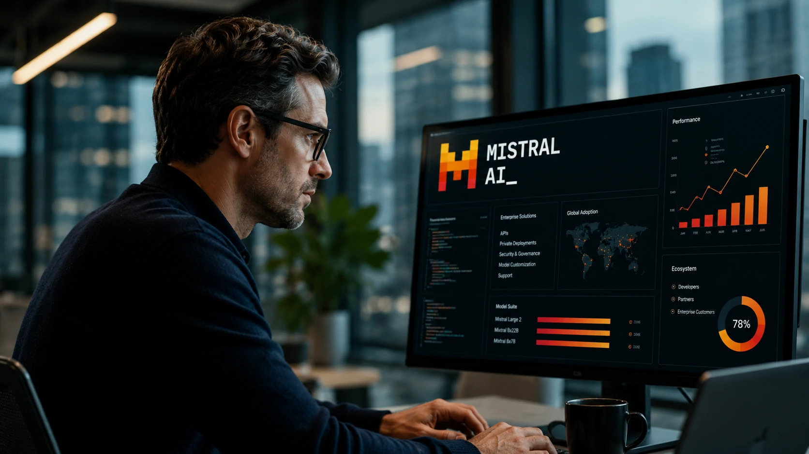
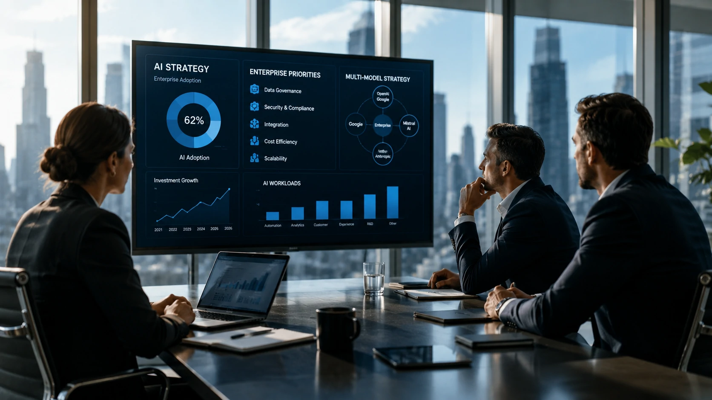
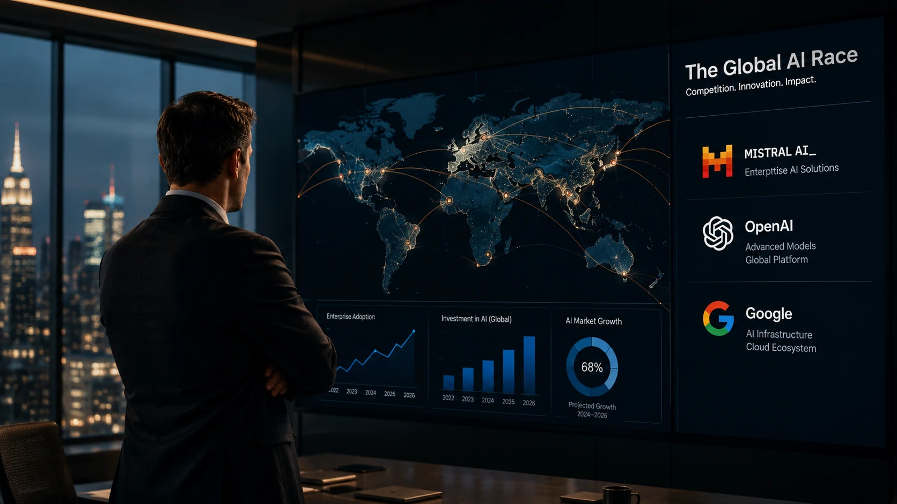

*A corrida pela inteligência artificial deixou de ser apenas uma disputa por modelos maiores. Empresas como **Mistral AI**, **OpenAI** e **Google** passaram a competir por ecossistemas completos, infraestrutura, desenvolvedores e contratos corporativos. Esse movimento indica uma nova fase do mercado, na qual estratégia de negócios pode ser tão importante quanto capacidade tecnológica.*

## A Mistral AI deixa de ser promessa e passa a disputar espaço entre as líderes

*Expansão da Mistral AI reforça a competição pelo mercado corporativo de inteligência artificial.*

Durante muito tempo a **Mistral AI** foi vista como uma startup promissora dentro do ecossistema europeu de inteligência artificial. Em 2026, esse cenário começa a mudar.

A companhia amplia investimentos em modelos de linguagem, fortalece sua presença internacional e passa a disputar clientes corporativos que tradicionalmente avaliavam apenas **OpenAI** e **Google**.

Mais do que lançar novos modelos, a empresa demonstra interesse em construir um ecossistema capaz de atender organizações preocupadas com flexibilidade, privacidade e independência tecnológica.

### A competição vai além dos modelos

A disputa atual envolve infraestrutura, APIs, plataformas para desenvolvedores e integração com aplicações empresariais.

Na prática, empresas procuram parceiros capazes de entregar inteligência artificial integrada aos seus processos, e não apenas um chatbot mais sofisticado.

### O mercado corporativo tornou-se prioridade

Os investimentos mostram que contratos empresariais passaram a representar uma das maiores oportunidades de crescimento da indústria.

Essa mudança acompanha o movimento observado em soluções voltadas para **agentes de IA**, automação e produtividade corporativa, tema já analisado pelo Notícia Tech:

[Como agentes de IA estão transformando a automação de processos nas empresas além do ChatGPT Work](/automacao/agentes-ia-transformando-automacao-processos-empresas-alem-chatgpt-work/)

## A disputa entre OpenAI, Google e Mistral mudou de fase

A concorrência já não acontece apenas em benchmarks técnicos.

Hoje, vencer significa conquistar parceiros estratégicos, integrar soluções aos softwares utilizados pelas empresas e construir confiança para projetos de longo prazo.

Nesse cenário, a **Mistral AI** procura ocupar um espaço diferente daquele explorado pelos gigantes americanos.

### Ecossistemas passam a valer mais do que modelos isolados

Organizações não escolhem apenas qual IA responde melhor perguntas.

Elas avaliam custos, segurança, governança, facilidade de integração e capacidade de evolução do fornecedor ao longo dos próximos anos.

### Empresas procuram reduzir dependência tecnológica

Outro fator relevante é o interesse crescente por estratégias multi-modelo.

Cada vez mais organizações evitam depender exclusivamente de um único fornecedor de IA, tendência relacionada ao avanço da orquestração de modelos e arquiteturas híbridas.

## A estratégia da Mistral pode acelerar a transformação digital das empresas

*Empresas avaliam cada vez mais critérios estratégicos, como governança, integração e independência tecnológica ao escolher plataformas de IA.*

O avanço da **Mistral AI** também representa uma mudança na forma como as organizações escolhem fornecedores de inteligência artificial. Se antes o foco estava apenas na qualidade dos modelos, hoje entram na decisão fatores como soberania dos dados, facilidade de implantação, custos operacionais e interoperabilidade.

Essa mudança beneficia empresas que conseguem oferecer soluções flexíveis para diferentes ambientes corporativos.

### Governança passa a influenciar decisões de compra

À medida que projetos de IA se tornam críticos para operações de negócio, cresce a preocupação com conformidade, auditoria e controle dos modelos utilizados.

Empresas que já estruturam políticas de governança possuem vantagem para adotar diferentes fornecedores sem comprometer segurança ou conformidade regulatória.

Esse movimento acompanha a evolução da **Governança de IA**, tema já abordado pelo Notícia Tech:

[O que é AI Governance e por que a governança de IA será essencial para empresas nos próximos anos](/inteligencia-artificial/o-que-e-ai-governance-governanca-ia-empresas/)

### O mercado caminha para ambientes híbridos

Poucas organizações deverão operar utilizando apenas um único modelo de inteligência artificial.

A tendência observada em grandes empresas aponta para ambientes híbridos, combinando soluções da **OpenAI**, **Google**, **Anthropic**, **Mistral AI** e outros fornecedores conforme cada necessidade operacional.

Essa abordagem reduz riscos, aumenta a flexibilidade e evita dependência tecnológica de um único ecossistema.

## O crescimento da Mistral aumenta a pressão sobre toda a indústria

*A expansão da concorrência estimula inovação, redução de custos e novas oportunidades para empresas que adotam inteligência artificial.*

O fortalecimento da **Mistral AI** não representa apenas o crescimento de mais uma empresa de inteligência artificial. Ele amplia a competição em um setor que movimenta bilhões de dólares e influencia diretamente a transformação digital das organizações.

Quanto maior a concorrência, maior tende a ser a velocidade de evolução dos modelos, da infraestrutura e das soluções empresariais.

### A disputa beneficia empresas usuárias

Para gestores e equipes de tecnologia, o aumento da concorrência normalmente significa mais opções de fornecedores, maior poder de negociação e acesso a soluções especializadas para diferentes cenários de negócio.

Esse ambiente favorece organizações que adotam uma estratégia de avaliação contínua, acompanhando não apenas lançamentos de modelos, mas também a evolução dos ecossistemas de IA.

### A próxima corrida será por plataformas completas

Os próximos anos devem consolidar uma nova dinâmica competitiva.

Em vez de vencer apenas pela qualidade do modelo de linguagem, empresas precisarão oferecer plataformas completas que integrem agentes de IA, automação, desenvolvimento de aplicações, segurança, governança e produtividade.

Nesse contexto, a **Mistral AI** busca deixar de ser apenas uma alternativa técnica para assumir uma posição estratégica entre os principais fornecedores globais de inteligência artificial. Se conseguir manter esse ritmo de expansão, a empresa poderá influenciar diretamente a forma como organizações escolhem seus parceiros tecnológicos em um mercado cada vez mais competitivo e orientado por ecossistemas.

---