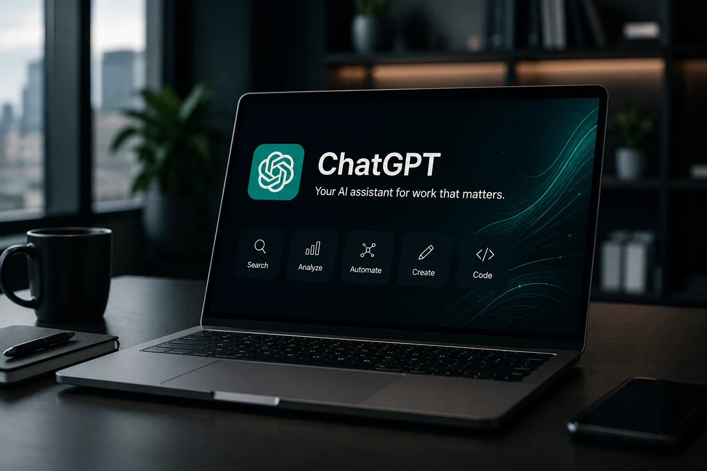
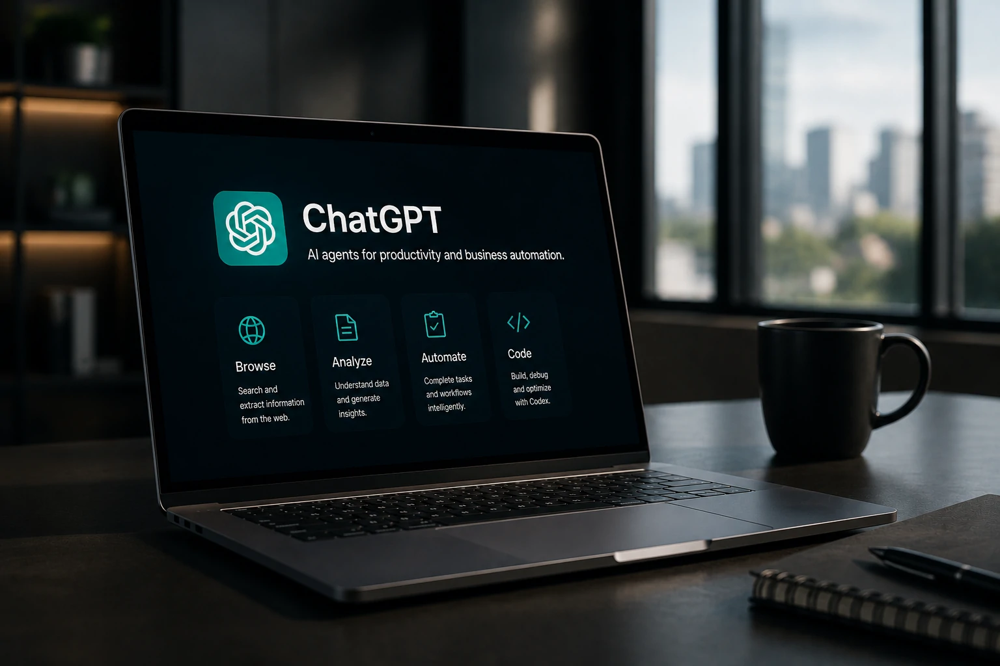
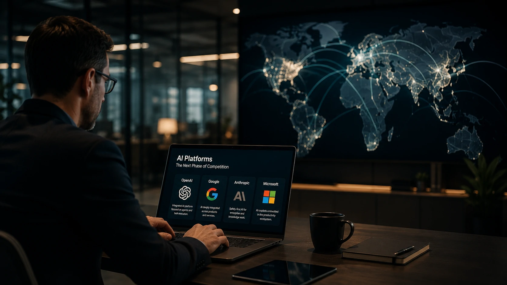

*Nos últimos meses, a disputa entre empresas de inteligência artificial deixou de girar apenas em torno de modelos mais poderosos. Agora, o foco está em construir plataformas capazes de executar tarefas completas. O encerramento do navegador Atlas representa exatamente essa mudança de estratégia da OpenAI.*

## O fim do Atlas mostra uma mudança de prioridade da OpenAI

*O encerramento do Atlas reforça a estratégia de transformar o ChatGPT no principal ambiente de trabalho baseado em inteligência artificial.*

A decisão da **OpenAI** de encerrar o desenvolvimento do navegador **Atlas** surpreendeu parte do mercado, mas faz sentido quando analisada dentro da estratégia recente da empresa.

Em vez de manter um navegador próprio competindo com soluções tradicionais, a companhia decidiu concentrar praticamente todos os seus investimentos no **ChatGPT**, que passa a assumir o papel de plataforma central para produtividade, pesquisa e automação.

Essa mudança reforça uma tendência que já vinha sendo observada desde o lançamento do **ChatGPT Work**: o objetivo deixou de ser oferecer apenas um chatbot inteligente e passou a ser construir um ambiente capaz de executar tarefas completas para usuários e empresas.

Essa estratégia também complementa a visão apresentada recentemente no artigo sobre **ChatGPT Work e a nova era dos agentes de IA**, publicado pelo Notícia Tech.

[Por que o ChatGPT Work marca o início da era dos agentes de IA para a produtividade corporativa](https://noticiatech.com.br/inteligencia-artificial/chatgpt-work-era-agentes-ia-produtividade-corporativa/)

### Um navegador deixou de ser prioridade

Nos últimos dois anos, diversas empresas passaram a testar navegadores baseados em inteligência artificial.

Entretanto, manter um navegador próprio exige um enorme investimento em desenvolvimento, segurança, compatibilidade e atualizações constantes.

Para a **OpenAI**, integrar essas capacidades diretamente ao **ChatGPT** representa um caminho mais eficiente e alinhado ao comportamento dos usuários.

### O foco agora são agentes capazes de executar tarefas

A empresa demonstra que pretende transformar o **ChatGPT** em um verdadeiro agente digital.

Isso inclui navegar na web, pesquisar informações, preencher formulários, organizar documentos, analisar dados e executar fluxos de trabalho sem que o usuário precise alternar entre diferentes aplicações.

## O encerramento do Atlas fortalece a estratégia de plataforma

*A consolidação do ChatGPT indica que a OpenAI pretende competir oferecendo uma plataforma completa de produtividade baseada em agentes de IA.*

Enquanto concorrentes continuam desenvolvendo ferramentas isoladas, a **OpenAI** caminha para uma estratégia de plataforma integrada.

O objetivo passa a ser reunir pesquisa, navegação, execução de tarefas, programação com **Codex**, geração de documentos e automação em um único ambiente.

Esse movimento reduz a complexidade para o usuário e aumenta o valor do ecossistema da empresa.

Para o mercado corporativo, isso significa menor dependência de múltiplos softwares e maior integração entre diferentes fluxos de trabalho.

### A corrida deixou de ser apenas por modelos maiores

Durante muito tempo, a competição entre empresas de IA foi medida principalmente pela capacidade dos modelos.

Hoje, o diferencial passa a ser outro.

Quem conseguir construir o melhor ambiente para executar tarefas reais terá vantagem competitiva.

Nesse contexto, o navegador Atlas deixava de ser um produto estratégico.

### Empresas procuram soluções completas

Organizações não querem apenas conversar com uma IA.

Elas procuram plataformas capazes de automatizar processos inteiros.

Essa mudança também explica por que agentes inteligentes vêm ganhando tanta importância.

No Notícia Tech, já mostramos como esse movimento está acelerando a adoção de agentes corporativos.

[Como os agentes de IA estão transformando a automação de processos nas empresas além do ChatGPT Work](https://noticiatech.com.br/automacao/agentes-ia-transformando-automacao-processos-empresas-alem-chatgpt-work/)

## O impacto para a disputa entre OpenAI, Google e Anthropic

*A competição deixa de ser apenas entre modelos de linguagem e passa a envolver plataformas completas para produtividade empresarial.*

A decisão da **OpenAI** aumenta a pressão sobre empresas como **Google**, **Anthropic**, **Microsoft** e **Perplexity**.

Todas caminham para oferecer plataformas completas em vez de produtos independentes.

No caso do **Google**, essa estratégia aparece na integração entre **Gemini**, **Chrome** e os serviços do Workspace.

A **Anthropic**, por sua vez, amplia continuamente as capacidades do **Claude** voltadas para ambientes corporativos.

Já a **Microsoft** fortalece o **Copilot** como interface principal dentro do Microsoft 365.

### A próxima disputa será pela plataforma dominante

A próxima fase da inteligência artificial provavelmente não será decidida pelo modelo mais inteligente.

Ela será vencida pela empresa capaz de oferecer a melhor experiência integrada.

Nessa lógica, pesquisa, memória, automação, navegação, programação e execução de tarefas deixam de ser produtos separados para formar uma única plataforma.

O encerramento do **Atlas** sinaliza exatamente essa mudança.

## O que essa decisão revela sobre o futuro da inteligência artificial

O fim do navegador Atlas não representa um recuo da **OpenAI**.

Na prática, ele demonstra uma mudança de foco.

A empresa deixa de distribuir recursos em diferentes aplicações para acelerar a evolução do **ChatGPT** como centro de sua estratégia.

Essa decisão acompanha uma tendência observada em todo o mercado: plataformas unificadas tendem a gerar maior retenção, facilitar a adoção corporativa e ampliar as possibilidades de automação.

Para empresas e profissionais de tecnologia, o anúncio serve como um indicativo importante.

Nos próximos anos, a competição provavelmente deixará de ser entre navegadores, aplicativos ou modelos isolados.

Ela ocorrerá entre plataformas completas capazes de concentrar pesquisa, raciocínio, automação e execução de tarefas em um único ambiente, redefinindo a forma como pessoas e organizações trabalham com inteligência artificial.

---