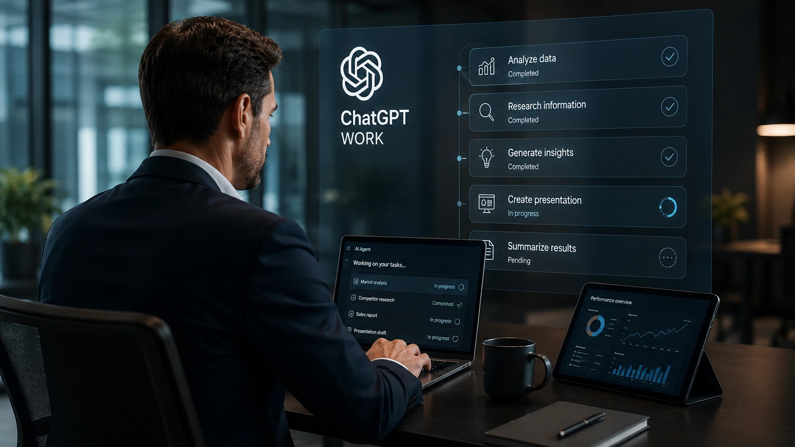
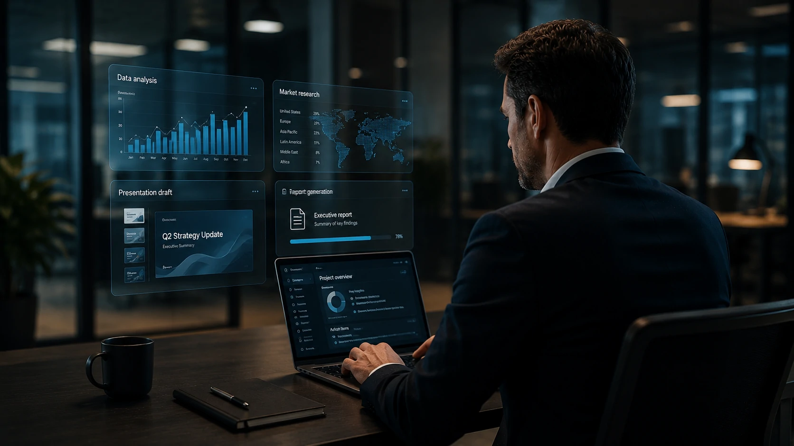
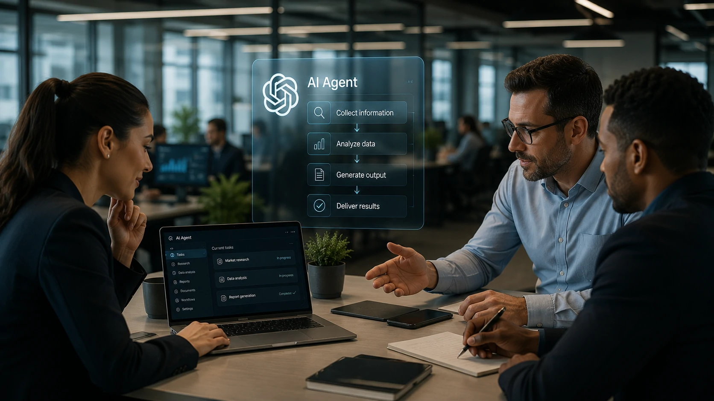

*O lançamento do **ChatGPT Work** representa mais do que um novo produto da **OpenAI**. Ele reforça uma mudança estrutural no mercado: a corrida pela liderança em inteligência artificial corporativa deixa de ser baseada apenas em modelos de linguagem e passa a girar em torno da capacidade de executar trabalho real. Para empresas, isso pode alterar profundamente produtividade, automação e competitividade.*

## O ChatGPT Work inaugura uma nova fase da inteligência artificial corporativa

*Agentes de IA deixam de apenas responder perguntas e passam a executar atividades completas de trabalho.*

Durante os últimos anos, a disputa entre **OpenAI**, **Google**, **Microsoft** e **Anthropic** concentrou-se principalmente na qualidade dos modelos de linguagem.

Com o lançamento do **ChatGPT Work**, o foco muda para outro nível: a capacidade de transformar a inteligência artificial em um colaborador capaz de executar tarefas completas.

Em vez de apenas gerar respostas, o agente consegue produzir apresentações, analisar planilhas, organizar informações, criar documentos e realizar atividades que normalmente exigiriam várias etapas conduzidas por um profissional.

### A mudança não está apenas na tecnologia

O avanço não representa somente uma evolução do **ChatGPT**.

Ele redefine a expectativa do mercado sobre o papel da inteligência artificial dentro das empresas.

Enquanto os primeiros assistentes aceleravam atividades individuais, os novos agentes começam a assumir processos completos.

### A produtividade passa a ser o principal diferencial

A disputa deixa de ser sobre quem escreve melhor.

Agora, vence quem consegue entregar mais trabalho concluído com menor intervenção humana.

Essa mudança tende a influenciar desde pequenas empresas até grandes organizações que buscam reduzir custos operacionais e aumentar eficiência.

## A disputa entre OpenAI, Microsoft, Google e Anthropic entra em um novo estágio

*Os grandes laboratórios agora competem pela liderança dos agentes capazes de executar trabalho corporativo.*

O impacto do **ChatGPT Work** não se limita à estratégia da **OpenAI**.

Ele aumenta a pressão competitiva sobre plataformas como **Microsoft Copilot**, **Google Gemini** e **Claude**, que também vêm investindo em agentes inteligentes.

Cada empresa possui vantagens importantes.

A **Microsoft** domina o ambiente corporativo por meio do **Microsoft 365**.

O **Google** controla o Workspace e o ecossistema de busca.

A **Anthropic** fortalece sua presença em ambientes empresariais com foco em segurança e governança.

### O mercado deixa de comparar apenas modelos

A comparação tradicional entre desempenho de modelos perde importância.

Empresas passam a avaliar quais plataformas conseguem integrar IA aos processos diários de forma prática.

Esse movimento complementa a evolução da memória permanente dos modelos, tema já analisado pelo Notícia Tech:

https://noticiatech.com.br/inteligencia-artificial/memoria-chatgpt-gemini-claude-disputa-ia-empresas/

### A competição passa para o fluxo de trabalho

O verdadeiro diferencial passa a ser executar tarefas de ponta a ponta.

Isso inclui pesquisar, interpretar dados, criar materiais e entregar resultados praticamente prontos para uso.

## Empresas precisam se preparar para uma nova lógica de automação

*Os agentes de IA tendem a assumir tarefas repetitivas enquanto profissionais concentram esforços em decisões estratégicas.*

A adoção de agentes de IA representa uma mudança operacional para empresas de todos os portes.

Em vez de automatizar apenas tarefas isoladas, organizações passam a estruturar fluxos completos de trabalho com apoio da inteligência artificial.

Essa evolução complementa tendências já observadas em áreas como **CRM com IA**, automação de processos e orquestração de agentes inteligentes.

### A integração será mais importante do que o modelo utilizado

Nos próximos anos, a vantagem competitiva não estará necessariamente no melhor modelo de linguagem.

O diferencial será a capacidade de integrar agentes aos sistemas já utilizados pela empresa, como **CRM**, **ERP**, plataformas de colaboração e ferramentas de produtividade.

Esse movimento também reforça a importância da orquestração de múltiplos agentes, assunto já abordado pelo Notícia Tech:

https://noticiatech.com.br/automacao/o-que-e-ai-orchestration-substitui-disputa-modelos-ia-empresas/

### O papel dos profissionais também muda

A tendência não indica a substituição completa das equipes.

Profissionais passam a atuar como supervisores de agentes, validando resultados, definindo estratégias e tomando decisões que exigem contexto humano.

Quanto maior a capacidade de combinar conhecimento de negócio com inteligência artificial, maior tende a ser o ganho de produtividade.

## O verdadeiro impacto do ChatGPT Work será medido nos próximos meses

O lançamento do **ChatGPT Work** provavelmente será lembrado menos pelo produto em si e mais pelo movimento estratégico que desencadeou.

A partir deste momento, a competição entre **OpenAI**, **Microsoft**, **Google** e **Anthropic** deixa de estar concentrada apenas em modelos de linguagem e passa a envolver plataformas capazes de executar trabalho corporativo de forma autônoma.

Essa mudança também fortalece a tendência dos **AI Agents**, da automação inteligente e dos ambientes de trabalho baseados em inteligência artificial, criando um novo ciclo de inovação para empresas.

Independentemente de qual plataforma assuma a liderança, o mercado caminha para um cenário em que agentes inteligentes deixarão de ser recursos experimentais e passarão a integrar as operações do dia a dia. Para gestores, acompanhar essa evolução desde agora pode representar uma vantagem competitiva importante nos próximos anos.

---