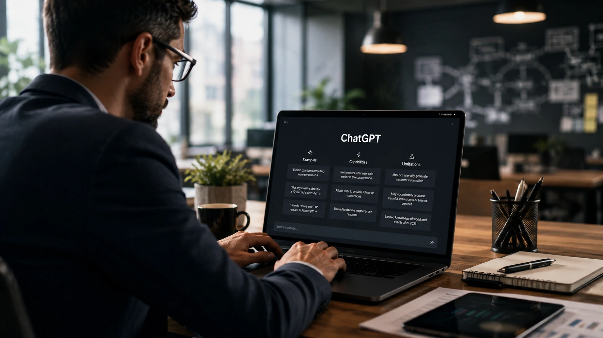
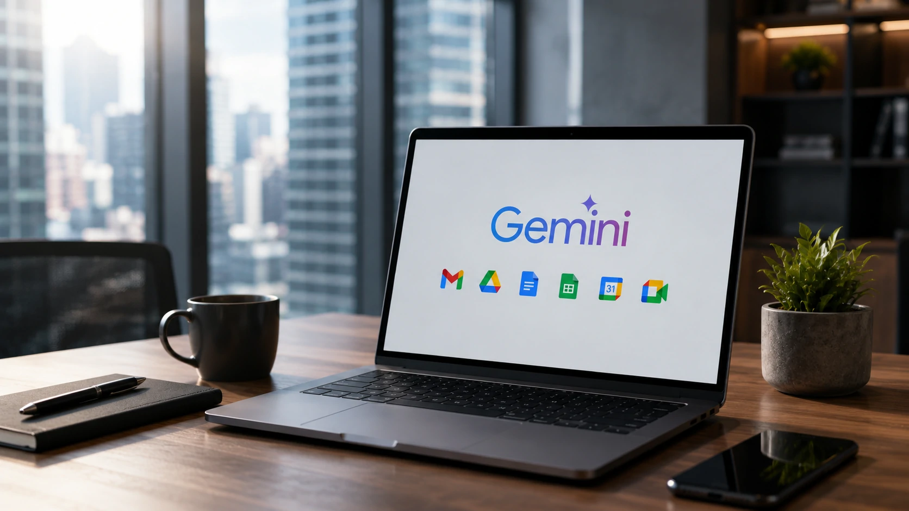
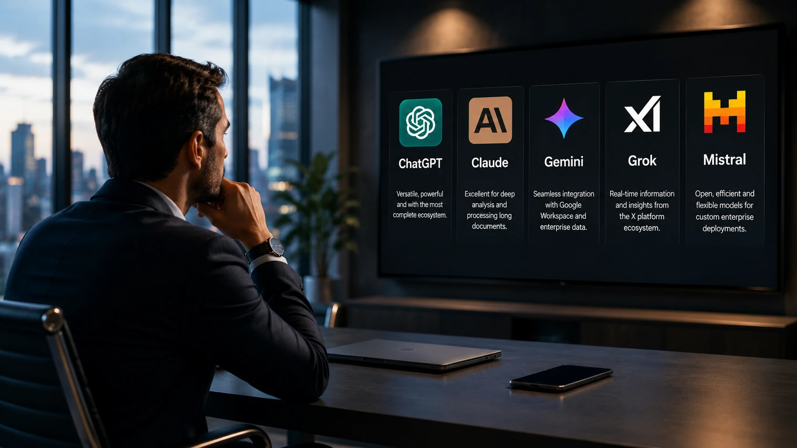

*A disputa entre os grandes modelos de inteligência artificial deixou de ser uma corrida por respostas mais rápidas. Em 2026, a escolha da IA influencia produtividade, custos operacionais, automação e vantagem competitiva. Para gestores, a pergunta deixou de ser "qual IA é mais inteligente?" e passou a ser "qual gera mais valor para o meu negócio?".*

# Qual IA é melhor para empresas em 2026?

A evolução da **Inteligência Artificial** acelerou nos últimos meses. **OpenAI**, **Anthropic**, **Google**, **xAI** e **Mistral AI** disputam espaço oferecendo modelos cada vez mais especializados para empresas.

Embora todos sejam capazes de gerar textos, analisar documentos e auxiliar na tomada de decisões, cada plataforma desenvolveu vantagens competitivas próprias.

Neste comparativo, o **Notícia Tech** analisa onde cada solução realmente se destaca e quais cenários corporativos justificam sua adoção.

## **ChatGPT continua sendo a referência em produtividade empresarial**

*O ecossistema da OpenAI continua sendo um dos mais completos para empresas que desejam acelerar produtividade e automação.*

A **OpenAI** consolidou o **ChatGPT** como uma plataforma completa para produtividade corporativa. O diferencial já não está apenas no modelo de linguagem, mas no conjunto de recursos disponíveis.

Empresas encontram integração com APIs, agentes inteligentes, geração de código, pesquisa, análise de arquivos e automação de tarefas em uma única plataforma.

### Ecossistema amplo

Outro ponto importante é o grande número de integrações disponíveis com CRMs, ERPs, plataformas de atendimento e ferramentas de automação.

Isso reduz o tempo de implantação e facilita projetos de transformação digital.

### Melhor escolha para

- equipes multidisciplinares;
- produtividade diária;
- criação de conteúdo;
- desenvolvimento de software;
- automação baseada em agentes.

Quem deseja aprofundar esse cenário pode ler também **[OpenAI alcança 10 milhões de usuários e mostra como agentes de IA começam a substituir softwares tradicionais](https://noticiatech.com.br/inteligencia-artificial/openai-10-milhoes-usuarios-agentes-ia-substituem-softwares/)**.

## **Claude aposta na qualidade das análises e na segurança corporativa**

A estratégia da **Anthropic** é diferente. Em vez de disputar apenas velocidade, a empresa investe em confiabilidade, interpretação contextual e governança.

Essa abordagem tornou o **Claude** bastante popular entre empresas que trabalham com documentos extensos, contratos, pesquisas e análises estratégicas.

### Grandes janelas de contexto

Outro diferencial importante é a capacidade do **Claude** de compreender grandes volumes de informação em uma única interação.

Na prática, isso reduz a necessidade de dividir documentos longos em várias consultas, mantendo maior coerência durante análises complexas.

### Melhor escolha para

- análise documental;
- compliance;
- departamentos jurídicos;
- pesquisa corporativa;
- elaboração de relatórios estratégicos.

Empresas interessadas em compreender essa estratégia também podem consultar **[Anthropic abre a caixa-preta do Claude e aproxima empresas de uma IA mais transparente](https://noticiatech.com.br/inteligencia-artificial/anthropic-caixa-preta-claude-ia-transparente-empresas/)**.

## **Gemini aproveita a força do ecossistema Google**

*O diferencial do Gemini está na integração nativa com o ambiente Google Workspace utilizado por milhões de empresas.*

O **Gemini** evoluiu rapidamente ao deixar de ser apenas um chatbot para tornar-se uma camada de inteligência distribuída dentro do **Google Workspace**.

Isso significa acesso direto a informações presentes em **Gmail**, **Drive**, **Docs**, **Sheets**, **Calendar** e **Meet**.

### Integração reduz atritos

Empresas que já utilizam soluções do Google normalmente conseguem acelerar a adoção do **Gemini** sem grandes mudanças de infraestrutura.

Essa integração reduz custos de treinamento e simplifica processos internos.

### Melhor escolha para

- empresas que utilizam Google Workspace;
- colaboração entre equipes;
- análise de documentos internos;
- produtividade administrativa;
- gestão do conhecimento.

## **Grok e Mistral seguem estratégias diferentes para conquistar espaço**

O **Grok**, desenvolvido pela **xAI**, aposta na integração com informações em tempo real e na proximidade com o ecossistema da plataforma X.

Já a **Mistral AI** segue um caminho mais técnico, investindo em modelos eficientes, arquitetura aberta e maior flexibilidade para organizações que desejam executar IA em infraestrutura própria.

### Quando considerar Grok

O **Grok** pode ser interessante para empresas que dependem de monitoramento contínuo de acontecimentos públicos, tendências e conversas em redes sociais.

Ainda assim, sua adoção corporativa permanece menor que a dos principais concorrentes.

### Quando considerar Mistral

A **Mistral AI** ganhou espaço entre empresas preocupadas com soberania tecnológica, custos de infraestrutura e maior controle sobre seus próprios modelos.

Essa estratégia fortalece sua presença principalmente em organizações europeias e projetos que exigem maior personalização.

Quem deseja conhecer melhor essa evolução pode ler **[Por que a estratégia da Mistral AI acelera a disputa com OpenAI e Google nas empresas](https://noticiatech.com.br/inteligencia-artificial/mistral-ai-estrategia-corporativa-openai-google-disputa-ia/)**.

## **Como escolher a IA certa para sua empresa**

*Não existe uma única vencedora. A melhor IA é aquela que resolve o problema específico da organização com maior eficiência.*

A comparação entre as cinco plataformas mostra que a disputa deixou de acontecer apenas na qualidade do modelo.

Hoje, fatores como integração, segurança, automação, governança e custo possuem peso semelhante na decisão empresarial.

### Critérios para avaliar

Antes de contratar uma solução, vale responder algumas perguntas:

- Quais processos serão automatizados?
- A IA precisa acessar documentos internos?
- Existe integração com sistemas atuais?
- Há requisitos de segurança ou conformidade?
- A empresa pretende desenvolver agentes de IA próprios?

Responder essas questões normalmente reduz bastante a lista de opções.

### Tendência para os próximos anos

A tendência mais forte para 2026 é que empresas deixem de utilizar apenas um único modelo.

Assim como acontece com softwares corporativos, diferentes áreas tendem a utilizar diferentes plataformas de IA, escolhendo a ferramenta mais adequada para cada necessidade.

Nesse cenário, o diferencial competitivo deixa de ser possuir acesso à inteligência artificial e passa a ser a capacidade de combinar modelos distintos para criar fluxos mais eficientes, seguros e produtivos. Essa mudança indica que o mercado caminha para uma estratégia multicloud também no universo da IA, em que **ChatGPT**, **Claude**, **Gemini**, **Grok** e **Mistral** deixam de ser concorrentes exclusivos e passam a atuar como peças complementares dentro da transformação digital das empresas.

---