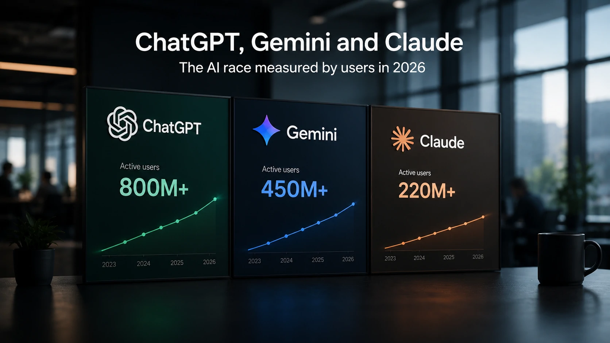
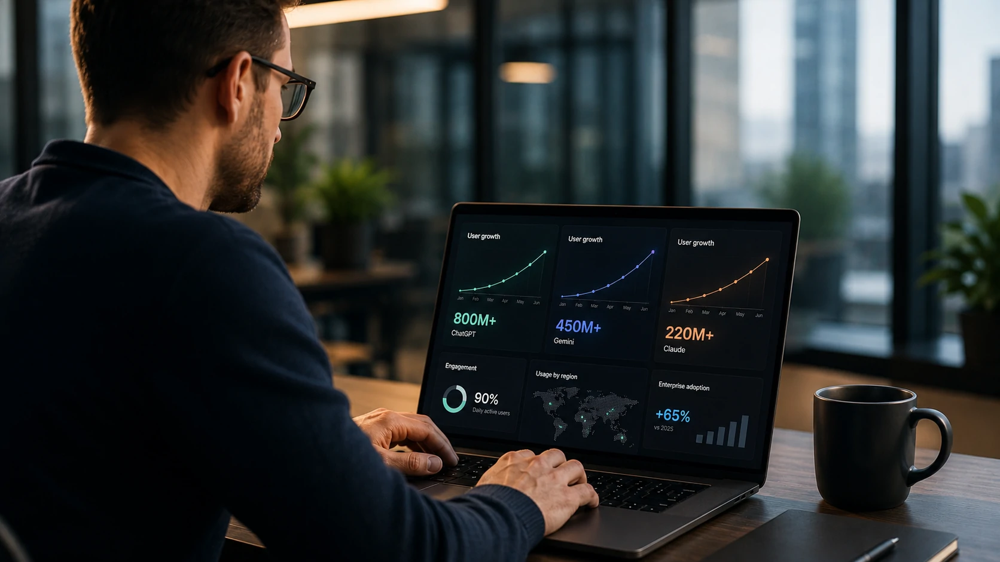

*Enquanto a corrida pela inteligência artificial costuma destacar novos modelos e recursos, existe um indicador que revela mudanças ainda mais profundas: a quantidade de pessoas utilizando cada plataforma. O crescimento da base de usuários mostra quais ecossistemas estão conquistando empresas, desenvolvedores e consumidores, influenciando investimentos bilionários e definindo os próximos movimentos do mercado.*

## O crescimento da base de usuários mostra quem realmente lidera a corrida da IA

A quantidade de usuários deixou de ser apenas uma métrica de popularidade. Hoje, ela representa um dos principais indicadores da capacidade de uma plataforma criar um ecossistema sustentável de inovação.

*O crescimento da base de usuários influencia investimentos, integrações e a velocidade de inovação das plataformas de inteligência artificial.*

Quando milhões de pessoas passam a utilizar diariamente ferramentas como **ChatGPT**, **Gemini** e **Claude**, ocorre um efeito em cadeia. Mais usuários geram maior volume de feedback, atraem desenvolvedores, estimulam integrações com softwares corporativos e justificam investimentos ainda maiores em infraestrutura.

Esse movimento ajuda a explicar por que a disputa entre as principais empresas de IA deixou de ser apenas tecnológica e passou a envolver distribuição, ecossistema e presença no ambiente corporativo.

### O ChatGPT continua como principal referência

O **ChatGPT** mantém a liderança em adoção global graças à combinação entre facilidade de uso, ampla oferta de modelos e integração crescente com ferramentas profissionais.

Mesmo diante da entrada de novos concorrentes, a plataforma da **OpenAI** permanece como referência para usuários individuais, equipes de desenvolvimento e empresas que buscam acelerar processos utilizando inteligência artificial generativa.

Esse posicionamento também fortalece a empresa na corrida por novos investimentos e amplia sua capacidade de lançar produtos complementares.

### Gemini amplia alcance com o ecossistema do Google

O **Gemini** segue uma estratégia diferente. Em vez de depender exclusivamente do acesso direto ao chatbot, o modelo cresce impulsionado pela integração com produtos amplamente utilizados, como **Google Workspace**, **Android** e **Pesquisa Google**.

Essa distribuição cria um enorme potencial de expansão, especialmente entre organizações que já utilizam soluções do Google em suas operações.

Esse movimento reforça tendências já abordadas pelo Notícia Tech em análises sobre o avanço do ecossistema da empresa, como em:

https://noticiatech.com.br/inteligencia-artificial/google-gemini-spark-agentes-ia-mercado-corporativo/

## Mais usuários significam ecossistemas mais fortes, e não apenas maior popularidade

O crescimento da base de usuários fortalece um ciclo contínuo de inovação, investimentos e criação de novos serviços, tornando as plataformas mais atrativas para empresas.

*Quanto maior o ecossistema de usuários, maior tende a ser a velocidade de inovação e o número de integrações disponíveis.*

No mercado corporativo, a decisão de adotar uma plataforma não depende apenas da qualidade do modelo de linguagem. Empresas analisam fatores como disponibilidade de parceiros, documentação, APIs, integrações, segurança e ritmo de evolução.

Quanto maior a comunidade, maior tende a ser a disponibilidade desses recursos.

### Claude cresce impulsionado pelo mercado empresarial

Embora possua uma base menor de usuários em comparação com **ChatGPT** e **Gemini**, o **Claude** continua ampliando sua presença entre empresas.

A estratégia da **Anthropic** concentra esforços em segurança, governança e confiabilidade, características valorizadas por organizações que utilizam IA em operações críticas.

Esse posicionamento ajuda a explicar por que a plataforma aparece cada vez mais em projetos corporativos, laboratórios científicos e grandes empresas.

### O impacto vai além dos chatbots

O crescimento das plataformas também acelera mercados relacionados, como agentes de IA, automação empresarial, integração com CRMs e desenvolvimento de aplicações inteligentes.

À medida que essas bases aumentam, surgem novas oportunidades para fornecedores de software, consultorias e empresas que desenvolvem soluções baseadas em inteligência artificial.

Outro movimento relacionado já analisado pelo Notícia Tech mostra como a evolução dos modelos está ampliando o mercado corporativo:

https://noticiatech.com.br/inteligencia-artificial/meta-gpt-5-5-disputa-lideranca-ia-corporativa/

## A disputa pela liderança mudou de tecnologia para estratégia de mercado

O número de usuários passou a ser um indicador da capacidade de cada empresa construir um ecossistema competitivo e sustentável. A liderança na inteligência artificial não depende apenas do desempenho dos modelos, mas também da velocidade de adoção por empresas e consumidores.

*A expansão da base de usuários tornou-se um dos principais indicadores da força competitiva das plataformas de inteligência artificial.*

A disputa entre **OpenAI**, **Google** e **Anthropic** mostra que a competição ocorre em diversas frentes simultaneamente. Enquanto uma empresa amplia sua distribuição, outra investe em segurança, produtividade ou integração com plataformas corporativas.

Esse cenário torna improvável que apenas um fornecedor domine completamente o mercado. Em vez disso, a tendência é a consolidação de um ecossistema onde diferentes modelos atendem necessidades específicas.

### Empresas passam a escolher ecossistemas, não apenas modelos

A decisão de implantar uma solução de IA envolve muito mais do que comparar qualidade de respostas.

Organizações avaliam disponibilidade de APIs, integração com sistemas existentes, governança, conformidade regulatória, custos operacionais, comunidade de desenvolvedores e perspectivas de evolução da plataforma.

Esse comportamento explica por que plataformas com crescimento consistente de usuários tendem a atrair ainda mais parceiros e investimentos, fortalecendo um ciclo contínuo de expansão.

### O que esperar da próxima fase da competição

A próxima etapa da corrida pela IA deve ser marcada por agentes inteligentes, automação empresarial, modelos multimodais e maior integração entre diferentes plataformas.

A tendência é que as empresas deixem de utilizar apenas um assistente de IA. Em muitos casos, diferentes modelos serão empregados conforme a atividade: um para desenvolvimento de software, outro para pesquisa, outro para atendimento ao cliente e outro para automação de processos.

Nesse contexto, a capacidade de integração será tão importante quanto a qualidade do próprio modelo.

A evolução desse cenário também reforça análises já publicadas pelo Notícia Tech sobre a crescente importância da IA nas empresas, como:

https://noticiatech.com.br/inteligencia-artificial/microsoft-empresa-bilionaria-adocao-ia-corporativa/

https://noticiatech.com.br/ferramentas/chatgpt-gemini-claude-comparativo-melhor-ia-2026/

O crescimento da base de usuários de **ChatGPT**, **Gemini** e **Claude** demonstra que a disputa pela inteligência artificial entrou em uma nova fase. Mais do que lançar modelos cada vez mais avançados, as empresas competem para construir ecossistemas capazes de atrair usuários, desenvolvedores, parceiros e organizações.

Para gestores e profissionais de tecnologia, acompanhar esses indicadores deixou de ser apenas uma curiosidade estatística. Eles ajudam a identificar quais plataformas tendem a concentrar inovação, investimentos e novas oportunidades de negócios nos próximos anos.

---