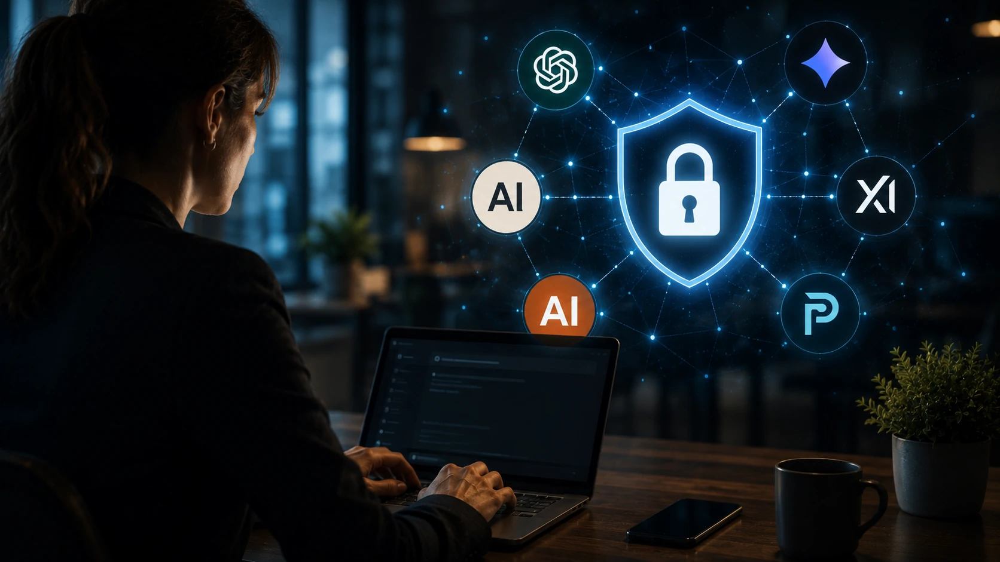

*Enquanto milhões de pessoas utilizam diariamente ferramentas de inteligência artificial para trabalhar, estudar e produzir conteúdo, uma pergunta continua crescendo dentro das empresas: afinal, quem realmente pode acessar tudo aquilo que escrevemos para esses assistentes? A resposta é mais complexa do que muitos imaginam e pode influenciar diretamente a segurança de informações pessoais e corporativas.*

## As conversas com inteligência artificial não são todas tratadas da mesma forma

Empresas como **OpenAI**, **Anthropic**, **Google**, **xAI** e **Perplexity** adotam políticas diferentes para armazenamento, utilização e proteção das conversas realizadas por seus usuários.

*Cada plataforma possui regras próprias para armazenamento e tratamento das conversas realizadas pelos usuários.*

Embora todas enfatizem segurança e proteção de dados, isso não significa que todas operem exatamente da mesma maneira. O tipo de conta utilizado também influencia diretamente como essas informações são tratadas.

### Usuários gratuitos normalmente possuem regras diferentes

Em diversas plataformas, contas gratuitas podem permitir que determinadas conversas sejam utilizadas para aprimorar modelos de inteligência artificial, sempre respeitando as políticas divulgadas por cada empresa.

Já algumas configurações permitem que o usuário desative esse compartilhamento para treinamento, reduzindo a utilização dos dados enviados.

### Contas corporativas oferecem proteção adicional

Planos Enterprise e Business normalmente incluem contratos específicos, maior controle administrativo, retenção reduzida dos dados e garantias adicionais de privacidade.

Esse movimento acompanha a crescente adoção da IA dentro das empresas, onde documentos estratégicos, códigos, relatórios e informações financeiras passaram a fazer parte da rotina dos assistentes inteligentes.

Essa evolução também acompanha o avanço de soluções como o **ChatGPT Work**, que ampliam o uso corporativo dos agentes inteligentes. Para entender esse cenário, veja também:

[Por que o ChatGPT Work marca o início da era dos agentes de IA para produtividade corporativa](https://noticiatech.com.br/inteligencia-artificial/chatgpt-work-era-agentes-ia-produtividade-corporativa/)

## O que muda entre ChatGPT, Claude, Gemini, Grok e Perplexity

As principais plataformas de IA compartilham um objetivo semelhante: entregar respostas cada vez melhores. No entanto, cada empresa implementa políticas próprias para equilibrar inovação, treinamento dos modelos e privacidade dos usuários.

*As diferenças entre as plataformas vão muito além da qualidade das respostas e incluem políticas distintas de privacidade.*

Enquanto algumas empresas oferecem maior transparência sobre retenção de dados, outras concentram esforços em recursos administrativos para clientes corporativos.

### O ChatGPT permite controlar parte do uso dos dados

A **OpenAI** disponibiliza configurações para limitar o uso das conversas no treinamento dos modelos para usuários individuais, além de políticas específicas para clientes empresariais.

Essa preocupação acompanha a expansão da plataforma para ambientes corporativos e para agentes de IA cada vez mais integrados aos processos de negócio.

### Claude, Gemini, Grok e Perplexity seguem estratégias diferentes

A **Anthropic** prioriza o discurso de segurança e IA responsável. Já o **Google Gemini** integra sua estratégia ao ecossistema de produtividade da empresa.

A **xAI**, responsável pelo **Grok**, busca aproveitar sua integração com a plataforma X, enquanto a **Perplexity** concentra seus esforços em pesquisa assistida por inteligência artificial.

Essas diferenças mostram que comparar apenas qualidade das respostas já não é suficiente. As políticas de privacidade passaram a ser um critério decisivo para empresas que desejam incorporar IA às suas operações.

Outro movimento importante é o avanço da memória permanente dos assistentes, tema que já analisamos em:

[Memória permanente vira novo campo de batalha entre ChatGPT, Gemini e Claude](https://noticiatech.com.br/inteligencia-artificial/memoria-chatgpt-gemini-claude-disputa-ia-empresas/)

## Quais informações nunca devem ser compartilhadas com uma IA

Nenhuma plataforma de inteligência artificial deve receber informações altamente confidenciais sem que exista uma política de proteção compatível com a criticidade desses dados.

*Empresas devem criar políticas internas para evitar o compartilhamento de informações sensíveis com assistentes de IA.*

Mesmo quando a ferramenta oferece recursos avançados de segurança, a responsabilidade sobre o conteúdo enviado continua sendo da organização.

### Dados financeiros e estratégicos merecem atenção especial

Empresas devem evitar compartilhar informações como:

- **senhas**;
- **chaves de API**;
- **dados bancários**;
- **documentos jurídicos confidenciais**;
- **projetos ainda não divulgados**;
- **informações protegidas por contratos de confidencialidade (NDA)**;
- **dados pessoais de clientes e colaboradores**.

Embora muitos fornecedores possuam certificações de segurança, reduzir a exposição continua sendo uma das melhores práticas de governança.

### Criar uma política interna de IA tornou-se prioridade

O crescimento acelerado da inteligência artificial fez surgir um novo desafio para as empresas: controlar como funcionários utilizam essas ferramentas no dia a dia.

Uma política de uso deve definir quais plataformas são autorizadas, quais tipos de informações podem ser compartilhadas e quais procedimentos devem ser adotados para minimizar riscos.

Esse movimento acompanha a evolução da **AI Governance**, que deixou de ser apenas uma preocupação regulatória e passou a fazer parte da estratégia das organizações.

Se sua empresa está estruturando esse processo, vale conhecer também:

[O que é AI Governance e por que empresas precisarão dela nos próximos anos](https://noticiatech.com.br/inteligencia-artificial/o-que-e-ai-governance-governanca-ia-empresas/)

## A privacidade será um dos principais diferenciais da próxima geração de IA

A disputa entre **OpenAI**, **Google**, **Anthropic**, **xAI** e **Perplexity** já não acontece apenas em desempenho ou qualidade das respostas. A confiança passou a ser um ativo estratégico para conquistar empresas e usuários.

### O mercado caminha para modelos cada vez mais seguros

À medida que agentes de IA assumem tarefas mais complexas, cresce também a necessidade de oferecer mecanismos robustos de proteção, auditoria e controle sobre os dados utilizados.

Planos corporativos tendem a investir cada vez mais em isolamento de informações, criptografia, governança e recursos administrativos, tornando a privacidade parte da proposta de valor dessas plataformas.

### A decisão sobre qual IA utilizar vai além da qualidade das respostas

Nos próximos anos, organizações deverão comparar assistentes inteligentes considerando critérios como conformidade regulatória, retenção de dados, transparência e integração com políticas internas de segurança.

Esse cenário indica que a corrida da inteligência artificial será definida não apenas pela capacidade dos modelos, mas também pela confiança que empresas e usuários depositarem em cada plataforma. Em um ambiente onde informações estratégicas circulam diariamente entre pessoas e assistentes digitais, compreender como cada serviço trata esses dados tornou-se um requisito essencial para adotar IA de forma responsável e sustentável.

---