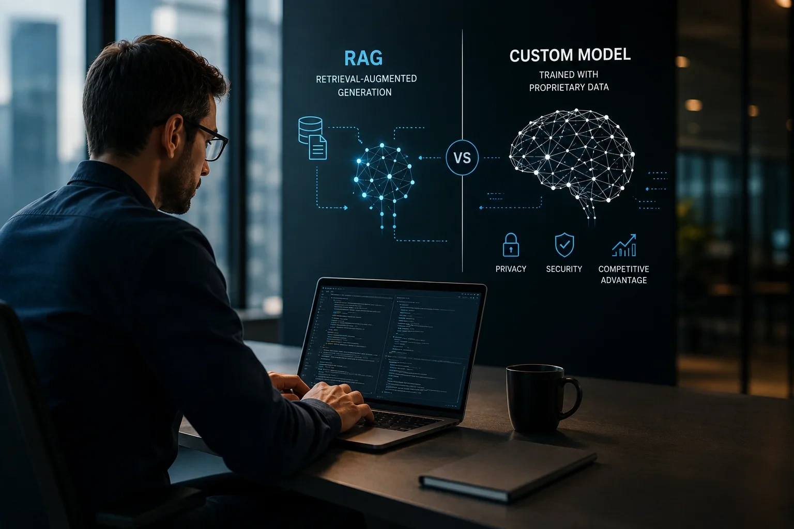
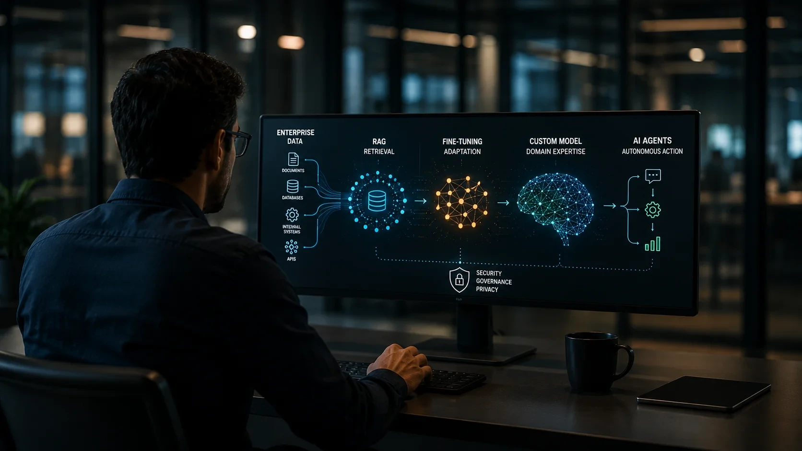

*Durante os primeiros anos da inteligência artificial generativa, o **RAG (Retrieval-Augmented Generation)** tornou-se praticamente o padrão para conectar modelos de linguagem aos dados internos das empresas. Agora, um novo movimento do mercado indica que organizações mais maduras começam a avaliar arquiteturas híbridas, combinando recuperação de informações, ajuste fino e modelos especializados para aumentar precisão, reduzir custos e proteger conhecimento estratégico.*

O **RAG** revolucionou a adoção da **IA corporativa** ao permitir que modelos consultem documentos internos sem necessidade de novo treinamento. Essa abordagem continua extremamente eficiente para a maioria das empresas.

Entretanto, o amadurecimento do mercado está mostrando que nem todos os cenários podem ser resolvidos apenas recuperando documentos. Empresas com grandes volumes de informações proprietárias, processos complexos e linguagem altamente especializada começam a investir em modelos personalizados para ampliar desempenho e reduzir limitações.

Mais do que substituir o **RAG**, essa mudança representa uma evolução da arquitetura de inteligência artificial empresarial, na qual diferentes técnicas passam a trabalhar em conjunto.

## O RAG continua sendo a melhor opção para a maioria das empresas

O **RAG** continua sendo a alternativa mais eficiente para conectar modelos de linguagem ao conhecimento corporativo sem necessidade de reentreinar toda a inteligência artificial.

*Arquiteturas baseadas em RAG continuam sendo a forma mais rápida e econômica de disponibilizar conhecimento corporativo para aplicações de IA.*

Essa tecnologia recupera documentos relevantes durante a geração da resposta, reduzindo alucinações e mantendo informações atualizadas.

### Como o RAG funciona na prática

Em vez de armazenar todo o conhecimento dentro do modelo, o sistema consulta bancos vetoriais, documentos, políticas internas ou bases de conhecimento antes de produzir uma resposta.

Essa arquitetura oferece vantagens importantes:

- atualização praticamente imediata das informações;
- menor custo de implantação;
- menor consumo computacional;
- facilidade para integrar novas bases de dados;
- menor necessidade de treinamento especializado.

Por esse motivo, o **RAG** permanece como a principal escolha para chatbots corporativos, assistentes internos, centrais de atendimento e plataformas de busca inteligente.

Para compreender em profundidade essa arquitetura, veja também o guia completo publicado pelo Notícia Tech:

https://noticiatech.com.br/inteligencia-artificial/o-que-e-rag-guia-completo-agentes-ia-empresas/

### Onde surgem as limitações

Apesar das vantagens, algumas organizações passaram a identificar desafios quando trabalham com conhecimento extremamente específico.

Em setores como saúde, finanças, indústria, energia e pesquisa científica, nem sempre recuperar documentos é suficiente para gerar respostas altamente especializadas.

Nesses casos, o modelo precisa compreender padrões internos, terminologias próprias e relações complexas entre dados que não aparecem explicitamente em documentos consultados durante a inferência.

É justamente nesse ponto que modelos personalizados começam a ganhar espaço.

## Quando modelos treinados com dados próprios fazem mais sentido

Modelos treinados com dados corporativos tornam-se vantajosos quando o conhecimento estratégico da empresa vai muito além do conteúdo disponível em documentos.

*Empresas começam a combinar RAG, fine-tuning e modelos especializados para construir aplicações de IA mais precisas e alinhadas ao seu negócio.*

Esse cenário vem sendo discutido por fornecedores de infraestrutura de IA, que defendem arquiteturas híbridas para organizações mais maduras digitalmente.

### Empresas com conhecimento altamente especializado

Organizações acumulam, durante décadas, informações que dificilmente podem ser reproduzidas apenas por meio da recuperação documental.

Entre os exemplos estão:

- histórico operacional;
- procedimentos internos;
- decisões regulatórias;
- padrões industriais;
- documentação técnica exclusiva;
- linguagem específica do negócio.

Quando esse patrimônio intelectual passa a ser incorporado ao treinamento ou ao ajuste fino do modelo, a inteligência artificial consegue responder com maior contexto e consistência.

### Privacidade e vantagem competitiva

Outro fator importante é a proteção dos dados.

Empresas que lidam com informações confidenciais procuram arquiteturas capazes de manter todo o processamento dentro de ambientes privados, reduzindo exposição de conhecimento estratégico.

Ao mesmo tempo, modelos especializados podem diminuir custos operacionais em aplicações de uso intensivo, oferecendo desempenho superior em tarefas repetitivas quando comparados a modelos generalistas.

Essa tendência também acompanha a evolução do **MCP (Model Context Protocol)**, que facilita a integração entre agentes de IA, ferramentas corporativas e fontes de dados estruturadas.

Para entender esse avanço, leia também:

https://noticiatech.com.br/inteligencia-artificial/como-implementar-mcp-empresas-arquitetura-integracao-agentes-ia/

## Como combinar RAG, fine-tuning e modelos próprios na mesma arquitetura

A melhor estratégia para a maioria das empresas não é abandonar o **RAG**, mas utilizá-lo em conjunto com outras técnicas de inteligência artificial.

*Arquiteturas híbridas unem RAG, modelos especializados e agentes de IA para aumentar precisão, segurança e escalabilidade nas aplicações corporativas.*

Nos últimos meses, grandes fornecedores de IA passaram a defender arquiteturas compostas, nas quais cada tecnologia resolve um problema específico.

### O papel de cada tecnologia

Uma arquitetura moderna normalmente distribui as responsabilidades da seguinte forma:

- **RAG** para consultar documentos atualizados;
- **Fine-tuning** para adaptar o comportamento do modelo;
- **Modelos próprios** para conhecimento altamente especializado;
- **Agentes de IA** para executar tarefas e tomar decisões;
- **MCP** para integrar sistemas, ferramentas e fontes de dados.

Em vez de competir entre si, essas tecnologias tornam-se complementares.

Essa evolução também acompanha o crescimento dos **Agentes de IA**, que dependem de múltiplas fontes de contexto para executar fluxos de trabalho completos.

Quem deseja entender essa evolução pode aprofundar a leitura no guia do Notícia Tech:

https://noticiatech.com.br/inteligencia-artificial/o-que-e-agentic-ai-guia-completo-agentes-ia/

### O que muda para pequenas e médias empresas?

Nem toda organização precisa investir em treinamento próprio.

Na prática, empresas de pequeno e médio porte costumam obter excelentes resultados utilizando:

- modelos fundacionais;
- arquitetura RAG;
- automação inteligente;
- agentes de IA;
- integrações via APIs.

Já grandes empresas, especialmente aquelas que operam em setores regulados ou possuem enorme patrimônio de dados exclusivos, começam a justificar investimentos em modelos especializados.

O fator decisivo deixa de ser apenas tecnologia e passa a ser estratégia de negócio.

## O futuro da IA corporativa será definido pela qualidade dos dados

A principal mudança do mercado não está na substituição do **RAG**, mas na crescente valorização dos dados corporativos como ativo estratégico.

Durante muito tempo, a vantagem competitiva esteve concentrada no acesso aos maiores modelos de linguagem.

Agora, organizações percebem que o diferencial está na qualidade dos próprios dados, no conhecimento acumulado e na capacidade de transformar essas informações em inteligência operacional.

Isso significa que empresas capazes de estruturar seus dados, implementar governança adequada e combinar diferentes arquiteturas terão maior potencial para desenvolver aplicações de IA mais precisas, seguras e eficientes.

Nos próximos anos, a discussão provavelmente deixará de ser "RAG ou modelo próprio" para se tornar "qual combinação oferece maior retorno para cada cenário de negócio".

Essa mudança representa uma nova etapa da maturidade da inteligência artificial empresarial, em que infraestrutura, qualidade dos dados e estratégia passam a ter tanto peso quanto o próprio modelo de linguagem.

### O RAG vai deixar de existir?

Não. O **RAG** continua sendo uma das arquiteturas mais eficientes para conectar modelos de linguagem a documentos corporativos atualizados. A tendência é que ele passe a ser utilizado em conjunto com outras técnicas, e não substituído.

### Qual a diferença entre RAG e fine-tuning?

O **RAG** recupera informações durante a geração da resposta, enquanto o **fine-tuning** altera o comportamento do modelo por meio de treinamento adicional utilizando conjuntos específicos de dados.

### Toda empresa precisa treinar um modelo próprio?

Não. Para muitas organizações, uma arquitetura baseada em **RAG**, modelos comerciais e automação já entrega excelente custo-benefício. Modelos próprios costumam fazer sentido quando existe grande volume de conhecimento exclusivo, requisitos regulatórios ou necessidade elevada de especialização.

### O que é uma arquitetura híbrida de IA?

É a combinação de diferentes tecnologias, como **RAG**, **fine-tuning**, **modelos especializados**, **Agentes de IA** e **MCP**, para atender diferentes necessidades dentro da mesma plataforma corporativa.

### Qual será a tendência para os próximos anos?

A tendência é que empresas priorizem arquiteturas flexíveis, capazes de combinar recuperação de informações, treinamento especializado e agentes inteligentes. O foco deixa de ser apenas escolher o melhor modelo de IA e passa a ser construir ecossistemas capazes de aproveitar todo o valor dos dados corporativos.

---