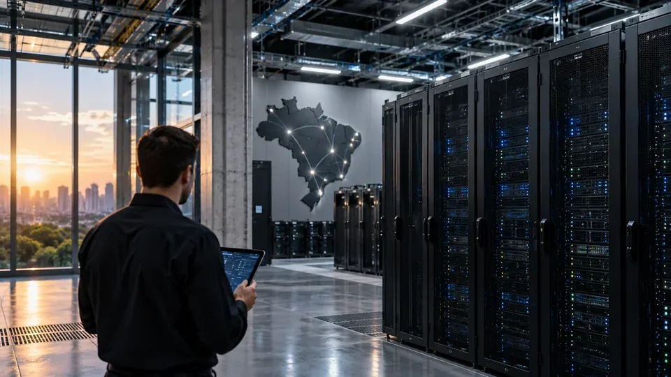
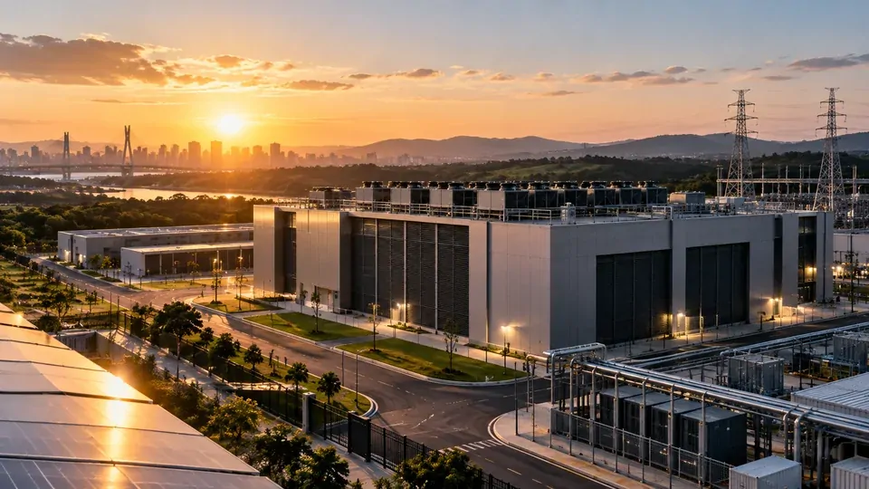
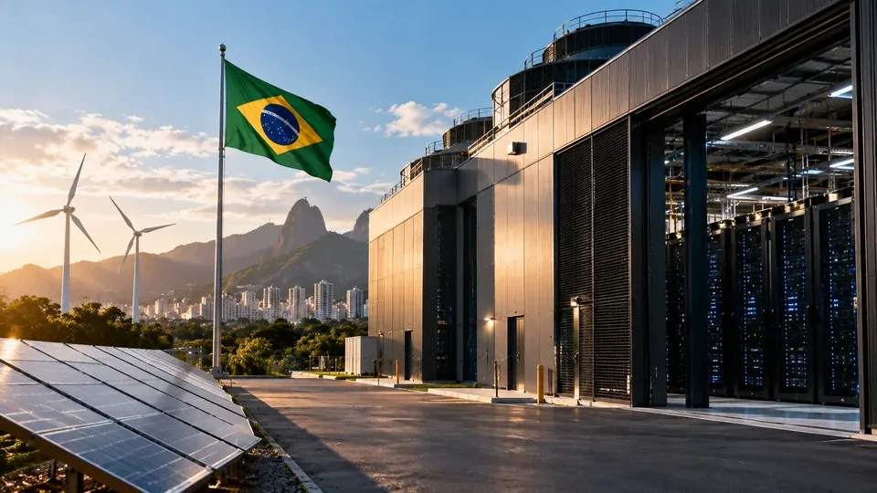

*O Senado aprovou o projeto que cria o ReData, regime especial de tributação voltado à instalação e expansão de data centers no Brasil. Mais do que uma mudança tributária, a medida pode afetar a infraestrutura que sustenta computação em nuvem e inteligência artificial, em um momento no qual capacidade computacional passou a ser um ativo estratégico para empresas e governos.*

# ReData coloca infraestrutura de computação no centro da estratégia brasileira de IA

## O que é o ReData e o que o Senado aprovou

O **ReData**, Regime Especial de Tributação para Serviços de Datacenter, foi aprovado pelo Senado em setembro de 2026 e estabelece incentivos fiscais para estimular a instalação e expansão de data centers no Brasil.

A proposta prevê a suspensão de determinados tributos incidentes sobre equipamentos destinados aos empreendimentos enquadrados no regime. Entre eles estão **Imposto de Importação, PIS/Cofins, PIS/Cofins-Importação e IPI**, criando uma condição tributária mais favorável para projetos de infraestrutura computacional.

A mudança acontece em um momento em que a demanda por processamento cresce rapidamente. Aplicações de **inteligência artificial, computação em nuvem e processamento de alto desempenho** exigem cada vez mais capacidade de servidores, armazenamento, redes e energia.

Nesse cenário, data centers deixaram de ser apenas uma infraestrutura de suporte para empresas de tecnologia. Eles passaram a fazer parte da capacidade estratégica necessária para desenvolver, treinar e executar sistemas de IA.
Um ponto importante é que o ReData não representa um programa no qual o governo federal desembolsa diretamente bilhões de reais para construir data centers.

A proposta funciona por meio de **incentivos tributários** destinados a reduzir determinados custos dos projetos privados. A expectativa é que uma estrutura fiscal mais competitiva aumente a atratividade do Brasil para empresas interessadas em instalar ou ampliar capacidade computacional.

O benefício, porém, está condicionado a contrapartidas. As empresas precisam cumprir requisitos relacionados à capacidade disponibilizada no mercado brasileiro, sustentabilidade, energia e investimentos em pesquisa e inovação.

Essa combinação muda a discussão. O objetivo não é apenas trazer servidores para o país, mas tentar fazer com que parte do investimento gere capacidade computacional, atividade econômica e desenvolvimento tecnológico dentro do Brasil.

## Por que o ReData pode acelerar a infraestrutura de IA

*O crescimento da inteligência artificial aumenta a necessidade de infraestrutura capaz de processar grandes volumes de dados e executar modelos computacionais de alta demanda.*

### Mais capacidade computacional pode mudar o custo da IA

A expansão dos data centers pode ter impacto direto sobre a disponibilidade de capacidade computacional para empresas brasileiras.

Modelos de inteligência artificial precisam de infraestrutura para treinamento, inferência, armazenamento e processamento de dados. Quanto maior a escala dessas operações, maior também é a necessidade de servidores especializados e sistemas capazes de operar continuamente.

Com mais capacidade instalada no país, empresas podem encontrar alternativas adicionais para hospedar aplicações, processar dados e executar cargas de trabalho de IA sem depender exclusivamente de infraestrutura localizada em outros mercados.

Isso não significa que a expansão dos data centers reduzirá automaticamente o preço da inteligência artificial. Custos de energia, hardware, conectividade, operação e disponibilidade de chips continuarão influenciando o preço final.

Mas uma infraestrutura doméstica maior pode reduzir determinados gargalos e ampliar a oferta de computação disponível para o ecossistema brasileiro.

### O Brasil ainda precisa reduzir a dependência externa

A questão também envolve soberania e disponibilidade de infraestrutura. Quando uma empresa brasileira utiliza serviços computacionais hospedados fora do país, parte do processamento e da infraestrutura crítica fica submetida a estruturas localizadas em outras jurisdições.

Para aplicações menos sensíveis, isso pode ser apenas uma questão operacional. Para setores que trabalham com grandes volumes de dados estratégicos, informações corporativas ou serviços essenciais, a localização da infraestrutura pode assumir uma importância maior.

O Senado destacou que cerca de **60% dos dados e da inteligência artificial utilizados no Brasil são processados no exterior**, segundo dados apresentados pelo Ministério da Fazenda.

O ReData tenta criar condições para ampliar essa capacidade dentro do território nacional. O resultado, entretanto, dependerá de quanto investimento realmente será convertido em capacidade instalada e utilizada.

A oportunidade é relevante porque a disputa por infraestrutura de IA acontece simultaneamente em vários países. O Brasil possui disponibilidade energética e um mercado consumidor significativo, mas precisa transformar essas vantagens em projetos competitivos e sustentáveis.

## As contrapartidas mudam a lógica do incentivo

### Energia passa a ser parte central do projeto

A expansão de data centers cria uma questão que vai muito além dos equipamentos. Servidores precisam de energia continuamente e, quanto maior a capacidade computacional, maior pode ser a demanda elétrica associada ao empreendimento.

Por isso, o ReData estabelece contrapartidas relacionadas à origem da energia utilizada. As empresas precisam atender à demanda contratual de energia elétrica por meio de contratos de suprimento ou autoprodução a partir de fontes enquadradas nas regras do programa.

O texto aprovado pelo Senado passou a utilizar o conceito de **fontes de baixa emissão**, além das fontes renováveis, deixando critérios específicos para regulamentação.

Também existe uma exigência relacionada ao uso eficiente da água. O regime estabelece **índice de eficiência hídrica para resfriamento de até 0,05 litro de água por kWh**, medido anualmente.

Esses critérios são importantes porque energia e água podem se tornar limitações concretas para a expansão da infraestrutura computacional em determinadas regiões.

### O programa também exige investimento no Brasil

Outra contrapartida relevante é o compromisso com pesquisa, desenvolvimento e inovação.

Os empreendimentos beneficiados devem investir no Brasil o equivalente a **2% do valor dos produtos comprados no mercado interno ou importados com o benefício fiscal** em atividades relacionadas a pesquisa e inovação.

Para projetos localizados nas regiões **Norte, Nordeste e Centro-Oeste**, existem condições diferenciadas. Nesses casos, determinados percentuais podem ser reduzidos, incluindo a exigência de direcionamento ao mercado brasileiro e o investimento em pesquisa.

O regime também estabelece que pelo menos **10% do fornecimento efetivo de processamento, armazenamento e tratamento de dados** instalado com o benefício seja direcionado ao mercado brasileiro.

Na prática, essas exigências tentam evitar que o país ofereça apenas um incentivo fiscal para instalação de infraestrutura sem capturar parte dos benefícios econômicos e tecnológicos gerados por ela.

## O que os bilhões em investimentos podem significar para o mercado

*Projetos de data centers exigem investimentos elevados em servidores, energia, conectividade e infraestrutura física, criando uma cadeia econômica além do próprio setor de tecnologia.*

### A maior parte do efeito acontece na infraestrutura

O potencial de expansão do setor chama atenção porque projetos de data centers exigem investimentos elevados em infraestrutura física e tecnológica.

A construção de grandes instalações envolve servidores, sistemas de refrigeração, equipamentos elétricos, redes de telecomunicações, segurança, conectividade e infraestrutura energética.

Isso cria uma cadeia de fornecedores e profissionais que pode se beneficiar de um ciclo prolongado de investimentos.

Mas é importante separar **potencial de investimento** de dinheiro já contratado. O ReData cria condições tributárias mais favoráveis, mas não garante que todos os projetos previstos serão efetivamente construídos.

A materialização dos investimentos dependerá das decisões das empresas, do custo de capital, da disponibilidade de energia, da regulamentação e da capacidade de conexão das novas instalações à infraestrutura existente.

### IA pode ser o principal motor da nova demanda

A inteligência artificial está entre os principais fatores que explicam a necessidade de ampliar capacidade computacional.

O treinamento e a execução de modelos mais sofisticados exigem infraestrutura especializada, especialmente quando empresas precisam processar grandes volumes de dados ou oferecer serviços de IA para milhares ou milhões de usuários.

A própria transformação da indústria de chips mostra como o mercado está se expandindo para além do componente físico. Empresas como a **Nvidia** estão ampliando sua atuação no ecossistema de IA, incluindo infraestrutura e software, como mostra a movimentação envolvendo a **[expansão da Nvidia para além dos chips de inteligência artificial](https://noticiatech.com.br/inteligencia-artificial/jensen-huang-nvidia-hugging-face-alem-chips-ia/)**.

Para o Brasil, isso significa que a expansão dos data centers pode criar uma base para diferentes camadas do mercado: computação em nuvem, IA generativa, treinamento de modelos, inferência, armazenamento de dados e aplicações corporativas.

O ponto decisivo será transformar capacidade física em serviços que efetivamente sejam utilizados por empresas brasileiras.

## Empresas brasileiras podem ganhar capacidade para competir

### Startups podem encontrar uma infraestrutura mais próxima

Uma infraestrutura computacional mais ampla pode beneficiar empresas menores que dependem de serviços de nuvem para desenvolver produtos digitais.

Startups de inteligência artificial, software e automação não precisam necessariamente construir seus próprios data centers. Elas podem utilizar capacidade oferecida por provedores especializados.

Com maior oferta de infraestrutura no país, aumenta também a possibilidade de criação de serviços adaptados ao mercado brasileiro, especialmente em aplicações que precisam processar grandes volumes de dados ou atender requisitos específicos de localização.

O movimento também acontece em um contexto de adoção crescente de IA pelas empresas. Um levantamento citado no mercado brasileiro aponta que **50% das empresas do país já utilizam inteligência artificial**, embora apenas uma parcela menor esteja em estágio considerado avançado.

Esse cenário reforça a importância de infraestrutura. A demanda empresarial por IA pode crescer mais rapidamente se houver capacidade computacional disponível para suportá-la.

### Grandes empresas também têm um incentivo para ampliar projetos

Para grandes empresas, a expansão da infraestrutura pode facilitar projetos de IA que exigem maior escala.

Bancos, indústrias, varejistas, empresas de telecomunicações e companhias de serviços podem utilizar computação em nuvem e inteligência artificial para análise de dados, automação e desenvolvimento de novos produtos.

A existência de mais data centers também pode aumentar a redundância e a disponibilidade de serviços, reduzindo a dependência de poucos pontos de infraestrutura.

Nesse sentido, o ReData pode funcionar como uma peça de uma transformação maior. O benefício fiscal não cria demanda sozinho, mas pode ajudar a criar a infraestrutura necessária para que a demanda existente cresça.

O Brasil já possui empresas avançando na adoção da tecnologia, como mostra o cenário de **[empresas brasileiras que estão usando IA em níveis mais avançados](https://noticiatech.com.br/inteligencia-artificial/empresas-brasileiras-usam-ia-nivel-avancado/)**. O próximo desafio é transformar essa adoção em escala operacional.

## O ReData não resolve sozinho o problema da IA brasileira

*O incentivo tributário pode acelerar investimentos, mas a competitividade da infraestrutura brasileira dependerá também de energia, regulamentação, conectividade e capacidade de execução.*

### A regulamentação será tão importante quanto a aprovação

A aprovação do ReData pelo Senado representa uma etapa importante, mas não encerra a implementação do regime.

O **PL 278/2026** foi aprovado e encaminhado para sanção presidencial. A própria tramitação no Senado registra o projeto como aprovado pelo Plenário e remetido à sanção em 4 de setembro de 2026.

A etapa seguinte será fundamental para definir como determinadas contrapartidas serão operacionalizadas e fiscalizadas.

Também será necessário observar como os novos projetos irão se relacionar com questões de energia, disponibilidade de terrenos, conexão à rede elétrica, licenciamento ambiental, conectividade e demanda regional.

Um incentivo fiscal pode melhorar a economia de um projeto, mas não elimina esses obstáculos.

### O verdadeiro teste será transformar incentivo em capacidade instalada

O principal indicador do sucesso do ReData não será apenas o volume anunciado em investimentos.

Será necessário observar quantos projetos realmente sairão do papel, quanta capacidade computacional será instalada, onde esses empreendimentos estarão localizados e quanto dessa infraestrutura estará disponível para o mercado brasileiro.

Também será importante acompanhar se os investimentos em pesquisa e inovação gerarão efeitos concretos para o ecossistema nacional.

O Brasil tem uma oportunidade de usar a expansão da infraestrutura digital para fortalecer sua posição na economia da inteligência artificial. Mas isso exigirá mais do que incentivos: será necessário combinar **capital privado, energia competitiva, sustentabilidade, conectividade, mão de obra qualificada e previsibilidade regulatória**.

Se essa combinação funcionar, o ReData poderá representar mais do que uma mudança tributária para data centers. Poderá se tornar uma das peças da infraestrutura que permitirá ao Brasil disputar uma parcela maior da próxima fase da economia digital.

---