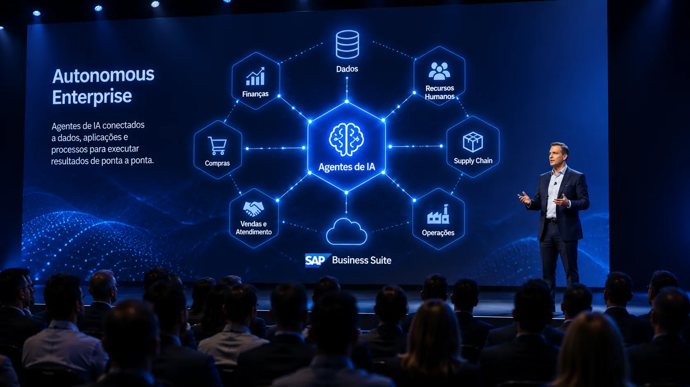

*O SAP NOW AI Tour Brazil 2026 chega a São Paulo em um momento em que a IA corporativa começa a mudar de função: em vez de apenas responder perguntas, os sistemas passam a ser projetados para executar tarefas, coordenar processos e agir dentro dos sistemas empresariais. A estratégia da SAP para o evento mostra por que essa transição pode ser uma das próximas disputas relevantes da tecnologia empresarial.*

## SAP leva a discussão sobre IA corporativa para São Paulo

O **SAP NOW AI Tour Brazil 2026** será realizado nos dias **9 e 10 de setembro**, no Transamerica Expo Center, em São Paulo. A **SAP**, empresa global de software empresarial, espera reunir cerca de 4 mil participantes para discutir inteligência artificial, dados, aplicações e transformação dos negócios.

### O tamanho do evento

A programação terá mais de **300 sessões**, 73 empresas parceiras e a expectativa de mais de 500 reuniões de negócios. A presença de clientes também será importante, com empresas como Copel, Grupo Edson Queiroz, M. Dias Branco, EMS e Claro apresentando experiências relacionadas à transformação digital.

### O que está em jogo

O ponto mais importante, porém, não é o tamanho do evento. É a mudança de foco. A SAP quer mostrar como **aplicações, dados e agentes de IA** podem funcionar de maneira integrada para transformar processos empresariais completos, em vez de limitar a IA a ferramentas isoladas.

Essa abordagem coloca o conceito de **Autonomous Enterprise** no centro da discussão. Para a SAP, a empresa autônoma é aquela capaz de usar IA para pensar, agir e se adaptar, com as pessoas mantendo o controle sobre estratégia, prioridades e decisões que exigem julgamento.

## A SAP quer levar a IA além dos chatbots

A principal mudança apresentada pela SAP é a passagem da IA conversacional para a **IA orientada à execução**. Um chatbot pode responder a uma pergunta sobre uma empresa. Um agente conectado aos sistemas corporativos pode, em determinadas condições, transformar essa intenção em uma sequência de ações.

*Agentes de IA podem conectar intenção, dados, aplicações e execução dentro dos processos empresariais.*

### Da resposta para a ação

Essa diferença é importante porque os maiores ganhos corporativos nem sempre estão na geração de texto. Eles podem aparecer quando a IA consegue consultar informações, interpretar contexto, acionar sistemas e acompanhar uma tarefa até sua conclusão.

É justamente essa lógica que aparece na proposta do **Joule**, a camada de IA da SAP que conecta usuários, sistemas, fluxos de trabalho e agentes. A empresa pretende mostrar como essa integração pode funcionar em áreas como finanças, recursos humanos, compras, cadeia de suprimentos e experiência do cliente.

### O agente como parte do processo

Isso aproxima a estratégia da SAP de uma mudança maior no mercado: os **agentes de IA** começam a deixar de ser apenas assistentes individuais e passam a ser considerados componentes de processos empresariais.

O próprio Notícia Tech já acompanha essa transição em uma análise sobre **[como agentes de IA estão transformando a automação de processos nas empresas](https://noticiatech.com.br/automacao/agentes-ia-transformando-automacao-processos-empresas-alem-chatgpt-work/)**. O diferencial da proposta da SAP é levar essa lógica para dentro de uma infraestrutura empresarial integrada.

## O Agent Lab mostra como a SAP pretende acelerar a adoção

O **Agent Lab** será uma das experiências mais relevantes do SAP NOW 2026 porque transforma o conceito de agente em uma demonstração prática. O espaço terá dez estações equipadas com **Joule Studio 2.0**, permitindo que participantes criem agentes usando linguagem natural.

### Menos programação, mais configuração

Segundo a SAP, uma pessoa sem conhecimento técnico de programação poderá configurar um agente direcionado a uma tarefa de negócio em aproximadamente **15 minutos**, contando com o apoio de especialistas.

Isso não significa que construir sistemas empresariais complexos ficará reduzido a alguns comandos. A demonstração indica outra coisa: a SAP quer diminuir a barreira inicial para que áreas de negócio participem da criação e adaptação de agentes.

### O desafio real começa depois

A facilidade para criar um agente é apenas uma parte da equação. Em ambientes corporativos, o valor depende de dados confiáveis, permissões, integração com aplicações, governança, segurança e capacidade de controlar o que a IA pode executar.

É justamente por isso que a proposta de **Autonomous Enterprise** é mais ampla do que simplesmente colocar agentes dentro das empresas. A autonomia precisa acontecer dentro de processos estruturados e com mecanismos que mantenham a organização no comando.

## A empresa autônoma depende de dados e sistemas conectados

A visão da SAP também revela por que a próxima fase da IA empresarial não será determinada apenas pelo modelo de linguagem utilizado. Um agente precisa de contexto para tomar decisões úteis e de acesso aos sistemas necessários para transformar uma decisão em ação.

*Na visão de empresa autônoma, agentes precisam operar conectados aos dados e às aplicações que sustentam os processos corporativos.*

### O papel do SAP Business Suite

A SAP pretende apresentar o **SAP Business Suite** como parte dessa arquitetura, reunindo aplicações empresariais, dados e inteligência artificial. A proposta é criar uma camada integrada na qual agentes possam operar com contexto empresarial, em vez de funcionar isoladamente.

Essa abordagem é relevante porque uma empresa não funciona como uma coleção de departamentos independentes. Uma decisão financeira pode afetar compras, estoque, logística, vendas e atendimento. Quanto mais processos dependerem de informações compartilhadas, maior será a importância da integração.

### O contexto passa a ser estratégico

Para agentes corporativos, saber gerar uma resposta não basta. Eles precisam entender **qual empresa está operando, quais regras existem, quais dados são confiáveis e quais ações estão autorizadas**.

Essa questão ajuda a explicar por que o avanço dos agentes está ligado à infraestrutura de dados e integração. O debate sobre **[como agentes de IA estão mudando a automação de processos empresariais](https://noticiatech.com.br/automacao/o-que-e-automacao-processos-ia-empresas/)** deixa de ser apenas tecnológico e passa a envolver desenho operacional.

## O impacto para as empresas brasileiras pode estar na execução

A relevância do SAP NOW para o mercado brasileiro está justamente na tentativa de mostrar aplicações concretas. A programação inclui casos de empresas de diferentes setores e demonstrações envolvendo finanças, RH, compras, supply chain, experiência do cliente e operações.

### Menos projetos isolados

A adoção empresarial da IA pode avançar de forma diferente quando a tecnologia deixa de ser tratada como um projeto experimental separado do restante da organização.

Em vez de criar uma ferramenta de IA para uma única equipe, a empresa pode começar a analisar onde agentes conseguem atuar dentro de processos que atravessam diferentes áreas. Isso aumenta o potencial de impacto, mas também eleva a exigência de governança.

### Produtividade não é o único indicador

O resultado também não deve ser medido apenas pela quantidade de tarefas automatizadas. Uma arquitetura de agentes precisa preservar controle, rastreabilidade e qualidade das decisões.

Para gestores, a pergunta mais importante passa a ser menos "qual IA devemos usar?" e mais **quais processos podem ser executados melhor com IA integrada aos sistemas que a empresa já utiliza?**

## SAP NOW pode antecipar a próxima disputa da IA corporativa

O **SAP NOW 2026** acontece antes que a visão de Autonomous Enterprise esteja consolidada no mercado. Por isso, o evento deve ser observado menos como uma promessa de substituição do trabalho humano e mais como uma demonstração de uma nova arquitetura operacional.

*O conceito de Autonomous Enterprise coloca agentes de IA dentro da operação, mas mantém estratégia e governança sob responsabilidade humana.*

### A mudança de interface

Durante anos, a principal interface da IA corporativa foi a conversa: o profissional pergunta, o sistema responde. A próxima etapa pode ser diferente.

Se os agentes conseguirem interpretar uma intenção, consultar dados, executar ações e coordenar etapas de um processo, a interface deixa de ser apenas uma conversa e passa a ser a própria operação.

### O que observar depois do evento

O ponto decisivo será descobrir quanto dessa visão pode sair das demonstrações e chegar aos processos reais das empresas. Os casos apresentados no SAP NOW poderão indicar onde os agentes já conseguem gerar valor e onde ainda existem obstáculos de integração, governança e adoção.

É essa passagem, da demonstração para a execução, que merece atenção. Se a IA corporativa realmente caminhar nessa direção, a competição não será apenas por modelos mais inteligentes, mas por plataformas capazes de colocar inteligência dentro dos processos que fazem uma empresa funcionar.

---