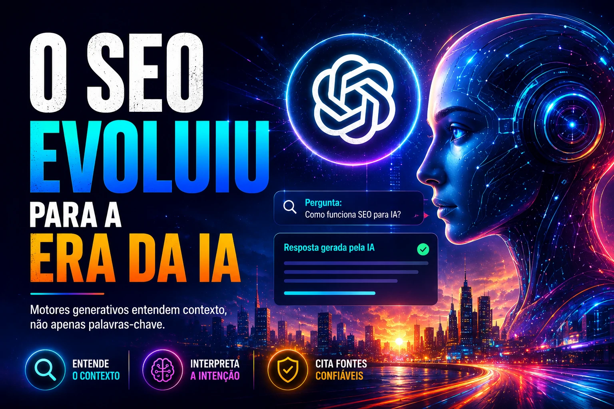
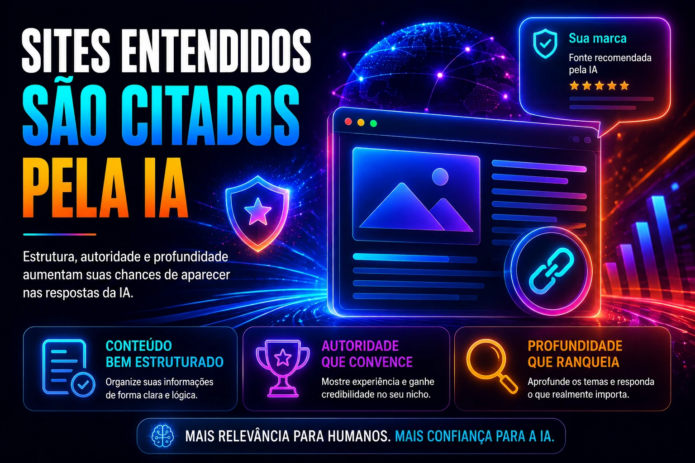
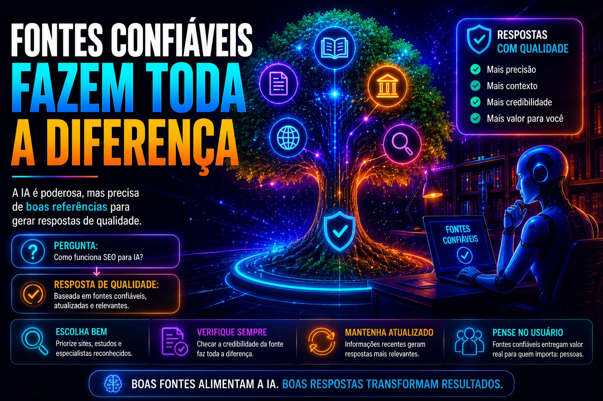

*O comportamento de busca mudou. Em vez de clicar em links e comparar páginas, usuários agora fazem perguntas diretamente para inteligências artificiais e recebem respostas prontas. Isso está mudando a lógica do SEO e obrigando empresas a repensarem como estruturam seus sites para serem compreendidos, citados e recomendados por sistemas como ChatGPT, Gemini e outros mecanismos generativos.*

## O SEO tradicional já não é suficiente

*Estrutura semântica e contexto estão se tornando fatores centrais para visibilidade em sistemas de IA.*

Durante anos, SEO significava otimizar páginas para mecanismos de busca tradicionais: palavras-chave, backlinks, tempo de carregamento e intenção de busca.

Esse modelo ainda importa.

Mas agora existe uma nova camada.

Os motores de IA não funcionam apenas indexando páginas. Eles interpretam contexto, relações semânticas, profundidade de informação e confiabilidade do conteúdo.

Isso muda o jogo.

Uma página bem posicionada no Google não necessariamente será usada como referência por uma IA.

## O que é SEO para IA (AEO e GEO)

### AEO (Answer Engine Optimization)

É a otimização para mecanismos que respondem diretamente perguntas.

O foco deixa de ser apenas “rankear”.

Agora é “ser escolhido como resposta”.

Isso exige:

- respostas objetivas
- clareza semântica
- autoridade temática
- estrutura lógica

### GEO (Generative Engine Optimization)

É a adaptação do conteúdo para motores generativos.

Nesse caso, o objetivo é aumentar as chances de o conteúdo ser usado na construção de respostas mais complexas.

Isso exige profundidade.

Quanto mais completo e estruturado o conteúdo, maior a chance de ser interpretado como fonte confiável.

## Como empresas estão adaptando seus sites

*Conteúdo profundo e bem estruturado aumenta as chances de ser utilizado por sistemas de resposta inteligente.*

A mudança não é estética.

É estrutural.

Empresas estão reformulando a arquitetura do conteúdo.

Os principais movimentos são:

### Estrutura semântica mais forte

Uso correto de:

- H1
- H2
- H3
- listas
- tabelas
- blocos curtos

Isso ajuda sistemas de IA a entenderem hierarquia e contexto.

Conteúdo mal estruturado perde força.

### Conteúdo mais profundo e menos superficial

Textos rasos estão perdendo relevância.

Motores generativos valorizam:

- contexto
- exemplos
- explicações completas
- aplicações práticas

O conteúdo precisa resolver de verdade.

Não apenas ranquear.

### Construção de autoridade temática

Sites que falam consistentemente sobre um mesmo tema ganham vantagem.

Isso acontece porque IA entende clusters de autoridade.

Exemplo:

Se um site publica constantemente sobre:

- automação
- IA
- marketing digital
- vendas

ele tende a ser percebido como fonte especializada.

É exatamente aqui que o interlinking ganha força.

## O papel do conteúdo evergreen no novo SEO

No ambiente de IA, conteúdo evergreen ganha ainda mais valor.

Motivo simples:

conteúdo atemporal serve como base de aprendizado e referência.

Guias, explicações e frameworks têm mais chance de serem usados como base em respostas.

Exemplos:

- como usar IA em vendas
- como automatizar atendimento
- como reduzir custos com IA

Esse tipo de conteúdo constrói autoridade sustentável.

## O que ainda importa no SEO clássico

Nem tudo mudou.

Os fundamentos continuam fortes:

- velocidade do site
- experiência mobile
- indexação limpa
- links internos
- backlinks

A diferença é que agora isso é apenas a base.

A camada estratégica está acima.

É o conteúdo que define relevância para IA.

## Como começar a adaptar seu site agora

*O futuro do SEO combina fundamentos técnicos com estrutura editorial pensada para inteligência artificial.*

Para quem produz conteúdo, o movimento precisa começar imediatamente.

Checklist prático:

- revisar estrutura dos artigos
- fortalecer interlinking
- aprofundar conteúdos estratégicos
- organizar clusters temáticos
- responder perguntas reais do público
- atualizar conteúdos antigos

Empresas que entenderem isso antes vão construir vantagem competitiva.

No novo ambiente digital, não basta ser encontrado.

É preciso ser compreendido.

E, cada vez mais, ser citado por inteligência artificial virou o novo topo do funil digital.
