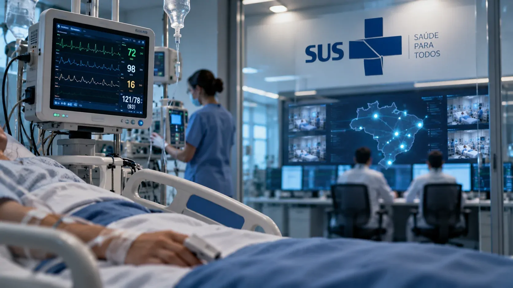
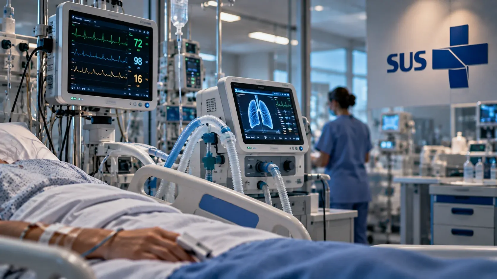
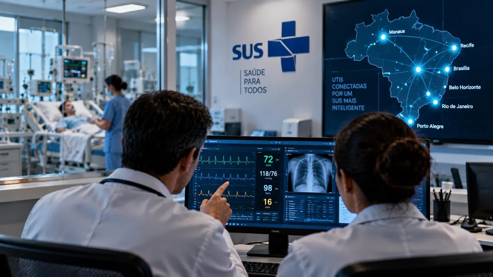

*O SUS está dando um passo que vai além da digitalização de prontuários: pela primeira vez, dados clínicos de UTIs instaladas em diferentes regiões do país podem ser acompanhados continuamente a partir de uma mesma central. A proposta combina conectividade, monitoramento em tempo real e inteligência artificial para apoiar decisões em situações nas quais minutos podem fazer diferença.*

## O SUS começa a transformar UTIs isoladas em uma rede conectada

A **Central de Comando das UTIs Inteligentes do SUS** já acompanha dados de pacientes internados em seis cidades brasileiras. Instalada no **Hospital das Clínicas da Faculdade de Medicina da USP**, em São Paulo, a estrutura opera com monitoramento contínuo e recebe informações de 60 leitos inteligentes atualmente ativos.

As primeiras unidades conectadas estão em **Manaus, Recife, Brasília, Belo Horizonte, Rio de Janeiro e Porto Alegre**. A rede permite que sinais vitais coletados nos hospitais sejam transmitidos para uma infraestrutura centralizada, criando uma visão contínua do estado clínico dos pacientes.

O ponto mais importante é que o projeto não consiste apenas em colocar computadores mais modernos dentro de uma UTI. A proposta é criar uma camada de **conectividade e interoperabilidade** capaz de transformar equipamentos, dados e sistemas hospitalares em uma infraestrutura integrada de cuidado.

### O que chega à central

Entre os dados transmitidos estão informações como **frequência cardíaca, pressão arterial e níveis de oxigênio**. Esses parâmetros são coletados pelos equipamentos de monitoramento instalados nos leitos e disponibilizados em tempo real para a rede.

A central funciona, portanto, como uma camada adicional de acompanhamento. O objetivo não é retirar o atendimento do hospital de origem, mas ampliar a capacidade de observar alterações e gerar informações que possam apoiar as equipes responsáveis pelo paciente.

Essa arquitetura também cria uma base para pesquisa e geração de evidências. Segundo o Ministério da Saúde, o monitoramento contínuo deverá contribuir para o aprimoramento de protocolos clínicos e para a expansão futura da rede.

## Como os dados de uma UTI chegam à central com IA

*Os dados dos equipamentos de monitoramento são integrados à infraestrutura digital que conecta as UTIs inteligentes à Central de Comando.*

O caminho começa no próprio leito. **Monitores multiparâmetros** acompanham continuamente sinais fisiológicos do paciente e produzem dados digitais. Esses equipamentos formam a infraestrutura inicial necessária para que as informações deixem de ficar restritas ao monitor localizado ao lado da cama.

### Da máquina ao sistema hospitalar

Depois de coletados, os dados podem ser integrados aos sistemas digitais da unidade e disponibilizados para a infraestrutura conectada. A ideia é reduzir a fragmentação entre equipamentos e informações clínicas, permitindo que diferentes fontes sejam analisadas dentro de um mesmo ambiente tecnológico.

É justamente nessa camada que a **inteligência artificial** ganha relevância. O Ministério da Saúde afirma que a tecnologia é utilizada para apoiar a avaliação de riscos e a identificação precoce de alterações no quadro clínico.

Isso não significa que uma IA esteja tomando decisões médicas sozinha. O papel descrito pelo projeto é de **apoio à decisão clínica**: identificar padrões ou alterações relevantes para ajudar as equipes a avaliar quais situações merecem atenção prioritária.

### IA não substitui o profissional de saúde

Essa distinção é fundamental. A central não transforma um algoritmo em médico remoto e não significa que uma máquina esteja autorizada a definir sozinha o tratamento de um paciente.

A tecnologia funciona como uma camada de inteligência sobre os dados disponíveis. A interpretação clínica, a confirmação das informações e a decisão sobre condutas permanecem relacionadas aos profissionais responsáveis pelo cuidado.

A mesma lógica explica por que a qualidade da infraestrutura de dados é tão importante. Assim como acontece nas empresas, **[a integração de dados pode ser tão importante quanto o próprio algoritmo de IA](https://noticiatech.com.br/inteligencia-artificial/wecogno-ia-dados-decisoes-negocio/)** quando uma organização precisa transformar grandes volumes de informação em decisões mais rápidas.

## O que muda para o paciente dentro de uma UTI inteligente

A principal mudança para o paciente não é necessariamente perceber uma nova tecnologia no quarto, mas permitir que alterações clínicas sejam acompanhadas de maneira mais contínua e estruturada.

Em uma UTI convencional, os profissionais já monitoram sinais vitais constantemente. A diferença é que uma infraestrutura conectada pode organizar esses dados digitalmente, compartilhar informações em tempo real e utilizar modelos computacionais para auxiliar na identificação de situações de risco.

### O objetivo é antecipar alterações

O Ministério da Saúde descreve o projeto como uma aplicação de **medicina preditiva**. Na prática, isso significa utilizar os dados disponíveis para identificar sinais que possam indicar uma mudança no estado clínico antes que o problema se torne mais evidente.

Essa capacidade é particularmente relevante em pacientes graves, nos quais pequenas alterações podem exigir avaliação rápida. Entretanto, o projeto ainda está em expansão e a expectativa de reduzir complicações e tempo de internação não deve ser apresentada como um resultado já comprovado para toda a rede.

A própria escala atual mostra o estágio do programa: são **60 leitos inteligentes ativos**, enquanto o planejamento prevê expansão para **280 leitos em 14 instituições**.

### A central também produz uma visão nacional

Outro ganho está na possibilidade de observar como diferentes unidades utilizam a mesma infraestrutura tecnológica. Com mais hospitais conectados, o SUS poderá acumular uma quantidade maior de dados para avaliar protocolos e identificar padrões assistenciais.

Essa dimensão é importante porque transforma a iniciativa em algo maior do que um projeto de monitoramento. A rede também pode funcionar como uma infraestrutura de **dados para pesquisa, gestão e melhoria de protocolos clínicos**.

## A próxima etapa inclui respiradores, camas inteligentes e 280 leitos

*O projeto prevê ampliar a infraestrutura das UTIs inteligentes com novos equipamentos conectados, incluindo respiradores e camas inteligentes.*

O projeto apresentado pelo Ministério da Saúde está estruturado para crescer além dos 60 leitos atuais. A próxima etapa prevê a ampliação da rede e a incorporação de novos componentes tecnológicos, entre eles **respiradores pulmonares e camas inteligentes**.

A meta anunciada é chegar a **280 leitos inteligentes em 14 instituições de saúde**. As UTIs inteligentes são descritas pelo governo como a primeira etapa da **Rede Nacional de Hospitais e Serviços Inteligentes e Medicina de Alta Precisão**.

### Conectividade passa a ser parte da infraestrutura hospitalar

Essa expansão muda a natureza do projeto. Em vez de tratar cada equipamento digital como uma solução isolada, a estratégia busca construir uma infraestrutura na qual diferentes dispositivos possam produzir e compartilhar informações.

É um movimento semelhante ao que está acontecendo em outras áreas da tecnologia: o valor não está apenas no equipamento individual, mas na capacidade de conectar equipamentos, sistemas e dados.

No setor de saúde, porém, essa integração exige um nível adicional de cuidado. Informações clínicas são sensíveis e decisões baseadas em dados precisam considerar segurança, governança, qualidade das informações e responsabilidade profissional.

O desafio do SUS, portanto, não será apenas instalar mais dispositivos. Será manter uma arquitetura confiável enquanto o número de pacientes, equipamentos, hospitais e dados cresce.

## O SAMU Inteligente leva a conexão para dentro da ambulância

A rede também terá uma extensão fora das paredes dos hospitais. O **SAMU Inteligente** busca conectar ambulâncias, centrais de regulação e hospitais para transmitir informações clínicas durante o transporte do paciente.

O projeto-piloto está em operação em **Recife, Belo Horizonte e Porto Alegre**. A lógica é permitir que a equipe hospitalar receba informações antes de o paciente chegar à unidade, preparando a assistência para o quadro que está sendo transportado.

### O que muda durante uma emergência

Hoje, parte da comunicação entre equipes pode depender de contatos realizados durante o deslocamento. No modelo proposto pelo Ministério da Saúde, informações clínicas podem ser transmitidas digitalmente em tempo real.

Isso cria uma ligação entre três momentos que normalmente podem estar separados: **atendimento pré-hospitalar, regulação e atendimento hospitalar**.

O ganho potencial está na continuidade da informação. Em uma emergência, uma equipe que recebe dados antecipadamente pode ter mais contexto para organizar recursos antes da chegada do paciente.

### A rede começa a formar um fluxo contínuo

A combinação entre **SAMU Inteligente e UTIs Inteligentes** aponta para uma arquitetura na qual o dado acompanha o paciente em diferentes etapas do atendimento.

O conceito é particularmente relevante porque a inteligência artificial depende de dados para funcionar. Quanto mais fragmentado estiver o fluxo de informação, mais difícil será construir sistemas capazes de apoiar decisões de forma consistente.

Esse mesmo princípio aparece na transformação digital de outros setores. No Brasil, a discussão sobre infraestrutura de IA também passa por capacidade de processamento e conectividade, como mostra o debate sobre **[novos data centers voltados ao avanço da inteligência artificial no país](https://noticiatech.com.br/inteligencia-artificial/redata-incentivo-data-centers-ia-brasil/)**.

## O verdadeiro teste será escalar a inteligência artificial dentro do SUS

*O objetivo de longo prazo é ampliar a rede de hospitais e serviços inteligentes, conectando dados, equipamentos e equipes em uma infraestrutura nacional.*

A implantação de seis UTIs conectadas é relevante justamente porque coloca em operação uma arquitetura que poderá ser ampliada. Mas o maior desafio começa agora: transformar um projeto inicial em uma rede nacional confiável.

O salto de **60 para 280 leitos** exigirá mais do que novos equipamentos. Será necessário garantir integração entre sistemas, qualidade dos dados, infraestrutura de comunicação, segurança e treinamento das equipes.

### A escala será mais importante que o efeito de demonstração

O projeto já mostra que o SUS consegue colocar **IA, conectividade e monitoramento em tempo real** dentro de uma estrutura hospitalar pública. O que ainda precisa ser observado é como essa tecnologia se comportará quando for utilizada em uma escala muito maior.

Também será necessário acompanhar quais resultados concretos aparecerão na prática: redução de complicações, tempo de internação, resposta das equipes, utilização dos leitos e qualidade dos protocolos.

O Ministério da Saúde afirma que a rede poderá contribuir para reduzir complicações e tempo de internação, mas esses resultados devem ser avaliados à medida que o programa acumular dados e evidências.

A importância da iniciativa, portanto, está menos na ideia de uma “UTI controlada por IA” e mais na criação de uma **infraestrutura digital capaz de conectar pacientes, equipamentos, hospitais e profissionais em tempo real**. Se a expansão prevista funcionar, o SUS estará testando algo maior do que uma nova ferramenta: um modelo de assistência no qual os dados passam a acompanhar continuamente o cuidado.

---